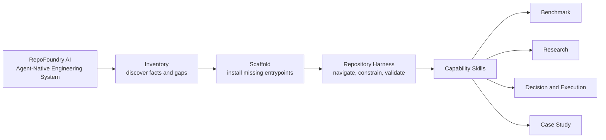
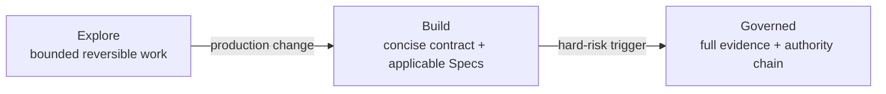
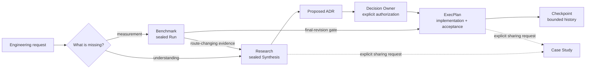
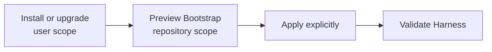
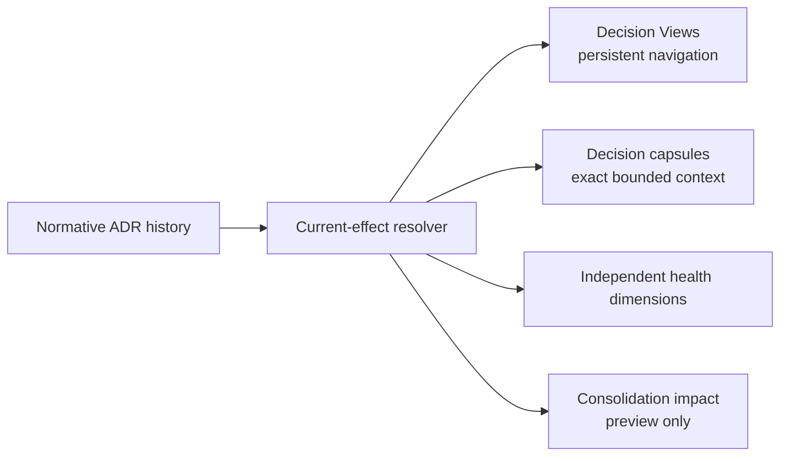
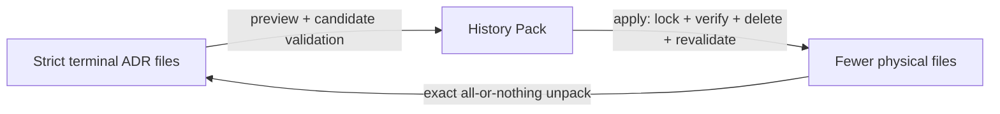
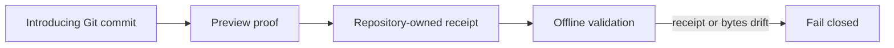
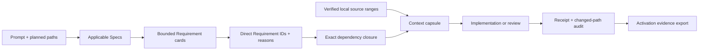

# RepoFoundry AI

[简体中文](README.zh-CN.md) | English

<p align="center">
  
</p>

<p align="center"><strong>The Agent-Native Engineering System</strong></p>

<p align="center">Turn any repository into an AI-ready engineering system.</p>

**RepoFoundry AI** turns an ordinary software repository into an environment
that humans and coding agents can navigate, govern, and verify together. It
installs durable engineering context close to the code: short agent
entrypoints, architecture maps, composable specifications, evidence contracts,
decisions, execution plans, and one deterministic validation path.

The repository remains the source of truth. RepoFoundry does not depend on one
model, agent, editor, or Git hosting provider.

## One system, four layers



- **Inventory** inspects the repository before proposing change.
- **Scaffold** performs guarded, preview-first Bootstrap.
- **Repository Harness** is the persistent environment left in the target
  repository.
- **Capability Skills** create specialized evidence and governance artifacts.

`Workflow` describes how an individual capability runs. RepoFoundry is the
system that makes those workflows composable and verifiable.

## Six Skills share file contracts

| Skill | Responsibility | Durable output |
|---|---|---|
| [`repo-foundry-ai`](./SKILL.md) | Inspect, Bootstrap, synchronize Specs, validate the Harness, and route work | `AGENTS.md`, architecture and docs maps, Harness and Spec manifests |
| [`engineering-benchmark`](./engineering-benchmark/SKILL.md) | Collaboratively calibrate, then execute reproducible measurement | Suite, Scenario, Run, Result, sealed Evidence Manifest |
| [`engineering-research`](./engineering-research/SKILL.md) | Collaboratively steer unknowns and synthesize multi-document evidence | Research controller, corpus Manifest, Rounds, topics, sealed Synthesis |
| [`engineering-design`](./engineering-design/SKILL.md) | Explore trade-offs and translate established evidence into a reviewable design | Single-file or multi-document Design Package, reading map, manifest, approved revision snapshot |
| [`engineering-execution-plan`](./engineering-execution-plan/SKILL.md) | Deliberate ADRs and align governed implementation | ADR, ExecPlan, Task, Checkpoint, Bugfix, technical debt |
| [`engineering-case-study`](./engineering-case-study/SKILL.md) | Turn verified code and process evidence into a shareable narrative | Chinese, English, or bilingual engineering case study |

The five professional Skills remain independently installable. They communicate
through versioned repository files rather than private runtime imports.

Governed artifacts also share one semantic metadata layer: stable type and ID,
title/status, author/owner, and created/updated. Authorship never implies
Research approval, ADR authority, or Benchmark execution. Raw evidence carries
the equivalent provenance in a content-addressed Manifest; source code and
generated indexes continue to use Git, CODEOWNERS, and generator provenance.
See the [Artifact Metadata Contract](./docs/design-docs/artifact-metadata-contract.md).

## Governance escalates with risk

Fresh Harnesses default to the `adaptive` profile. Existing Harnesses without a
profile remain `strict` until an explicit preview/apply migration. Adaptive work
uses three monotonic modes:



Explore needs no persistent artifact or Spec receipt. Build keeps only intent,
paths, acceptance, and compatibility. Public contracts, security, data,
irreversible operations, reliability claims, releases, and durable decisions
promote to Governed. Human authority, destructive/external actions, security,
data integrity, and evidence integrity remain hard boundaries in every mode.

## Evidence moves forward without losing authority



Agents may collect evidence and draft decisions. Research conclusion and ADR
acceptance remain explicit human authority boundaries.

## What appears in a target repository

RepoFoundry creates only the paths owned by a selected capability. A fully used
target may contain:

```text
target-repository/
├── AGENTS.md                         # Codex adapter only
├── ARCHITECTURE.md
├── .repo-foundry/
│   ├── engineering-specs/spec_router.py # shared activation engine
│   └── skills/repo-foundry-ai/SKILL.md  # canonical project workflow
├── .agents/skills/                   # Codex adapter entrypoints
│   ├── repo-foundry-ai/SKILL.md
│   └── engineering-specs/
│       ├── SKILL.md
│       ├── agents/openai.yaml
│       └── scripts/spec_router.py
├── .claude/skills/                   # Claude project Skills
│   ├── repo-foundry-ai/SKILL.md
│   └── engineering-specs/SKILL.md
├── .codex/
│   └── hooks.json                     # reviewed project activation guards
├── scripts/
│   └── bench/                         # project-owned benchmark executables
├── benchmarks/
│   ├── BENCHMARKS.md
│   └── suites/b-NNN_slug/
│       ├── BENCHMARK.md
│       ├── scenarios/bs-NNN_slug.md
│       └── runs/br-NNN_slug/
│           ├── SCENARIO.md
│           ├── RESULT.md
│           ├── EVIDENCE_MANIFEST.json
│           └── artifacts/
└── docs/
    ├── .engineering/
    │   ├── harness.json
    │   ├── specs.json
    │   └── specs.lock.json
    ├── agent-guides/
    │   ├── README.md                  # Portable adapter entrypoint
    │   └── managed/
    │       ├── index.md               # Spec routing index
    │       └── requirements.json      # exact Requirement source index
    ├── design-docs/
    ├── research/{active,completed}/
    ├── adr/
    ├── exec-plans/{active,completed}/
    ├── bugfixes/{active,completed}/
    └── case-studies/
```

Benchmark Scenarios reference project-owned executables under
`scripts/bench/`; RepoFoundry AI records their evidence without owning the
project's measurement implementation.

Bootstrap never invents repository facts. Unknown commands, owners,
architecture, SLOs, and security controls remain explicit `BOOTSTRAP_TODO`
markers for maintainers to resolve.

## Install once, enable each repository explicitly

RepoFoundry has two independent scopes. The **distribution installation** puts
the CLI and optional personal Skill entrypoints in your user environment. The
**repository Bootstrap** writes a versioned Harness and project Skills only to
the repository you select. Installing or upgrading the distribution never
scans or changes project repositories.



### Fast path: install and enable every bundled adapter

The installer supports macOS and Linux and requires Python 3.10+ plus `curl`.

1. Install the latest stable release. Run the same command later to upgrade:

   ```bash
   curl -fsSL https://raw.githubusercontent.com/XiaoWeiKIN/RepoFoundryAI/main/install.py | python3 -
   ```

2. From the target repository, preview the Agent-neutral Core and every bundled
   project adapter:

   ```bash
   repofoundry --repo . bootstrap --all-adapters
   ```

3. Review the `create`, `preserve`, and `conflict` actions. Apply only a
   conflict-free plan, then validate the result:

   ```bash
   repofoundry --repo . bootstrap --all-adapters --apply
   repofoundry --repo . validate
   ```

`--all-adapters` always expands to `codex`, `claude`, and `portable` in a
deterministic order. The result does not depend on which Agent products are
installed on the machine.

### Enable only the adapter you need

Use the same preview-then-apply flow with one or more explicit adapters:

```bash
# Claude Code only: preview, then apply
repofoundry --repo . bootstrap --adapter claude
repofoundry --repo . bootstrap --adapter claude --apply

# Codex and the product-neutral guide
repofoundry --repo . bootstrap --adapter codex --adapter portable
repofoundry --repo . bootstrap --adapter codex --adapter portable --apply
```

| Adapter | Project-owned entrypoint |
|---|---|
| `codex` | `AGENTS.md`, `.agents/skills/`, and reviewed `.codex/` guards |
| `claude` | Native project Skills under `.claude/skills/` |
| `portable` | Product-neutral guidance under `docs/agent-guides/` |

All adapters share the canonical workflow at
`.repo-foundry/skills/repo-foundry-ai/SKILL.md` and the Core Spec Router. The
Claude adapter creates regular project files; it never links the repository to
a home directory. Claude Code gives a personal Skill precedence over a project
Skill with the same name, so the personal entrypoint delegates to the canonical
project workflow when that file exists.

### `--host` controls personal discovery, not project compatibility

You do not need to pass `--host` for normal installation. Its default value is
`auto`, which registers the personal RepoFoundry Skill with every detected
Codex or Claude Code installation. Other Agents can still use the CLI and the
portable project adapter without either host directory.

| Installer option | Personal Skill behavior |
|---|---|
| `--host auto` | Register every detected supported host; this is the default |
| `--host codex` | Ensure the Codex personal Skill link exists |
| `--host claude` | Ensure the Claude Code personal Skill link exists |
| `--host none` | Leave existing registrations unchanged and create none |

Examples:

```bash
curl -fsSL https://raw.githubusercontent.com/XiaoWeiKIN/RepoFoundryAI/main/install.py | python3 - --version 0.4.1 --host codex
curl -fsSL https://raw.githubusercontent.com/XiaoWeiKIN/RepoFoundryAI/main/install.py | python3 - --host claude
curl -fsSL https://raw.githubusercontent.com/XiaoWeiKIN/RepoFoundryAI/main/install.py | python3 - --host none
```

The installer backs up an existing non-managed target before replacing it.
Claude Code uses `$CLAUDE_CONFIG_DIR/skills/repo-foundry-ai` when
`CLAUDE_CONFIG_DIR` is set and `~/.claude/skills/repo-foundry-ai` otherwise;
`--claude-home` overrides both. Directory symlink discovery requires Claude
Code 2.1.203 or later.

### Upgrade the distribution, then migrate repositories explicitly

Rerunning the one-line installer atomically activates the latest stable release
and is a no-op when that release is already active. It resolves the release tag
to an immutable commit, records the archive SHA-256, and validates the staged
package before activation.

Repository migration remains a separate, preview-first operation. After a
distribution upgrade, run this in each existing project and replace `0.8.7`
with the installed target version when necessary:

```bash
repofoundry --repo . upgrade --to 0.8.7
repofoundry --repo . upgrade --to 0.8.7 --apply
repofoundry --repo . validate
```

### Compact ADR working context without deleting history

RepoFoundry 0.8.4 keeps ADR lifecycle authority and logical source bytes normative,
then derives smaller non-normative retrieval surfaces above them. An upgrade creates
only additive empty infrastructure; it never retires or packs an ADR or invents
domain membership.

A replacement ADR may itself later be superseded. RepoFoundry preserves every
immediate `superseded_by` / `supersedes` backlink as an acyclic history chain;
current Decision contexts anchor only at the terminal accepted/current ADR.



Use explicit current ADR seeds to define a view, then compile only the exact task
context needed. Preview is the default for persistent changes:

```bash
python3 <engineering-execution-plan-dir>/scripts/epctl.py --repo . adr-health --json
python3 <engineering-execution-plan-dir>/scripts/epctl.py --repo . set-decision-view runtime \
  --title "Runtime decisions" --adr ADR-012 --adr ADR-019
python3 <engineering-execution-plan-dir>/scripts/epctl.py --repo . set-decision-view runtime \
  --title "Runtime decisions" --adr ADR-012 --adr ADR-019 --apply
python3 <engineering-execution-plan-dir>/scripts/epctl.py --repo . decision-capsule --view runtime \
  --constraint ADR-019#C-002 --json
python3 <engineering-execution-plan-dir>/scripts/epctl.py --repo . decision-capsule --view runtime \
  --constraint ADR-019#C-002 --materialization focused \
  --focus-reason "Implement the selected runtime boundary" --json
python3 <engineering-execution-plan-dir>/scripts/epctl.py --repo . adr-consolidation-plan --view runtime --json
```

After semantic lifecycle work is complete, explicitly selected strict terminal
ADRs (`rejected`, `retired`, or `superseded`) may be replaced physically by one
lossless, content-addressed History Pack. This changes storage only: logical ADR
count, exact bytes, seals, relations, historical evidence, indexes, and current
effect remain resolvable offline.



```bash
# Preview first; this creates no files or locks.
python3 <engineering-execution-plan-dir>/scripts/epctl.py --repo . \
  pack-historical-adrs ADR-051 ADR-052 \
  --packed-by Wangxiaowei1 --reason "Superseded by ADR-055" --json

# Apply only after reviewing the exact pack digest and deletion set.
python3 <engineering-execution-plan-dir>/scripts/epctl.py --repo . \
  pack-historical-adrs ADR-051 ADR-052 \
  --packed-by Wangxiaowei1 --reason "Superseded by ADR-055" --apply --json

# Preview exact restoration before recovery or downgrade.
python3 <engineering-execution-plan-dir>/scripts/epctl.py --repo . \
  unpack-adr-history-pack sha256-<pack>.json \
  --unpacked-by Wangxiaowei1 --reason "Prepare downgrade" --json
```

Packing rejects current, proposed, under-review, legacy, malformed, symlinked,
duplicate, or already-packed inputs as one operation. Apply validates the complete
candidate before deletion, validates the materialized repository again, and rolls
back the pack, source files, and generated indexes byte-for-byte after any failure.
Packed ADRs must be unpacked before lifecycle mutation. Before downgrading to a
pack-unaware RepoFoundry release, unpack every History Pack and confirm
`adr-health` reports zero `history_packs` and `packed_entries`.

Capsules copy exact verified Decision Statements and selected constraint rows. A
linked legacy ADR uses its exact whole document. Complete materialization remains
the default and preserves the 0.8.0 output contract. Explicit focused
materialization still validates the complete current-effect closure, then emits
only requested rows and recursively downstream scoped amendments. It declares
`focused_partial`, records the closure digest and omissions, and fails closed for
legacy or broad unscoped amendment boundaries. The default budget is 32 KiB;
overflow fails with source costs instead of summarizing, truncating, or changing
mode. A larger budget requires `--budget-reason`. Consolidation output cannot
merge, accept, retire, supersede, rewrite, or delete ADRs.

### Recover a checkpoint seal that was invalid at birth

RepoFoundry 0.8.2 can preserve a schema-1.2 checkpoint whose digest was already
wrong in the Git commit that introduced its exact path. It never edits the
checkpoint. Registration proves the commit is an ancestor, no parent contains
the path, and the commit blob equals the current raw bytes; apply then writes a
content-addressed receipt for offline validation.



```bash
python3 <engineering-execution-plan-dir>/scripts/epctl.py --repo . \
  register-checkpoint-recovery EP-091 CP-001 \
  --from-git-commit <full-ancestor-commit> \
  --attested-by "Repository Owner" \
  --reason "The checkpoint was introduced with this invalid seal"
# Repeat the reviewed command with --apply.
```

The payload mismatch must be the checkpoint's only validation error. Receipt
tampering, different checkpoint bytes, later corruption, non-ancestor commits,
or a path that existed in a parent commit remain hard failures.

Check the active installation and available adapters at any time:

```bash
repofoundry --version
repofoundry --repo . adapter list
```

### Inspect first or install from a checkout

If your environment prohibits piping downloaded code to an interpreter,
download and inspect the installer before running it:

```bash
curl -fsSLo /tmp/repofoundry-install.py https://raw.githubusercontent.com/XiaoWeiKIN/RepoFoundryAI/main/install.py
less /tmp/repofoundry-install.py
python3 /tmp/repofoundry-install.py
```

Maintainers can install an explicit checkout without downloading a release:

```bash
git clone https://github.com/XiaoWeiKIN/RepoFoundryAI.git /absolute/path/to/RepoFoundryAI
python3 /absolute/path/to/RepoFoundryAI/install.py --source /absolute/path/to/RepoFoundryAI
export REPO_FOUNDRY_HOME="${XDG_DATA_HOME:-$HOME/.local/share}/repofoundry-ai/current"
```

## Start with a Prompt

Bootstrap a repository:

```text
Use $repo-foundry-ai to inspect this repository, preview the Agent-neutral
Harness Core and suitable adapters, and report create, preserve, and conflict
actions. Apply only after the preview is conflict-free, then validate the
Harness and local Specs.
```

Route specialized work:

```text
Use $engineering-benchmark to collaboratively calibrate a representative,
reproducible capacity Scenario before running the measurement.

Use $engineering-research to collaboratively steer the cache-topology questions
and evidence branches, preserve counterevidence, and stop at review-ready
Synthesis.

Use $engineering-design to collaboratively explore material trade-offs, then
translate confirmed inputs into a technical Design Package with explicit
boundaries, contracts, failure behavior, and a reviewable revision.

Use $engineering-execution-plan to deliberate the ADR, wait for Decision Owner
authorization, then align the governed implementation plan.

Use $engineering-case-study with the verified code, Research, ADR, and ExecPlan
to write a bilingual module-design article.
```

The [cache-topology example](./examples/cache-topology/README.md) shows a
Prompt-driven Research-to-decision handoff. The Design contract adds a distinct
review boundary between established evidence and delivery when implementation
architecture must be specified.

## Prompt-driven examples

The bilingual [Prompt example catalog](./examples/README.md) and
[Chinese catalog](./examples/README.zh-CN.md) cover all six Skills as
standalone entrypoints and as evidence handoffs:

| Situation | First Skill |
|---|---|
| Initialize a repository or route an ambiguous request | `$repo-foundry-ai` |
| Produce reproducible measurements | `$engineering-benchmark` |
| Investigate unknowns or adopt an existing corpus | `$engineering-research` |
| Create or revise a technical Design Package | `$engineering-design` |
| Record a decision or drive delivery | `$engineering-execution-plan` |
| Write a shareable engineering narrative | `$engineering-case-study` |

Users provide intent, context, stopping boundaries, and explicit authority.
Skills invoke deterministic control scripts internally and report the resulting
IDs, artifacts, and validation results.

## Deterministic CLI surfaces

Skills invoke these CLIs for state changes and validation. Humans can use them
directly for automation or diagnosis:

```bash
REPO_FOUNDRY_HOME="${XDG_DATA_HOME:-$HOME/.local/share}/repofoundry-ai/current"
BENCHCTL="$REPO_FOUNDRY_HOME/engineering-benchmark/scripts/benchctl.py"
RESEARCHCTL="$REPO_FOUNDRY_HOME/engineering-research/scripts/researchctl.py"
DESIGNCTL="$REPO_FOUNDRY_HOME/engineering-design/scripts/designctl.py"
EPCTL="$REPO_FOUNDRY_HOME/engineering-execution-plan/scripts/epctl.py"

repofoundry --version
repofoundry --repo . adapter list
repofoundry --repo . bootstrap --adapter portable
repofoundry --repo . bootstrap --adapter claude --apply
repofoundry --repo . \
  bootstrap --all-adapters --governance-profile adaptive \
  --spec languages/go --apply
repofoundry --repo . validate --harness
repofoundry --repo . validate --adapter codex
repofoundry --repo . validate --adapter claude
repofoundry --repo . upgrade --to 0.8.7
repofoundry --repo . upgrade --to 0.8.7 --governance-profile adaptive
repofoundry --repo . upgrade --to 0.8.7 --apply

repofoundry --repo . spec plan
repofoundry --repo . spec sync --apply
repofoundry --repo . \
  spec update --spec-version 1.5.0 --spec languages/go --apply
repofoundry --repo . spec validate

python3 "$BENCHCTL" --repo . validate
python3 "$RESEARCHCTL" --repo . sync-research R-001
python3 "$RESEARCHCTL" --repo . validate
python3 "$EPCTL" --repo . validate
python3 "$EPCTL" --repo . status
python3 "$EPCTL" --repo . register-adr-revision ADR-018 \
  --from-file evidence/adr-018-historical.md
python3 "$EPCTL" --repo . register-adr-revision ADR-018 \
  --from-file evidence/adr-018-historical.md --apply
python3 "$EPCTL" --repo . register-checkpoint-recovery EP-091 CP-001 \
  --from-git-commit <full-ancestor-commit> \
  --attested-by "Repository Owner" --reason "Invalid when introduced"
```

New and synchronized current Research packages expose `notes/README.md` as the
manifest entrypoint for navigating large note corpora. Generated inventories are
maintained deterministically; hand-curated reading maps are preserved.

The `register-adr-revision` pair recovers a historical ADR payload referenced by a sealed
completed or cancelled ExecPlan. Preview is the default. Apply stores the valid
strict ADR document at a digest-addressed path under
`docs/.epctl/adr-revisions/`; normal validation is offline and Git-independent.
When the only recoverable source is a local Git blob, replace `--from-file`
with `--from-git-blob <full-object-id>`. Active ExecPlans never use this
fallback and must continue to match the current accepted ADR.

The final command previews recovery for a checkpoint seal that was invalid at
path introduction. After review, repeat it with `--apply`. The receipt is stored
under `docs/.epctl/checkpoint-recoveries/`; routine validation is offline and
keeps the original checkpoint bytes unchanged.

Bootstrap, Harness upgrades, and Spec writes are preview-first. Bootstrap
creates missing paths and preserves repository-owned files. An agent
instruction file registered by an adapter must stay within that adapter's line
budget. Codex `AGENTS.md` remains capped at 100 physical lines.

RepoFoundry `0.8.7` uses Harness schema `3`, Harness Core `1.5.1`, Codex
adapter `2.4.0`, Claude adapter `1.3.0`, Portable adapter `1.3.0`, and
activation protocol `2`.
Those versions evolve independently from the Engineering Specs Catalog.
Schemas `1` and `2` stay readable but are changed only by an explicit
`upgrade --to 0.8.7 --apply`. Earlier schema `3` Core and adapter contracts
also stay readable; an upgrade, or a previewed bootstrap that adds
an adapter, records the component migrations and creates the new project Skill
paths. A versioned seed is replaced only when its bytes still match the
recorded installed SHA-256; customized or provenance-unknown files are
preserved, and post-write validation failure rolls the migration back. See the
[versioning and migration design](./docs/design-docs/repo-foundry-versioning-and-migrations.md).

The project workflow now chooses activation depth before doing governance work.
Ordinary read-only code explanation, navigation, call-chain tracing, and
existing-behavior summaries read only the necessary code and documentation;
they do not run full Harness validation, activate Specifications, create
governed artifacts, or require an evidence handoff. Formal reviews, explicit
Spec-conformance work, diagnoses, and repository mutations still escalate to
the applicable Harness layer.

Engineering Specs come from the independent
[EngineeringSpecifications](https://github.com/XiaoWeiKIN/EngineeringSpecifications)
Git catalog. `sync` follows the locked commit; `update` explicitly resolves the
selected release again. New repositories default to fixed Catalog version
`1.5.0`, represented as `refs/tags/v1.5.0`; production upgrades name another
version with `spec update --spec-version MAJOR.MINOR.PATCH`. `--spec-ref`
remains an explicit development-source escape hatch. `spec validate` is
offline. Installing RepoFoundry `0.4.1` or upgrading only the Harness does not
rewrite an existing project Spec manifest, lock, index, or managed content.

`spec plan` lists every Catalog entry and separates required, recommended,
configured, and dependency-closed selected sets. Detection only recommends
optional IDs. Repeat `--spec ID` during initial Bootstrap or `spec update` to
set the complete optional direct selection; use `--required-only` to select no
optional Specs. When a Catalog update exposes unconfigured optional Specs,
dry-run returns `selection_decision.status=required` with every candidate's ID,
description, and dependencies. Apply then stays blocked until the user chooses
a complete `--spec` set, `--required-only`, or `--keep-selection`. Required
Specs and transitive dependencies remain automatic.

## Activate Specifications for each task

Installation and task activation are separate. Bootstrap installs exactly one
shared activation engine; it does not turn every Spec into a Skill. The Codex
adapter exposes `$engineering-specs` with native Hooks. Claude discovers a
project `$engineering-specs` Skill, and Claude plus Portable use the same
engine through explicit CLI steps. Before implementation or code review, the
engine:

1. matches planned paths to locked Catalog scopes and decides Spec
   Applicability;
2. returns bounded, non-normative Requirement cards only for applicable Specs;
3. records the smallest complete set of direct Requirement IDs, each with a
   task-specific reason, or an explicit reasoned `none` decision;
4. resolves the exact Requirement dependency closure and compiles a
   digest-verified context capsule from local source bytes; and
5. reports exact IDs, published/effective enforcement levels, capsule digest
   and bytes, verification, exceptions, and migration effects at handoff.



The normal card budget is 16 KiB and the exact capsule budget is 32 KiB.
Capsules contain each selected Spec's mandatory interpretation frame, resolved
Requirement blocks, and matching Verification rows. Normative text is never
summarized or truncated to fit: overflow fails and asks the caller to narrow
the choice, partition the task, or explicitly justify a larger reviewed budget
with `--capsule-budget-reason`. Legacy documents without formal Requirement
blocks remain usable only through reasoned whole-Spec mode.

The Core understands only normalized `session_start`, `subagent_start`,
`context_resume`, `before_mutation`, and `stop` events. Protocol-v2 receipts
record direct and resolved Requirement IDs, reasons, source ranges, capsule
mode/digest/bytes, published/effective enforcement levels, and a context epoch.
`rehydrate` advances the epoch and
reconstructs the same verified capsule after compaction or context loss.

Requirement-index schema v2 carries each declared Automated enforcement level;
schema v1 and older source blocks remain readable through an explicit legacy
Advisory default. Run `spec_router.py evidence` with the active
adapter/session/turn to export verified Catalog, Spec, Requirement-block,
receipt, and level identities without normative source text. RepoFoundry's
effective ceiling is Advisory, and the export explicitly reports that no
finding lifecycle is supported.
The Codex adapter translates its native
events: generated Hooks establish a Git baseline on `UserPromptSubmit`, pass
the contract to subagents, deny Bash or `apply_patch` writes before activation,
inject the activated local documents before the first write, and audit changed
paths at `Stop`. Project hooks run only after the repository is trusted and the
exact commands are reviewed through Codex `/hooks`. If hooks are disabled or
unavailable, run the Router's `begin` before any write and finish with
`audit --message` over the five-label handoff. Claude and Portable use this
manual flow by design and report CLI/advisory enforcement rather than a
mechanical gate.

## Boundaries keep the system trustworthy

- RepoFoundry AI does not run a general agent runtime or hide orchestration state
  outside the repository.
- The root Skill does not create Benchmark Runs, Research packages, Design
  Packages, ADRs, ExecPlans, or Case Studies.
- Professional Skills do not infer Research Owner or Decision Owner authority.
- Bootstrap does not overwrite repository-owned documentation.
- Normative Engineering Specs stay in their independent repository.
- RepoFoundry generates one task Router, not one Skill per Specification.
- Core contains no Agent-product event, tool payload, trust model, or
  instruction-file format; adapters own those translations.
- Project Hooks are guardrails inside a trusted Codex project, not a universal
  enforcement guarantee for other agents or disabled hook environments.
- Case Studies are created only after an explicit sharing request.
- GitHub Actions, GitLab CI, Jenkins, and other providers call the same
  repository check instead of duplicating policy.

## Migration from EngineeringWorkflow

RepoFoundry AI replaces the former product identity with one current
entrypoint:

| Former surface | Current surface |
|---|---|
| `$engineering-workflow` | `$repo-foundry-ai` |
| `$repo-foundry` (pre-merge candidate) | `$repo-foundry-ai` |
| `scripts/engineeringctl.py` | `scripts/foundryctl.py` |
| `ENGINEERING_WORKFLOW_HOME` | `REPO_FOUNDRY_HOME` |
| new manifest owner `engineering-workflow` | new manifest owner `repo-foundry` |

Existing target manifests owned by `engineering-workflow` remain readable and
produce a migration warning. New manifests use `repo-foundry`. Accepted ADRs,
completed ExecPlans, and sealed validation artifacts preserve the historical
names that were true when they were recorded.

The local distribution does not claim that its Git hosting repository has
already been renamed. Perform that external operation separately and then
update existing clones with the confirmed remote URL. See
[GitHub repository rename guidance](https://docs.github.com/en/repositories/creating-and-managing-repositories/renaming-a-repository).

## Development and validation

Run the only canonical repository check:

```bash
python3 -B scripts/check.py
```

The command validates all six Skill packages and five eval catalogs, runs every
governance test suite, checks local Markdown links and independent installation,
and validates repository Research, Design, and ExecPlan state. CI adapters only invoke
this command.

## Reference map

RepoFoundry AI:

- [Root Skill](./SKILL.md)
- [Bootstrap contract](./references/bootstrap.md)
- [System identity and packaging](./docs/design-docs/repo-foundry-system.md)
- [Versioning and Harness migrations](./docs/design-docs/repo-foundry-versioning-and-migrations.md)
- [Engineering Spec resolution](./docs/design-docs/engineering-spec-management.md)
- [Agent-neutral Harness and adapters](./docs/design-docs/agent-neutral-harness-adapters.md)
- [Artifact Metadata Contract](./docs/design-docs/artifact-metadata-contract.md)

Professional capabilities:

- [Benchmark contract](./engineering-benchmark/references/contract.md)
- [Benchmark Scenario collaboration](./engineering-benchmark/references/collaboration.md)
- [Research method](./engineering-research/references/research.md)
- [Research manifest](./engineering-research/references/manifest.md)
- [Research collaboration](./engineering-research/references/collaboration.md)
- [Technical Design contract](./engineering-design/references/contract.md)
- [Technical Design review](./engineering-design/references/review.md)
- [Interactive Design exploration](./engineering-design/references/exploration.md)
- [Execution artifact routing](./engineering-execution-plan/references/templates.md)
- [Architecture Decision Records](./engineering-execution-plan/references/adr.md)
- [ExecPlan specification](./engineering-execution-plan/references/template.md)
- [ADR and ExecPlan collaboration](./engineering-execution-plan/references/collaboration.md)
- [Benchmark gates for ExecPlans](./engineering-execution-plan/references/benchmark.md)
- [Documentation and code integrity](./engineering-execution-plan/references/integrity.md)
- [Case Study source evidence](./engineering-case-study/references/source-evidence.md)
- [Case Study review](./engineering-case-study/references/review.md)

Decision and implementation:

- [ADR-007 — Adopt RepoFoundry](./docs/adr/adr-007_repo-foundry-identity.md)
- [ADR-008 — Use RepoFoundry AI externally](./docs/adr/adr-008_repofoundry-ai-brand.md)
- [ADR-009 — Align the root Skill name with RepoFoundry AI](./docs/adr/adr-009_align-repofoundry-ai-skill-name.md)
- [ADR-011 — Separate Core from Agent adapters](./docs/adr/adr-011_agent-neutral-harness-adapters.md)
- [ADR-012 — Separate Spec activation from runtime adapters](./docs/adr/adr-012_agent-neutral-spec-activation.md)
- [ADR-014 — Governed artifact metadata contract (proposed)](./docs/adr/adr-014_governed-artifact-metadata-contract.md)
- [EP-006 — Migrate to RepoFoundry AI](./docs/exec-plans/active/ep-006_migrate-to-repo-foundry/EXECPLAN.md)
- [EP-010 — Implement Agent-neutral adapters](./docs/exec-plans/completed/ep-010_implement-agent-neutral-adapters/EXECPLAN.md)
