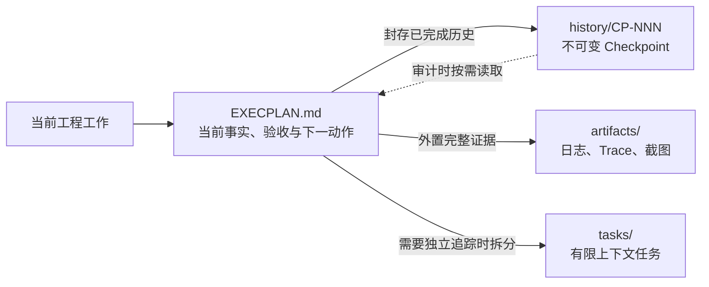

# ExecutionPlan

ExecutionPlan 是一套面向复杂工程任务的仓库级执行系统。它把计划、进度、决策、阻塞和验收保存为可验证的工程制品，让 Agent 能在跨会话、跨人员和长时间迭代后继续工作。

核心约束很简单：**根 `EXECPLAN.md` 始终保持有界、自包含，并且可以直接接手。**

## 适用场景

ExecutionPlan 适合这些工作：

- 跨模块或涉及公共契约的工程变更。
- 需要多个可独立验收里程碑的长期任务。
- 存在技术未知、外部依赖或恢复要求的工作。
- 需要在不同 Agent、会话或开发者之间持续交接的任务。
- 用户明确要求记录和跟踪的局部 Bugfix。

一次会话可以完成的小改动，继续使用线程内轻量计划即可。

## 根计划保持为当前工作集



根 `EXECPLAN.md` 始终保留：

- 当前目的、系统事实、约束、接口和恢复方法。
- 当前里程碑、当前状态与准确下一动作。
- 所有未完成的 Progress 和 Validation。
- 所有 open blocker。

Checkpoint 无损封存已完成进度、历史发现、决策、已关闭 blocker 和 Revision Notes。完整输出进入 `artifacts/`，根计划只记录结论与证据路径。

## 主要能力

- 生成自包含的 ExecPlan、Task 和 Bugfix 制品。
- 使用稳定 ID 和高水位避免编号复用。
- 校验状态机、验收项、依赖关系、blocker 和索引一致性。
- 建立带 SHA-256 的 sealed Checkpoint，检测历史正文篡改。
- 在根计划超过 800 行、64 KiB 或 50 条活跃历史事件时提示压缩。
- 严格检查完成条件，再归档 ExecPlan 或 Bugfix。
- 从真实制品重建 `PLANS.md` 和 `BUGFIXES.md` 投影。
- 不依赖 Git 即可在任意代码仓库中运行。

## 安装

环境要求：Python 3.10 或更高版本。运行时只使用 Python 标准库。

将仓库克隆到 Codex skills 目录：

```bash
git clone https://github.com/XiaoWeiKIN/ExecutionPlan.git \
  ~/.codex/skills/execution-plan
```

更新已有安装：

```bash
git -C ~/.codex/skills/execution-plan pull --ff-only
```

在 Codex 中可以直接提出：

```text
使用 $execution-plan 为这项跨模块变更创建并维护一个 ExecPlan。
```

## 快速开始

以下命令都在目标代码仓库根目录运行。

初始化管理目录：

```bash
python3 ~/.codex/skills/execution-plan/scripts/epctl.py --repo . init
```

创建 ExecPlan：

```bash
python3 ~/.codex/skills/execution-plan/scripts/epctl.py --repo . new-ep \
  --slug unify-token-refresh \
  --title "Unify token refresh"
```

生成后完整填写 `EXECPLAN.md`，删除所有 `<!-- REQUIRED... -->` 占位符，再运行：

```bash
python3 ~/.codex/skills/execution-plan/scripts/epctl.py --repo . validate
python3 ~/.codex/skills/execution-plan/scripts/epctl.py --repo . status
```

按需拆分独立 Task：

```bash
python3 ~/.codex/skills/execution-plan/scripts/epctl.py --repo . new-task EP-001 \
  --slug add-gateway-contract \
  --title "Add gateway refresh contract"
```

## 用 Checkpoint 控制文档增长

先把仍然有效的发现和决策吸收到根计划的当前事实，再预览 Checkpoint：

```bash
python3 ~/.codex/skills/execution-plan/scripts/epctl.py --repo . checkpoint EP-001 \
  --slug milestone-one \
  --title "Milestone 1 complete" \
  --current-milestone "Milestone 2: adapter integration" \
  --summary "契约层已完成；适配层仍待实现。" \
  --next-action "编辑 src/adapter.ts 并运行 npm test。" \
  --dry-run
```

确认归档数量和目标路径后，去掉 `--dry-run`。命令会保留所有未完成工作和 open blocker，并刷新根计划的 `Current Snapshot`。

Checkpoint 适合在以下时机建立：

- 一个可独立验证的里程碑完成。
- 准备跨会话交接或长时间暂停。
- `validate` 报告根计划超过默认警戒线。
- 历史事件开始遮蔽当前下一步。

详细规则见 [Checkpoint 与有界工作集](./references/checkpoints.md)。

## 严格完成与归档

ExecPlan 只有同时满足这些条件才能归档为 completed：

- Validation 全部完成。
- Task 全部为 `done` 或 `cancelled`。
- 没有 open blocker。
- Outcomes & Retrospective 已填写。
- `validate` 没有错误。

```bash
python3 ~/.codex/skills/execution-plan/scripts/epctl.py --repo . validate
python3 ~/.codex/skills/execution-plan/scripts/epctl.py --repo . archive-ep \
  EP-001 --outcome completed
```

## 生成的仓库结构

```text
docs/
├── .epctl/
├── PLANS.md
├── BUGFIXES.md
├── exec-plans/
│   ├── active/
│   │   └── ep-NNN_slug/
│   │       ├── EXECPLAN.md
│   │       ├── tasks/
│   │       ├── history/
│   │       └── artifacts/
│   ├── completed/
│   └── tech-debt-tracker.md
└── bugfixes/
    ├── active/
    └── completed/
```

`PLANS.md` 和 `BUGFIXES.md` 是可重建索引。`active/` 与 `completed/` 下的制品才是事实源。

## 开发与验证

运行全部测试：

```bash
PYTHONDONTWRITEBYTECODE=1 python3 -B -m unittest discover \
  -s tests -p 'test_*.py' -v
```

查看命令：

```bash
python3 scripts/epctl.py --help
```

测试覆盖并发编号、Checkpoint 链、篡改检测、索引恢复、严格归档、依赖循环、symlink 防护和无 Git 环境。

## 项目文档

- [Skill 入口与工作流](./SKILL.md)
- [ExecPlan 字段与维护规则](./references/template.md)
- [制品路由与状态机](./references/templates.md)
- [Checkpoint 与有界工作集](./references/checkpoints.md)
- [Bugfix 规则](./references/bugfix.md)
- [典型命令与场景](./references/examples.md)

## 设计来源

ExecutionPlan 借鉴了 OpenAI 对长时间运行 Agent 的工程实践：

- [Harness engineering: leveraging Codex in an agent-first world](https://openai.com/index/harness-engineering/)
- [Codex Exec Plans](https://developers.openai.com/cookbook/articles/codex_exec_plans)

这些实践强调仓库内事实源、渐进式信息披露、确定性工具和持续熵管理。ExecutionPlan 将这些原则落成可执行模板、状态约束与 `epctl` 命令。
