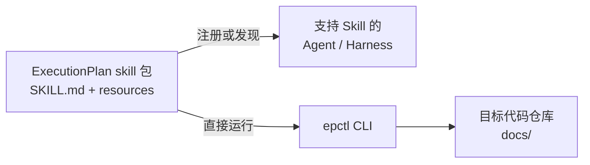
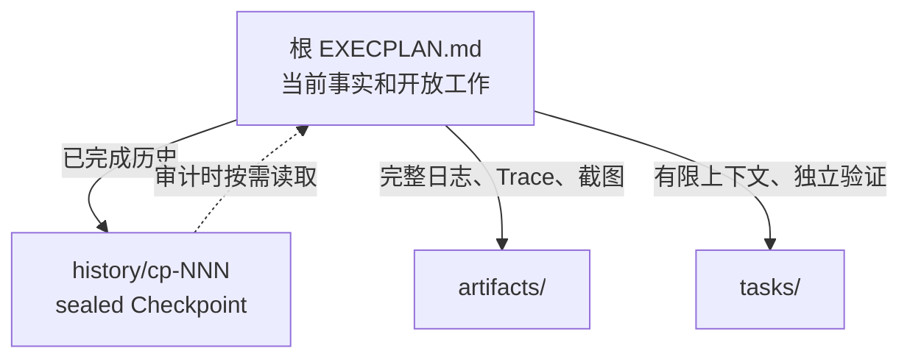

# ExecutionPlan

ExecutionPlan 是一套仓库级工程工作流：先把功能未知变成证据，再把证据压缩为可决策结论，保存长期架构决定，最后生成可跨会话恢复的开发计划。


核心约束：

- 复杂功能默认先 Research；已有充分输入时可 fast track，但必须写明理由。
- Agent 可以起草 proposed ADR；接受或拒绝必须由用户或 Decision Owner 明确授权。
- 上游引用提供审计链，ExecPlan 仍需自包含。
- `RESEARCH.md` 和 `EXECPLAN.md` 都是有界工作集，详细证据和历史下沉。
- 状态、引用、Gate、payload 和索引都可由标准库脚本机械验证。

## 为什么把 Research、ADR 和 ExecPlan 分开

三个阶段的变化频率和读者不同：

| 制品 | 回答的问题 | 内容增长策略 |
|---|---|---|
| Research | 我们知道什么，证据可靠吗？ | 主题分析进 `notes/`，原始输出进 `artifacts/` |
| Synthesis | 哪些结论足以支持选择？ | 只保留决策级结论，完成后 SHA-256 封存 |
| ADR | 长期选择是什么，承担什么后果？ | 稳定路径；方向变化用 superseding ADR |
| ExecPlan | 已决定的方向怎样落地并验收？ | 已完成历史进 sealed Checkpoint |

这样可以保留完整审计链，同时避免单个 EP 随研究材料和迭代日志无限膨胀。

## 安装与宿主接入

ExecutionPlan 是独立于具体 Agent 和 Harness 的 skill 包。仓库检出位置不属于
skill 契约：`SKILL.md` 是入口，`references/`、`assets/` 和 `scripts/` 是配套资源，
`agents/` 仅保存可选的宿主集成元数据。



要求 Python 3.10+；运行时只使用标准库。可以把仓库克隆到任意稳定目录：

```bash
git clone https://github.com/xiaoweikin/ExecutionPlan.git \
  /absolute/path/to/ExecutionPlan
export EXECUTION_PLAN_HOME=/absolute/path/to/ExecutionPlan
```

然后按所用 Agent 或 Harness 的 skill 发现机制注册
`$EXECUTION_PLAN_HOME`：目录扫描型宿主可以建立符号链接，显式配置型宿主可以直接
指向该目录。ExecutionPlan 不要求复制到任何特定 Agent 的私有目录。

更新：

```bash
git -C "$EXECUTION_PLAN_HOME" pull --ff-only
```

如果宿主支持 `$<skill-name>` 调用语法，可以直接说：

```text
使用 $execution-plan 先研究这个功能，形成技术架构决策，再给出开发计划。
```

其他宿主使用其自身的 skill 调用约定即可。

## 快速开始

以下命令在目标代码仓库根目录运行。

初始化：

```bash
EXECUTION_PLAN_HOME=/absolute/path/to/ExecutionPlan
EPCTL="$EXECUTION_PLAN_HOME/scripts/epctl.py"
python3 "$EPCTL" --repo . init
```

### 1. Research 与 Synthesis

```bash
python3 "$EPCTL" --repo . new-research \
  --slug token-refresh-contract \
  --title "Research token refresh contract"
```

生成：

```text
docs/research/active/r-001_token-refresh-contract/
├── RESEARCH.md
├── SYNTHESIS.md
├── notes/
└── artifacts/
```

完成 Research Questions、证据和 Synthesis 后：

```bash
python3 "$EPCTL" --repo . archive-research R-001 \
  --outcome concluded
```

命令会拒绝 open 问题、open blocker 和未填写占位符，封存 Synthesis 正文并把整个包移到 completed。

### 2. ADR

```bash
python3 "$EPCTL" --repo . new-adr \
  --slug token-refresh-contract \
  --title "Choose token refresh contract" \
  --research R-001
```

Agent 填写 proposed ADR。得到明确决定后：

```bash
python3 "$EPCTL" --repo . decide-adr ADR-001 \
  --outcome accepted \
  --decision-maker "API Architecture Council"
```

accepted/rejected ADR 正文会被封存。方向变化时创建并接受新 ADR：

```bash
python3 "$EPCTL" --repo . supersede-adr ADR-001 --by ADR-002
```

### 3. Gated ExecPlan

```bash
python3 "$EPCTL" --repo . new-ep \
  --slug implement-token-refresh \
  --title "Implement token refresh contract" \
  --research R-001 \
  --adr ADR-001
```

`new-ep` 只接受 concluded Research 和当前 accepted ADR。生成后，在
`Research and Architecture Inputs` 中复述关键证据、架构约束、负面后果和剩余未知，再完成里程碑、Concrete Steps、验收和恢复方法。

局部、可逆、输入已经固定的工作可以 fast track：

```bash
python3 "$EPCTL" --repo . new-ep \
  --slug clean-local-adapter \
  --title "Clean local adapter" \
  --research-not-required-reason \
  "Current contract tests fully define the behavior." \
  --architecture-not-required-reason \
  "No public boundary or durable technical choice changes."
```

## 控制长期迭代中的文档增长



根 `EXECPLAN.md` 始终保留当前目的、系统事实、Gate 输入、当前里程碑、准确下一动作、未完成 Progress/Validation 和 open blocker。

以下时机建立 Checkpoint：

- 一个独立可验证里程碑完成。
- 准备跨会话交接或暂停。
- 根计划超过约 800 行、64 KiB 或 50 条活跃历史事件。
- 已完成历史开始遮蔽当前下一步。

先把仍有效的结论吸收到当前事实，把完整输出移入 `artifacts/`，再预览：

```bash
python3 "$EPCTL" --repo . checkpoint EP-001 \
  --slug milestone-one \
  --title "Milestone 1 complete" \
  --current-milestone "Milestone 2: adapter integration" \
  --summary "契约层已完成；适配层尚未实现。" \
  --next-action "编辑 src/adapter.ts 并运行 npm test。" \
  --dry-run
```

确认后去掉 `--dry-run`。Checkpoint 无损保存旧事件，根计划继续作为唯一恢复入口。

## 状态、验证与归档

```bash
python3 "$EPCTL" --repo . status
python3 "$EPCTL" --repo . validate
python3 "$EPCTL" --repo . validate --fix-index
python3 "$EPCTL" --repo . reindex
```

`status` 汇总 Research 问题、Synthesis、ADR、ExecPlan Gate、验收、Task、blocker 和 Checkpoint。`validate --fix-index` 只重建派生索引。

ExecPlan 只有在验收完成、Task 终态、无 open blocker、复盘完整且验证通过时才能 completed：

```bash
python3 "$EPCTL" --repo . archive-ep EP-001 --outcome completed
```

## 生成的仓库结构

```text
docs/
├── .epctl/
├── RESEARCH.md
├── DECISIONS.md
├── PLANS.md
├── BUGFIXES.md
├── research/
│   ├── active/
│   └── completed/
├── adr/
├── exec-plans/
│   ├── active/
│   ├── completed/
│   └── tech-debt-tracker.md
└── bugfixes/
    ├── active/
    └── completed/
```

根索引是可重建投影；目录中的事实制品才决定真实状态。

## 开发与验证

```bash
PYTHONDONTWRITEBYTECODE=1 python3 -B -m unittest discover \
  -s tests -p 'test_*.py' -v
python3 scripts/epctl.py --help
```

测试覆盖 Gate、Research 结论、Synthesis/ADR/Checkpoint 篡改检测、ADR supersession、并发编号、索引恢复、严格归档、依赖循环、symlink 防护、无 Git 环境和 v2.1 兼容。

## 项目文档

- [Skill 入口与工作流](./SKILL.md)
- [Research 与 Synthesis](./references/research.md)
- [ADR 与 Architecture Gate](./references/adr.md)
- [ExecPlan 规范](./references/template.md)
- [制品路由与状态机](./references/templates.md)
- [Checkpoint 与有界工作集](./references/checkpoints.md)
- [Bugfix 规则](./references/bugfix.md)
- [完整示例](./references/examples.md)

## 设计来源

- [OpenAI Harness engineering](https://openai.com/index/harness-engineering/)
- [OpenAI Codex Exec Plans](https://developers.openai.com/cookbook/articles/codex_exec_plans)
- [MADR](https://adr.github.io/madr/)

仓库内事实源、短入口与渐进披露、确定性工具、first-class plans 和持续熵管理来自 Harness Engineering。自包含 Living Document 来自 Codex Exec Plans。ADR 字段与状态参考 MADR，并增加显式决策权和 payload 封存。
