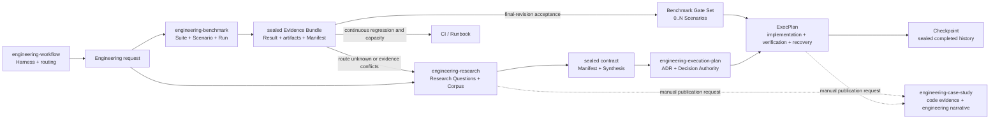
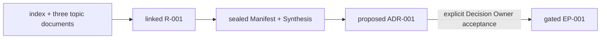
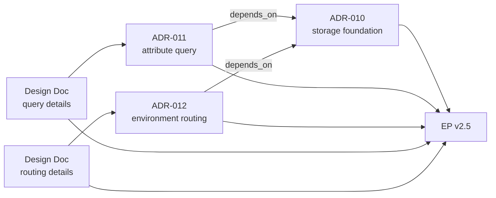
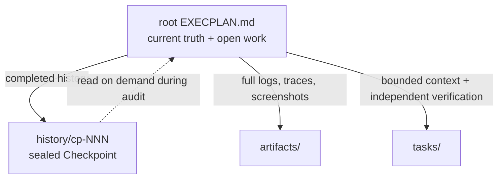
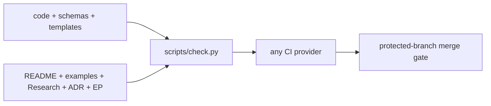

# EngineeringWorkflow

[简体中文](README.zh-CN.md) | English

EngineeringWorkflow combines one aggregation Skill with four professional
Skills:

- **Engineering Workflow** bootstraps and validates an agent-first project
  Harness, then routes follow-up work to the right professional Skill.
- **Engineering Benchmark** organizes load tests, performance comparisons,
  capacity validation, and regression tests into Suites, stable Scenarios, and
  sealed Evidence Bundles.
- **Engineering Research** turns source code, documents, experiments, and
  external research into an auditable multi-document corpus and a sealed
  Synthesis.
- **Engineering Execution Plan** consumes completed Research and governs ADRs,
  ExecPlans, Tasks, Checkpoints, Bugfixes, and technical debt.
- **Engineering Case Study** uses code, Research, ADRs, and EP history to write
  Chinese, English, or bilingual module designs, best practices, and delivery
  stories when a user explicitly asks for a shareable case study.

The four professional Skills share versioned file contracts and remain
independently installable. The aggregation Skill composes the bundled
Engineering Execution Plan initialization contract only during project
Bootstrap.



Documentation-to-code integrity is independent of any agent or hosting
provider. `python3 -B scripts/check.py` is the repository's single validation
entrypoint; GitHub Actions, GitLab CI, and other pipelines only invoke it.

## Why four professional Skills

Measurement, research synthesis, execution governance, and case-study writing
have different triggers, evidence responsibilities, and growth patterns.

| Skill | Question it answers | Primary artifacts | Out of scope |
|---|---|---|---|
| Engineering Workflow | How does a project expose an agent-navigable, verifiable engineering entrypoint? | AGENTS, Architecture, Docs Map, Harness Manifest | Accepting ADRs or generating professional artifacts |
| Engineering Benchmark | How can we measure reproducibly, and what did one run produce against predeclared rules? | Suite, Scenario, Run, Result, Evidence Manifest | Explaining cross-source conflicts, accepting ADRs, or creating implementation plans |
| Engineering Research | What do we know, how reliable is the evidence, and which options remain viable? | Research, Corpus Manifest, Synthesis, Snapshot | Accepting ADRs or creating implementation plans |
| Engineering Execution Plan | Which decision does the evidence support, and how will we implement and accept it? | ADR, ExecPlan, Task, Checkpoint, Bugfix | Collecting new evidence or maintaining the research corpus |
| Engineering Case Study | Which engineering judgment is worth sharing, and how should code and process evidence tell the story? | Module design, best-practice article, delivery case study | Automatic generation, changing factual artifacts, or replacing current specifications |

Benchmark evidence does not always belong in Research. Exploratory comparisons
and route-changing experiments enter Research. Final-revision acceptance for an
already selected route becomes direct EP evidence. Nightly regression and
capacity trends stay in CI or a Runbook. A continuous Benchmark becomes
Research only when the route is unknown, evidence conflicts, or a new decision
is required. One EP can be driven by several independent Scenarios: declare the
complete set before implementation, cover each gate with one passed sealed Run
from the same revision, and never collapse unlike protocols or environments
into one aggregate score.

One Research package may contain many documents when they serve the same
decision purpose, share Research Questions, conclude together, and feed the
same Synthesis. Split them when purpose, Owner, completion timing, or downstream
consumer can change independently.

Research can also proceed through multiple rounds. Create an `RR-NNN` Round
when discussion continues, evidence expands, or a conclusion needs deeper
review. Keep full Synthesis snapshots for sparse milestones such as formal
review, handoff, or a major decision. Only explicit Research Owner
authorization concludes Research.

These boundaries keep documents bounded:

- `RESEARCH.md` keeps purpose, questions, the current route, and a finding
  index.
- `rounds/` records each round's focus, evidence delta, and conclusion changes.
- Managed topic analysis goes into `notes/`; existing document trees are
  registered as linked corpora.
- `RESEARCH_MANIFEST.json` records membership, entrypoints, byte sizes, and
  SHA-256 digests.
- `SYNTHESIS.md` keeps only conclusions required by downstream decisions.
- `EXECPLAN.md` keeps current truth and open work; completed history moves into
  sealed Checkpoints.

## Repository layout and installation

This Git repository is both the distribution and the aggregation Skill:

```text
EngineeringWorkflow/
├── SKILL.md                         # engineering-workflow aggregation Skill
├── scripts/
│   ├── engineeringctl.py            # Harness Bootstrap and validation
│   └── check.py                     # single repository check entrypoint
├── assets/
│   └── harness-*.md
├── engineering-benchmark/
│   ├── SKILL.md                     # engineering-benchmark Skill root
│   └── scripts/benchctl.py
├── engineering-research/
│   ├── SKILL.md                     # engineering-research Skill root
│   └── scripts/researchctl.py
├── engineering-execution-plan/
│   ├── SKILL.md                     # engineering-execution-plan Skill root
│   └── scripts/epctl.py
└── engineering-case-study/
    └── SKILL.md                     # engineering-case-study Skill root
```

Python 3.10+ is required. All four governance CLIs use only the standard
library; Engineering Case Study needs no dedicated CLI. Clone the repository
into any stable directory:

```bash
git clone https://github.com/XiaoWeiKIN/EngineeringWorkflow.git \
  /absolute/path/to/EngineeringWorkflow
export ENGINEERING_WORKFLOW_HOME=/absolute/path/to/EngineeringWorkflow
```

Register these five directories through your agent or Harness Skill discovery
mechanism:

```text
/absolute/path/to/EngineeringWorkflow
/absolute/path/to/EngineeringWorkflow/engineering-benchmark
/absolute/path/to/EngineeringWorkflow/engineering-research
/absolute/path/to/EngineeringWorkflow/engineering-execution-plan
/absolute/path/to/EngineeringWorkflow/engineering-case-study
```

The root is the Workflow aggregation Skill. The four child directories are the
Benchmark, Research, Execution Plan, and Case Study professional Skills.
Directory scanning, symbolic links, configuration, and other registration
mechanisms all work; this project does not require installation into an
agent-specific private directory.

Update the distribution with:

```bash
git -C "$ENGINEERING_WORKFLOW_HOME" pull --ff-only
```

Hosts that support `$<skill-name>` syntax can invoke each Skill directly:

```text
Use $engineering-workflow to bootstrap the project Harness and route follow-up engineering work.
Use $engineering-benchmark to design a reproducible spans-placement Scenario and seal the Run.
Use $engineering-research to investigate spans aggregation and organize the existing multi-document corpus.
Use $engineering-execution-plan to turn completed Research into an ADR and a resumable implementation plan.
Use $engineering-case-study to write a module-design article from the code, Research, and EP-038.
```

Other hosts can use their own Skill invocation convention.

## Quick start

Run the following commands from the target repository root:

```bash
ENGINEERING_WORKFLOW_HOME=/absolute/path/to/EngineeringWorkflow
WORKFLOWCTL="$ENGINEERING_WORKFLOW_HOME/scripts/engineeringctl.py"
BENCHCTL="$ENGINEERING_WORKFLOW_HOME/engineering-benchmark/scripts/benchctl.py"
RESEARCHCTL="$ENGINEERING_WORKFLOW_HOME/engineering-research/scripts/researchctl.py"
EPCTL="$ENGINEERING_WORKFLOW_HOME/engineering-execution-plan/scripts/epctl.py"

python3 "$BENCHCTL" --repo . init
python3 "$RESEARCHCTL" --repo . init
python3 "$EPCTL" --repo . init
```

All three `init` commands are idempotent. Benchmark owns
`benchmarks/.benchctl/state.json`. Research and Execution Plan share the
Research ID high-water mark in `docs/.epctl/state.json`.

### Bootstrap a Codex project documentation Harness

`init` creates only the artifact structure owned by each professional Skill.
To also create a short `AGENTS.md`, architecture map, documentation index,
quality, reliability, security, and Design Doc entrypoints, preview the
Bootstrap first:

```bash
python3 "$WORKFLOWCTL" --repo . bootstrap --profile codex
```

Apply and validate only after the preview reports no conflicts:

```bash
python3 "$WORKFLOWCTL" --repo . bootstrap --profile codex --apply
python3 "$WORKFLOWCTL" --repo . validate --harness
```

Bootstrap creates missing paths and never overwrites existing files. Every
registered agent instruction file must stay at or below 100 physical lines.
The first profile registers only the root `AGENTS.md`, and its template reserves
at least 20 lines for project-specific guidance. An existing file over the hard
limit is reported as a conflict before any write occurs.

### Create and seal a Benchmark

Create a long-lived Suite, complete its generated `BENCHMARK.md`, then create a
reusable Scenario:

```bash
python3 "$BENCHCTL" --repo . new-suite \
  --slug spans-placement \
  --title "Spans placement strategies" \
  --owner "Observability Performance Owner"

python3 "$BENCHCTL" --repo . new-scenario B-001 \
  --slug placement-order-key \
  --title "Compare placement order-key strategies"

python3 "$BENCHCTL" --repo . new-scenario B-001 \
  --slug sustained-throughput \
  --title "Verify sustained placement throughput"
```

Before results are visible, the Scenario must define its hypothesis, falsifier,
controlled variables, dataset, environment, commands, warmup, repetition
strategy, metrics, correctness checks, decision rules, and extrapolation
boundary. Then create a Run against explicit subject and harness revisions:

```bash
python3 "$BENCHCTL" --repo . new-run BS-001 \
  --slug candidate-a \
  --title "Candidate A at 10k spans/s" \
  --subject-revision "git:<subject-commit>" \
  --harness-revision "git:<harness-commit>"
```

Execute the real benchmark, place raw CSV, JSON, logs, traces, profiles, or
screenshots unchanged under the Run's `artifacts/`, and complete `RESULT.md`.
Artifact formats may differ; Scenario, Result, and Manifest provide the shared
contract. Seal the completed Run:

```bash
python3 "$BENCHCTL" --repo . seal-run BR-001 \
  --outcome passed \
  --executed-by "Benchmark Operator"
```

`passed`, `failed`, `inconclusive`, and `errored` are all sealable outcomes.
The Manifest inventories byte sizes and SHA-256 digests for `SCENARIO.md`,
`RESULT.md`, and local artifacts. Any post-seal addition, deletion, or change
fails validation. Corrections and new evidence require a new Run connected
through `--supersedes BR-NNN`.

Generate a reference that downstream artifacts can consume directly:

```bash
python3 "$BENCHCTL" --repo . evidence-ref BR-001
# benchmark:BR-001@sha256:<manifest-payload-sha256>
```

### Generate a case study manually

Engineering Case Study has no background task or automatic hook. Invoke it only
after a user explicitly selects a topic:

```text
Use $engineering-case-study with the current code, R-006, and EP-042 to write a bilingual module-design article about the spans-aggregate planner.
```

The Skill first confirms `zh-CN`, `en`, or `bilingual`. It asks when the
language is unspecified instead of inferring from the conversation. It then
checks code, tests, Research/ADR/EP artifacts, and the revision before writing a
`draft` at the repository's agreed location. A document becomes `verified` only
when the user requests finalization and source, link, and redaction checks pass.
Bilingual output defaults to two independently readable articles backed by the
same evidence.

### End-to-end example: from four documents to an executable EP

The [cache-topology example](./examples/cache-topology/README.md) provides four
copyable corpus documents and demonstrates:



The example includes concrete Research Questions, benchmark numbers, Synthesis
conclusions, an ADR authorization statement, Gate fields, and implementation
milestones. Corpus registration commands are executable. The ADR remains
`proposed`; the example never fabricates a human decision.

### 1. Create managed Research

Use managed Research when starting from scratch:

```bash
python3 "$RESEARCHCTL" --repo . new-research \
  --slug token-refresh-contract \
  --title "Research token refresh contract" \
  --owner "API Platform Owner" \
  --author "Codex" \
  --research-type technical
```

This creates:

```text
docs/research/active/r-001_token-refresh-contract/
├── RESEARCH.md
├── RESEARCH_MANIFEST.json
├── SYNTHESIS.md
├── rounds/
├── notes/
├── snapshots/
└── artifacts/
```

Use structured topic documents to answer one or more tightly related Research
Questions:

```bash
python3 "$RESEARCHCTL" --repo . new-topic R-001 \
  --slug http-auth-boundary \
  --title "HTTP authentication boundary" \
  --question RQ-001 --author "Security Researcher"
```

The command allocates a unique, non-reusable `RT-NNN` within the Research,
writes the topic under `notes/`, attaches it to the current Round, and refreshes
the Manifest. New topics use the learning-first schema 2.2: the opening screen
states the answer, confidence, applicability boundary, and decision impact;
the body builds a mental model before explaining the reasoning through
continuous `A-NNN` analyses; the `E-NNN` evidence index and `S-NNN` source list
after Handoff support auditing. Filenames stay semantic. Cross-topic references
use `R-001/RT-001/A-002`. Visible titles may change for audience or language
while hidden roles keep the structure stable. Ordinary topic or source notes
may still be added directly under `notes/`; run `sync-research` after manual
adds, moves, or deletions. Topic schemas 1, 2, and 2.1 remain compatible.

### 2. Adopt an existing multi-document Research corpus

An existing `index.md` plus topic documents can remain in place; do not merge
them into one large file:

```bash
python3 "$RESEARCHCTL" --repo . new-research \
  --slug spans-aggregate \
  --title "Research spans aggregate" \
  --owner "Observability Owner" \
  --author "Codex" \
  --corpus-root _bmad-output/planning-artifacts/research/spans-aggregate \
  --entrypoint _bmad-output/planning-artifacts/research/spans-aggregate/index.md
```

`--corpus-root`, `--entrypoint`, and `--include` are repeatable. The CLI accepts
absolute paths inside the repository, but the Manifest always stores normalized
repository-relative paths. Paths outside the repository, traversal, and
symlink escapes are rejected.

Validation checks:

- corpus membership and document SHA-256 drift;
- local Markdown links and `inputDocuments`;
- whether each entrypoint belongs to the Manifest;
- non-portable references such as absolute workstation paths.

```bash
python3 "$RESEARCHCTL" --repo . validate
python3 "$RESEARCHCTL" --repo . status
```

After completing the Research Questions and current Synthesis, create a review
revision:

```bash
python3 "$RESEARCHCTL" --repo . mark-review-ready R-001
```

By default this increments the Synthesis revision and records its body SHA-256
without copying another Markdown file. Save a full snapshot only for formal
review, downstream handoff, or a major decision:

```bash
python3 "$RESEARCHCTL" --repo . \
  mark-review-ready R-001 --snapshot
```

Snapshot revisions may contain gaps, and identical bodies reuse an existing
snapshot. Conclusion ensures that the latest unique body has at least one full
milestone snapshot.

Research remains under `active/` during review. Open another Round when review
requires a deeper investigation:

```bash
python3 "$RESEARCHCTL" --repo . new-round R-001 \
  --slug http-security \
  --title "Deep dive into HTTP security" \
  --author "Security Reviewer"
```

Use `new-topic` for the Round's topics. Review-ready Research cannot receive a
topic directly, preventing new evidence from bypassing the Round and Synthesis
revision.

Only explicit Research Owner authorization can seal the Research:

```bash
python3 "$RESEARCHCTL" --repo . conclude-research R-001 \
  --approved-by "Observability Owner" \
  --approval-ref "review:OBS-123"
```

Managed documents seal in place. Linked documents are copied into
`artifacts/research-snapshot/` under the completed Research while their sources
remain unchanged. Manifest and Synthesis receive verifiable digests.
Cancellation also requires explicit Owner authorization and a reason, and it
cannot satisfy a downstream Research Gate.

### 3. Make an ADR

`engineering-execution-plan` accepts only valid, concluded Research. When a
Research Manifest exists, it must also be sealed and untampered:

```bash
python3 "$EPCTL" --repo . new-adr \
  --slug token-refresh-contract \
  --title "Choose token refresh contract" \
  --research R-001
```

An agent may draft a proposed ADR. Acceptance or rejection must come from the
user or an explicit Decision Owner:

```bash
python3 "$EPCTL" --repo . decide-adr ADR-001 \
  --outcome accepted \
  --decision-maker "API Architecture Council"
```

Create a supersession chain when the direction changes:

```bash
python3 "$EPCTL" --repo . supersede-adr ADR-001 --by ADR-002
```

Do not combine every decision for one feature into a giant ADR. Keep each ADR
atomic and compose a typed Architecture Input Set:



Register an existing ADR or Design Doc directory in place:

```bash
python3 "$EPCTL" --repo . register-architecture-root docs/design-docs
```

The registration is stored in `docs/.epctl/config.json`, so local runs, GitHub
Actions, GitLab CI, and other pipelines consume the same inputs. New ADRs still
go into `docs/adr/`. Existing ADRs without an epctl decision signature enter
through read-only compatibility mode and produce a warning. Never backfill
fabricated historical authorization.

### 4. Create a gated ExecPlan

```bash
python3 "$EPCTL" --repo . new-ep \
  --slug implement-token-refresh \
  --title "Implement token refresh contract" \
  --research R-001 \
  --adr ADR-001 \
  --design docs/design-docs/token-refresh.md \
  --architecture-entrypoint docs/design-docs/index.md \
  --benchmark-scenario BS-001 \
  --benchmark-scenario BS-002
```

In `Research and Architecture Inputs`, restate the decisive evidence,
architecture constraints, negative consequences, and remaining unknowns. Then
complete milestones, Concrete Steps, acceptance, and recovery. When an ADR has
`depends_on` or `amends`, `--adr` must list the complete transitive closure.
Design Docs referenced by those ADRs must also appear through `--design`.
Repeat `--benchmark-scenario` for every required Benchmark Scenario. The
generated `required_benchmark_scenarios` and `Benchmark Gate Set` create a
mechanically verifiable many-to-one relationship between measurements and the
EP.

At completion, attach one Run for each Scenario. Every Run must use the same
final revision:

```bash
python3 "$EPCTL" --repo . archive-ep EP-001 \
  --outcome completed \
  --verified-revision "git:<final-commit>" \
  --evidence "benchmark:BR-001@sha256:<payload>" \
  --evidence "benchmark:BR-002@sha256:<payload>"
```

Archival fails atomically when a Scenario is missing, one Scenario has two
accepted Runs, a Run belongs to an undeclared Scenario, or any
`subject_revision` differs.

Fast-track only when inputs are sufficient and no unknown could change the
route. Record an auditable reason:

```bash
python3 "$EPCTL" --repo . new-ep \
  --slug clean-local-adapter \
  --title "Clean local adapter" \
  --research-not-required-reason \
  "Current contract tests fully define the behavior." \
  --architecture-not-required-reason \
  "No public boundary or durable technical choice changes."
```

## Keep long-running ExecPlans bounded



The root plan always keeps the current purpose, system facts, Gate inputs,
current milestone, exact next action, incomplete Progress/Validation, and open
blockers. Create a Checkpoint when:

- an independently verifiable milestone finishes;
- work is about to pause or cross a session boundary;
- the root exceeds roughly 800 lines, 64 KiB, or 50 active history events;
- completed history starts obscuring the current next step.

First absorb durable conclusions into current truth and move full output into
`artifacts/`. Then preview the Checkpoint:

```bash
python3 "$EPCTL" --repo . checkpoint EP-001 \
  --slug milestone-one \
  --title "Milestone 1 complete" \
  --current-milestone "Milestone 2: adapter integration" \
  --summary "The contract layer is complete; the adapter is not implemented." \
  --next-action "Edit src/adapter.ts and run npm test." \
  --revision "git:<current-commit>" \
  --dry-run
```

Remove `--dry-run` after confirming the preview.

## Validate status and archive completed work

```bash
python3 "$BENCHCTL" --repo . validate
python3 "$RESEARCHCTL" --repo . validate
python3 "$EPCTL" --repo . validate
python3 "$EPCTL" --repo . validate --fix-index
python3 "$EPCTL" --repo . status
```

An ExecPlan can complete only after acceptance passes, Tasks reach terminal
states, no blocker remains open, the retrospective is complete, and
verification succeeds:

```bash
python3 "$EPCTL" --repo . archive-ep EP-001 \
  --outcome completed \
  --verified-revision "git:<verified-commit>" \
  --evidence "ci:<pipeline-or-job-url>"
```

Root indexes are rebuildable projections. Factual artifacts in their lifecycle
directories determine the true state.

## Keep documentation and code aligned through one CI contract



The canonical check runs all four governance CLI test suites, Research and
Execution Plan repository validation, five-Skill portability checks, local
Markdown link validation, the cache-topology end-to-end contract test, and
index regeneration diff checks. CI definitions must not duplicate those
subcommands:

- GitHub uses `.github/workflows/integrity.yml`; configure the stable
  `ep-integrity` status check as required.
- GitLab uses `.gitlab-ci.yml`; protect the default branch, reject direct push,
  and enable `Pipelines must succeed`.
- Jenkins, Buildkite, and other providers run
  `python3 -B scripts/check.py` directly.

`CODEOWNERS` lives at the repository root and works with GitHub and GitLab.
Specific approver accounts and hosting settings belong to repository
governance, not to a Skill installation directory. GitLab Free can route review
through this file; requiring Code Owner approval needs a supporting GitLab
tier, while the CI merge gate remains available. See
[Documentation and code integrity](./engineering-execution-plan/references/integrity.md).

## Compatibility

- The root Skill moved from `$execution-plan` to `$engineering-workflow`. The
  original EP Skill now lives under `engineering-execution-plan/`; callers must
  update root `scripts/epctl.py` references to
  `engineering-execution-plan/scripts/epctl.py`.
- The GitHub repository was renamed from `EngineeringPlan` to
  `EngineeringWorkflow`. GitHub redirects the old URL, but existing clones
  should update `origin`; see
  [GitHub's rename documentation](https://docs.github.com/en/repositories/creating-and-managing-repositories/renaming-a-repository).
- Legacy Research packages without `RESEARCH_MANIFEST.json` remain readable by
  both validators.
- Legacy `epctl new-research`, `archive-research`, and related commands remain
  temporarily available, but new work should use `engineering-research`. This
  is a migration surface, not a new ownership boundary.
- Research schema 1 remains readable. Schema 1.1 adds visible human metadata,
  Rounds, Synthesis revisions, and explicit conclusion authority.
- The four professional Skills do not couple through relative imports,
  installation paths, or runtime calls. The `engineering-workflow` aggregation
  Skill composes EP initialization only inside the bundled distribution.
- Engineering Benchmark is a new contract and provides no adapter for legacy
  benchmark directories or historical report formats.
- Raw Benchmark artifacts do not need one common format. `RESULT.md` and
  `EVIDENCE_MANIFEST.json` provide the shared consumption and integrity
  boundary.
- Manifest is an optional backward-compatible field; once present, it must
  satisfy the versioned contract.
- ExecPlan v2.0 through v2.4 remain readable. New plans use the v2.5
  Architecture Input Set and `required_benchmark_scenarios`.
- Existing accepted ADRs can enter read-only from registered directories.
  Strict new ADRs use schema 1.1.

## Development and validation

```bash
python3 -B scripts/check.py
```

The command depends only on repository content and Python 3.10+, not on any
agent's private Skill directory.

## Project documentation

End-to-end:

- [Executable cache-topology example](./examples/cache-topology/README.md)
- [Multi-ADR / Design Doc Architecture Input Set example](./engineering-execution-plan/examples/architecture-input-set/README.md)

Engineering Workflow:

- [Skill entrypoint](./SKILL.md)
- [Codex project documentation Bootstrap](./references/bootstrap.md)

Engineering Benchmark:

- [Skill entrypoint](./engineering-benchmark/SKILL.md)
- [Suite / Scenario / Run and Manifest contract](./engineering-benchmark/references/contract.md)
- [Research, EP, and CI routing examples](./engineering-benchmark/references/examples.md)

Engineering Research:

- [Skill entrypoint](./engineering-research/SKILL.md)
- [Research method](./engineering-research/references/research.md)
- [Structured topic documents](./engineering-research/references/topic.md)
- [Manifest contract](./engineering-research/references/manifest.md)
- [Typical scenarios](./engineering-research/references/examples.md)

Engineering Execution Plan:

- [Skill entrypoint](./engineering-execution-plan/SKILL.md)
- [Research consumption contract](./engineering-execution-plan/references/research.md)
- [Benchmark final-revision evidence](./engineering-execution-plan/references/benchmark.md)
- [ADR and Architecture Gate](./engineering-execution-plan/references/adr.md)
- [ExecPlan specification](./engineering-execution-plan/references/template.md)
- [Artifact routing and state machines](./engineering-execution-plan/references/templates.md)
- [Checkpoints and bounded working sets](./engineering-execution-plan/references/checkpoints.md)
- [Documentation and code integrity](./engineering-execution-plan/references/integrity.md)
- [Bugfix rules](./engineering-execution-plan/references/bugfix.md)
- [Complete examples](./engineering-execution-plan/references/examples.md)

Engineering Case Study:

- [Skill entrypoint](./engineering-case-study/SKILL.md)
- [Sources and evidence](./engineering-case-study/references/source-evidence.md)
- [Article patterns](./engineering-case-study/references/article-patterns.md)
- [Chinese and English writing](./engineering-case-study/references/language.md)
- [Pre-publication review](./engineering-case-study/references/review.md)

## Design sources

- [OpenAI Harness engineering](https://openai.com/index/harness-engineering/)
- [OpenAI Codex Exec Plans](https://developers.openai.com/cookbook/articles/codex_exec_plans)
- [MADR](https://adr.github.io/madr/)

Harness Engineering informs the repository-backed source of truth, short
entrypoints with progressive disclosure, deterministic tooling, first-class
plans, and continuous entropy management. Codex Exec Plans informs the
self-contained Living Document. ADR fields and states build on MADR with
explicit decision authority and sealed payloads.
