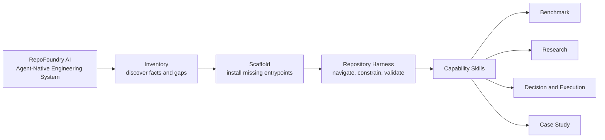
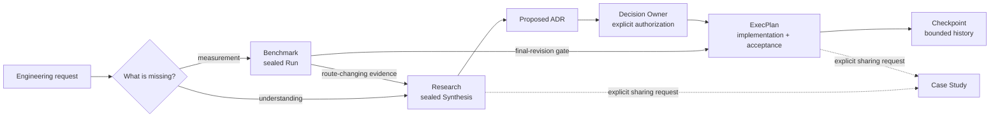
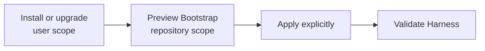
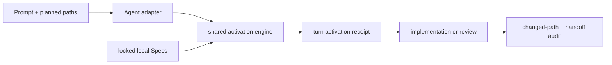

# RepoFoundry AI

[简体中文](README.zh-CN.md) | English

<p align="center">
  
</p>

<p align="center"><strong>The Agent-Native Engineering System</strong></p>

<p align="center">Turn any repository into an AI-ready engineering system.</p>

**RepoFoundry AI** turns an ordinary software repository into an environment
that humans and coding agents can navigate, govern, and verify together. It
installs durable engineering context close to the code: short agent
entrypoints, architecture maps, composable specifications, evidence contracts,
decisions, execution plans, and one deterministic validation path.

The repository remains the source of truth. RepoFoundry does not depend on one
model, agent, editor, or Git hosting provider.

## One system, four layers



- **Inventory** inspects the repository before proposing change.
- **Scaffold** performs guarded, preview-first Bootstrap.
- **Repository Harness** is the persistent environment left in the target
  repository.
- **Capability Skills** create specialized evidence and governance artifacts.

`Workflow` describes how an individual capability runs. RepoFoundry is the
system that makes those workflows composable and verifiable.

## Five Skills share file contracts

| Skill | Responsibility | Durable output |
|---|---|---|
| [`repo-foundry-ai`](./SKILL.md) | Inspect, Bootstrap, synchronize Specs, validate the Harness, and route work | `AGENTS.md`, architecture and docs maps, Harness and Spec manifests |
| [`engineering-benchmark`](./engineering-benchmark/SKILL.md) | Predeclare and execute reproducible measurement | Suite, Scenario, Run, Result, sealed Evidence Manifest |
| [`engineering-research`](./engineering-research/SKILL.md) | Investigate unknowns and synthesize multi-document evidence | Research controller, corpus Manifest, Rounds, topics, sealed Synthesis |
| [`engineering-execution-plan`](./engineering-execution-plan/SKILL.md) | Govern decisions and implementation | ADR, ExecPlan, Task, Checkpoint, Bugfix, technical debt |
| [`engineering-case-study`](./engineering-case-study/SKILL.md) | Turn verified code and process evidence into a shareable narrative | Chinese, English, or bilingual engineering case study |

The four professional Skills remain independently installable. They communicate
through versioned repository files rather than private runtime imports.

## Evidence moves forward without losing authority



Agents may collect evidence and draft decisions. Research conclusion and ADR
acceptance remain explicit human authority boundaries.

## What appears in a target repository

RepoFoundry creates only the paths owned by a selected capability. A fully used
target may contain:

```text
target-repository/
├── AGENTS.md                         # Codex adapter only
├── ARCHITECTURE.md
├── .repo-foundry/
│   ├── engineering-specs/spec_router.py # shared activation engine
│   └── skills/repo-foundry-ai/SKILL.md  # canonical project workflow
├── .agents/skills/                   # Codex adapter entrypoints
│   ├── repo-foundry-ai/SKILL.md
│   └── engineering-specs/
│       ├── SKILL.md
│       ├── agents/openai.yaml
│       └── scripts/spec_router.py
├── .claude/skills/                   # Claude project Skills
│   ├── repo-foundry-ai/SKILL.md
│   └── engineering-specs/SKILL.md
├── .codex/
│   └── hooks.json                     # reviewed project activation guards
├── scripts/
│   └── bench/                         # project-owned benchmark executables
├── benchmarks/
│   ├── BENCHMARKS.md
│   └── suites/b-NNN_slug/
│       ├── BENCHMARK.md
│       ├── scenarios/bs-NNN_slug.md
│       └── runs/br-NNN_slug/
│           ├── SCENARIO.md
│           ├── RESULT.md
│           ├── EVIDENCE_MANIFEST.json
│           └── artifacts/
└── docs/
    ├── .engineering/
    │   ├── harness.json
    │   ├── specs.json
    │   └── specs.lock.json
    ├── agent-guides/
    │   ├── README.md                  # Portable adapter entrypoint
    │   └── managed/
    ├── design-docs/
    ├── research/{active,completed}/
    ├── adr/
    ├── exec-plans/{active,completed}/
    ├── bugfixes/{active,completed}/
    └── case-studies/
```

Benchmark Scenarios reference project-owned executables under
`scripts/bench/`; RepoFoundry AI records their evidence without owning the
project's measurement implementation.

Bootstrap never invents repository facts. Unknown commands, owners,
architecture, SLOs, and security controls remain explicit `BOOTSTRAP_TODO`
markers for maintainers to resolve.

## Install once, enable each repository explicitly

RepoFoundry has two independent scopes. The **distribution installation** puts
the CLI and optional personal Skill entrypoints in your user environment. The
**repository Bootstrap** writes a versioned Harness and project Skills only to
the repository you select. Installing or upgrading the distribution never
scans or changes project repositories.



### Fast path: install and enable every bundled adapter

The installer supports macOS and Linux and requires Python 3.10+ plus `curl`.

1. Install the latest stable release. Run the same command later to upgrade:

   ```bash
   curl -fsSL https://raw.githubusercontent.com/XiaoWeiKIN/RepoFoundryAI/main/install.py | python3 -
   ```

2. From the target repository, preview the Agent-neutral Core and every bundled
   project adapter:

   ```bash
   repofoundry --repo . bootstrap --all-adapters
   ```

3. Review the `create`, `preserve`, and `conflict` actions. Apply only a
   conflict-free plan, then validate the result:

   ```bash
   repofoundry --repo . bootstrap --all-adapters --apply
   repofoundry --repo . validate
   ```

`--all-adapters` always expands to `codex`, `claude`, and `portable` in a
deterministic order. The result does not depend on which Agent products are
installed on the machine.

### Enable only the adapter you need

Use the same preview-then-apply flow with one or more explicit adapters:

```bash
# Claude Code only: preview, then apply
repofoundry --repo . bootstrap --adapter claude
repofoundry --repo . bootstrap --adapter claude --apply

# Codex and the product-neutral guide
repofoundry --repo . bootstrap --adapter codex --adapter portable
repofoundry --repo . bootstrap --adapter codex --adapter portable --apply
```

| Adapter | Project-owned entrypoint |
|---|---|
| `codex` | `AGENTS.md`, `.agents/skills/`, and reviewed `.codex/` guards |
| `claude` | Native project Skills under `.claude/skills/` |
| `portable` | Product-neutral guidance under `docs/agent-guides/` |

All adapters share the canonical workflow at
`.repo-foundry/skills/repo-foundry-ai/SKILL.md` and the Core Spec Router. The
Claude adapter creates regular project files; it never links the repository to
a home directory. Claude Code gives a personal Skill precedence over a project
Skill with the same name, so the personal entrypoint delegates to the canonical
project workflow when that file exists.

### `--host` controls personal discovery, not project compatibility

You do not need to pass `--host` for normal installation. Its default value is
`auto`, which registers the personal RepoFoundry Skill with every detected
Codex or Claude Code installation. Other Agents can still use the CLI and the
portable project adapter without either host directory.

| Installer option | Personal Skill behavior |
|---|---|
| `--host auto` | Register every detected supported host; this is the default |
| `--host codex` | Ensure the Codex personal Skill link exists |
| `--host claude` | Ensure the Claude Code personal Skill link exists |
| `--host none` | Leave existing registrations unchanged and create none |

Examples:

```bash
curl -fsSL https://raw.githubusercontent.com/XiaoWeiKIN/RepoFoundryAI/main/install.py | python3 - --version 0.2.0 --host codex
curl -fsSL https://raw.githubusercontent.com/XiaoWeiKIN/RepoFoundryAI/main/install.py | python3 - --host claude
curl -fsSL https://raw.githubusercontent.com/XiaoWeiKIN/RepoFoundryAI/main/install.py | python3 - --host none
```

The installer backs up an existing non-managed target before replacing it.
Claude Code uses `$CLAUDE_CONFIG_DIR/skills/repo-foundry-ai` when
`CLAUDE_CONFIG_DIR` is set and `~/.claude/skills/repo-foundry-ai` otherwise;
`--claude-home` overrides both. Directory symlink discovery requires Claude
Code 2.1.203 or later.

### Upgrade the distribution, then migrate repositories explicitly

Rerunning the one-line installer atomically activates the latest stable release
and is a no-op when that release is already active. It resolves the release tag
to an immutable commit, records the archive SHA-256, and validates the staged
package before activation.

Repository migration remains a separate, preview-first operation. After a
distribution upgrade, run this in each existing project and replace `0.2.0`
with the installed target version when necessary:

```bash
repofoundry --repo . upgrade --to 0.2.0
repofoundry --repo . upgrade --to 0.2.0 --apply
repofoundry --repo . validate
```

Check the active installation and available adapters at any time:

```bash
repofoundry --version
repofoundry --repo . adapter list
```

### Inspect first or install from a checkout

If your environment prohibits piping downloaded code to an interpreter,
download and inspect the installer before running it:

```bash
curl -fsSLo /tmp/repofoundry-install.py https://raw.githubusercontent.com/XiaoWeiKIN/RepoFoundryAI/main/install.py
less /tmp/repofoundry-install.py
python3 /tmp/repofoundry-install.py
```

Maintainers can install an explicit checkout without downloading a release:

```bash
git clone https://github.com/XiaoWeiKIN/RepoFoundryAI.git /absolute/path/to/RepoFoundryAI
python3 /absolute/path/to/RepoFoundryAI/install.py --source /absolute/path/to/RepoFoundryAI
export REPO_FOUNDRY_HOME="${XDG_DATA_HOME:-$HOME/.local/share}/repofoundry-ai/current"
```

## Start with a Prompt

Bootstrap a repository:

```text
Use $repo-foundry-ai to inspect this repository, preview the Agent-neutral
Harness Core and suitable adapters, and report create, preserve, and conflict
actions. Apply only after the preview is conflict-free, then validate the
Harness and local Specs.
```

Route specialized work:

```text
Use $engineering-benchmark to define a reproducible capacity Scenario before
running the measurement.

Use $engineering-research to investigate the cache topology, preserve
counterevidence, and stop at review-ready Synthesis.

Use $engineering-execution-plan to consume the concluded Research, draft the
ADR, and wait for Decision Owner authorization before accepting it.

Use $engineering-case-study with the verified code, Research, ADR, and ExecPlan
to write a bilingual module-design article.
```

The [cache-topology example](./examples/cache-topology/README.md) shows the full
Prompt-driven handoff from an existing corpus to Research, an authorized ADR,
and a gated ExecPlan.

## Prompt-driven examples

The bilingual [Prompt example catalog](./examples/README.md) and
[Chinese catalog](./examples/README.zh-CN.md) cover all five Skills as
standalone entrypoints and as evidence handoffs:

| Situation | First Skill |
|---|---|
| Initialize a repository or route an ambiguous request | `$repo-foundry-ai` |
| Produce reproducible measurements | `$engineering-benchmark` |
| Investigate unknowns or adopt an existing corpus | `$engineering-research` |
| Record a decision or drive delivery | `$engineering-execution-plan` |
| Write a shareable engineering narrative | `$engineering-case-study` |

Users provide intent, context, stopping boundaries, and explicit authority.
Skills invoke deterministic control scripts internally and report the resulting
IDs, artifacts, and validation results.

## Deterministic CLI surfaces

Skills invoke these CLIs for state changes and validation. Humans can use them
directly for automation or diagnosis:

```bash
REPO_FOUNDRY_HOME="${XDG_DATA_HOME:-$HOME/.local/share}/repofoundry-ai/current"
BENCHCTL="$REPO_FOUNDRY_HOME/engineering-benchmark/scripts/benchctl.py"
RESEARCHCTL="$REPO_FOUNDRY_HOME/engineering-research/scripts/researchctl.py"
EPCTL="$REPO_FOUNDRY_HOME/engineering-execution-plan/scripts/epctl.py"

repofoundry --version
repofoundry --repo . adapter list
repofoundry --repo . bootstrap --adapter portable
repofoundry --repo . bootstrap --adapter claude --apply
repofoundry --repo . \
  bootstrap --all-adapters --spec languages/go --apply
repofoundry --repo . validate --harness
repofoundry --repo . validate --adapter codex
repofoundry --repo . validate --adapter claude
repofoundry --repo . upgrade --to 0.2.0
repofoundry --repo . upgrade --to 0.2.0 --apply

repofoundry --repo . spec plan
repofoundry --repo . spec sync --apply
repofoundry --repo . \
  spec update --spec-version 1.2.0 --spec languages/go --apply
repofoundry --repo . spec validate

python3 "$BENCHCTL" --repo . validate
python3 "$RESEARCHCTL" --repo . validate
python3 "$EPCTL" --repo . validate
python3 "$EPCTL" --repo . status
```

Bootstrap, Harness upgrades, and Spec writes are preview-first. Bootstrap
creates missing paths and preserves repository-owned files. An agent
instruction file registered by an adapter must stay within that adapter's line
budget. Codex `AGENTS.md` remains capped at 100 physical lines.

RepoFoundry `0.2.0` uses Harness schema `3`, Harness Core `1.1.0`, Codex
adapter `2.1.0`, Claude adapter `1.0.0`, Portable adapter `1.0.0`, and
activation protocol `1`.
Those versions evolve independently from the Engineering Specs Catalog.
Schemas `1` and `2` stay readable but are changed only by an explicit
`upgrade --to 0.2.0 --apply`. Earlier schema `3` Core `1.0.0` and Codex `2.0.0`
contracts also stay readable; an upgrade, or a previewed bootstrap that adds
an adapter, records the component migrations and creates the new project Skill
paths. A versioned seed is replaced only when its bytes still match the
recorded installed SHA-256; customized or provenance-unknown files are
preserved, and post-write validation failure rolls the migration back. See the
[versioning and migration design](./docs/design-docs/repo-foundry-versioning-and-migrations.md).

Engineering Specs come from the independent
[EngineeringSpecifications](https://github.com/XiaoWeiKIN/EngineeringSpecifications)
Git catalog. `sync` follows the locked commit; `update` explicitly resolves the
selected release again. New repositories default to fixed Catalog version
`1.2.0`, represented as `refs/tags/v1.2.0`; production upgrades name another
version with `spec update --spec-version MAJOR.MINOR.PATCH`. `--spec-ref`
remains an explicit development-source escape hatch. `spec validate` is
offline.

`spec plan` lists every Catalog entry and separates required, recommended,
configured, and dependency-closed selected sets. Detection only recommends
optional IDs. Repeat `--spec ID` during initial Bootstrap or `spec update` to
set the complete optional direct selection; use `--required-only` to select no
optional Specs. Required Specs and transitive dependencies remain automatic.

## Activate Specifications for each task

Installation and task activation are separate. Bootstrap installs exactly one
shared activation engine; it does not turn every Spec into a Skill. The Codex
adapter exposes `$engineering-specs` with native Hooks. Claude discovers a
project `$engineering-specs` Skill, and Claude plus Portable use the same
engine through explicit CLI steps. Before implementation or code review, the
engine:

1. matches planned paths to the locked Catalog scopes;
2. asks the Agent to read candidate descriptions and Applicability;
3. records applicable Spec IDs, including dependencies, or an explicit
   reasoned `none` decision for the current turn;
4. reads only digest-verified local documents; and
5. reports activated requirements, verification, exceptions, and migration
   effects at handoff.



The Core understands only normalized `session_start`, `subagent_start`,
`before_mutation`, and `stop` events. The Codex adapter translates its native
events: generated Hooks establish a Git baseline on `UserPromptSubmit`, pass
the contract to subagents, deny Bash or `apply_patch` writes before activation,
inject the activated local documents before the first write, and audit changed
paths at `Stop`. Project hooks run only after the repository is trusted and the
exact commands are reviewed through Codex `/hooks`. If hooks are disabled or
unavailable, run the Router's `begin` before any write and finish with
`audit --message` over the five-label handoff. Claude and Portable use this
manual flow by design and report CLI/advisory enforcement rather than a
mechanical gate.

## Boundaries keep the system trustworthy

- RepoFoundry AI does not run a general agent runtime or hide orchestration state
  outside the repository.
- The root Skill does not create Benchmark Runs, Research packages, ADRs,
  ExecPlans, or Case Studies.
- Professional Skills do not infer Research Owner or Decision Owner authority.
- Bootstrap does not overwrite repository-owned documentation.
- Normative Engineering Specs stay in their independent repository.
- RepoFoundry generates one task Router, not one Skill per Specification.
- Core contains no Agent-product event, tool payload, trust model, or
  instruction-file format; adapters own those translations.
- Project Hooks are guardrails inside a trusted Codex project, not a universal
  enforcement guarantee for other agents or disabled hook environments.
- Case Studies are created only after an explicit sharing request.
- GitHub Actions, GitLab CI, Jenkins, and other providers call the same
  repository check instead of duplicating policy.

## Migration from EngineeringWorkflow

RepoFoundry AI replaces the former product identity with one current
entrypoint:

| Former surface | Current surface |
|---|---|
| `$engineering-workflow` | `$repo-foundry-ai` |
| `$repo-foundry` (pre-merge candidate) | `$repo-foundry-ai` |
| `scripts/engineeringctl.py` | `scripts/foundryctl.py` |
| `ENGINEERING_WORKFLOW_HOME` | `REPO_FOUNDRY_HOME` |
| new manifest owner `engineering-workflow` | new manifest owner `repo-foundry` |

Existing target manifests owned by `engineering-workflow` remain readable and
produce a migration warning. New manifests use `repo-foundry`. Accepted ADRs,
completed ExecPlans, and sealed validation artifacts preserve the historical
names that were true when they were recorded.

The local distribution does not claim that its Git hosting repository has
already been renamed. Perform that external operation separately and then
update existing clones with the confirmed remote URL. See
[GitHub repository rename guidance](https://docs.github.com/en/repositories/creating-and-managing-repositories/renaming-a-repository).

## Development and validation

Run the only canonical repository check:

```bash
python3 -B scripts/check.py
```

The command validates all five Skill packages and eval catalogs, runs every
governance test suite, checks local Markdown links and independent installation,
and validates repository Research and ExecPlan state. CI adapters only invoke
this command.

## Reference map

RepoFoundry AI:

- [Root Skill](./SKILL.md)
- [Bootstrap contract](./references/bootstrap.md)
- [System identity and packaging](./docs/design-docs/repo-foundry-system.md)
- [Versioning and Harness migrations](./docs/design-docs/repo-foundry-versioning-and-migrations.md)
- [Engineering Spec resolution](./docs/design-docs/engineering-spec-management.md)
- [Agent-neutral Harness and adapters](./docs/design-docs/agent-neutral-harness-adapters.md)

Professional capabilities:

- [Benchmark contract](./engineering-benchmark/references/contract.md)
- [Research method](./engineering-research/references/research.md)
- [Research manifest](./engineering-research/references/manifest.md)
- [Execution artifact routing](./engineering-execution-plan/references/templates.md)
- [Architecture Decision Records](./engineering-execution-plan/references/adr.md)
- [ExecPlan specification](./engineering-execution-plan/references/template.md)
- [Benchmark gates for ExecPlans](./engineering-execution-plan/references/benchmark.md)
- [Documentation and code integrity](./engineering-execution-plan/references/integrity.md)
- [Case Study source evidence](./engineering-case-study/references/source-evidence.md)
- [Case Study review](./engineering-case-study/references/review.md)

Decision and implementation:

- [ADR-007 — Adopt RepoFoundry](./docs/adr/adr-007_repo-foundry-identity.md)
- [ADR-008 — Use RepoFoundry AI externally](./docs/adr/adr-008_repofoundry-ai-brand.md)
- [ADR-009 — Align the root Skill name with RepoFoundry AI](./docs/adr/adr-009_align-repofoundry-ai-skill-name.md)
- [ADR-011 — Separate Core from Agent adapters](./docs/adr/adr-011_agent-neutral-harness-adapters.md)
- [ADR-012 — Separate Spec activation from runtime adapters](./docs/adr/adr-012_agent-neutral-spec-activation.md)
- [EP-006 — Migrate to RepoFoundry AI](./docs/exec-plans/active/ep-006_migrate-to-repo-foundry/EXECPLAN.md)
- [EP-010 — Implement Agent-neutral adapters](./docs/exec-plans/completed/ep-010_implement-agent-neutral-adapters/EXECPLAN.md)
