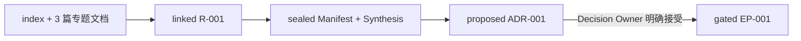
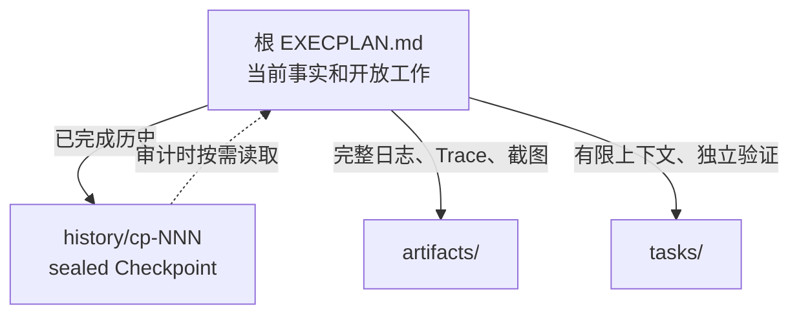

# ExecutionPlan

ExecutionPlan 现在由两个可独立安装、独立触发的 Skill 组成：

- **Engineering Research**：把大量源码、文档、实验和外部研究组织成可审计的
  多文档 corpus，并输出 sealed Synthesis。
- **Execution Plan**：消费已经完成的 Research，治理 ADR、ExecPlan、Task、
  Checkpoint、Bugfix 和技术债务。

它们共享版本化文件契约，不互相导入，也不依赖彼此的安装位置。


## 为什么拆成两个 Skill

Research 与实施治理的触发条件、工具和内容增长方式不同。

| Skill | 回答的问题 | 主要制品 | 不负责 |
|---|---|---|---|
| Engineering Research | 我们知道什么，证据可靠吗，哪些选项成立？ | Research、Corpus Manifest、Synthesis、Snapshot | 接受 ADR、创建实施计划 |
| Execution Plan | 已有证据支持什么决定，怎样实施并验收？ | ADR、ExecPlan、Task、Checkpoint、Bugfix | 搜集新证据、维护研究 corpus |

一项 Research 可以包含多篇文档。只要它们服务同一决策目的、共享 Research
Questions、结论时间和下游 Synthesis，就使用同一个 `R-NNN`；当目的、Owner、
结束时间或下游消费者可以独立变化时，再拆成多个 Research。

这种边界也控制文档膨胀：

- `RESEARCH.md` 只保留目的、问题、当前路线和发现索引；
- 主题分析进入 managed `notes/`，已有文档目录以 linked corpus 注册；
- `RESEARCH_MANIFEST.json` 明确成员、入口、大小和 SHA-256；
- `SYNTHESIS.md` 只保留下游决策所需结论；
- `EXECPLAN.md` 只保留当前事实与开放工作，已完成历史进入 sealed Checkpoint。

## 仓库布局与安装

这个 Git 仓库同时是发行仓库和兼容入口：

```text
ExecutionPlan/
├── SKILL.md                         # execution-plan Skill 根
├── scripts/epctl.py
└── engineering-research/
    ├── SKILL.md                     # engineering-research Skill 根
    └── scripts/researchctl.py
```

要求 Python 3.10+，两个 CLI 都只使用标准库。仓库可以检出到任意稳定目录：

```bash
git clone https://github.com/XiaoWeiKIN/ExecutionPlan.git \
  /absolute/path/to/ExecutionPlan
export EXECUTION_PLAN_HOME=/absolute/path/to/ExecutionPlan
```

按所用 Agent 或 Harness 的 Skill 发现机制，分别注册两个目录：

```text
/absolute/path/to/ExecutionPlan/engineering-research
/absolute/path/to/ExecutionPlan
```

第一个是 Research Skill，第二个是 Execution Plan Skill。目录扫描、符号链接、
配置文件或其他注册方式均可；本项目不要求安装到任何特定 Agent 的私有目录。
根目录保留 `execution-plan` 是为了兼容已有安装，两个注册目标本身没有运行时
依赖。

更新发行包：

```bash
git -C "$EXECUTION_PLAN_HOME" pull --ff-only
```

如果宿主支持 `$<skill-name>` 调用语法，可以分别调用：

```text
使用 $engineering-research 调研 spans 聚合方案并整理现有多文档 corpus。
使用 $execution-plan 基于已完成的 Research 形成 ADR 和可恢复的开发计划。
```

其他宿主使用自己的 Skill 调用约定即可。

## 快速开始

以下命令都在目标代码仓库根目录运行：

```bash
EXECUTION_PLAN_HOME=/absolute/path/to/ExecutionPlan
RESEARCHCTL="$EXECUTION_PLAN_HOME/engineering-research/scripts/researchctl.py"
EPCTL="$EXECUTION_PLAN_HOME/scripts/epctl.py"

python3 "$RESEARCHCTL" --repo . init
python3 "$EPCTL" --repo . init
```

两个 `init` 都是幂等的，并共享 `docs/.epctl/state.json` 中的 Research ID
高水位。

### 完整示例：从四篇文档到可执行 EP

[cache-topology 端到端示例](./examples/cache-topology/README.md) 提供四篇可复制
的 corpus 文档，并展示：



示例给出具体 Research Questions、benchmark 数字、Synthesis 结论、ADR
授权语句、Gate 字段和实施里程碑。注册 corpus 的命令可以直接运行；ADR
仍会停在 `proposed`，不会用演示脚本伪造人的决定。

### 1. 创建 managed Research

适合从零开始的调研：

```bash
python3 "$RESEARCHCTL" --repo . new-research \
  --slug token-refresh-contract \
  --title "Research token refresh contract"
```

生成：

```text
docs/research/active/r-001_token-refresh-contract/
├── RESEARCH.md
├── RESEARCH_MANIFEST.json
├── SYNTHESIS.md
├── notes/
└── artifacts/
```

专题文档放入 `notes/`。新增、移动或删除文档后刷新 manifest：

```bash
python3 "$RESEARCHCTL" --repo . sync-research R-001
```

### 2. 接管已有多文档 Research

已有 `index.md + 多篇专题文档` 时，不需要合并成一个大文件，也不需要移动原目录：

```bash
python3 "$RESEARCHCTL" --repo . new-research \
  --slug spans-aggregate \
  --title "Research spans aggregate" \
  --corpus-root _bmad-output/planning-artifacts/research/spans-aggregate \
  --entrypoint _bmad-output/planning-artifacts/research/spans-aggregate/index.md
```

`--corpus-root`、`--entrypoint` 和 `--include` 都可以重复。CLI 可以接收仓库内
的绝对路径，但 manifest 始终保存规范化的仓库相对路径。仓库外路径、路径穿越
和 symlink escape 会被拒绝。

验证会检查：

- corpus membership 与文档 SHA-256 drift；
- 本地 Markdown 链接和 `inputDocuments`；
- entrypoint 是否属于 manifest；
- 绝对工作站路径等不可移植引用。

```bash
python3 "$RESEARCHCTL" --repo . validate
python3 "$RESEARCHCTL" --repo . status
```

完成 Research Questions 和 Synthesis 后封存：

```bash
python3 "$RESEARCHCTL" --repo . archive-research R-001 \
  --outcome concluded
```

managed 文档原地封存；linked 文档会复制到 completed Research 的
`artifacts/research-snapshot/`，源文档不变。Manifest 和 Synthesis 都会写入
可验证摘要。取消 Research 必须给出原因，且不能满足下游 Research Gate。

### 3. 形成 ADR

`execution-plan` 只接受 valid、concluded 的 Research。若 Research 带 manifest，
还必须是 sealed 且未被篡改：

```bash
python3 "$EPCTL" --repo . new-adr \
  --slug token-refresh-contract \
  --title "Choose token refresh contract" \
  --research R-001
```

Agent 可以起草 proposed ADR；接受或拒绝必须来自用户或明确的 Decision Owner：

```bash
python3 "$EPCTL" --repo . decide-adr ADR-001 \
  --outcome accepted \
  --decision-maker "API Architecture Council"
```

方向改变时建立替代链：

```bash
python3 "$EPCTL" --repo . supersede-adr ADR-001 --by ADR-002
```

### 4. 创建 gated ExecPlan

```bash
python3 "$EPCTL" --repo . new-ep \
  --slug implement-token-refresh \
  --title "Implement token refresh contract" \
  --research R-001 \
  --adr ADR-001
```

在 `Research and Architecture Inputs` 中复述关键证据、架构约束、负面后果和
剩余未知，再填写里程碑、Concrete Steps、验收和恢复方法。

只有在输入已经充分且没有会改变路线的未知时才能 fast track，并要记录可核查
理由：

```bash
python3 "$EPCTL" --repo . new-ep \
  --slug clean-local-adapter \
  --title "Clean local adapter" \
  --research-not-required-reason \
  "Current contract tests fully define the behavior." \
  --architecture-not-required-reason \
  "No public boundary or durable technical choice changes."
```

## 控制长期迭代中的 EP 膨胀



根计划始终保留当前目的、系统事实、Gate 输入、当前里程碑、准确下一动作、
未完成 Progress/Validation 和 open blocker。以下时机建立 Checkpoint：

- 一个独立可验证里程碑完成；
- 准备跨会话交接或暂停；
- 根计划超过约 800 行、64 KiB 或 50 条活跃历史事件；
- 已完成历史开始遮蔽当前下一步。

先把仍有效的结论吸收到当前事实，把完整输出移入 `artifacts/`，再预览：

```bash
python3 "$EPCTL" --repo . checkpoint EP-001 \
  --slug milestone-one \
  --title "Milestone 1 complete" \
  --current-milestone "Milestone 2: adapter integration" \
  --summary "契约层已完成；适配层尚未实现。" \
  --next-action "编辑 src/adapter.ts 并运行 npm test。" \
  --dry-run
```

确认后去掉 `--dry-run`。

## 状态、验证与归档

```bash
python3 "$RESEARCHCTL" --repo . validate
python3 "$EPCTL" --repo . validate
python3 "$EPCTL" --repo . validate --fix-index
python3 "$EPCTL" --repo . status
```

ExecPlan 只有在验收完成、Task 终态、无 open blocker、复盘完整且验证通过时
才能完成：

```bash
python3 "$EPCTL" --repo . archive-ep EP-001 --outcome completed
```

根索引是可重建投影；目录中的事实制品才决定真实状态。

## 兼容性

- 旧 Research 包没有 `RESEARCH_MANIFEST.json` 时仍可被两个验证器读取。
- `epctl new-research`、`archive-research` 等旧命令暂时保留，但新工作应使用
  `engineering-research`；这是迁移兼容面，不是新的职责边界。
- 两个 Skill 不通过相对 import、安装目录或运行时调用耦合。
- Manifest 是可选的向后兼容字段；一旦出现，就必须满足版本化契约。

## 开发与验证

```bash
PYTHONDONTWRITEBYTECODE=1 python3 -B -m unittest discover \
  -s engineering-research/tests -p 'test_*.py' -v
PYTHONDONTWRITEBYTECODE=1 python3 -B -m unittest discover \
  -s tests -p 'test_*.py' -v

python3 -B /path/to/skill-creator/scripts/quick_validate.py \
  "$EXECUTION_PLAN_HOME/engineering-research"
python3 -B /path/to/skill-creator/scripts/quick_validate.py \
  "$EXECUTION_PLAN_HOME"
```

## 项目文档

端到端：

- [可运行的 cache-topology 端到端示例](./examples/cache-topology/README.md)

Engineering Research：

- [Skill 入口](./engineering-research/SKILL.md)
- [Research 方法](./engineering-research/references/research.md)
- [Manifest 契约](./engineering-research/references/manifest.md)
- [典型场景](./engineering-research/references/examples.md)

Execution Plan：

- [Skill 入口](./SKILL.md)
- [Research 消费契约](./references/research.md)
- [ADR 与 Architecture Gate](./references/adr.md)
- [ExecPlan 规范](./references/template.md)
- [制品路由与状态机](./references/templates.md)
- [Checkpoint 与有界工作集](./references/checkpoints.md)
- [Bugfix 规则](./references/bugfix.md)
- [完整示例](./references/examples.md)

## 设计来源

- [OpenAI Harness engineering](https://openai.com/index/harness-engineering/)
- [OpenAI Codex Exec Plans](https://developers.openai.com/cookbook/articles/codex_exec_plans)
- [MADR](https://adr.github.io/madr/)

仓库内事实源、短入口与渐进披露、确定性工具、first-class plans 和持续熵管理
来自 Harness Engineering。自包含 Living Document 来自 Codex Exec Plans。
ADR 字段与状态参考 MADR，并增加显式决策权和 payload 封存。
