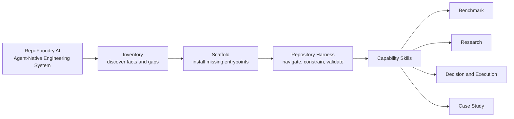
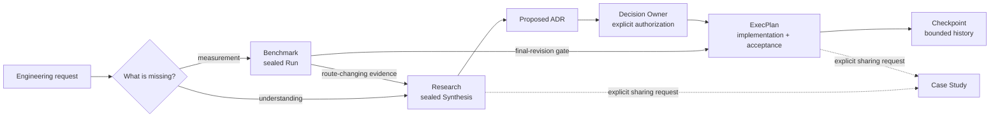

# RepoFoundry AI

[简体中文](README.zh-CN.md) | English

<p align="center">
  
</p>

<p align="center"><strong>The Agent-Native Engineering System</strong></p>

<p align="center">Turn any repository into an AI-ready engineering system.</p>

**RepoFoundry AI** turns an ordinary software repository into an environment
that humans and coding agents can navigate, govern, and verify together. It
installs durable engineering context close to the code: short agent
entrypoints, architecture maps, composable specifications, evidence contracts,
decisions, execution plans, and one deterministic validation path.

The repository remains the source of truth. RepoFoundry does not depend on one
model, agent, editor, or Git hosting provider.

## One system, four layers



- **Inventory** inspects the repository before proposing change.
- **Scaffold** performs guarded, preview-first Bootstrap.
- **Repository Harness** is the persistent environment left in the target
  repository.
- **Capability Skills** create specialized evidence and governance artifacts.

`Workflow` describes how an individual capability runs. RepoFoundry is the
system that makes those workflows composable and verifiable.

## Five Skills share file contracts

| Skill | Responsibility | Durable output |
|---|---|---|
| [`repo-foundry`](./SKILL.md) | Inspect, Bootstrap, synchronize Specs, validate the Harness, and route work | `AGENTS.md`, architecture and docs maps, Harness and Spec manifests |
| [`engineering-benchmark`](./engineering-benchmark/SKILL.md) | Predeclare and execute reproducible measurement | Suite, Scenario, Run, Result, sealed Evidence Manifest |
| [`engineering-research`](./engineering-research/SKILL.md) | Investigate unknowns and synthesize multi-document evidence | Research controller, corpus Manifest, Rounds, topics, sealed Synthesis |
| [`engineering-execution-plan`](./engineering-execution-plan/SKILL.md) | Govern decisions and implementation | ADR, ExecPlan, Task, Checkpoint, Bugfix, technical debt |
| [`engineering-case-study`](./engineering-case-study/SKILL.md) | Turn verified code and process evidence into a shareable narrative | Chinese, English, or bilingual engineering case study |

The four professional Skills remain independently installable. They communicate
through versioned repository files rather than private runtime imports.

## Evidence moves forward without losing authority



Agents may collect evidence and draft decisions. Research conclusion and ADR
acceptance remain explicit human authority boundaries.

## What appears in a target repository

RepoFoundry creates only the paths owned by a selected capability. A fully used
target may contain:

```text
target-repository/
├── AGENTS.md
├── ARCHITECTURE.md
├── scripts/
│   └── bench/                         # project-owned benchmark executables
├── benchmarks/
│   ├── BENCHMARKS.md
│   └── suites/b-NNN_slug/
│       ├── BENCHMARK.md
│       ├── scenarios/bs-NNN_slug.md
│       └── runs/br-NNN_slug/
│           ├── SCENARIO.md
│           ├── RESULT.md
│           ├── EVIDENCE_MANIFEST.json
│           └── artifacts/
└── docs/
    ├── .engineering/
    │   ├── harness.json
    │   ├── specs.json
    │   └── specs.lock.json
    ├── agent-guides/managed/
    ├── design-docs/
    ├── research/{active,completed}/
    ├── adr/
    ├── exec-plans/{active,completed}/
    ├── bugfixes/{active,completed}/
    └── case-studies/
```

Benchmark Scenarios reference project-owned executables under
`scripts/bench/`; RepoFoundry AI records their evidence without owning the
project's measurement implementation.

Bootstrap never invents repository facts. Unknown commands, owners,
architecture, SLOs, and security controls remain explicit `BOOTSTRAP_TODO`
markers for maintainers to resolve.

## Install the distribution

RepoFoundry AI requires Python 3.10+ and Git. Its governance CLIs use only the
Python standard library.

The external repository rename is a separate hosting operation. Until the
canonical hosting URL is confirmed, clone from the repository URL supplied by
its owner:

```bash
git clone <repo-url> /absolute/path/to/RepoFoundry
export REPO_FOUNDRY_HOME=/absolute/path/to/RepoFoundry
```

Register the root and any professional Skills your agent host should discover:

```text
/absolute/path/to/RepoFoundry
/absolute/path/to/RepoFoundry/engineering-benchmark
/absolute/path/to/RepoFoundry/engineering-research
/absolute/path/to/RepoFoundry/engineering-execution-plan
/absolute/path/to/RepoFoundry/engineering-case-study
```

RepoFoundry does not require installation inside an agent-specific private
directory. Directory scanning, symbolic links, or host configuration all work
when they preserve these package roots.

## Start with a Prompt

Bootstrap a repository:

```text
Use $repo-foundry to inspect this repository, preview the Codex Harness
Bootstrap, and report create, preserve, and conflict actions. Apply only after
the preview is conflict-free, then validate the Harness and local Specs.
```

Route specialized work:

```text
Use $engineering-benchmark to define a reproducible capacity Scenario before
running the measurement.

Use $engineering-research to investigate the cache topology, preserve
counterevidence, and stop at review-ready Synthesis.

Use $engineering-execution-plan to consume the concluded Research, draft the
ADR, and wait for Decision Owner authorization before accepting it.

Use $engineering-case-study with the verified code, Research, ADR, and ExecPlan
to write a bilingual module-design article.
```

The [cache-topology example](./examples/cache-topology/README.md) shows the full
Prompt-driven handoff from an existing corpus to Research, an authorized ADR,
and a gated ExecPlan.

## Deterministic CLI surfaces

Skills invoke these CLIs for state changes and validation. Humans can use them
directly for automation or diagnosis:

```bash
FOUNDRYCTL="$REPO_FOUNDRY_HOME/scripts/foundryctl.py"
BENCHCTL="$REPO_FOUNDRY_HOME/engineering-benchmark/scripts/benchctl.py"
RESEARCHCTL="$REPO_FOUNDRY_HOME/engineering-research/scripts/researchctl.py"
EPCTL="$REPO_FOUNDRY_HOME/engineering-execution-plan/scripts/epctl.py"

python3 "$FOUNDRYCTL" --repo . bootstrap --profile codex
python3 "$FOUNDRYCTL" --repo . bootstrap --profile codex --apply
python3 "$FOUNDRYCTL" --repo . validate --harness

python3 "$FOUNDRYCTL" --repo . spec plan
python3 "$FOUNDRYCTL" --repo . spec sync --apply
python3 "$FOUNDRYCTL" --repo . spec update --apply
python3 "$FOUNDRYCTL" --repo . spec validate

python3 "$BENCHCTL" --repo . validate
python3 "$RESEARCHCTL" --repo . validate
python3 "$EPCTL" --repo . validate
python3 "$EPCTL" --repo . status
```

Bootstrap and Spec writes are preview-first. Bootstrap creates missing paths and
preserves repository-owned files. An agent instruction file registered by the
Codex profile must stay at or below 100 physical lines.

Engineering Specs come from the independent
[EngineeringSpecifications](https://github.com/XiaoWeiKIN/EngineeringSpecifications)
Git catalog. `sync` follows the locked commit; `update` explicitly resolves the
configured ref again. `spec validate` is offline.

## Boundaries keep the system trustworthy

- RepoFoundry AI does not run a general agent runtime or hide orchestration state
  outside the repository.
- The root Skill does not create Benchmark Runs, Research packages, ADRs,
  ExecPlans, or Case Studies.
- Professional Skills do not infer Research Owner or Decision Owner authority.
- Bootstrap does not overwrite repository-owned documentation.
- Normative Engineering Specs stay in their independent repository.
- Case Studies are created only after an explicit sharing request.
- GitHub Actions, GitLab CI, Jenkins, and other providers call the same
  repository check instead of duplicating policy.

## Migration from EngineeringWorkflow

RepoFoundry AI replaces the former product identity with one current
entrypoint:

| Former surface | Current surface |
|---|---|
| `$engineering-workflow` | `$repo-foundry` |
| `scripts/engineeringctl.py` | `scripts/foundryctl.py` |
| `ENGINEERING_WORKFLOW_HOME` | `REPO_FOUNDRY_HOME` |
| new manifest owner `engineering-workflow` | new manifest owner `repo-foundry` |

Existing target manifests owned by `engineering-workflow` remain readable and
produce a migration warning. New manifests use `repo-foundry`. Accepted ADRs,
completed ExecPlans, and sealed validation artifacts preserve the historical
names that were true when they were recorded.

The local distribution does not claim that its Git hosting repository has
already been renamed. Perform that external operation separately and then
update existing clones with the confirmed remote URL. See
[GitHub repository rename guidance](https://docs.github.com/en/repositories/creating-and-managing-repositories/renaming-a-repository).

## Development and validation

Run the only canonical repository check:

```bash
python3 -B scripts/check.py
```

The command validates all five Skill packages and eval catalogs, runs every
governance test suite, checks local Markdown links and independent installation,
and validates repository Research and ExecPlan state. CI adapters only invoke
this command.

## Reference map

RepoFoundry AI:

- [Root Skill](./SKILL.md)
- [Bootstrap contract](./references/bootstrap.md)
- [System identity and packaging](./docs/design-docs/repo-foundry-system.md)
- [Engineering Spec resolution](./docs/design-docs/engineering-spec-management.md)

Professional capabilities:

- [Benchmark contract](./engineering-benchmark/references/contract.md)
- [Research method](./engineering-research/references/research.md)
- [Research manifest](./engineering-research/references/manifest.md)
- [Execution artifact routing](./engineering-execution-plan/references/templates.md)
- [Architecture Decision Records](./engineering-execution-plan/references/adr.md)
- [ExecPlan specification](./engineering-execution-plan/references/template.md)
- [Benchmark gates for ExecPlans](./engineering-execution-plan/references/benchmark.md)
- [Documentation and code integrity](./engineering-execution-plan/references/integrity.md)
- [Case Study source evidence](./engineering-case-study/references/source-evidence.md)
- [Case Study review](./engineering-case-study/references/review.md)

Decision and implementation:

- [ADR-007 — Adopt RepoFoundry](./docs/adr/adr-007_repo-foundry-identity.md)
- [ADR-008 — Use RepoFoundry AI externally](./docs/adr/adr-008_repofoundry-ai-brand.md)
- [EP-006 — Migrate to RepoFoundry AI](./docs/exec-plans/active/ep-006_migrate-to-repo-foundry/EXECPLAN.md)
