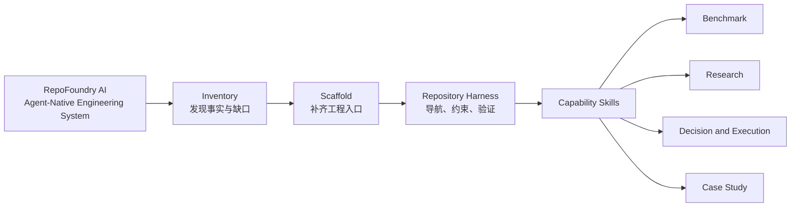
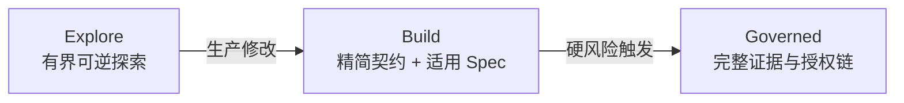
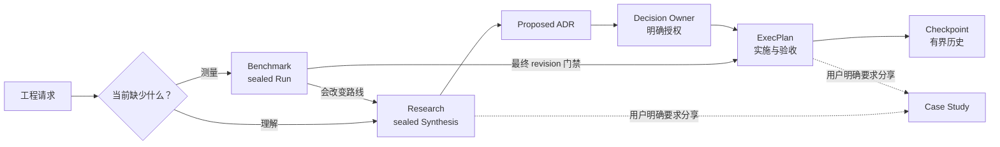
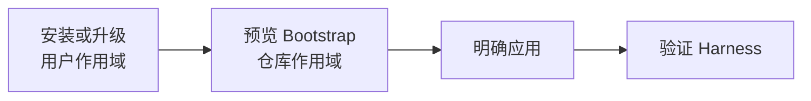
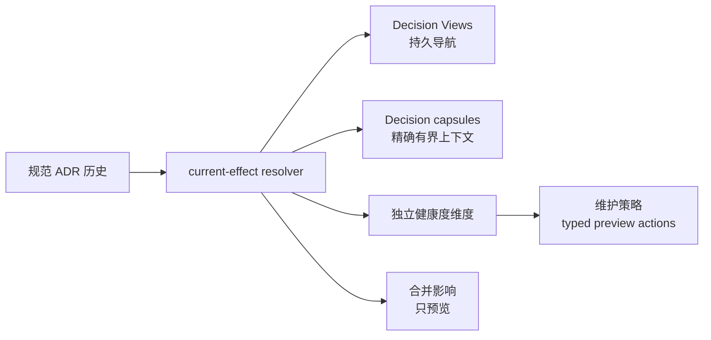
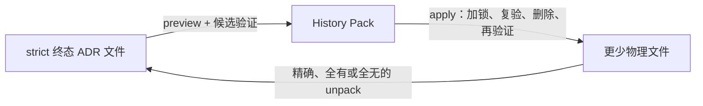
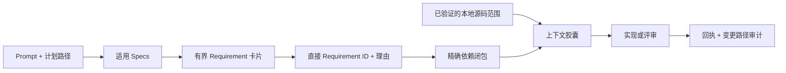

# RepoFoundry AI

简体中文 | [English](README.md)

<p align="center">
  
</p>

<p align="center"><strong>The Agent-Native Engineering System</strong></p>

<p align="center">把任何代码仓库锻造成 AI Agent 可以可靠工作的工程系统。</p>

**RepoFoundry AI** 把普通代码仓库转化为人和 Coding Agent 可以共同导航、治理
和验证的工程环境。它把短 Agent 入口、架构地图、可组合规范、证据契约、
架构决定、执行计划和确定性校验留在代码旁边，让仓库本身持续保存工程上下文。

系统不绑定某个模型、Agent、编辑器或代码托管平台。仓库始终是事实源。

## 一个系统包含四层能力



- **Inventory** 先盘点仓库事实和工程缺口。
- **Scaffold** 通过 preview-first Bootstrap 安全补齐入口。
- **Repository Harness** 是持久留在目标仓库里的工程环境。
- **Capability Skills** 负责专业证据与治理制品。

`Workflow` 描述某一项能力如何运行；RepoFoundry 提供承载、组合和验证这些流程的
系统。

## 六个 Skill 通过文件契约协作

| Skill | 职责 | 持久制品 |
|---|---|---|
| [`repo-foundry-ai`](./SKILL.md) | 盘点、Bootstrap、同步 Specs、验证 Harness、路由工作 | `AGENTS.md`、架构与文档地图、Harness 与 Spec manifests |
| [`engineering-benchmark`](./engineering-benchmark/SKILL.md) | 共同校准并执行可复现测量 | Suite、Scenario、Run、Result、sealed Evidence Manifest |
| [`engineering-research`](./engineering-research/SKILL.md) | 共同引导未知并综合多文档证据 | Research controller、corpus Manifest、Rounds、topics、sealed Synthesis |
| [`engineering-design`](./engineering-design/SKILL.md) | 探索取舍并把已建立的证据翻译成可评审设计 | 单文件或多文档 Design Package、阅读地图、manifest、已批准 revision 快照 |
| [`engineering-execution-plan`](./engineering-execution-plan/SKILL.md) | 共同权衡 ADR 并校准受治理实施 | ADR、ExecPlan、Task、Checkpoint、Bugfix、技术债务 |
| [`engineering-case-study`](./engineering-case-study/SKILL.md) | 把已验证代码和过程证据写成可分享内容 | 中文、英文或中英双语工程案例 |

五个专业 Skill 可以独立安装。它们通过版本化仓库文件交接，不依赖私有运行时
导入。

这些治理制品还共享一层语义元数据：稳定 type/ID、title/status、author/owner 与
created/updated。作者身份不等于 Research approval、ADR 决策权或 Benchmark
执行身份。原始证据由 content-addressed Manifest 携带等价 provenance；源码和
生成索引继续使用 Git、CODEOWNERS 与 generator provenance。详见
[Artifact Metadata Contract](./docs/design-docs/artifact-metadata-contract.md)。

## 治理随风险升级，而不是预先限制每一步

新 Harness 默认使用 `adaptive` profile；旧 Harness 未声明 profile 时继续按
`strict` 运行，只有显式 preview/apply 才迁移。adaptive 使用三个单调升级的模式：



Explore 不要求持久制品或 Spec receipt；Build 只维护 intent、paths、acceptance 和
compatibility；公共契约、安全、数据、不可逆操作、可靠性声明、发布或长期决定才进入
Governed。人类授权、破坏性/外部写入、安全、数据与证据完整性在所有模式中始终是硬边界。

## 证据向前流动，授权边界保持清晰



Agent 可以搜集证据并起草决定。Research 结束和 ADR 接受仍由人类明确授权。

## 目标仓库会出现什么

RepoFoundry 只创建已选择能力拥有的路径。完整使用后，目标仓库可能包含：

```text
target-repository/
├── AGENTS.md                         # 仅 Codex adapter
├── ARCHITECTURE.md
├── .repo-foundry/
│   ├── engineering-specs/spec_router.py # 共享激活引擎
│   └── skills/repo-foundry-ai/SKILL.md  # 项目规范工作流
├── .agents/skills/                   # Codex adapter 入口
│   ├── repo-foundry-ai/SKILL.md
│   └── engineering-specs/
│       ├── SKILL.md
│       ├── agents/openai.yaml
│       └── scripts/spec_router.py
├── .claude/skills/                   # Claude 项目 Skills
│   ├── repo-foundry-ai/SKILL.md
│   └── engineering-specs/SKILL.md
├── .codex/
│   └── hooks.json                     # 经审查的项目激活门禁
├── scripts/
│   └── bench/                         # 项目自己的压测实现
├── benchmarks/
│   ├── BENCHMARKS.md
│   └── suites/b-NNN_slug/
│       ├── BENCHMARK.md
│       ├── scenarios/bs-NNN_slug.md
│       └── runs/br-NNN_slug/
│           ├── SCENARIO.md
│           ├── RESULT.md
│           ├── EVIDENCE_MANIFEST.json
│           └── artifacts/
└── docs/
    ├── .engineering/
    │   ├── harness.json
    │   ├── specs.json
    │   └── specs.lock.json
    ├── agent-guides/
    │   ├── README.md                  # Portable adapter 入口
    │   └── managed/
    │       ├── index.md               # Spec 路由索引
    │       └── requirements.json      # Requirement 精确源码索引
    ├── design-docs/
    ├── research/{active,completed}/
    ├── adr/
    ├── exec-plans/{active,completed}/
    ├── bugfixes/{active,completed}/
    └── case-studies/
```

Benchmark Scenario 引用项目在 `scripts/bench/` 下维护的可执行测量代码；
RepoFoundry AI 记录证据，但不接管项目自己的测量实现。

Bootstrap 不会编造仓库事实。未知命令、Owner、架构、SLO 和安全控制会保留为
`BOOTSTRAP_TODO`，等待维护者确认。

## 一次安装，逐仓库启用

RepoFoundry 包含两个相互独立的作用域。**发行包安装**把 CLI 和可选的个人 Skill
入口放进用户环境；**仓库 Bootstrap**只向明确指定的仓库写入版本化 Harness 与
项目 Skills。安装或升级发行包不会扫描、修改任何项目仓库。



### 快速开始：安装并启用全部 adapter

安装器支持 macOS 和 Linux，需要 Python 3.10+ 与 `curl`。

1. 安装最新稳定版。以后升级仍运行同一条命令：

   ```bash
   curl -fsSL https://raw.githubusercontent.com/XiaoWeiKIN/RepoFoundryAI/main/install.py | python3 -
   ```

2. 进入目标仓库，预览 Agent-neutral Core 与全部项目 adapter：

   ```bash
   repofoundry --repo . bootstrap --all-adapters
   ```

3. 检查输出中的 `create`、`preserve` 和 `conflict`。确认计划无冲突后再应用，
   随后验证 Harness：

   ```bash
   repofoundry --repo . bootstrap --all-adapters --apply
   repofoundry --repo . validate
   ```

`--all-adapters` 始终按确定顺序展开为 `codex`、`claude` 和 `portable`。结果不受
当前机器安装了哪些 Agent 产品影响。

### 只启用需要的 adapter

指定一个或多个 adapter 时，仍然先预览，再加 `--apply` 应用：

```bash
# 只启用 Claude Code：先预览，再应用
repofoundry --repo . bootstrap --adapter claude
repofoundry --repo . bootstrap --adapter claude --apply

# 同时启用 Codex 与产品无关的 portable 指南
repofoundry --repo . bootstrap --adapter codex --adapter portable
repofoundry --repo . bootstrap --adapter codex --adapter portable --apply
```

| Adapter | 仓库持有的入口 |
|---|---|
| `codex` | `AGENTS.md`、`.agents/skills/` 与经过评审的 `.codex/` guards |
| `claude` | `.claude/skills/` 下的原生项目 Skills |
| `portable` | `docs/agent-guides/` 下的产品无关指南 |

所有 adapter 共享 `.repo-foundry/skills/repo-foundry-ai/SKILL.md` 中的 canonical
workflow 和 Core Spec Router。Claude adapter 创建普通项目文件，不会把仓库链接到
用户 home。Claude Code 对同名 Skill 采用个人级优先规则；项目 canonical workflow
存在时，个人入口会转交给该项目文件。

### `--host` 只控制个人入口

常规安装无需传入 `--host`。默认值 `auto` 会为检测到的 Codex 和 Claude Code
注册个人 RepoFoundry Skill。其他 Agent 仍可直接使用 CLI 与 portable 项目
adapter，不依赖这两个宿主目录。

| 安装参数 | 个人 Skill 行为 |
|---|---|
| `--host auto` | 注册检测到的全部受支持宿主；这是默认值 |
| `--host codex` | 确保 Codex 个人 Skill 链接存在 |
| `--host claude` | 确保 Claude Code 个人 Skill 链接存在 |
| `--host none` | 保留已有注册，不创建新注册 |

示例：

```bash
curl -fsSL https://raw.githubusercontent.com/XiaoWeiKIN/RepoFoundryAI/main/install.py | python3 - --version 0.4.1 --host codex
curl -fsSL https://raw.githubusercontent.com/XiaoWeiKIN/RepoFoundryAI/main/install.py | python3 - --host claude
curl -fsSL https://raw.githubusercontent.com/XiaoWeiKIN/RepoFoundryAI/main/install.py | python3 - --host none
```

目标位置存在非托管内容时，安装器会先备份再替换。Claude Code 在设置
`CLAUDE_CONFIG_DIR` 时使用
`$CLAUDE_CONFIG_DIR/skills/repo-foundry-ai`，否则使用
`~/.claude/skills/repo-foundry-ai`；`--claude-home` 可以覆盖这两个位置。
目录软链接发现要求 Claude Code 2.1.203 或更高版本。

### 先升级发行包，再逐仓库迁移

重新运行一键安装命令会原子切换到最新稳定版；当前稳定版已经激活时返回 no-op。
安装器把 Release tag 解析为不可变 commit，记录归档 SHA-256，并在激活前验证
暂存包。

项目迁移保持独立，并且默认只预览。发行包升级后，在每个既有项目中执行以下命令；
需要迁移到其他版本时，把 `0.9.0` 替换为已安装的目标版本：

```bash
repofoundry --repo . upgrade --to 0.9.0
repofoundry --repo . upgrade --to 0.9.0 --apply
repofoundry --repo . validate
```

### 保留 ADR 历史，只压缩工作上下文

RepoFoundry 0.8.4 继续把 ADR 生命周期授权和逻辑源字节作为规范历史，并在其上
生成更小的非规范检索面。升级只会创建 additive 空基础设施；不会自动退役或打包
ADR，也不会猜测领域分类。

replacement ADR 后续仍可被新的 accepted/current ADR supersede。RepoFoundry 会把
每一跳 `superseded_by` / `supersedes` 双向证据保留为无环历史链；当前 Decision
context 只锚定链尾的 accepted/current ADR。



用显式 current ADR 种子定义 View，再按任务提取必要的精确上下文。持久修改默认
只预览：

```bash
python3 <engineering-execution-plan-dir>/scripts/epctl.py --repo . adr-health --json
python3 <engineering-execution-plan-dir>/scripts/epctl.py --repo . adr-maintenance --json
python3 <engineering-execution-plan-dir>/scripts/epctl.py --repo . adr-maintenance --check
python3 <engineering-execution-plan-dir>/scripts/epctl.py --repo . set-decision-view runtime \
  --title "Runtime decisions" --adr ADR-012 --adr ADR-019
python3 <engineering-execution-plan-dir>/scripts/epctl.py --repo . set-decision-view runtime \
  --title "Runtime decisions" --adr ADR-012 --adr ADR-019 --apply
python3 <engineering-execution-plan-dir>/scripts/epctl.py --repo . decision-capsule \
  --view runtime --constraint ADR-019#C-002 --json
python3 <engineering-execution-plan-dir>/scripts/epctl.py --repo . decision-capsule \
  --view runtime --constraint ADR-019#C-002 --materialization focused \
  --focus-reason "实现选中的 runtime 边界" --json
python3 <engineering-execution-plan-dir>/scripts/epctl.py --repo . \
  adr-consolidation-plan --view runtime --json
```

RepoFoundry 0.9.0 会在 `validate` 中执行版本化 `default-v1` 维护策略，在 `status`
中给出摘要，并由 `adr-maintenance` 输出完整结果。数值只有大于 review/action 边界才会
升级状态；三个及以上可机械验证的 strict 终态 live ADR 会独立产生
`pack_history`。当前决策、图耦合、amendment、View 与 active plan 压力分别路由到
不同 action。所有 action 都是非规范、只预览的建议：检测不会自动 retire、
supersede、rewrite、consolidate、pack、unpack 或 apply。外部定时任务调用
`adr-maintenance --check`，不复制策略。

语义生命周期处理完成后，可以把显式选择的 strict 终态 ADR（`rejected`、`retired`
或 `superseded`）从多个 Markdown 文件物理替换为一个无损、content-addressed History
Pack。它只改变存储：逻辑 ADR 数量、精确字节、seal、关系、历史 evidence、索引和
current effect 都继续由离线 resolver 解析。



```bash
# preview 不创建文件或 lock
python3 <engineering-execution-plan-dir>/scripts/epctl.py --repo . \
  pack-historical-adrs ADR-051 ADR-052 \
  --packed-by Wangxiaowei1 --reason "Superseded by ADR-055" --json

# 审查 pack digest 与删除集合后再 apply
python3 <engineering-execution-plan-dir>/scripts/epctl.py --repo . \
  pack-historical-adrs ADR-051 ADR-052 \
  --packed-by Wangxiaowei1 --reason "Superseded by ADR-055" --apply --json

# 恢复或降级前先 preview 精确还原
python3 <engineering-execution-plan-dir>/scripts/epctl.py --repo . \
  unpack-adr-history-pack sha256-<pack>.json \
  --unpacked-by Wangxiaowei1 --reason "Prepare downgrade" --json
```

打包会整批拒绝 current、proposed、under-review、legacy、malformed、symlink、duplicate
或已打包输入。apply 在删源前验证完整候选，物化后再次验证仓库；任一失败都会按字节
恢复 pack、源文件和生成索引。packed ADR 必须先 unpack 才能做 lifecycle mutation。
降级到不理解 History Pack 的版本前，必须 unpack 所有 pack，并确认 `adr-health` 的
`history_packs` 与 `packed_entries` 都为 0。

Capsule 复制经过验证的 Decision Statement 与选中 constraint 原文；linked legacy
ADR 必须整篇进入 complete 上下文。complete 仍是默认模式，并保持 0.8.0 输出契约。
显式 focused 模式仍先验证完整 current-effect closure，再只物化请求行及递归向下的
scoped amendments；它会声明 `focused_partial`、记录 closure digest 与省略边界，并对
legacy 或 broad unscoped amendment 失败关闭。默认预算为 32 KiB，超限会报告各来源
成本并失败，不会摘要、截断或切换模式；提高预算必须提供 `--budget-reason`。合并预览
无权 merge、accept、retire、supersede、rewrite 或 delete ADR。

### 恢复出生即错误的 Checkpoint seal

RepoFoundry 0.8.2 可以保留 schema 1.2 Checkpoint 的原始历史，同时恢复一个在首次
引入其精确路径的 Git commit 中就已错误的 digest。工具不会修改 Checkpoint；登记时
证明 commit 是祖先、所有 parent 都不含该路径、commit blob 与当前原始 bytes 完全
一致，apply 再写入可离线验证的 content-addressed receipt。


```bash
python3 <engineering-execution-plan-dir>/scripts/epctl.py --repo . \
  register-checkpoint-recovery EP-091 CP-001 \
  --from-git-commit <完整祖先 commit> \
  --attested-by "Repository Owner" \
  --reason "该 Checkpoint 在引入时就带有错误 seal"
# 审查后重复命令并增加 --apply。
```

payload mismatch 必须是唯一验证错误。receipt 篡改、Checkpoint bytes 变化、后续才
改坏、非祖先 commit 或 parent 已存在该路径时仍然 hard fail。

随时可以检查当前安装和可用 adapter：

```bash
repofoundry --version
repofoundry --repo . adapter list
```

### 先审查安装器，或从 checkout 安装

如果环境禁止把下载内容直接交给解释器，可以先下载并审查：

```bash
curl -fsSLo /tmp/repofoundry-install.py https://raw.githubusercontent.com/XiaoWeiKIN/RepoFoundryAI/main/install.py
less /tmp/repofoundry-install.py
python3 /tmp/repofoundry-install.py
```

维护者也可以从显式 checkout 安装，无需下载 Release：

```bash
git clone https://github.com/XiaoWeiKIN/RepoFoundryAI.git /absolute/path/to/RepoFoundryAI
python3 /absolute/path/to/RepoFoundryAI/install.py --source /absolute/path/to/RepoFoundryAI
export REPO_FOUNDRY_HOME="${XDG_DATA_HOME:-$HOME/.local/share}/repofoundry-ai/current"
```

## 从 Prompt 开始

初始化仓库：

```text
使用 $repo-foundry-ai 盘点当前仓库，预览 Agent-neutral Harness Core 与合适的
adapter，并报告 create、preserve 和 conflict。只有预览无冲突时才应用，随后
验证 Harness 和本地 Specs。
```

路由专业工作：

```text
使用 $engineering-benchmark，在执行容量测量前共同校准有代表性、可复现的 Scenario。

使用 $engineering-research 共同校准缓存拓扑的研究问题和证据方向，
保留反例和不确定性，停在 review-ready Synthesis。

使用 $engineering-design 共同探索实质取舍，再把已确认输入翻译成技术
Design Package，明确边界、契约、失败语义和可评审 revision。

使用 $engineering-execution-plan 共同权衡 ADR，等待 Decision Owner 明确授权，
再校准受治理的实施计划。

使用 $engineering-case-study，结合已验证代码、Research、ADR 和 ExecPlan，
撰写一篇中英双语模块设计文章。
```

[cache-topology 端到端示例](./examples/cache-topology/README.md)展示了既有 corpus
到 Research 与决策的 Prompt 交接；当实施架构需要被明确说明时，Design 契约在
证据与交付之间增加独立评审边界。

## Prompt 驱动的示例

双语 [Prompt 示例目录](./examples/README.zh-CN.md)与
[English catalog](./examples/README.md)覆盖六个 Skill 的独立入口和证据交接：

| 场景 | 首选 Skill |
|---|---|
| 初始化仓库或路由模糊请求 | `$repo-foundry-ai` |
| 产生可复现测量 | `$engineering-benchmark` |
| 调研未知或接管现有 corpus | `$engineering-research` |
| 创建或修订技术 Design Package | `$engineering-design` |
| 记录决定或推动交付 | `$engineering-execution-plan` |
| 编写可分享工程文章 | `$engineering-case-study` |

用户提供意图、上下文、停止边界和明确授权；Skill 在内部调用确定性控制脚本，
并报告生成的 ID、制品和验证结果。

## 确定性 CLI

Skill 通过这些 CLI 修改状态并验证制品。维护者也可以直接用它们编写自动化或
诊断问题：

```bash
REPO_FOUNDRY_HOME="${XDG_DATA_HOME:-$HOME/.local/share}/repofoundry-ai/current"
BENCHCTL="$REPO_FOUNDRY_HOME/engineering-benchmark/scripts/benchctl.py"
RESEARCHCTL="$REPO_FOUNDRY_HOME/engineering-research/scripts/researchctl.py"
DESIGNCTL="$REPO_FOUNDRY_HOME/engineering-design/scripts/designctl.py"
EPCTL="$REPO_FOUNDRY_HOME/engineering-execution-plan/scripts/epctl.py"

repofoundry --version
repofoundry --repo . adapter list
repofoundry --repo . bootstrap --adapter portable
repofoundry --repo . bootstrap --adapter claude --apply
repofoundry --repo . \
  bootstrap --all-adapters --governance-profile adaptive \
  --spec languages/go --apply
repofoundry --repo . validate --harness
repofoundry --repo . validate --adapter codex
repofoundry --repo . validate --adapter claude
repofoundry --repo . upgrade --to 0.9.0
repofoundry --repo . upgrade --to 0.9.0 --governance-profile adaptive
repofoundry --repo . upgrade --to 0.9.0 --apply

repofoundry --repo . spec plan
repofoundry --repo . spec sync --apply
repofoundry --repo . \
  spec update --spec-version 1.5.0 --spec languages/go --apply
repofoundry --repo . spec validate

python3 "$BENCHCTL" --repo . validate
python3 "$RESEARCHCTL" --repo . sync-research R-001
python3 "$RESEARCHCTL" --repo . validate
python3 "$EPCTL" --repo . validate
python3 "$EPCTL" --repo . status
python3 "$EPCTL" --repo . register-adr-revision ADR-018 \
  --from-file evidence/adr-018-historical.md
python3 "$EPCTL" --repo . register-adr-revision ADR-018 \
  --from-file evidence/adr-018-historical.md --apply
python3 "$EPCTL" --repo . register-checkpoint-recovery EP-091 CP-001 \
  --from-git-commit <完整祖先-commit> \
  --attested-by "Repository Owner" --reason "引入时 seal 已错误"
```

新建或同步后的当前 Research package 会把 `notes/README.md` 作为 manifest 阅读
入口，解决专题文档增多后的导航问题。工具确定性维护自动目录，同时保留人工编排的
阅读地图。

两条 `register-adr-revision` 命令用于恢复 sealed completed/cancelled ExecPlan 引用的历史 ADR payload。
默认只预览；`--apply` 把有效 strict ADR 文档写入
`docs/.epctl/adr-revisions/` 的 digest-addressed 路径，正常验证保持离线且不依赖
Git。如果旧字节只存在于本地 Git blob，把 `--from-file` 换成
`--from-git-blob <完整对象 ID>`。active ExecPlan 从不使用该回退，仍必须匹配当前
accepted ADR。

最后一条命令预览出生即错误的 Checkpoint seal 恢复；审查后重复命令并增加
`--apply`。receipt 写入 `docs/.epctl/checkpoint-recoveries/`，正常验证保持离线，
原 Checkpoint bytes 不变。

Bootstrap、Harness 升级与 Spec 写操作默认先预览。Bootstrap 只创建缺失路径，
保留仓库已有文件。adapter 注册的 instruction file 必须满足自身预算；Codex
`AGENTS.md` 仍不得超过 100 个物理行。

RepoFoundry `0.9.0` 使用 Harness schema `3`、Harness Core `1.5.2`、Codex
adapter `2.4.0`、Claude adapter `1.3.0`、Portable adapter `1.3.1` 与激活协议
`2`；它们与 Engineering Specs Catalog 各自独立演进。schema `1` 和 `2` 继续
可读，但只有显式执行 `upgrade --to 0.9.0 --apply` 才会迁移。较早的 schema `3`
Core 与 adapter 契约也继续可读；显式 upgrade 或一次预览过的
adapter 追加 bootstrap 会记录组件迁移并补齐项目 Skill。versioned seed 只有在文件
字节仍匹配记录的 installed SHA-256 时才自动替换；定制文件或来源未知文件保持
原样，写后验证失败会回滚。完整契约见
[版本与迁移设计](./docs/design-docs/repo-foundry-versioning-and-migrations.md)。

项目工作流现在会先判断激活深度。普通的只读代码解释、导航、调用链追踪和既有行为
总结，只读取回答所需的代码与文档；不会运行完整 Harness validation、激活 Spec、创建
治理制品或强制五字段证据交接。正式评审、显式 Spec 合规判断、缺陷诊断和仓库修改，
仍会升级到对应的 Harness 层级。

Engineering Specs 来自独立的
[EngineeringSpecifications](https://github.com/XiaoWeiKIN/EngineeringSpecifications)
Git catalog。`sync` 遵循锁定 commit；`update` 才会重新解析所选发布版本。
新仓库默认选择固定 Catalog `1.5.0`，manifest 记录
`refs/tags/v1.5.0`。生产升级通过
`spec update --spec-version MAJOR.MINOR.PATCH` 明确选择新版本；
`--spec-ref` 只作为显式开发源入口。`spec validate` 完全离线。安装 RepoFoundry
`0.4.1` 或只升级 Harness，不会改写既有项目的 Spec manifest、lock、索引或本地
托管正文。

`spec plan` 会列出全部 Catalog 条目，并区分必选、推荐、项目直接配置和依赖闭包后的
最终集合。检测结果只推荐可选 ID；首次 Bootstrap 或 `spec update` 时重复传入
`--spec ID`，即可设置完整的可选直接集合；`--required-only` 表示不选任何可选
Spec。Catalog 更新出现尚未配置的可选 Spec 时，dry-run 会返回
`selection_decision.status=required`，并列出每个 candidate 的 ID、描述与依赖；
用户明确选择完整 `--spec` 集合、`--required-only` 或 `--keep-selection` 之前，
apply 会保持失败关闭。必选 Spec 与传递依赖仍由解析器自动补齐。

## 为每个任务激活规范

安装与任务激活是两个阶段。Bootstrap 只安装一个共享激活引擎，不会把每份 Spec
都变成 Skill。Codex adapter 通过原生 Hooks 暴露 `$engineering-specs`；Claude
发现项目级 `$engineering-specs` Skill，Claude 与 Portable 都通过显式 CLI 步骤
使用同一引擎。实现或评审前，引擎会：

1. 用计划路径匹配 lock 中的 Catalog 作用域，并判断 Spec Applicability；
2. 只为适用 Spec 返回有大小上限、非规范性的 Requirement 卡片；
3. 记录最小但完整的直接 Requirement ID 集合，每个 ID 都带任务理由；没有适用项时
   记录带理由的显式 `none`；
4. 计算精确 Requirement 依赖闭包，并从摘要已验证的本地源码字节编译上下文胶囊；
5. 在交接时报告精确 ID、胶囊摘要与字节数、验证、例外和迁移影响。



默认卡片预算为 16 KiB，精确胶囊预算为 32 KiB。胶囊包含每份所选 Spec 的强制
解释框架、依赖闭包中的 Requirement 原文块和对应 Verification 行。规范文本绝不为
适应预算而摘要或截断：超限会失败，调用方必须缩小选择、拆分任务，或通过
`--capsule-budget-reason` 记录提高预算的评审理由。没有正式 Requirement 块的旧文档
只能走带理由的整份 Spec 回退。

Core 只识别标准化的 `session_start`、`subagent_start`、`context_resume`、
`before_mutation`、`stop`。协议 v2 回执记录直接和闭包 Requirement ID、理由、源码
范围、发布/有效自动执法等级、胶囊模式/摘要/字节数与上下文 epoch。发生 compaction 或上下文丢失后，
`rehydrate` 会推进 epoch，并从本地源码重建同一个已验证胶囊。

Requirement 索引 schema v2 携带源码声明的 Automated enforcement 等级；schema v1
与旧格式 Requirement 通过显式的 legacy Advisory 默认值继续可读。使用当前
adapter/session/turn 运行 `spec_router.py evidence`，可导出经过源码复核的 Catalog、
Spec、Requirement 块、receipt 与等级身份，不包含规范原文。RepoFoundry 的有效上限
固定为 Advisory，导出也明确声明尚不支持 finding lifecycle。
Codex adapter 翻译原生事件：生成的 Hooks 在 `UserPromptSubmit` 建立 Git 基线，把契约传给子 Agent，
在激活前拒绝 Bash 或 `apply_patch` 写入，在首次写入前注入已激活的本地全文，并在
`Stop` 审计实际变更路径。项目只有在仓库受信任、用户通过 Codex `/hooks` 审查
精确命令后才运行这些 Hooks。Hooks 被禁用或不可用时，Skill 仍是人工契约，但不再
具有机械写入门禁；Agent 必须在写入前运行 Router `begin`，并在完成前用包含五字段
交接的 `audit --message` 检查路径。Claude 与 Portable 默认采用这条手动路径，
并明确报告 CLI/advisory enforcement，而不是机械门禁。

## 清晰边界保证系统可信

- RepoFoundry AI 不运行通用 Agent runtime，也不把编排状态藏在仓库外。
- 根 Skill 不创建 Benchmark Run、Research、ADR、ExecPlan 或 Case Study。
- 专业 Skill 不推断 Research Owner 或 Decision Owner 的授权。
- Bootstrap 不覆盖仓库自有文档。
- 规范正文保留在独立 EngineeringSpecifications 仓库。
- RepoFoundry 只生成一个任务 Router，不为每份 Spec 创建一个 Skill。
- Core 不包含任何 Agent 产品事件、工具 payload、信任模型或 instruction 格式；
  这些翻译全部属于 adapter。
- 项目 Hooks 是受信任 Codex 项目中的护栏，不是对其他 Agent 或禁用 Hook 环境的
  通用强制保证。
- 只有用户明确要求分享时才创建 Case Study。
- GitHub Actions、GitLab CI、Jenkins 等平台调用同一个仓库检查入口，不复制策略。

## 从 EngineeringWorkflow 迁移

RepoFoundry AI 用一套当前入口替换原产品身份：

| 原入口 | 当前入口 |
|---|---|
| `$engineering-workflow` | `$repo-foundry-ai` |
| `$repo-foundry`（合并前候选名） | `$repo-foundry-ai` |
| `scripts/engineeringctl.py` | `scripts/foundryctl.py` |
| `ENGINEERING_WORKFLOW_HOME` | `REPO_FOUNDRY_HOME` |
| 新 manifest owner `engineering-workflow` | 新 manifest owner `repo-foundry` |

已有目标仓库中 owner 为 `engineering-workflow` 的 manifests 仍可读取，并产生
迁移 warning；新 manifests 使用 `repo-foundry`。Accepted ADR、completed
ExecPlan 和 sealed 校验产物保留当时真实使用的历史名称。

本地改造不会声称 Git 托管仓库已经完成改名。外部操作完成并确认 URL 后，再更新
现有 clone 的 remote。参见
[GitHub 仓库改名说明](https://docs.github.com/en/repositories/creating-and-managing-repositories/renaming-a-repository)。

## 开发与验证

运行唯一仓库检查入口：

```bash
python3 -B scripts/check.py
```

该命令验证六个 Skill package 与五个 eval catalog，执行所有治理测试，检查本地
Markdown 链接和独立安装，并验证仓库内 Research、Design 与 ExecPlan 状态。CI adapter
只调用这一条命令。

## 参考入口

RepoFoundry AI：

- [根 Skill](./SKILL.md)
- [Bootstrap 契约](./references/bootstrap.md)
- [系统身份与 packaging](./docs/design-docs/repo-foundry-system.md)
- [版本与 Harness 迁移](./docs/design-docs/repo-foundry-versioning-and-migrations.md)
- [Engineering Spec 解析](./docs/design-docs/engineering-spec-management.md)
- [Agent-neutral Harness 与 adapters](./docs/design-docs/agent-neutral-harness-adapters.md)
- [Artifact Metadata Contract](./docs/design-docs/artifact-metadata-contract.md)

专业能力：

- [Benchmark 契约](./engineering-benchmark/references/contract.md)
- [Benchmark Scenario 协作校准](./engineering-benchmark/references/collaboration.md)
- [Research 方法](./engineering-research/references/research.md)
- [Research Manifest](./engineering-research/references/manifest.md)
- [Research 协作引导](./engineering-research/references/collaboration.md)
- [技术 Design 契约](./engineering-design/references/contract.md)
- [技术 Design 评审](./engineering-design/references/review.md)
- [交互式 Design 探索](./engineering-design/references/exploration.md)
- [执行制品路由](./engineering-execution-plan/references/templates.md)
- [ADR 契约](./engineering-execution-plan/references/adr.md)
- [ExecPlan 规范](./engineering-execution-plan/references/template.md)
- [ADR 与 ExecPlan 协作](./engineering-execution-plan/references/collaboration.md)
- [ExecPlan Benchmark 门禁](./engineering-execution-plan/references/benchmark.md)
- [文档—代码完整性](./engineering-execution-plan/references/integrity.md)
- [Case Study 证据](./engineering-case-study/references/source-evidence.md)
- [Case Study 评审](./engineering-case-study/references/review.md)

决定与实施：

- [ADR-007 — 采用 RepoFoundry](./docs/adr/adr-007_repo-foundry-identity.md)
- [ADR-008 — 对外使用 RepoFoundry AI](./docs/adr/adr-008_repofoundry-ai-brand.md)
- [ADR-009 — 根 Skill 名称与 RepoFoundry AI 对齐](./docs/adr/adr-009_align-repofoundry-ai-skill-name.md)
- [ADR-011 — 分离 Core 与 Agent adapters](./docs/adr/adr-011_agent-neutral-harness-adapters.md)
- [ADR-012 — 分离 Spec 激活与 runtime adapters](./docs/adr/adr-012_agent-neutral-spec-activation.md)
- [ADR-014 — 治理制品元数据契约（proposed）](./docs/adr/adr-014_governed-artifact-metadata-contract.md)
- [EP-006 — 迁移到 RepoFoundry AI](./docs/exec-plans/active/ep-006_migrate-to-repo-foundry/EXECPLAN.md)
- [EP-010 — 实现 Agent-neutral adapters](./docs/exec-plans/completed/ep-010_implement-agent-neutral-adapters/EXECPLAN.md)
