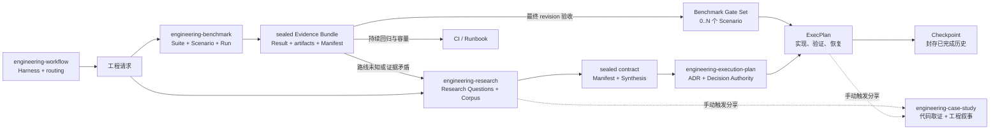
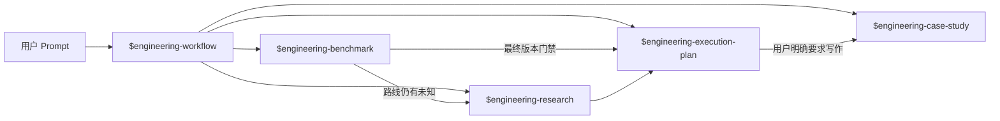
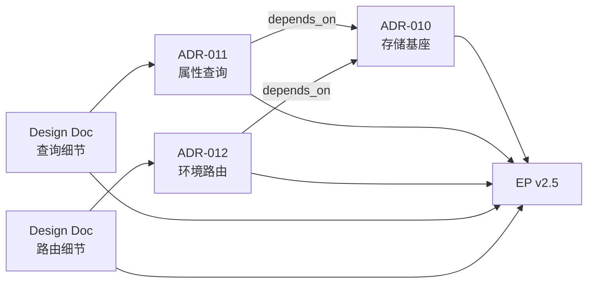
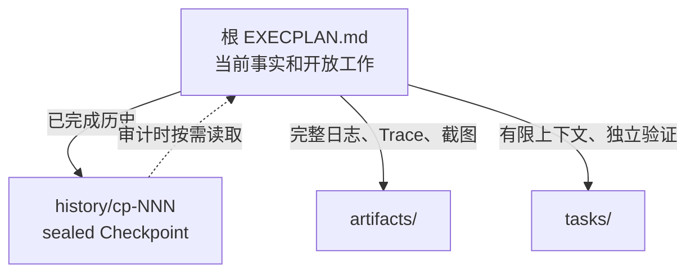
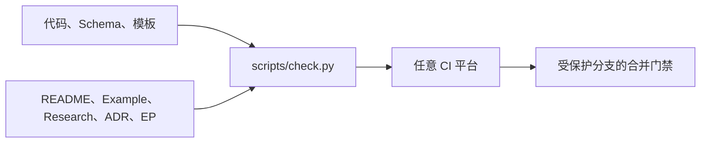

# EngineeringWorkflow

简体中文 | [English](README.md)

EngineeringWorkflow 由一个聚合 Skill 和四个专业 Skill 组成：

- **[Engineering Workflow](./SKILL.md)**：初始化和验证 Agent-first 项目
  Harness，并把后续工作路由到合适的专业 Skill。
- **[Engineering Benchmark](./engineering-benchmark/SKILL.md)**：把外部压测、
  性能对比、容量验证和回归测试组织成 Suite、稳定 Scenario 与 sealed
  Evidence Bundle。
- **[Engineering Research](./engineering-research/SKILL.md)**：把大量源码、
  文档、实验和外部研究组织成可审计的多文档 corpus，并输出 sealed Synthesis。
- **[Engineering Execution Plan](./engineering-execution-plan/SKILL.md)**：
  消费已经完成的 Research，治理 ADR、ExecPlan、Task、Checkpoint、Bugfix
  和技术债务。
- **[Engineering Case Study](./engineering-case-study/SKILL.md)**：在用户明确
  要求分享时，结合代码、Research、ADR 和 EP 过程记录，撰写中文、英文或
  中英双语的模块设计、最佳实践和交付案例。

四个专业 Skill 共享版本化文件契约，可独立安装和运行。聚合 Skill 只在项目
Bootstrap 时显式组合仓库内的 Engineering Execution Plan 初始化契约。



文档—代码完整性同样不依赖某个 Agent 或代码托管平台。仓库内
`python3 -B scripts/check.py` 是唯一检查入口；GitHub Actions、GitLab CI 或
其他 Pipeline 只负责调用它。

## 从需要的制品开始阅读

根 README 负责导航，不承载全部规范。先进入目标制品对应的专业 Skill，任务碰到
具体边界时再打开更深一层契约。

| 目标 | 从这里开始 | 契约或示例 |
|---|---|---|
| 初始化 Agent 可导航的项目 Harness | [Engineering Workflow](./SKILL.md) | [Bootstrap 契约](./references/bootstrap.md) |
| 设计或执行可复现压测 | [Engineering Benchmark](./engineering-benchmark/SKILL.md) | [Suite / Scenario / Run 契约](./engineering-benchmark/references/contract.md) · [路由示例](./engineering-benchmark/references/examples.md) |
| 调研未知、综合或解释证据 | [Engineering Research](./engineering-research/SKILL.md) | [Research 方法](./engineering-research/references/research.md) · [Manifest 契约](./engineering-research/references/manifest.md) |
| 形成 ADR，或通过 EP 推动实施 | [Engineering Execution Plan](./engineering-execution-plan/SKILL.md) | [制品路由](./engineering-execution-plan/references/templates.md) · [Benchmark Gate](./engineering-execution-plan/references/benchmark.md) |
| 把已验证的工程工作整理成分享 | [Engineering Case Study](./engineering-case-study/SKILL.md) | [来源与证据](./engineering-case-study/references/source-evidence.md) · [文章模式](./engineering-case-study/references/article-patterns.md) |

## 为什么拆成四个专业 Skill

测量取证、研究综合、实施治理和分享写作的触发条件、证据责任与内容增长方式不同。

| Skill | 回答的问题 | 主要制品 | 不负责 |
|---|---|---|---|
| Engineering Workflow | 项目如何建立 Agent 可导航、可验证的工程入口？ | AGENTS、Architecture、Docs Map、Harness Manifest | 接受 ADR、生成专业制品 |
| Engineering Benchmark | 怎样可复现地测量，某次执行相对预声明规则得到什么结果？ | Suite、Scenario、Run、Result、Evidence Manifest | 解释跨来源矛盾、接受 ADR、创建实施计划 |
| Engineering Research | 我们知道什么，证据可靠吗，哪些选项成立？ | Research、Corpus Manifest、Synthesis、Snapshot | 接受 ADR、创建实施计划 |
| Engineering Execution Plan | 已有证据支持什么决定，怎样实施并验收？ | ADR、ExecPlan、Task、Checkpoint、Bugfix | 搜集新证据、维护研究 corpus |
| Engineering Case Study | 哪个工程判断值得分享，代码和过程证据怎样讲清？ | 模块设计解读、最佳实践、交付案例 | 自动生成、改变事实制品、替代当前规范 |

Benchmark 不需要全部合并进 Research：探索性对比和会改变路线的实验进入
Research；已决定路线的最终 revision 验收直接成为 EP evidence；夜间回归与容量
趋势留在 CI 或 Runbook。只有出现路线未知、证据矛盾或需要重新决策时，持续
Benchmark 才升级为 Research。一个 EP 可以由多个独立 Scenario 共同驱动：
Scenario 集合在实现前声明，每个门禁由一个同 revision 的 passed sealed Run
覆盖，不把不同协议或环境的结果揉成一个总分。

一项 Research 可以包含多篇文档。只要它们服务同一决策目的、共享 Research
Questions、结论时间和下游 Synthesis，就使用同一个 `R-NNN`；当目的、Owner、
结束时间或下游消费者可以独立变化时，再拆成多个 Research。

同一个 Research 也可以有多轮深入分析。第一版完成后继续讨论、补证据或复核
某个结论时创建 `RR-NNN` Round；Synthesis 全量快照只保留正式评审、交接和重大
决策等稀疏里程碑。只有 Research Owner 明确授权后才结束 Research。

这种边界也控制文档膨胀：

- `RESEARCH.md` 只保留目的、问题、当前路线和发现索引；
- `rounds/` 只记录每轮焦点、证据增量和结论变化；
- 主题分析进入 managed `notes/`，已有文档目录以 linked corpus 注册；
- `RESEARCH_MANIFEST.json` 明确成员、入口、大小和 SHA-256；
- `SYNTHESIS.md` 只保留下游决策所需结论；
- `EXECPLAN.md` 只保留当前事实与开放工作，已完成历史进入 sealed Checkpoint。

## 目标代码仓库最终会出现这些制品

各 Skill 把治理制品写入正在开发的目标代码仓库。下面是目标仓库结构；下一节的
EngineeringWorkflow 目录则是 Skill 发行包结构：

```text
target-repository/
├── AGENTS.md
├── ARCHITECTURE.md
├── benchmarks/
│   ├── BENCHMARKS.md
│   └── suites/b-NNN_slug/
│       ├── BENCHMARK.md
│       ├── scenarios/bs-NNN_slug.md
│       └── runs/br-NNN_slug/
│           ├── SCENARIO.md
│           ├── RESULT.md
│           ├── EVIDENCE_MANIFEST.json
│           └── artifacts/
└── docs/
    ├── index.md
    ├── RESEARCH.md
    ├── DECISIONS.md
    ├── PLANS.md
    ├── BUGFIXES.md
    ├── research/
    │   ├── active/r-NNN_slug/
    │   └── completed/
    ├── adr/adr-NNN_slug.md
    ├── design-docs/
    ├── exec-plans/
    │   ├── active/ep-NNN_slug/
    │   └── completed/
    ├── bugfixes/
    │   ├── active/
    │   └── completed/
    └── case-studies/                 # 仅在用户要求分享时创建
```

`benchmarks/` 保存可重复验证的测量事实。Suite 定义主题与 Owner；Scenario
预声明执行协议；Run 封存一次执行的 Scenario 快照、Result、原生 artifacts 和
Manifest。已有压测实现可以继续放在 `scripts/bench/` 等代码目录；Scenario
指向可执行入口，每个 Run 记录不可变的 `harness_revision`。

`docs/` 保存解释、决策、实施治理和分享案例。Research 可以综合多个 sealed
Run；ExecPlan 声明作为完成门禁的 Scenario ID，并要求每个门禁恰好由一个同
subject revision 的 passed sealed Run 覆盖。根索引都是可重建投影；Suite、
Scenario、Run bundle、Research package、ADR 和 ExecPlan 文件才是事实源。
完整 schema 与生命周期参见
[Benchmark 契约](./engineering-benchmark/references/contract.md)、
[Research 方法](./engineering-research/references/research.md)和
[ExecPlan 制品路由](./engineering-execution-plan/references/templates.md)。

只有调用对应工作流后，相关路径才会出现。例如，Case Study 从不自动生成。

## 仓库布局与安装

这个 Git 仓库同时是发行仓库和聚合 Skill：

```text
EngineeringWorkflow/
├── SKILL.md                         # engineering-workflow 聚合 Skill
├── scripts/
│   ├── engineeringctl.py            # Harness Bootstrap 与验证
│   └── check.py                     # 唯一仓库检查入口
├── assets/
│   └── harness-*.md
├── engineering-benchmark/
│   ├── SKILL.md                     # engineering-benchmark Skill 根
│   └── scripts/benchctl.py
├── engineering-research/
│   ├── SKILL.md                     # engineering-research Skill 根
│   └── scripts/researchctl.py
├── engineering-execution-plan/
│   ├── SKILL.md                     # engineering-execution-plan Skill 根
│   └── scripts/epctl.py
└── engineering-case-study/
    └── SKILL.md                     # engineering-case-study Skill 根
```

要求 Python 3.10+；四个治理 CLI 都只使用标准库，分享写作 Skill 不需要专用
CLI。仓库可以检出到任意稳定目录：

```bash
git clone https://github.com/XiaoWeiKIN/EngineeringWorkflow.git \
  /absolute/path/to/EngineeringWorkflow
export ENGINEERING_WORKFLOW_HOME=/absolute/path/to/EngineeringWorkflow
```

按所用 Agent 或 Harness 的 Skill 发现机制，分别注册五个目录：

```text
/absolute/path/to/EngineeringWorkflow
/absolute/path/to/EngineeringWorkflow/engineering-benchmark
/absolute/path/to/EngineeringWorkflow/engineering-research
/absolute/path/to/EngineeringWorkflow/engineering-execution-plan
/absolute/path/to/EngineeringWorkflow/engineering-case-study
```

根目录是 Workflow 聚合 Skill；四个子目录依次是 Benchmark、Research、
Execution Plan 和 Case Study 专业 Skill。目录扫描、符号链接、配置文件或其他
注册方式均可；本项目不要求安装到任何特定 Agent 的私有目录。

更新发行包：

```bash
git -C "$ENGINEERING_WORKFLOW_HOME" pull --ff-only
```

如果宿主支持 `$<skill-name>` 调用语法，可以分别调用：

```text
使用 $engineering-workflow 初始化项目 Harness 并路由后续工程工作。
使用 $engineering-benchmark 为 spans placement 设计可复现 Scenario 并封存 Run。
使用 $engineering-research 调研 spans 聚合方案并整理现有多文档 corpus。
使用 $engineering-execution-plan 基于已完成的 Research 形成 ADR 和可恢复的开发计划。
使用 $engineering-case-study 基于代码、Research 和 EP-038 写一篇模块设计分享。
```

其他宿主使用自己的 Skill 调用约定即可。

## Prompt 驱动的示例体系

中英双语的 [Prompt 示例集](./examples/README.zh-CN.md) 覆盖全部五个 Skill，
既展示独立入口，也展示证据怎样在 Skill 之间交接：



| 场景 | 第一条 Prompt |
|---|---|
| 初始化仓库或选择正确流程 | `使用 $engineering-workflow 预览 Harness，并路由这个请求……` |
| 产生可复现测量 | `使用 $engineering-benchmark 预声明并执行这个 Scenario……` |
| 调研未知或接管现有 corpus | `使用 $engineering-research 回答这些 Research Questions……` |
| 记录决定或推动交付 | `使用 $engineering-execution-plan 创建 proposed ADR / ExecPlan / Bugfix……` |
| 编写可分享工程文章 | `使用 $engineering-case-study 生成中文 / 英文 / 双语 draft……` |

示例集包含仓库初始化、模糊请求路由、探索性 Benchmark、Research 到 ADR、
多 Scenario EP 门禁、Bugfix 升级，以及四类 Case Study。
[cache-topology 完整示例](./examples/cache-topology/README.md) 继续作为
Research → ADR → ExecPlan 的深度演示。

用户提供意图、上下文、停止边界和明确授权；Skill 在内部调用控制脚本，并报告
生成的 ID、制品和校验结果。

## 底层 CLI：供 Agent 与自动化使用

大多数用户应从上面的 Skill Prompt 开始。本节命令是 Skill、CI 和维护者使用的
确定性接口；只有编写自动化或排查控制层时才需要直接运行。以下命令都在目标代码
仓库根目录运行：

```bash
ENGINEERING_WORKFLOW_HOME=/absolute/path/to/EngineeringWorkflow
WORKFLOWCTL="$ENGINEERING_WORKFLOW_HOME/scripts/engineeringctl.py"
BENCHCTL="$ENGINEERING_WORKFLOW_HOME/engineering-benchmark/scripts/benchctl.py"
RESEARCHCTL="$ENGINEERING_WORKFLOW_HOME/engineering-research/scripts/researchctl.py"
EPCTL="$ENGINEERING_WORKFLOW_HOME/engineering-execution-plan/scripts/epctl.py"

python3 "$BENCHCTL" --repo . init
python3 "$RESEARCHCTL" --repo . init
python3 "$EPCTL" --repo . init
```

三个 `init` 都是幂等的。Benchmark 使用独立的
`benchmarks/.benchctl/state.json`；Research 与 Execution Plan 共享
`docs/.epctl/state.json` 中的 Research ID 高水位。

### 初始化 Codex 项目文档 Harness

`init` 只创建各 Skill 自己拥有的制品结构。要同时建立短 `AGENTS.md`、架构地图、
文档索引、质量、可靠性、安全和 Design Doc 入口，先预览：

```bash
python3 "$WORKFLOWCTL" --repo . bootstrap --profile codex
```

确认没有 conflict 后再应用并验证：

```bash
python3 "$WORKFLOWCTL" --repo . bootstrap --profile codex --apply
python3 "$WORKFLOWCTL" --repo . validate --harness
```

Bootstrap 只创建缺失路径，不覆盖已有文件。每个注册的 Agent instruction file
按物理行计数必须不超过 100 行；首版只注册根 `AGENTS.md`，模板保留至少 20 行
维护余量。现有文件超过上限时，工具报告冲突并拒绝写入。

### 创建和封存 Benchmark

先创建长期 Suite，填写生成的 `BENCHMARK.md`，再创建可复用 Scenario：

生成目录、ID、生命周期与 Manifest digest 由
[Benchmark 契约](./engineering-benchmark/references/contract.md)定义。
[路由示例](./engineering-benchmark/references/examples.md)说明何时进入
Research、直接作为 EP 验收或交给 CI / Runbook；同一个 EP 需要多个 Scenario
门禁时读取
[ExecPlan Benchmark 契约](./engineering-execution-plan/references/benchmark.md)。

```bash
python3 "$BENCHCTL" --repo . new-suite \
  --slug spans-placement \
  --title "Spans placement strategies" \
  --owner "Observability Performance Owner"

python3 "$BENCHCTL" --repo . new-scenario B-001 \
  --slug placement-order-key \
  --title "Compare placement order-key strategies"

python3 "$BENCHCTL" --repo . new-scenario B-001 \
  --slug sustained-throughput \
  --title "Verify sustained placement throughput"
```

Scenario 必须在看到结果前写清 hypothesis、falsifier、受控变量、数据集、环境、
命令、warmup、重复策略、指标、正确性检查、判定规则和外推边界。完成后针对
明确的被测 revision 与 harness revision 创建一次 Run：

```bash
python3 "$BENCHCTL" --repo . new-run BS-001 \
  --slug candidate-a \
  --title "Candidate A at 10k spans/s" \
  --subject-revision "git:<subject-commit>" \
  --harness-revision "git:<harness-commit>"
```

执行真实压测，把原始 CSV、JSON、日志、Trace、profile 或截图原样放入 Run 的
`artifacts/`，再填写 `RESULT.md`。文件格式不要求全部统一；统一的是 Scenario、
Result 和 Manifest 契约。完成后封存：

```bash
python3 "$BENCHCTL" --repo . seal-run BR-001 \
  --outcome passed \
  --executed-by "Benchmark Operator"
```

`passed`、`failed`、`inconclusive`、`errored` 都是可封存结果。Manifest 会清点
`SCENARIO.md`、`RESULT.md` 和本地 artifacts 的字节数与 SHA-256；封存后任何
增删改都会验证失败。修正或补证据要创建新 Run，并用
`--supersedes BR-NNN` 建立替代链。

生成下游可直接消费的引用：

```bash
python3 "$BENCHCTL" --repo . evidence-ref BR-001
# benchmark:BR-001@sha256:<manifest-payload-sha256>
```

### 手动生成分享案例

Case Study 没有后台任务或自动 hook。用户明确选择主题后再调用：

```text
使用 $engineering-case-study，结合当前代码、R-006 和 EP-042，
把 spans aggregate 的 planner 设计写成一篇中英双语模块设计分享。
```

Skill 会先确认用户选择 `zh-CN`、`en` 还是 `bilingual`；未指定时必须询问，
不会根据对话语言自行猜测。随后核对代码、测试、Research/ADR/EP 和 revision，
再在仓库约定位置生成 `draft`。只有用户要求定稿且来源、链接和脱敏检查全部
通过时，才标记为 `verified`。双语默认生成两份可独立阅读、证据一致的文章。

### 1. 创建 managed Research

适合从零开始的调研：

```bash
python3 "$RESEARCHCTL" --repo . new-research \
  --slug token-refresh-contract \
  --title "Research token refresh contract" \
  --owner "API Platform Owner" \
  --author "Codex" \
  --research-type technical
```

生成：

```text
docs/research/active/r-001_token-refresh-contract/
├── RESEARCH.md
├── RESEARCH_MANIFEST.json
├── SYNTHESIS.md
├── rounds/
├── notes/
├── snapshots/
└── artifacts/
```

用结构化专题文档把一个或多个紧密相关的 Research Questions 研究透：

```bash
python3 "$RESEARCHCTL" --repo . new-topic R-001 \
  --slug http-auth-boundary \
  --title "HTTP authentication boundary" \
  --question RQ-001 --author "Security Researcher"
```

命令会分配 Research 内唯一且不可复用的 `RT-NNN`，把专题写入 `notes/`、
挂接当前 Round 并刷新 manifest。新专题采用 learning-first 的 schema 2.2：
首屏给出答案、置信度、适用边界与决策影响；正文先建立心智模型，再用
`A-NNN` 连续分析讲清推导过程；Handoff 之后的 `E-NNN` 证据索引与 `S-NNN`
来源服务审计。文件名保持语义化，跨专题引用使用
`R-001/RT-001/A-002`。可见标题可以按读者和语言改写，隐藏 role 保持结构稳定。
普通专题或来源笔记仍可直接放入 `notes/`；手工新增、移动或删除后运行
`sync-research`。旧 schema 1、schema 2 和 schema 2.1 专题继续兼容。

### 2. 接管已有多文档 Research

已有 `index.md + 多篇专题文档` 时，不需要合并成一个大文件，也不需要移动原目录：

```bash
python3 "$RESEARCHCTL" --repo . new-research \
  --slug spans-aggregate \
  --title "Research spans aggregate" \
  --owner "Observability Owner" \
  --author "Codex" \
  --corpus-root _bmad-output/planning-artifacts/research/spans-aggregate \
  --entrypoint _bmad-output/planning-artifacts/research/spans-aggregate/index.md
```

`--corpus-root`、`--entrypoint` 和 `--include` 都可以重复。CLI 可以接收仓库内
的绝对路径，但 manifest 始终保存规范化的仓库相对路径。仓库外路径、路径穿越
和 symlink escape 会被拒绝。

验证会检查：

- corpus membership 与文档 SHA-256 drift；
- 本地 Markdown 链接和 `inputDocuments`；
- entrypoint 是否属于 manifest；
- 绝对工作站路径等不可移植引用。

```bash
python3 "$RESEARCHCTL" --repo . validate
python3 "$RESEARCHCTL" --repo . status
```

完成 Research Questions 和当前 Synthesis 后先创建评审版本：

```bash
python3 "$RESEARCHCTL" --repo . mark-review-ready R-001
```

默认只递增 Synthesis revision 并记录正文 SHA-256，不复制一份 Markdown。正式
评审、下游交接或重大决策节点才显式保存全量快照：

```bash
python3 "$RESEARCHCTL" --repo . \
  mark-review-ready R-001 --snapshot
```

快照版本允许有空号；正文相同会复用已有快照。conclude 时会确保最新唯一正文
至少保留一份全量里程碑。

Research 此时仍位于 `active/`。如果评审要求深入某一点：

```bash
python3 "$RESEARCHCTL" --repo . new-round R-001 \
  --slug http-security \
  --title "Deep dive into HTTP security" \
  --author "Security Reviewer"
```

随后使用 `new-topic` 创建本轮专题；review-ready 状态下不能直接追加专题，
从而避免新证据绕过 Round 和 Synthesis revision。

只有 Research Owner 明确授权结束后才能封存：

```bash
python3 "$RESEARCHCTL" --repo . conclude-research R-001 \
  --approved-by "Observability Owner" \
  --approval-ref "review:OBS-123"
```

managed 文档原地封存；linked 文档会复制到 completed Research 的
`artifacts/research-snapshot/`，源文档不变。Manifest 和 Synthesis 都会写入
可验证摘要。取消 Research 同样需要 Owner 明确授权和原因，且不能满足下游
Research Gate。

### 3. 形成 ADR

`engineering-execution-plan` 只接受 valid、concluded 的 Research。若 Research 带 manifest，
还必须是 sealed 且未被篡改：

```bash
python3 "$EPCTL" --repo . new-adr \
  --slug token-refresh-contract \
  --title "Choose token refresh contract" \
  --research R-001
```

Agent 可以起草 proposed ADR；接受或拒绝必须来自用户或明确的 Decision Owner：

```bash
python3 "$EPCTL" --repo . decide-adr ADR-001 \
  --outcome accepted \
  --decision-maker "API Architecture Council"
```

方向改变时建立替代链：

```bash
python3 "$EPCTL" --repo . supersede-adr ADR-001 --by ADR-002
```

一个功能需要多个决定时，不把它们揉成一个巨型 ADR。每份 ADR 保持原子性，
再用有类型的关系组成 Architecture Input Set：



既有 ADR / Design Doc 目录可以原地注册：

```bash
python3 "$EPCTL" --repo . register-architecture-root docs/design-docs
```

注册结果保存在 `docs/.epctl/config.json`，所以本地、GitHub Actions、GitLab CI
和其他 Pipeline 使用相同输入。新 ADR 仍写入 `docs/adr/`。旧 ADR 没有 epctl
决策签名时会以只读兼容模式接入并产生告警；后续决策不要回填伪造的历史授权。

### 4. 创建 gated ExecPlan

```bash
python3 "$EPCTL" --repo . new-ep \
  --slug implement-token-refresh \
  --title "Implement token refresh contract" \
  --research R-001 \
  --adr ADR-001 \
  --design docs/design-docs/token-refresh.md \
  --architecture-entrypoint docs/design-docs/index.md \
  --benchmark-scenario BS-001 \
  --benchmark-scenario BS-002
```

在 `Research and Architecture Inputs` 中复述关键证据、架构约束、负面后果和
剩余未知，再填写里程碑、Concrete Steps、验收和恢复方法。ADR 有
`depends_on` 或 `amends` 时，`--adr` 必须显式列出完整传递闭包；ADR 引用的
Design Docs 也必须进入 `--design`。对每个必需 Benchmark Scenario 重复
`--benchmark-scenario`；生成的 `required_benchmark_scenarios` 和
`Benchmark Gate Set` 会把多个压测与同一个 EP 建立可机械验证的多对一关系。

完成时为每个 Scenario 附一个 Run，所有 Run 必须来自同一个最终 revision：

```bash
python3 "$EPCTL" --repo . archive-ep EP-001 \
  --outcome completed \
  --verified-revision "git:<final-commit>" \
  --evidence "benchmark:BR-001@sha256:<payload>" \
  --evidence "benchmark:BR-002@sha256:<payload>"
```

缺少一个 Scenario、一个 Scenario 附了两个 accepted Run、Run 属于未声明
Scenario，或任一 `subject_revision` 不一致，都会原子阻止归档。

只有在输入已经充分且没有会改变路线的未知时才能 fast track，并要记录可核查
理由：

```bash
python3 "$EPCTL" --repo . new-ep \
  --slug clean-local-adapter \
  --title "Clean local adapter" \
  --research-not-required-reason \
  "Current contract tests fully define the behavior." \
  --architecture-not-required-reason \
  "No public boundary or durable technical choice changes."
```

## 控制长期迭代中的 EP 膨胀



根计划始终保留当前目的、系统事实、Gate 输入、当前里程碑、准确下一动作、
未完成 Progress/Validation 和 open blocker。以下时机建立 Checkpoint：

- 一个独立可验证里程碑完成；
- 准备跨会话交接或暂停；
- 根计划超过约 800 行、64 KiB 或 50 条活跃历史事件；
- 已完成历史开始遮蔽当前下一步。

先把仍有效的结论吸收到当前事实，把完整输出移入 `artifacts/`，再预览：

```bash
python3 "$EPCTL" --repo . checkpoint EP-001 \
  --slug milestone-one \
  --title "Milestone 1 complete" \
  --current-milestone "Milestone 2: adapter integration" \
  --summary "契约层已完成；适配层尚未实现。" \
  --next-action "编辑 src/adapter.ts 并运行 npm test。" \
  --revision "git:<current-commit>" \
  --dry-run
```

确认后去掉 `--dry-run`。

## 状态、验证与归档

```bash
python3 "$BENCHCTL" --repo . validate
python3 "$RESEARCHCTL" --repo . validate
python3 "$EPCTL" --repo . validate
python3 "$EPCTL" --repo . validate --fix-index
python3 "$EPCTL" --repo . status
```

ExecPlan 只有在验收完成、Task 终态、无 open blocker、复盘完整且验证通过时
才能完成：

```bash
python3 "$EPCTL" --repo . archive-ep EP-001 \
  --outcome completed \
  --verified-revision "git:<verified-commit>" \
  --evidence "ci:<pipeline-or-job-url>"
```

根索引是可重建投影；目录中的事实制品才决定真实状态。

## 文档—代码完整性与 CI



Canonical check 会运行四个治理 CLI 的测试、Research 与 Execution Plan
仓库验证、五个 Skill 包的可移植性检查、本地
Markdown 链接检查、cache-topology 端到端契约测试，以及索引 regeneration-diff。
CI 文件不得复制这些子命令：

- GitHub 使用 `.github/workflows/integrity.yml`，将稳定的 `ep-integrity`
  status check 设为 required。
- GitLab 使用 `.gitlab-ci.yml`，保护默认分支、禁止直接 push，并启用
  `Pipelines must succeed`。
- Jenkins、Buildkite 等平台直接运行 `python3 -B scripts/check.py`。

`CODEOWNERS` 位于仓库根目录，GitHub 与 GitLab 都能识别。具体审批账号和平台
设置属于仓库治理，不属于 Skill 的安装目录。GitLab Free 可用它路由 review；
把 Code Owner approval 设为强制需要支持该能力的 GitLab tier，CI 合并门禁不受
此限制。完整原则见
[文档与代码完整性](./engineering-execution-plan/references/integrity.md)。

## 兼容性

- 根 Skill 已从 `$execution-plan` 更名为 `$engineering-workflow`；原 EP Skill
  位于 `engineering-execution-plan/`，调用方需把根 `scripts/epctl.py` 更新为
  `engineering-execution-plan/scripts/epctl.py`。
- GitHub 仓库已从 `EngineeringPlan` 重命名为 `EngineeringWorkflow`。GitHub
  会重定向旧仓库 URL，但已有本地 clone 仍应更新 `origin`；参见
  [GitHub 重命名说明](https://docs.github.com/en/repositories/creating-and-managing-repositories/renaming-a-repository)。
- 旧 Research 包没有 `RESEARCH_MANIFEST.json` 时仍可被两个验证器读取。
- `epctl new-research`、`archive-research` 等旧命令暂时保留，但新工作应使用
  `engineering-research`；这是迁移兼容面，不是新的职责边界。
- Research schema 1 继续按 legacy 契约读取；schema 1.1 增加人类可见元数据、
  Round、Synthesis revision 和显式终止授权。
- 四个专业 Skill 不通过相对 import、安装目录或运行时调用耦合；聚合
  `engineering-workflow` 只在 bundled distribution 中显式组合 EP 初始化。
- Engineering Benchmark 是全新契约，不承担旧压测目录或历史报告格式的适配。
- 原始 Benchmark artifacts 不强制统一格式；`RESULT.md` 与
  `EVIDENCE_MANIFEST.json` 提供统一消费和完整性边界。
- Manifest 是可选的向后兼容字段；一旦出现，就必须满足版本化契约。
- v2.0–v2.4 ExecPlan 继续按原 schema 读取；新计划使用 v2.5 Architecture
  Input Set 与 `required_benchmark_scenarios`。
- 既有 accepted ADR 可以从注册目录只读接入；严格的新 ADR 使用 schema 1.1。

## 开发与验证

```bash
python3 -B scripts/check.py
```

该命令只依赖仓库内容和 Python 3.10+，不依赖某个 Agent 的私有 Skill 目录。

## 参考文档地图

先读取 Skill 入口，任务确实需要某项细节时再打开对应契约或示例。

端到端：

- [可运行的 cache-topology 端到端示例](./examples/cache-topology/README.md)
- [多 ADR / Design Doc Architecture Input Set 示例](./engineering-execution-plan/examples/architecture-input-set/README.md)

Engineering Workflow：

- [Skill 入口](./SKILL.md)
- [Codex 项目文档 Bootstrap](./references/bootstrap.md)

Engineering Benchmark：

- [Skill 入口](./engineering-benchmark/SKILL.md)
- [Suite / Scenario / Run 与 Manifest 契约](./engineering-benchmark/references/contract.md)
- [Research、EP 与 CI 路由示例](./engineering-benchmark/references/examples.md)

Engineering Research：

- [Skill 入口](./engineering-research/SKILL.md)
- [Research 方法](./engineering-research/references/research.md)
- [结构化专题文档](./engineering-research/references/topic.md)
- [Manifest 契约](./engineering-research/references/manifest.md)
- [典型场景](./engineering-research/references/examples.md)

Engineering Execution Plan：

- [Skill 入口](./engineering-execution-plan/SKILL.md)
- [Research 消费契约](./engineering-execution-plan/references/research.md)
- [Benchmark final-revision evidence](./engineering-execution-plan/references/benchmark.md)
- [ADR 与 Architecture Gate](./engineering-execution-plan/references/adr.md)
- [ExecPlan 规范](./engineering-execution-plan/references/template.md)
- [制品路由与状态机](./engineering-execution-plan/references/templates.md)
- [Checkpoint 与有界工作集](./engineering-execution-plan/references/checkpoints.md)
- [文档与代码完整性](./engineering-execution-plan/references/integrity.md)
- [Bugfix 规则](./engineering-execution-plan/references/bugfix.md)
- [完整示例](./engineering-execution-plan/references/examples.md)

Engineering Case Study：

- [Skill 入口](./engineering-case-study/SKILL.md)
- [来源与证据](./engineering-case-study/references/source-evidence.md)
- [文章模式](./engineering-case-study/references/article-patterns.md)
- [中英文写作](./engineering-case-study/references/language.md)
- [发布前复核](./engineering-case-study/references/review.md)

## 设计来源

- [OpenAI Harness engineering](https://openai.com/index/harness-engineering/)
- [OpenAI Codex Exec Plans](https://developers.openai.com/cookbook/articles/codex_exec_plans)
- [MADR](https://adr.github.io/madr/)

仓库内事实源、短入口与渐进披露、确定性工具、first-class plans 和持续熵管理
来自 Harness Engineering。自包含 Living Document 来自 Codex Exec Plans。
ADR 字段与状态参考 MADR，并增加显式决策权和 payload 封存。
