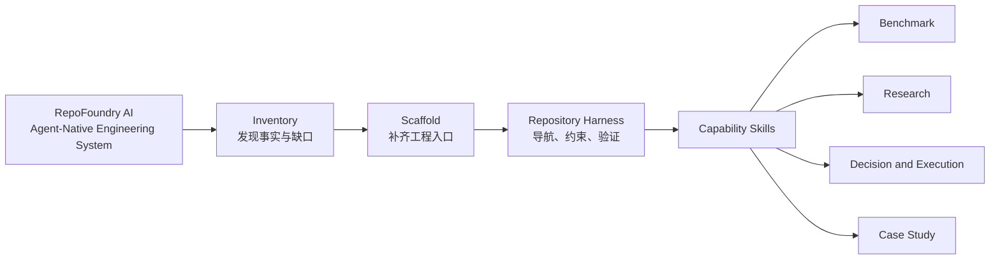
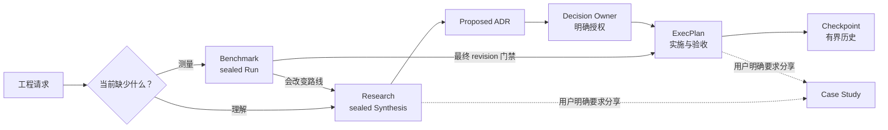
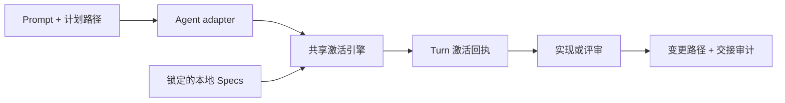

# RepoFoundry AI

简体中文 | [English](README.md)

<p align="center">
  
</p>

<p align="center"><strong>The Agent-Native Engineering System</strong></p>

<p align="center">把任何代码仓库锻造成 AI Agent 可以可靠工作的工程系统。</p>

**RepoFoundry AI** 把普通代码仓库转化为人和 Coding Agent 可以共同导航、治理
和验证的工程环境。它把短 Agent 入口、架构地图、可组合规范、证据契约、
架构决定、执行计划和确定性校验留在代码旁边，让仓库本身持续保存工程上下文。

系统不绑定某个模型、Agent、编辑器或代码托管平台。仓库始终是事实源。

## 一个系统包含四层能力



- **Inventory** 先盘点仓库事实和工程缺口。
- **Scaffold** 通过 preview-first Bootstrap 安全补齐入口。
- **Repository Harness** 是持久留在目标仓库里的工程环境。
- **Capability Skills** 负责专业证据与治理制品。

`Workflow` 描述某一项能力如何运行；RepoFoundry 提供承载、组合和验证这些流程的
系统。

## 五个 Skill 通过文件契约协作

| Skill | 职责 | 持久制品 |
|---|---|---|
| [`repo-foundry-ai`](./SKILL.md) | 盘点、Bootstrap、同步 Specs、验证 Harness、路由工作 | `AGENTS.md`、架构与文档地图、Harness 与 Spec manifests |
| [`engineering-benchmark`](./engineering-benchmark/SKILL.md) | 预声明并执行可复现测量 | Suite、Scenario、Run、Result、sealed Evidence Manifest |
| [`engineering-research`](./engineering-research/SKILL.md) | 调研未知并综合多文档证据 | Research controller、corpus Manifest、Rounds、topics、sealed Synthesis |
| [`engineering-execution-plan`](./engineering-execution-plan/SKILL.md) | 治理决定与实施 | ADR、ExecPlan、Task、Checkpoint、Bugfix、技术债务 |
| [`engineering-case-study`](./engineering-case-study/SKILL.md) | 把已验证代码和过程证据写成可分享内容 | 中文、英文或中英双语工程案例 |

四个专业 Skill 可以独立安装。它们通过版本化仓库文件交接，不依赖私有运行时
导入。

这些治理制品还共享一层语义元数据：稳定 type/ID、title/status、author/owner 与
created/updated。作者身份不等于 Research approval、ADR 决策权或 Benchmark
执行身份。原始证据由 content-addressed Manifest 携带等价 provenance；源码和
生成索引继续使用 Git、CODEOWNERS 与 generator provenance。详见
[Artifact Metadata Contract](./docs/design-docs/artifact-metadata-contract.md)。

## 证据向前流动，授权边界保持清晰



Agent 可以搜集证据并起草决定。Research 结束和 ADR 接受仍由人类明确授权。

## 目标仓库会出现什么

RepoFoundry 只创建已选择能力拥有的路径。完整使用后，目标仓库可能包含：

```text
target-repository/
├── AGENTS.md                         # 仅 Codex adapter
├── ARCHITECTURE.md
├── .repo-foundry/
│   ├── engineering-specs/spec_router.py # 共享激活引擎
│   └── skills/repo-foundry-ai/SKILL.md  # 项目规范工作流
├── .agents/skills/                   # Codex adapter 入口
│   ├── repo-foundry-ai/SKILL.md
│   └── engineering-specs/
│       ├── SKILL.md
│       ├── agents/openai.yaml
│       └── scripts/spec_router.py
├── .claude/skills/                   # Claude 项目 Skills
│   ├── repo-foundry-ai/SKILL.md
│   └── engineering-specs/SKILL.md
├── .codex/
│   └── hooks.json                     # 经审查的项目激活门禁
├── scripts/
│   └── bench/                         # 项目自己的压测实现
├── benchmarks/
│   ├── BENCHMARKS.md
│   └── suites/b-NNN_slug/
│       ├── BENCHMARK.md
│       ├── scenarios/bs-NNN_slug.md
│       └── runs/br-NNN_slug/
│           ├── SCENARIO.md
│           ├── RESULT.md
│           ├── EVIDENCE_MANIFEST.json
│           └── artifacts/
└── docs/
    ├── .engineering/
    │   ├── harness.json
    │   ├── specs.json
    │   └── specs.lock.json
    ├── agent-guides/
    │   ├── README.md                  # Portable adapter 入口
    │   └── managed/
    ├── design-docs/
    ├── research/{active,completed}/
    ├── adr/
    ├── exec-plans/{active,completed}/
    ├── bugfixes/{active,completed}/
    └── case-studies/
```

Benchmark Scenario 引用项目在 `scripts/bench/` 下维护的可执行测量代码；
RepoFoundry AI 记录证据，但不接管项目自己的测量实现。

Bootstrap 不会编造仓库事实。未知命令、Owner、架构、SLO 和安全控制会保留为
`BOOTSTRAP_TODO`，等待维护者确认。

## 一条命令安装或升级

一键安装器当前支持 macOS 和 Linux，需要 Python 3.10+ 与 `curl`。首次安装和
后续升级使用同一条命令：

```bash
curl -fsSL https://raw.githubusercontent.com/XiaoWeiKIN/RepoFoundryAI/main/install.py | python3 -
```

安装器默认选择 GitHub 最新稳定 Release，把 tag 解析到不可变 commit，记录下载
归档的 SHA-256，验证暂存包后再原子切换当前版本。默认安装到 XDG 用户数据目录，
在用户本地 bin 目录暴露 `repofoundry`，并为检测到的 Codex 与 Claude Code 注册根
Skill。Claude Code 注册遵循其官方配置根目录：
设置环境变量时使用 `$CLAUDE_CONFIG_DIR/skills/repo-foundry-ai`，否则使用
`~/.claude/skills/repo-foundry-ai`。其他 Agent 可以直接使用同一 CLI 和 portable
adapter，不需要这两个宿主目录。重复执行当前版本会返回 no-op。

在 `python3 -` 后传参即可固定版本或宿主策略：

```bash
curl -fsSL https://raw.githubusercontent.com/XiaoWeiKIN/RepoFoundryAI/main/install.py | python3 - --version 0.2.0 --host codex
curl -fsSL https://raw.githubusercontent.com/XiaoWeiKIN/RepoFoundryAI/main/install.py | python3 - --host claude
curl -fsSL https://raw.githubusercontent.com/XiaoWeiKIN/RepoFoundryAI/main/install.py | python3 - --host none
```

`--host codex` 与 `--host claude` 会确保对应的个人 Skill 链接存在；如果目标位置
已有非托管内容，安装器会先备份再替换。`--host auto` 注册检测到的全部受支持
宿主；`--host none` 不新增宿主注册，也不会删除既有注册。Claude Code 配置根目录
可通过 `CLAUDE_CONFIG_DIR` 或 `--claude-home` 覆盖。
目录软链接发现要求 Claude Code 2.1.203 或更高版本。

宿主注册只负责让个人安装中的 `/repo-foundry-ai` 可发现；项目注册是另一个由仓库
持有的操作。为当前项目安装 Claude Skills，或按确定顺序安装全部 adapter：

```bash
repofoundry --repo . bootstrap --adapter claude --apply
repofoundry --repo . bootstrap --all-adapters --apply
```

Claude adapter 在 `.claude/skills/` 下创建普通文件，不链接用户 home。它提供原生
Skill discovery，通过共享项目 Router 显式执行 CLI 激活与审计，但不宣称 Claude
生命周期 Hooks 或机械写入门禁。`--all-adapters` 总是展开为 `codex`、`claude`、
`portable`，不会因当前机器安装了哪些宿主而变化。

Claude Code 对同名 Skill 采用个人级优先于项目级的规则。RepoFoundry 在两个 scope
都保留 `/repo-foundry-ai` 品牌入口：已安装的个人入口发现项目 canonical 文件时，
必须读取 `.repo-foundry/skills/repo-foundry-ai/SKILL.md`；没有个人注册的 clone 则
直接发现薄项目入口。

命令会报告当前 package home、CLI 路径、宿主链接和所有保留的备份。如果 bin
目录尚未进入 `PATH`，安装器会输出需要加入的精确目录。安装后验证：

```bash
repofoundry --version
repofoundry --repo . adapter list
```

如果环境禁止把下载内容直接交给解释器，可以先下载审查再执行：

```bash
curl -fsSLo /tmp/repofoundry-install.py https://raw.githubusercontent.com/XiaoWeiKIN/RepoFoundryAI/main/install.py
less /tmp/repofoundry-install.py
python3 /tmp/repofoundry-install.py
```

发行包升级与项目迁移严格分离。安装器不会扫描或修改任何项目仓库。安装新版
RepoFoundry 后，仍需在每个项目中先执行
`repofoundry --repo PATH upgrade --to VERSION` 预览，再加 `--apply` 明确应用
Harness 迁移。

维护者也可以从显式 checkout 离线安装：

```bash
git clone https://github.com/XiaoWeiKIN/RepoFoundryAI.git /absolute/path/to/RepoFoundryAI
python3 /absolute/path/to/RepoFoundryAI/install.py --source /absolute/path/to/RepoFoundryAI
export REPO_FOUNDRY_HOME="${XDG_DATA_HOME:-$HOME/.local/share}/repofoundry-ai/current"
```

## 从 Prompt 开始

初始化仓库：

```text
使用 $repo-foundry-ai 盘点当前仓库，预览 Agent-neutral Harness Core 与合适的
adapter，并报告 create、preserve 和 conflict。只有预览无冲突时才应用，随后
验证 Harness 和本地 Specs。
```

路由专业工作：

```text
使用 $engineering-benchmark，在执行容量测量前定义可复现 Scenario。

使用 $engineering-research 调研缓存拓扑，保留反例和不确定性，
停在 review-ready Synthesis。

使用 $engineering-execution-plan 消费已结束的 Research，起草 ADR，
等待 Decision Owner 明确授权后再接受。

使用 $engineering-case-study，结合已验证代码、Research、ADR 和 ExecPlan，
撰写一篇中英双语模块设计文章。
```

[cache-topology 端到端示例](./examples/cache-topology/README.md)展示了如何从既有
corpus 出发，经过 Research、明确授权的 ADR，最终进入 gated ExecPlan。

## Prompt 驱动的示例

双语 [Prompt 示例目录](./examples/README.zh-CN.md)与
[English catalog](./examples/README.md)覆盖五个 Skill 的独立入口和证据交接：

| 场景 | 首选 Skill |
|---|---|
| 初始化仓库或路由模糊请求 | `$repo-foundry-ai` |
| 产生可复现测量 | `$engineering-benchmark` |
| 调研未知或接管现有 corpus | `$engineering-research` |
| 记录决定或推动交付 | `$engineering-execution-plan` |
| 编写可分享工程文章 | `$engineering-case-study` |

用户提供意图、上下文、停止边界和明确授权；Skill 在内部调用确定性控制脚本，
并报告生成的 ID、制品和验证结果。

## 确定性 CLI

Skill 通过这些 CLI 修改状态并验证制品。维护者也可以直接用它们编写自动化或
诊断问题：

```bash
REPO_FOUNDRY_HOME="${XDG_DATA_HOME:-$HOME/.local/share}/repofoundry-ai/current"
BENCHCTL="$REPO_FOUNDRY_HOME/engineering-benchmark/scripts/benchctl.py"
RESEARCHCTL="$REPO_FOUNDRY_HOME/engineering-research/scripts/researchctl.py"
EPCTL="$REPO_FOUNDRY_HOME/engineering-execution-plan/scripts/epctl.py"

repofoundry --version
repofoundry --repo . adapter list
repofoundry --repo . bootstrap --adapter portable
repofoundry --repo . bootstrap --adapter claude --apply
repofoundry --repo . \
  bootstrap --all-adapters --spec languages/go --apply
repofoundry --repo . validate --harness
repofoundry --repo . validate --adapter codex
repofoundry --repo . validate --adapter claude
repofoundry --repo . upgrade --to 0.2.0
repofoundry --repo . upgrade --to 0.2.0 --apply

repofoundry --repo . spec plan
repofoundry --repo . spec sync --apply
repofoundry --repo . \
  spec update --spec-version 1.2.0 --spec languages/go --apply
repofoundry --repo . spec validate

python3 "$BENCHCTL" --repo . validate
python3 "$RESEARCHCTL" --repo . validate
python3 "$EPCTL" --repo . validate
python3 "$EPCTL" --repo . status
```

Bootstrap、Harness 升级与 Spec 写操作默认先预览。Bootstrap 只创建缺失路径，
保留仓库已有文件。adapter 注册的 instruction file 必须满足自身预算；Codex
`AGENTS.md` 仍不得超过 100 个物理行。

RepoFoundry `0.2.0` 使用 Harness schema `3`、Harness Core `1.1.0`、Codex
adapter `2.1.0`、Claude adapter `1.0.0`、Portable adapter `1.0.0` 与激活协议
`1`；它们与 Engineering Specs Catalog 各自独立演进。schema `1` 和 `2` 继续
可读，但只有显式执行 `upgrade --to 0.2.0 --apply` 才会迁移。较早的 schema `3`
Core `1.0.0` 与 Codex `2.0.0` 契约也继续可读；显式 upgrade 或一次预览过的
adapter 追加 bootstrap 会记录组件迁移并补齐项目 Skill。versioned seed 只有在文件
字节仍匹配记录的 installed SHA-256 时才自动替换；定制文件或来源未知文件保持
原样，写后验证失败会回滚。完整契约见
[版本与迁移设计](./docs/design-docs/repo-foundry-versioning-and-migrations.md)。

Engineering Specs 来自独立的
[EngineeringSpecifications](https://github.com/XiaoWeiKIN/EngineeringSpecifications)
Git catalog。`sync` 遵循锁定 commit；`update` 才会重新解析所选发布版本。
新仓库默认选择固定 Catalog `1.2.0`，manifest 记录
`refs/tags/v1.2.0`。生产升级通过
`spec update --spec-version MAJOR.MINOR.PATCH` 明确选择新版本；
`--spec-ref` 只作为显式开发源入口。`spec validate` 完全离线。

`spec plan` 会列出全部 Catalog 条目，并区分必选、推荐、项目直接配置和依赖闭包后的
最终集合。检测结果只推荐可选 ID；首次 Bootstrap 或 `spec update` 时重复传入
`--spec ID`，即可设置完整的可选直接集合；`--required-only` 表示不选任何可选
Spec。必选 Spec 与传递依赖仍由解析器自动补齐。

## 为每个任务激活规范

安装与任务激活是两个阶段。Bootstrap 只安装一个共享激活引擎，不会把每份 Spec
都变成 Skill。Codex adapter 通过原生 Hooks 暴露 `$engineering-specs`；Claude
发现项目级 `$engineering-specs` Skill，Claude 与 Portable 都通过显式 CLI 步骤
使用同一引擎。实现或评审前，引擎会：

1. 用计划路径匹配 lock 中的 Catalog 作用域；
2. 要求 Agent 读取候选 description 与 Applicability；
3. 为当前 Turn 记录适用 Spec ID 与依赖，或记录带理由的显式 `none`；
4. 只读取摘要已验证的本地规范；
5. 在交接时报告激活的 Requirement、验证、例外与迁移影响。



Core 只识别标准化的 `session_start`、`subagent_start`、`before_mutation`、`stop`。
Codex adapter 翻译原生事件：生成的 Hooks 在 `UserPromptSubmit` 建立 Git 基线，把契约传给子 Agent，
在激活前拒绝 Bash 或 `apply_patch` 写入，在首次写入前注入已激活的本地全文，并在
`Stop` 审计实际变更路径。项目只有在仓库受信任、用户通过 Codex `/hooks` 审查
精确命令后才运行这些 Hooks。Hooks 被禁用或不可用时，Skill 仍是人工契约，但不再
具有机械写入门禁；Agent 必须在写入前运行 Router `begin`，并在完成前用包含五字段
交接的 `audit --message` 检查路径。Claude 与 Portable 默认采用这条手动路径，
并明确报告 CLI/advisory enforcement，而不是机械门禁。

## 清晰边界保证系统可信

- RepoFoundry AI 不运行通用 Agent runtime，也不把编排状态藏在仓库外。
- 根 Skill 不创建 Benchmark Run、Research、ADR、ExecPlan 或 Case Study。
- 专业 Skill 不推断 Research Owner 或 Decision Owner 的授权。
- Bootstrap 不覆盖仓库自有文档。
- 规范正文保留在独立 EngineeringSpecifications 仓库。
- RepoFoundry 只生成一个任务 Router，不为每份 Spec 创建一个 Skill。
- Core 不包含任何 Agent 产品事件、工具 payload、信任模型或 instruction 格式；
  这些翻译全部属于 adapter。
- 项目 Hooks 是受信任 Codex 项目中的护栏，不是对其他 Agent 或禁用 Hook 环境的
  通用强制保证。
- 只有用户明确要求分享时才创建 Case Study。
- GitHub Actions、GitLab CI、Jenkins 等平台调用同一个仓库检查入口，不复制策略。

## 从 EngineeringWorkflow 迁移

RepoFoundry AI 用一套当前入口替换原产品身份：

| 原入口 | 当前入口 |
|---|---|
| `$engineering-workflow` | `$repo-foundry-ai` |
| `$repo-foundry`（合并前候选名） | `$repo-foundry-ai` |
| `scripts/engineeringctl.py` | `scripts/foundryctl.py` |
| `ENGINEERING_WORKFLOW_HOME` | `REPO_FOUNDRY_HOME` |
| 新 manifest owner `engineering-workflow` | 新 manifest owner `repo-foundry` |

已有目标仓库中 owner 为 `engineering-workflow` 的 manifests 仍可读取，并产生
迁移 warning；新 manifests 使用 `repo-foundry`。Accepted ADR、completed
ExecPlan 和 sealed 校验产物保留当时真实使用的历史名称。

本地改造不会声称 Git 托管仓库已经完成改名。外部操作完成并确认 URL 后，再更新
现有 clone 的 remote。参见
[GitHub 仓库改名说明](https://docs.github.com/en/repositories/creating-and-managing-repositories/renaming-a-repository)。

## 开发与验证

运行唯一仓库检查入口：

```bash
python3 -B scripts/check.py
```

该命令验证五个 Skill package 与 eval catalog，执行所有治理测试，检查本地
Markdown 链接和独立安装，并验证仓库内 Research 与 ExecPlan 状态。CI adapter
只调用这一条命令。

## 参考入口

RepoFoundry AI：

- [根 Skill](./SKILL.md)
- [Bootstrap 契约](./references/bootstrap.md)
- [系统身份与 packaging](./docs/design-docs/repo-foundry-system.md)
- [版本与 Harness 迁移](./docs/design-docs/repo-foundry-versioning-and-migrations.md)
- [Engineering Spec 解析](./docs/design-docs/engineering-spec-management.md)
- [Agent-neutral Harness 与 adapters](./docs/design-docs/agent-neutral-harness-adapters.md)
- [Artifact Metadata Contract](./docs/design-docs/artifact-metadata-contract.md)

专业能力：

- [Benchmark 契约](./engineering-benchmark/references/contract.md)
- [Research 方法](./engineering-research/references/research.md)
- [Research Manifest](./engineering-research/references/manifest.md)
- [执行制品路由](./engineering-execution-plan/references/templates.md)
- [ADR 契约](./engineering-execution-plan/references/adr.md)
- [ExecPlan 规范](./engineering-execution-plan/references/template.md)
- [ExecPlan Benchmark 门禁](./engineering-execution-plan/references/benchmark.md)
- [文档—代码完整性](./engineering-execution-plan/references/integrity.md)
- [Case Study 证据](./engineering-case-study/references/source-evidence.md)
- [Case Study 评审](./engineering-case-study/references/review.md)

决定与实施：

- [ADR-007 — 采用 RepoFoundry](./docs/adr/adr-007_repo-foundry-identity.md)
- [ADR-008 — 对外使用 RepoFoundry AI](./docs/adr/adr-008_repofoundry-ai-brand.md)
- [ADR-009 — 根 Skill 名称与 RepoFoundry AI 对齐](./docs/adr/adr-009_align-repofoundry-ai-skill-name.md)
- [ADR-011 — 分离 Core 与 Agent adapters](./docs/adr/adr-011_agent-neutral-harness-adapters.md)
- [ADR-012 — 分离 Spec 激活与 runtime adapters](./docs/adr/adr-012_agent-neutral-spec-activation.md)
- [ADR-014 — 治理制品元数据契约（proposed）](./docs/adr/adr-014_governed-artifact-metadata-contract.md)
- [EP-006 — 迁移到 RepoFoundry AI](./docs/exec-plans/active/ep-006_migrate-to-repo-foundry/EXECPLAN.md)
- [EP-010 — 实现 Agent-neutral adapters](./docs/exec-plans/completed/ep-010_implement-agent-neutral-adapters/EXECPLAN.md)
