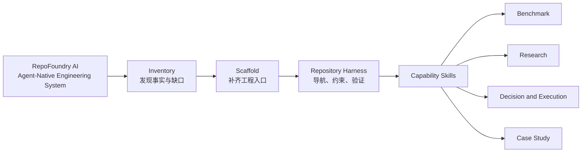
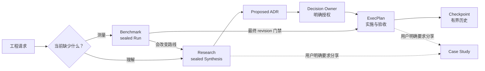

# RepoFoundry AI

简体中文 | [English](README.md)

<p align="center">
  
</p>

<p align="center"><strong>The Agent-Native Engineering System</strong></p>

<p align="center">把任何代码仓库锻造成 AI Agent 可以可靠工作的工程系统。</p>

**RepoFoundry AI** 把普通代码仓库转化为人和 Coding Agent 可以共同导航、治理
和验证的工程环境。它把短 Agent 入口、架构地图、可组合规范、证据契约、
架构决定、执行计划和确定性校验留在代码旁边，让仓库本身持续保存工程上下文。

系统不绑定某个模型、Agent、编辑器或代码托管平台。仓库始终是事实源。

## 一个系统包含四层能力



- **Inventory** 先盘点仓库事实和工程缺口。
- **Scaffold** 通过 preview-first Bootstrap 安全补齐入口。
- **Repository Harness** 是持久留在目标仓库里的工程环境。
- **Capability Skills** 负责专业证据与治理制品。

`Workflow` 描述某一项能力如何运行；RepoFoundry 提供承载、组合和验证这些流程的
系统。

## 五个 Skill 通过文件契约协作

| Skill | 职责 | 持久制品 |
|---|---|---|
| [`repo-foundry`](./SKILL.md) | 盘点、Bootstrap、同步 Specs、验证 Harness、路由工作 | `AGENTS.md`、架构与文档地图、Harness 与 Spec manifests |
| [`engineering-benchmark`](./engineering-benchmark/SKILL.md) | 预声明并执行可复现测量 | Suite、Scenario、Run、Result、sealed Evidence Manifest |
| [`engineering-research`](./engineering-research/SKILL.md) | 调研未知并综合多文档证据 | Research controller、corpus Manifest、Rounds、topics、sealed Synthesis |
| [`engineering-execution-plan`](./engineering-execution-plan/SKILL.md) | 治理决定与实施 | ADR、ExecPlan、Task、Checkpoint、Bugfix、技术债务 |
| [`engineering-case-study`](./engineering-case-study/SKILL.md) | 把已验证代码和过程证据写成可分享内容 | 中文、英文或中英双语工程案例 |

四个专业 Skill 可以独立安装。它们通过版本化仓库文件交接，不依赖私有运行时
导入。

## 证据向前流动，授权边界保持清晰



Agent 可以搜集证据并起草决定。Research 结束和 ADR 接受仍由人类明确授权。

## 目标仓库会出现什么

RepoFoundry 只创建已选择能力拥有的路径。完整使用后，目标仓库可能包含：

```text
target-repository/
├── AGENTS.md
├── ARCHITECTURE.md
├── scripts/
│   └── bench/                         # 项目自己的压测实现
├── benchmarks/
│   ├── BENCHMARKS.md
│   └── suites/b-NNN_slug/
│       ├── BENCHMARK.md
│       ├── scenarios/bs-NNN_slug.md
│       └── runs/br-NNN_slug/
│           ├── SCENARIO.md
│           ├── RESULT.md
│           ├── EVIDENCE_MANIFEST.json
│           └── artifacts/
└── docs/
    ├── .engineering/
    │   ├── harness.json
    │   ├── specs.json
    │   └── specs.lock.json
    ├── agent-guides/managed/
    ├── design-docs/
    ├── research/{active,completed}/
    ├── adr/
    ├── exec-plans/{active,completed}/
    ├── bugfixes/{active,completed}/
    └── case-studies/
```

Benchmark Scenario 引用项目在 `scripts/bench/` 下维护的可执行测量代码；
RepoFoundry AI 记录证据，但不接管项目自己的测量实现。

Bootstrap 不会编造仓库事实。未知命令、Owner、架构、SLO 和安全控制会保留为
`BOOTSTRAP_TODO`，等待维护者确认。

## 安装发行包

RepoFoundry AI 要求 Python 3.10+ 和 Git。治理 CLI 只依赖 Python 标准库。

外部仓库改名属于独立托管操作。在正式 URL 得到确认前，使用仓库 Owner 提供的
地址：

```bash
git clone <repo-url> /absolute/path/to/RepoFoundry
export REPO_FOUNDRY_HOME=/absolute/path/to/RepoFoundry
```

根据宿主的 Skill 发现机制，注册根目录和需要的专业 Skill：

```text
/absolute/path/to/RepoFoundry
/absolute/path/to/RepoFoundry/engineering-benchmark
/absolute/path/to/RepoFoundry/engineering-research
/absolute/path/to/RepoFoundry/engineering-execution-plan
/absolute/path/to/RepoFoundry/engineering-case-study
```

RepoFoundry 不要求安装到某个 Agent 的私有目录。只要保留这些 package root，
目录扫描、符号链接和宿主配置都可以使用。

## 从 Prompt 开始

初始化仓库：

```text
使用 $repo-foundry 盘点当前仓库，预览 Codex Harness Bootstrap，并报告
create、preserve 和 conflict。只有预览无冲突时才应用，随后验证 Harness
和本地 Specs。
```

路由专业工作：

```text
使用 $engineering-benchmark，在执行容量测量前定义可复现 Scenario。

使用 $engineering-research 调研缓存拓扑，保留反例和不确定性，
停在 review-ready Synthesis。

使用 $engineering-execution-plan 消费已结束的 Research，起草 ADR，
等待 Decision Owner 明确授权后再接受。

使用 $engineering-case-study，结合已验证代码、Research、ADR 和 ExecPlan，
撰写一篇中英双语模块设计文章。
```

[cache-topology 端到端示例](./examples/cache-topology/README.md)展示了如何从既有
corpus 出发，经过 Research、明确授权的 ADR，最终进入 gated ExecPlan。

## Prompt 驱动的示例

双语 [Prompt 示例目录](./examples/README.zh-CN.md)与
[English catalog](./examples/README.md)覆盖五个 Skill 的独立入口和证据交接：

| 场景 | 首选 Skill |
|---|---|
| 初始化仓库或路由模糊请求 | `$repo-foundry` |
| 产生可复现测量 | `$engineering-benchmark` |
| 调研未知或接管现有 corpus | `$engineering-research` |
| 记录决定或推动交付 | `$engineering-execution-plan` |
| 编写可分享工程文章 | `$engineering-case-study` |

用户提供意图、上下文、停止边界和明确授权；Skill 在内部调用确定性控制脚本，
并报告生成的 ID、制品和验证结果。

## 确定性 CLI

Skill 通过这些 CLI 修改状态并验证制品。维护者也可以直接用它们编写自动化或
诊断问题：

```bash
FOUNDRYCTL="$REPO_FOUNDRY_HOME/scripts/foundryctl.py"
BENCHCTL="$REPO_FOUNDRY_HOME/engineering-benchmark/scripts/benchctl.py"
RESEARCHCTL="$REPO_FOUNDRY_HOME/engineering-research/scripts/researchctl.py"
EPCTL="$REPO_FOUNDRY_HOME/engineering-execution-plan/scripts/epctl.py"

python3 "$FOUNDRYCTL" --repo . bootstrap --profile codex
python3 "$FOUNDRYCTL" --repo . bootstrap --profile codex --apply
python3 "$FOUNDRYCTL" --repo . validate --harness

python3 "$FOUNDRYCTL" --repo . spec plan
python3 "$FOUNDRYCTL" --repo . spec sync --apply
python3 "$FOUNDRYCTL" --repo . spec update --apply
python3 "$FOUNDRYCTL" --repo . spec validate

python3 "$BENCHCTL" --repo . validate
python3 "$RESEARCHCTL" --repo . validate
python3 "$EPCTL" --repo . validate
python3 "$EPCTL" --repo . status
```

Bootstrap 与 Spec 写操作默认先预览。Bootstrap 只创建缺失路径，保留仓库已有
文件。Codex profile 注册的 Agent instruction file 不得超过 100 个物理行。

Engineering Specs 来自独立的
[EngineeringSpecifications](https://github.com/XiaoWeiKIN/EngineeringSpecifications)
Git catalog。`sync` 遵循锁定 commit；`update` 才会重新解析配置 ref；
`spec validate` 完全离线。

## 清晰边界保证系统可信

- RepoFoundry AI 不运行通用 Agent runtime，也不把编排状态藏在仓库外。
- 根 Skill 不创建 Benchmark Run、Research、ADR、ExecPlan 或 Case Study。
- 专业 Skill 不推断 Research Owner 或 Decision Owner 的授权。
- Bootstrap 不覆盖仓库自有文档。
- 规范正文保留在独立 EngineeringSpecifications 仓库。
- 只有用户明确要求分享时才创建 Case Study。
- GitHub Actions、GitLab CI、Jenkins 等平台调用同一个仓库检查入口，不复制策略。

## 从 EngineeringWorkflow 迁移

RepoFoundry AI 用一套当前入口替换原产品身份：

| 原入口 | 当前入口 |
|---|---|
| `$engineering-workflow` | `$repo-foundry` |
| `scripts/engineeringctl.py` | `scripts/foundryctl.py` |
| `ENGINEERING_WORKFLOW_HOME` | `REPO_FOUNDRY_HOME` |
| 新 manifest owner `engineering-workflow` | 新 manifest owner `repo-foundry` |

已有目标仓库中 owner 为 `engineering-workflow` 的 manifests 仍可读取，并产生
迁移 warning；新 manifests 使用 `repo-foundry`。Accepted ADR、completed
ExecPlan 和 sealed 校验产物保留当时真实使用的历史名称。

本地改造不会声称 Git 托管仓库已经完成改名。外部操作完成并确认 URL 后，再更新
现有 clone 的 remote。参见
[GitHub 仓库改名说明](https://docs.github.com/en/repositories/creating-and-managing-repositories/renaming-a-repository)。

## 开发与验证

运行唯一仓库检查入口：

```bash
python3 -B scripts/check.py
```

该命令验证五个 Skill package 与 eval catalog，执行所有治理测试，检查本地
Markdown 链接和独立安装，并验证仓库内 Research 与 ExecPlan 状态。CI adapter
只调用这一条命令。

## 参考入口

RepoFoundry AI：

- [根 Skill](./SKILL.md)
- [Bootstrap 契约](./references/bootstrap.md)
- [系统身份与 packaging](./docs/design-docs/repo-foundry-system.md)
- [Engineering Spec 解析](./docs/design-docs/engineering-spec-management.md)

专业能力：

- [Benchmark 契约](./engineering-benchmark/references/contract.md)
- [Research 方法](./engineering-research/references/research.md)
- [Research Manifest](./engineering-research/references/manifest.md)
- [执行制品路由](./engineering-execution-plan/references/templates.md)
- [ADR 契约](./engineering-execution-plan/references/adr.md)
- [ExecPlan 规范](./engineering-execution-plan/references/template.md)
- [ExecPlan Benchmark 门禁](./engineering-execution-plan/references/benchmark.md)
- [文档—代码完整性](./engineering-execution-plan/references/integrity.md)
- [Case Study 证据](./engineering-case-study/references/source-evidence.md)
- [Case Study 评审](./engineering-case-study/references/review.md)

决定与实施：

- [ADR-007 — 采用 RepoFoundry](./docs/adr/adr-007_repo-foundry-identity.md)
- [ADR-008 — 对外使用 RepoFoundry AI](./docs/adr/adr-008_repofoundry-ai-brand.md)
- [EP-006 — 迁移到 RepoFoundry AI](./docs/exec-plans/active/ep-006_migrate-to-repo-foundry/EXECPLAN.md)
