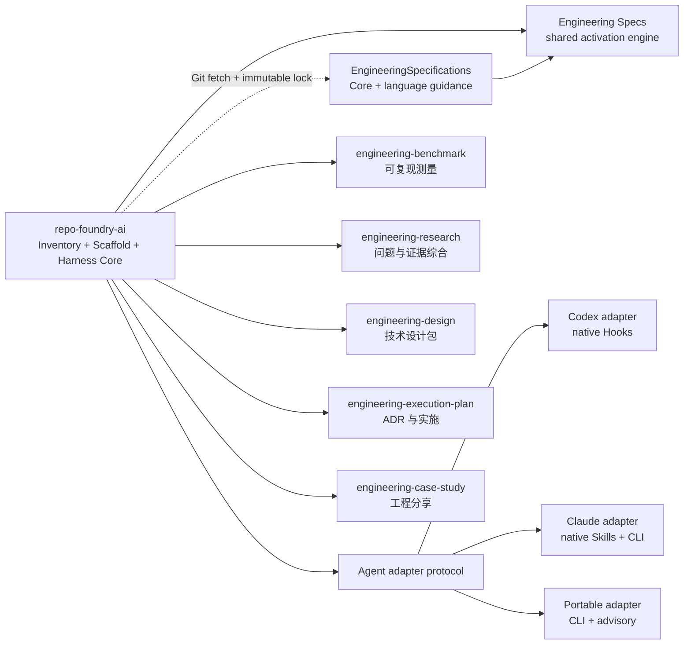

# RepoFoundry AI

把普通代码仓库锻造成 AI Agent 可导航、规范可组合、证据可追溯、交付可验证的
工程系统。RepoFoundry AI 的根 Skill 负责 Inventory、Scaffold、Repository
Harness、Spec 解析和能力路由；专业制品生命周期仍由五个独立 Skill 持有。



## 安装或升级 RepoFoundry AI

首次安装和后续升级使用同一条命令：

```bash
curl -fsSL https://raw.githubusercontent.com/XiaoWeiKIN/RepoFoundryAI/main/install.py | python3 -
curl -fsSL https://raw.githubusercontent.com/XiaoWeiKIN/RepoFoundryAI/main/install.py | python3 - --host claude
```

安装器选择最新稳定 GitHub Release，把 tag 固定到 commit，记录归档 SHA-256，
验证完整暂存包后原子切换当前版本，并暴露 `repofoundry` CLI。默认只为检测到的
Agent host 注册发现入口；`--host codex` 显式注册 Codex，`--host claude` 在
`$CLAUDE_CONFIG_DIR/skills/repo-foundry-ai`（未设置时为
`~/.claude/skills/repo-foundry-ai`）注册 Claude Code，
`--host none` 只安装产品中立的 CLI 且不改动既有宿主注册。`--host auto` 会注册
检测到的全部受支持宿主。`--version MAJOR.MINOR.PATCH` 固定版本，重复安装同一版本为
no-op，旧的不可变 release 和被替换的非托管宿主目录保留用于恢复。宿主注册只
提供个人 Skill 发现；项目级 Skill 必须由目标仓库的 adapter bootstrap 注册。

发行包升级不扫描或修改项目仓库。安装新版工具后，目标项目仍必须单独执行
`repofoundry --repo PATH upgrade --to VERSION` 预览 Harness migration，并在用户
明确要求后加 `--apply`。需要审查远程脚本时，先下载 `install.py`、阅读内容，
再用 `python3 install.py` 执行。

## 初始化项目

先确认目标仓库根目录。如果
`.repo-foundry/skills/repo-foundry-ai/SKILL.md` 已存在，必须完整读取并以它作为
当前项目的 canonical RepoFoundry 工作流，再执行本 Skill 的产品安装或 CLI 路由。
这也处理了某些 Agent host 中个人同名 Skill 优先于项目 Skill 的发现规则：个人
入口负责发现，仓库文件负责保存当前项目版本的工程契约。

使用确定性脚本。把 `<repo-foundry-ai-dir>` 解析为本 Skill 所在目录：

```bash
python3 <repo-foundry-ai-dir>/scripts/foundryctl.py --repo . \
  adapter list

python3 <repo-foundry-ai-dir>/scripts/foundryctl.py --repo . \
  bootstrap --adapter portable

python3 <repo-foundry-ai-dir>/scripts/foundryctl.py --repo . \
  bootstrap --adapter claude

python3 <repo-foundry-ai-dir>/scripts/foundryctl.py --repo . \
  bootstrap --all-adapters \
  --spec languages/go --apply

python3 <repo-foundry-ai-dir>/scripts/foundryctl.py --repo . \
  validate --harness

python3 <repo-foundry-ai-dir>/scripts/foundryctl.py --repo . \
  upgrade --to 0.7.1

python3 <repo-foundry-ai-dir>/scripts/foundryctl.py --repo . \
  spec validate
```

执行顺序：

1. 默认先 dry-run，检查 `create`、`preserve`、`register` 和 `conflict`。
2. 有 conflict 时停止，不进行部分写入。
3. 用户要求实际初始化时使用 `--apply`；只补缺失路径。
4. 分别组合 `engineering-design` 的 `designctl init` 与
   `engineering-execution-plan` 的 `epctl init`，不要复制任一制品逻辑。
5. 完成后运行 Harness 验证；详细契约见
   [bootstrap.md](references/bootstrap.md)。

Core 创建 `ARCHITECTURE.md`、文档索引、质量、可靠性、安全、Design Doc 入口、
规范工作流 `.repo-foundry/skills/repo-foundry-ai/SKILL.md`、本地 Engineering
Specs 与唯一的 `.repo-foundry/engineering-specs/spec_router.py` 激活引擎。
`codex` adapter 额外创建短 `AGENTS.md`、RepoFoundry 项目 Skill、项目级
`$engineering-specs` Skill、薄事件翻译器和 `.codex/hooks.json`；`claude` adapter
在 `.claude/skills/` 创建 RepoFoundry 与 Engineering Specs 两个项目 Skill，使用
显式 CLI 激活，不宣称原生 Hook 门禁；`portable` adapter 只创建产品中立的
`docs/agent-guides/README.md`。三个 adapter 共享同一个 Core 与 Router。
Core Spec 必选；仓库证据只推荐可选 Spec，
用户通过可重复 `--spec <id>` 显式选择安装。选择写入
`docs/.engineering/specs.json`，精确版本与 SHA-256 写入
`specs.lock.json`；lock 同时记录解析后的完整 Git commit。所有 adapter 都从
同一个 Router 按计划路径、任务意图、`docs/agent-guides/managed/index.md` 与
`requirements.json` 激活精确 Requirement。
Requirement 索引 schema v2、协议 v2 receipt 与 `evidence` 导出会传播发布等级；
RepoFoundry 的有效自动执法上限固定为 Advisory，不得宣称 finding lifecycle。
项目规则通过 manifest 引用，工具不改写其内容。未知项目事实保留
`BOOTSTRAP_TODO`，不得编造命令、Owner、架构、SLO 或安全控制。

所有注册的 Agent instruction 文件按物理行计数。Codex adapter 的根 `AGENTS.md` 必须不超过
100 行；模板目标不超过 80 行，为项目维护保留余量。Harness 契约写入
`docs/.engineering/harness.json`，Design 与 EP 状态分别写入
`docs/.designctl/` 和 `docs/.epctl/`。

## 升级 Harness

先读取 `VERSION`，再检查目标仓库的 `docs/.engineering/harness.json`。RepoFoundry
产品版本、Harness schema、Core 版本、各 adapter 版本、激活协议版本和
Engineering Specs Catalog 版本是独立版本线；不要用 `spec update` 代替 Harness
migration。schema 迁移必须走 upgrade；schema 3 中追加 adapter 时，bootstrap
可以在预览中明确列出并记录 Core/adapter 组件迁移。

```bash
python3 <repo-foundry-ai-dir>/scripts/foundryctl.py --repo . \
  upgrade --to 0.7.1
python3 <repo-foundry-ai-dir>/scripts/foundryctl.py --repo . \
  upgrade --to 0.7.1 --apply
```

必须先展示 dry-run 结果。只有用户已要求实施升级且计划无 conflict 时才使用
`--apply`。versioned seed 只有在实际 SHA-256 等于 manifest 记录的
`installed_sha256` 时才可自动替换；修改过的 versioned seed 必须停止并要求人工
合并。`legacy-unversioned` seed 保持原字节，除非它已经与当前模板完全一致。apply
后必须报告更新路径和验证结果；验证失败由 CLI 回滚。详细兼容矩阵见
[Bootstrap 契约](references/bootstrap.md#版本与-harness-升级)。

## 管理 Engineering Specs

所有写操作默认只预览：

```bash
python3 <repo-foundry-ai-dir>/scripts/foundryctl.py --repo . spec plan
python3 <repo-foundry-ai-dir>/scripts/foundryctl.py --repo . \
  bootstrap --adapter codex --governance-profile adaptive \
  --spec languages/go --apply
python3 <repo-foundry-ai-dir>/scripts/foundryctl.py --repo . spec sync --apply
python3 <repo-foundry-ai-dir>/scripts/foundryctl.py --repo . \
  spec update --spec-version 1.5.0 --spec languages/go --apply
python3 <repo-foundry-ai-dir>/scripts/foundryctl.py --repo . spec validate
```

默认 Catalog 来自
`https://github.com/XiaoWeiKIN/EngineeringSpecifications.git`，默认固定版本为
`1.5.0`。`--spec-version MAJOR.MINOR.PATCH` 规范化为
`refs/tags/vMAJOR.MINOR.PATCH`，解析器必须验证 tag 与 `catalog_version` 一致。
首次初始化可用 `--spec-repository` 选择其他仓库；`--spec-ref` 只用于显式开发
分支、tag 或 commit。manifest 保存 Git URL/ref。`sync` 使用已有 lock 的 commit；
生产升级通过 `update --spec-version ...` 替换 source 并刷新已选内容，不会因检测
结果改变选择。Catalog 发生变化且出现尚未配置的可选 Spec 时，dry-run 的
`selection_decision.status` 为 `required`；必须向用户展示每个 candidate 的 ID、
描述和依赖，并让用户明确选择完整 `--spec` 集合、`--required-only` 或
`--keep-selection`。在用户作答前不得传 `--apply`，也不得替用户推断
`--keep-selection`。`update --spec ...` 预览并替换完整可选集合，
`--required-only` 回到仅必选集合；`--keep-selection` 明确保留既有直接选择。
依赖闭包自动补齐。`spec validate` 完全离线。Bootstrap
不替换漂移的托管文件；显式 `spec sync/update --apply` 才能在预览后恢复
`docs/agent-guides/managed/`。

## 风险自适应治理

schema 3 Harness 可记录 `governance.profile: adaptive|strict`。新仓库默认
`adaptive`；缺少该字段的既有仓库按 `strict` 读取，只有显式 preview/apply
`--governance-profile adaptive` 才迁移。strict 始终使用 Governed；adaptive 从
Explore 开始，并只允许按 `Explore → Build → Governed` 单调升级：

- Explore：有界、可逆的阅读、实验、本地编辑与测试，不要求持久制品或 Spec receipt。
- Build：有界生产修改，维护简短 intent/path/acceptance/compatibility 契约并激活适用 Spec。
- Governed：公共契约、安全、数据、不可逆操作、可靠性声明、发布或长期决定，按触发器使用 Research、ADR、ExecPlan 与 sealed Benchmark。

所有模式都保持人类授权、破坏性/外部写入、安全、数据完整性、兼容性、locked/sealed
证据与真实验证边界。不得用较低模式规避已确认边界，也不因“任务复杂”本身强制一张
持久制品图。

## 激活任务规范

Bootstrap 只安装一个共享激活引擎，不为每份 Spec 创建 Skill。所有 adapter 先运行
`begin` 取得 profile/mode；adaptive Explore 可直接进行有界可逆工作，跨越风险边界
前用 `classify --mode build|governed --reason ...` 升级。Build/Governed 再执行
`candidates/requirements/activate`：读取候选 Applicability，
`requirements` 返回有界卡片，`activate` 记录带理由的直接 Requirement ID。Core
计算精确依赖闭包，并从摘要已验证的源码范围编译解释框架、Requirement 块和对应
Verification 行；16 KiB 卡片与 32 KiB 胶囊超限时失败，绝不摘要或截断规范原文。
提高默认胶囊预算必须通过 `--capsule-budget-reason` 记录评审理由。
旧文档、迁移或全库审计只能使用带理由的整份 Spec 回退；无适用项仍记录带理由的
`none`。

Codex Hook 在 Build/Governed 首次写入前注入已验证本地全文，Claude 与 Portable
显式读取并审计。Governed 保留五字段 handoff；Explore 使用普通结果、验证与剩余
风险说明。

Core 只识别 `session_start`、`subagent_start`、`context_resume`、
`before_mutation`、`stop` 五类标准化事件。协议 v2 回执记录直接/闭包 ID、理由、
胶囊摘要/字节数和 context epoch；compaction 后用 `rehydrate` 精确重建。Codex
adapter 将原生生命周期翻译到这些事件，并保持写入门禁与五字段交接审计。
项目 Hooks 只有在仓库受信任且用户通过 Codex `/hooks` 审查精确命令后才生效；
Hook 不可用时仍必须手动遵循 Router Skill 并运行其 `audit` 命令。

## 路由专业工作

| 请求 | 使用 Skill |
|---|---|
| 共同校准 Scenario，再预声明并执行性能、容量或回归测量；为一个 EP 建立多个独立测量门禁 | `engineering-benchmark`，再由 `engineering-execution-plan` 声明 Gate Set |
| 共同校准研究问题与证据方向，解释矛盾并维护多文档 Research | `engineering-research` |
| 共同探索架构取舍，把已收敛证据转成单文档或多文档技术设计包，并管理评审与版本 | `engineering-design` |
| 共同权衡 ADR、校准 ExecPlan；确定性维护 Task、Checkpoint、Bugfix | `engineering-execution-plan` |
| 基于真实代码和过程证据撰写工程分享 | `engineering-case-study` |

一次请求可以按证据流依次经过多个 Skill，但不要让聚合 Skill 伪造其输出。专业
Skill 必须保持可独立安装和运行；只有 `repo-foundry-ai` 可以显式组合仓库内
的子 Skill。

需要向用户展示独立入口、跨 Skill 交接或完整工作流时，读取
[Prompt 示例集](examples/README.zh-CN.md)。从用户 Prompt 开始说明，不把
`foundryctl`、`benchctl`、`researchctl` 或 `epctl` 命令当作端到端入口。

## 边界

- 不在本 Skill 接受或拒绝 ADR。
- 不在本 Skill 创建 Research、Benchmark Run、Design、ExecPlan 或 Case Study。
- 不覆盖、搬迁或重写已有项目文档。
- 不把规范正文内置到 RepoFoundry；不执行远程仓库内容。
- 不接收、记录或管理 Git 凭据；只使用用户已有的 credential helper / SSH agent。
- 不把项目自定义 Spec 复制进托管目录或改写其内容。
- 不把每份 Spec 包装成独立 Skill；Agent 适配只由一个项目级 Router 持有。
- 不把产品事件名、工具 payload、信任配置或 instruction 格式放进 Harness Core。
- 不把未受信任或被禁用的项目 Hook 描述成机械强制保证。
- 不把某个 Agent、代码托管平台或本机安装路径写入文件契约。
- 不把 Harness manifest 放进 `.epctl`；项目级状态与 EP 状态分开持有。
