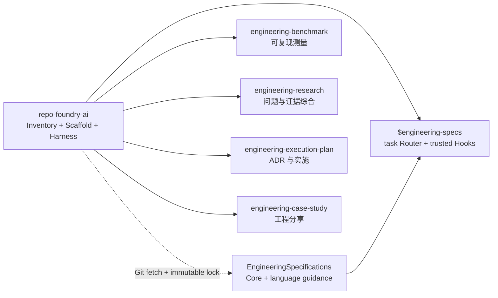

# RepoFoundry AI

把普通代码仓库锻造成 AI Agent 可导航、规范可组合、证据可追溯、交付可验证的
工程系统。RepoFoundry AI 的根 Skill 负责 Inventory、Scaffold、Repository
Harness、Spec 解析和能力路由；专业制品生命周期仍由四个独立 Skill 持有。



## 初始化项目

使用确定性脚本。把 `<repo-foundry-ai-dir>` 解析为本 Skill 所在目录：

```bash
python3 <repo-foundry-ai-dir>/scripts/foundryctl.py --repo . \
  bootstrap --profile codex

python3 <repo-foundry-ai-dir>/scripts/foundryctl.py --repo . \
  bootstrap --profile codex --spec languages/go --apply

python3 <repo-foundry-ai-dir>/scripts/foundryctl.py --repo . \
  validate --harness

python3 <repo-foundry-ai-dir>/scripts/foundryctl.py --repo . \
  upgrade --to 0.1.0

python3 <repo-foundry-ai-dir>/scripts/foundryctl.py --repo . \
  spec validate
```

执行顺序：

1. 默认先 dry-run，检查 `create`、`preserve`、`register` 和 `conflict`。
2. 有 conflict 时停止，不进行部分写入。
3. 用户要求实际初始化时使用 `--apply`；只补缺失路径。
4. 组合 `engineering-execution-plan` 的 `epctl init`，不要复制其制品逻辑。
5. 完成后运行 Harness 验证；详细契约见
   [bootstrap.md](references/bootstrap.md)。

Codex profile 创建短 `AGENTS.md`、`ARCHITECTURE.md`、文档索引、质量、可靠性、
安全、Design Doc 入口、本地 Engineering Specs、一个项目级 `$engineering-specs`
Router Skill 与 `.codex/hooks.json`。Core Spec 必选；仓库证据只推荐可选 Spec，
用户通过可重复 `--spec <id>` 显式选择安装。选择写入
`docs/.engineering/specs.json`，精确版本与 SHA-256 写入
`specs.lock.json`；lock 同时记录解析后的完整 Git commit。Codex 从
Router 按计划路径、任务意图和 `docs/agent-guides/managed/index.md` 激活规范。
项目规则通过 manifest 引用，工具不改写其内容。未知项目事实保留
`BOOTSTRAP_TODO`，不得编造命令、Owner、架构、SLO 或安全控制。

所有注册的 Agent instruction 文件按物理行计数。根 `AGENTS.md` 必须不超过
100 行；模板目标不超过 80 行，为项目维护保留余量。Harness 契约写入
`docs/.engineering/harness.json`，EP 状态继续写入 `docs/.epctl/`。

## 升级 Harness

先读取 `VERSION`，再检查目标仓库的 `docs/.engineering/harness.json`。RepoFoundry
产品版本、Harness schema、profile 版本和 Engineering Specs Catalog 版本是四条
独立版本线；不要用 `spec update` 代替 Harness migration，也不要在 bootstrap 中
静默迁移。

```bash
python3 <repo-foundry-ai-dir>/scripts/foundryctl.py --repo . \
  upgrade --to 0.1.0
python3 <repo-foundry-ai-dir>/scripts/foundryctl.py --repo . \
  upgrade --to 0.1.0 --apply
```

必须先展示 dry-run 结果。只有用户已要求实施升级且计划无 conflict 时才使用
`--apply`。versioned seed 只有在实际 SHA-256 等于 manifest 记录的
`installed_sha256` 时才可自动替换；修改过的 versioned seed 必须停止并要求人工
合并。`legacy-unversioned` seed 保持原字节，除非它已经与当前模板完全一致。apply
后必须报告更新路径和验证结果；验证失败由 CLI 回滚。详细兼容矩阵见
[Bootstrap 契约](references/bootstrap.md#版本与-harness-升级)。

## 管理 Engineering Specs

所有写操作默认只预览：

```bash
python3 <repo-foundry-ai-dir>/scripts/foundryctl.py --repo . spec plan
python3 <repo-foundry-ai-dir>/scripts/foundryctl.py --repo . \
  bootstrap --profile codex --spec languages/go --apply
python3 <repo-foundry-ai-dir>/scripts/foundryctl.py --repo . spec sync --apply
python3 <repo-foundry-ai-dir>/scripts/foundryctl.py --repo . \
  spec update --spec-version 1.2.0 --spec languages/go --apply
python3 <repo-foundry-ai-dir>/scripts/foundryctl.py --repo . spec validate
```

默认 Catalog 来自
`https://github.com/XiaoWeiKIN/EngineeringSpecifications.git`，默认固定版本为
`1.2.0`。`--spec-version MAJOR.MINOR.PATCH` 规范化为
`refs/tags/vMAJOR.MINOR.PATCH`，解析器必须验证 tag 与 `catalog_version` 一致。
首次初始化可用 `--spec-repository` 选择其他仓库；`--spec-ref` 只用于显式开发
分支、tag 或 commit。manifest 保存 Git URL/ref。`sync` 使用已有 lock 的 commit；
生产升级通过 `update --spec-version ...` 替换 source 并刷新已选内容，不会因检测
结果改变选择；`update --spec ...` 预览并替换完整可选集合，`--required-only` 回到
仅必选集合。依赖闭包自动补齐。`spec validate` 完全离线。Bootstrap
不替换漂移的托管文件；显式 `spec sync/update --apply` 才能在预览后恢复
`docs/agent-guides/managed/`。

## 激活任务规范

Bootstrap 只生成一个 Router Skill，不为每份 Spec 创建 Skill。实现或评审前调用
`$engineering-specs`：先列出计划路径的候选，再读取每个候选的 Applicability，
记录本 Turn 的适用 ID 或带理由的 `none`。激活会自动加入 `requires` 闭包；首次
写入前，受信任 Hook 注入摘要已验证的本地全文，并要求 Agent 重新评估后重试。

`UserPromptSubmit` 建立 Git 基线，`SubagentStart` 传递同一契约，`PreToolUse`
阻断未激活的 Bash/`apply_patch` 写入，`Stop` 审计实际变更路径与五字段交接。
项目 Hooks 只有在仓库受信任且用户通过 Codex `/hooks` 审查精确命令后才生效；
Hook 不可用时仍必须手动遵循 Router Skill 并运行其 `audit` 命令。

## 路由专业工作

| 请求 | 使用 Skill |
|---|---|
| 预声明并执行性能、容量或回归测量；为一个 EP 建立多个独立测量门禁 | `engineering-benchmark`，再由 `engineering-execution-plan` 声明 Gate Set |
| 搜集证据、解释矛盾、维护多文档 Research | `engineering-research` |
| ADR、ExecPlan、Task、Checkpoint、Bugfix | `engineering-execution-plan` |
| 基于真实代码和过程证据撰写工程分享 | `engineering-case-study` |

一次请求可以按证据流依次经过多个 Skill，但不要让聚合 Skill 伪造其输出。专业
Skill 必须保持可独立安装和运行；只有 `repo-foundry-ai` 可以显式组合仓库内
的子 Skill。

需要向用户展示独立入口、跨 Skill 交接或完整工作流时，读取
[Prompt 示例集](examples/README.zh-CN.md)。从用户 Prompt 开始说明，不把
`foundryctl`、`benchctl`、`researchctl` 或 `epctl` 命令当作端到端入口。

## 边界

- 不在本 Skill 接受或拒绝 ADR。
- 不在本 Skill 创建 Research、Benchmark Run、ExecPlan 或 Case Study。
- 不覆盖、搬迁或重写已有项目文档。
- 不把规范正文内置到 RepoFoundry；不执行远程仓库内容。
- 不接收、记录或管理 Git 凭据；只使用用户已有的 credential helper / SSH agent。
- 不把项目自定义 Spec 复制进托管目录或改写其内容。
- 不把每份 Spec 包装成独立 Skill；Agent 适配只由一个项目级 Router 持有。
- 不把未受信任或被禁用的项目 Hook 描述成机械强制保证。
- 不把某个 Agent、代码托管平台或本机安装路径写入文件契约。
- 不把 Harness manifest 放进 `.epctl`；项目级状态与 EP 状态分开持有。
