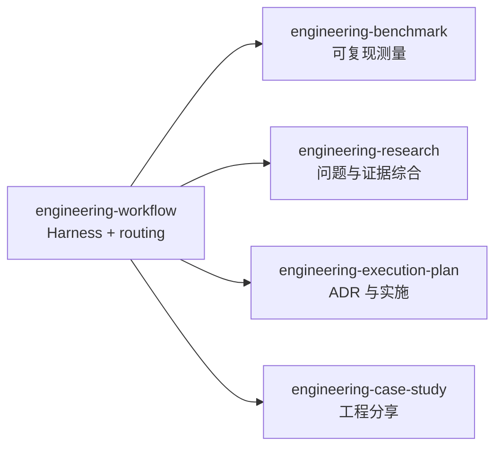

# Engineering Workflow

把仓库级 Harness 与四个专业工程 Skill 连接起来。根 Skill 只负责项目初始化、
统一入口和工作路由，不接管专业制品的生命周期。



## 初始化项目

使用确定性脚本。把 `<workflow-dir>` 解析为本 Skill 所在目录：

```bash
python3 <workflow-dir>/scripts/engineeringctl.py --repo . \
  bootstrap --profile codex

python3 <workflow-dir>/scripts/engineeringctl.py --repo . \
  bootstrap --profile codex --apply

python3 <workflow-dir>/scripts/engineeringctl.py --repo . \
  validate --harness
```

执行顺序：

1. 默认先 dry-run，检查 `create`、`preserve`、`register` 和 `conflict`。
2. 有 conflict 时停止，不进行部分写入。
3. 用户要求实际初始化时使用 `--apply`；只补缺失路径。
4. 组合 `engineering-execution-plan` 的 `epctl init`，不要复制其制品逻辑。
5. 完成后运行 Harness 验证；详细契约见
   [bootstrap.md](references/bootstrap.md)。

Codex profile 创建短 `AGENTS.md`、`ARCHITECTURE.md`、文档索引、质量、可靠性、
安全和 Design Doc 入口。未知项目事实保留 `BOOTSTRAP_TODO`，不得编造命令、
Owner、架构、SLO 或安全控制。

所有注册的 Agent instruction 文件按物理行计数。根 `AGENTS.md` 必须不超过
100 行；模板目标不超过 80 行，为项目维护保留余量。Harness 契约写入
`docs/.engineering/harness.json`，EP 状态继续写入 `docs/.epctl/`。

## 路由专业工作

| 请求 | 使用 Skill |
|---|---|
| 预声明并执行性能、容量或回归测量；为一个 EP 建立多个独立测量门禁 | `engineering-benchmark`，再由 `engineering-execution-plan` 声明 Gate Set |
| 搜集证据、解释矛盾、维护多文档 Research | `engineering-research` |
| ADR、ExecPlan、Task、Checkpoint、Bugfix | `engineering-execution-plan` |
| 基于真实代码和过程证据撰写工程分享 | `engineering-case-study` |

一次请求可以按证据流依次经过多个 Skill，但不要让聚合 Skill 伪造其输出。专业
Skill 必须保持可独立安装和运行；只有 `engineering-workflow` 可以显式组合仓库内
的子 Skill。

## 边界

- 不在本 Skill 接受或拒绝 ADR。
- 不在本 Skill 创建 Research、Benchmark Run、ExecPlan 或 Case Study。
- 不覆盖、搬迁或重写已有项目文档。
- 不把某个 Agent、代码托管平台或本机安装路径写入文件契约。
- 不把 Harness manifest 放进 `.epctl`；项目级状态与 EP 状态分开持有。
