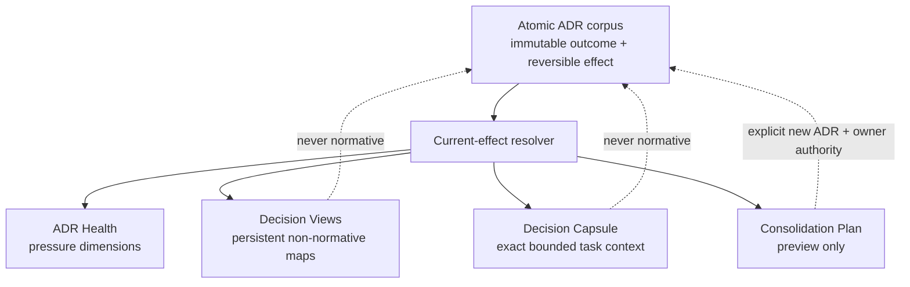
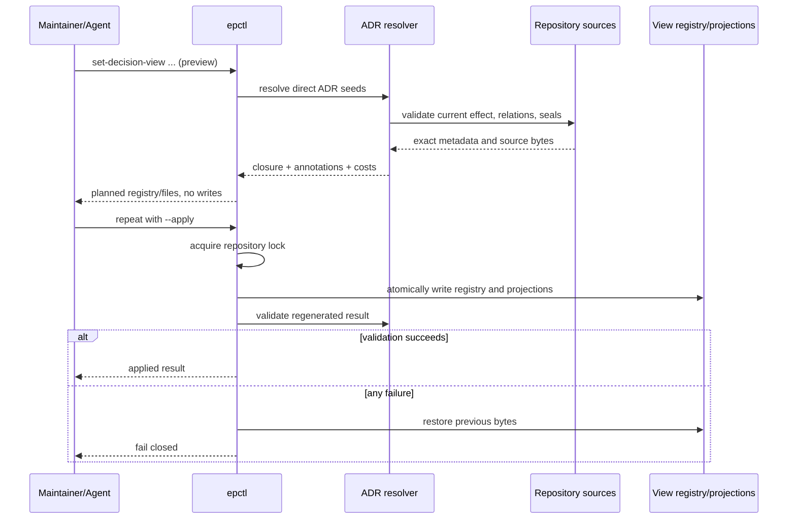

# Lossless ADR context compaction

This document is the entrypoint for `DD-012`. The logical Design and all
managed package members share one review and approval boundary.

## Design Summary

RepoFoundry will treat ADR compression as a retrieval projection, not as history
deletion or semantic rewriting. Atomic ADR files remain the normative and auditable
source. A new deterministic resolver will derive the recursively current decision
set, current amendment annotations, stable provenance, and exact structured
constraint rows. Three consumers sit above that resolver:

1. `adr-health` reports corpus pressure as separate, explainable dimensions;
2. persistent Decision Views group current ADRs into named working contexts; and
3. `decision-capsule` compiles an exact, digest-verifiable task context under an
   explicit byte budget.

`adr-consolidation-plan` remains preview-only. It identifies amendment chains,
legacy contracts, proposed overlap, and active ExecPlan impact, but it never merges,
retires, supersedes, accepts, or rewrites an ADR. Semantic consolidation still
requires a new atomic ADR and explicit Decision Owner authority.

The design is valid while RepoFoundry ADRs have stable IDs and lifecycle metadata,
strict ADRs expose stable `Decision Statement` and `Normative Constraints` sections,
and linked legacy ADRs can be treated conservatively as whole-document context.

## Goals and Non-goals

Goals:

- make a corpus with dozens of ADRs navigable without weakening historical audit;
- separate corpus health, reusable domain navigation, and task-specific context;
- resolve current effect from accepted ADR relationships instead of trusting a
  manually maintained summary;
- keep selected normative bytes exact and attributable to repository sources;
- fail closed when a capsule exceeds its reviewed context budget;
- make every persistent change preview-first, deterministic, and idempotent; and
- give maintainers evidence for later semantic consolidation without performing it.

Non-goals:

- deleting, archiving, retiring, superseding, accepting, or rejecting ADRs based on
  age, count, size, graph position, or an LLM recommendation;
- treating a Decision View or capsule as a new normative decision;
- inventing a universal numeric architecture quality score;
- summarizing or truncating normative text to fit a model context window;
- inferring a safe partial extract from a linked legacy ADR that lacks structured
  normative sections; or
- replacing Architecture Input Sets, Compliance Matrices, ADR seals, or explicit
  decision authority in ExecPlans.

## Research and Decision Inputs

### Supported Findings and Confidence

The DataFox corpus observed on 2026-08-31 contains 51 ADRs and 10,228 lines. Its
current projection contains 46 effective ADRs, 18 partially amended decisions, 86
typed relationship edges, 279 structured current constraint rows, and a largest
weakly connected component of 38 ADRs. One active ExecPlan references 28 ADRs and
225 constraints. These measurements establish high confidence that flat file count
and the current `DECISIONS.md` table are no longer sufficient task entrypoints.

The existing Engineering Specifications Router already demonstrates the relevant
safety pattern: select stable IDs, resolve an exact closure, read local verified
source bytes, compile a bounded context capsule, and fail rather than summarize or
truncate on overflow. Confidence is high that the same separation applies to ADR
retrieval, while ADR current-effect relationships require an ADR-specific resolver.

ADR-016 already separates immutable decision outcome from reversible current
effect. Therefore compaction can be built as a projection above that effect model
without changing or weakening the accepted lifecycle.

### Negative Evidence and Rejected Hypotheses

The DataFox corpus rejects several tempting shortcuts:

- retiring by age or count would hide current decisions and confuse lifecycle with
  retrieval cost;
- one mega ADR would destroy atomic acceptance, amendment, supersession, and stable
  constraint references;
- an LLM summary cannot prove semantic equivalence and would silently create a
  second, unauthorised source of architectural truth;
- using graph centrality as an automatic consolidation decision would confuse
  structural coupling with common decision ownership; and
- extracting selected paragraphs from legacy ADRs is unsafe because those documents
  do not expose a machine-verifiable normative boundary.

The design therefore allows generated navigation and exact extraction, while
keeping semantic consolidation as an explicit later decision.

### Remaining Unknowns and Validity Conditions

Domain membership is a human architectural classification. RepoFoundry will store
explicit Decision View seed ADRs and resolve their current closure; it will not infer
domain names from embeddings or filenames. A future evidence-backed classifier may
propose view membership, but automatic application is outside this revision.

The first revision will use a 32 KiB default capsule budget, matching the existing
Specifications capsule. The value is an operational default, not a semantic limit;
a caller may raise it only with an explicit reviewed reason. Production evidence
that exact constraint capsules routinely exceed the budget after task partitioning
would trigger a budget or representation review.

Legacy ADRs remain readable but are whole-document-only in capsules. Evidence that
a repository has a stable, mechanically identifiable legacy decision section may
justify an explicit migration adapter later; this design does not guess one.

### ADR Constraints

- ADR-014 C-001 and C-004 require stable identity, lifecycle visibility, and
  repository-backed provenance for governed artifacts. Decision Views are explicitly
  non-normative projections, but their registry and generated paths still use stable
  slugs, deterministic source references, and validation.
- ADR-016 C-001 through C-008 require outcome history to remain immutable, current
  effect to be derived from lifecycle and typed relations, historical decisions to
  stay discoverable, and lifecycle transitions to retain explicit authority. The
  resolver consumes these rules; none of the new commands may mutate ADR lifecycle.
- A new ADR is required before release because persistent view configuration, exact
  capsule semantics, and preview-only consolidation form a public long-lived CLI and
  repository contract. Until that ADR is accepted, this Design remains draft and
  implementation cannot be merged or released.

## System Context and Invariants



Invariants:

- an ADR path, decision payload, stable constraint ID, and decision authority remain
  owned by the ADR lifecycle;
- a view contains current accepted ADRs only and stores direct seeds separately from
  the derived closure;
- dependency and amendment closure is resolved from repository bytes on every
  render, so a view cannot freeze stale current-effect claims;
- original constraint rows targeted by current amendments remain visible and are
  annotated; they are not silently discarded as if every amendment were total;
- proposed, review-required, retired, rejected, and superseded ADRs never enter a
  current capsule through default resolution;
- generated source excerpts are exact UTF-8 substrings or whole documents, and every
  source carries a digest; and
- health or preview output cannot call lifecycle mutation commands.

## Proposed Architecture

`epctl.py` gains five bounded components:

1. **Decision registry** — `docs/.epctl/decision-views.json`, schema version 1,
   stores `{id, title, adr_refs}` for each stable kebab-case view. It is the only
   persistent source owned by the view feature.
2. **Current-effect resolver** — validates requested current ADRs, expands
   `depends_on` and `amends`, recursively adds current scoped amendments, and returns
   ordered source metadata, relationship annotations, and structured constraints.
3. **View renderer** — writes deterministic generated documents under
   `docs/decision-views/` and a rebuildable `docs/DECISION-VIEWS.md` entrypoint. A
   view contains exact Decision Statements for strict ADRs, constraint identities,
   current amendment annotations, and links to source documents.
4. **Capsule compiler** — accepts a view or explicit ADR selection and optional exact
   constraint IDs. It emits exact Decision Statement/constraint bytes for strict
   ADRs and whole source bytes for selected legacy ADRs, together with source and
   capsule digests. Overflow is an error with per-source byte costs.
5. **Health and consolidation analyzers** — read the same resolver model and active
   ExecPlans. Health exposes independent counts and graph pressure. Consolidation
   output is a read-only impact preview.

The dependency direction is parser -> resolver -> renderers/analyzers. Renderers do
not introduce another lifecycle model, and the ADR transition code does not depend
on views.

## Interfaces and Contracts

Public CLI contracts:

```text
epctl adr-health [--json]
epctl set-decision-view VIEW --title TITLE --adr ADR-NNN [--adr ...] [--apply]
epctl remove-decision-view VIEW [--apply]
epctl decision-capsule (--view VIEW | --adr ADR-NNN [--adr ...])
    [--constraint ADR-NNN#C-NNN ...] [--budget-bytes N]
    [--budget-reason TEXT] [--json]
epctl adr-consolidation-plan (--view VIEW | --adr ADR-NNN [--adr ...]) [--json]
```

`set-decision-view` and `remove-decision-view` are preview-first. Preview returns the
exact registry and generated-file delta but writes nothing. `--apply` executes under
the existing repository lock and rolls back registry/index/view bytes if rendering
or validation fails. Repeating the same applied command is byte-stable.

`decision-capsule` is read-only. `--constraint` selects stable constraint rows from
the resolved view; source ADR Decision Statements and amendment annotations remain
present as interpretation frames. Without `--constraint`, all strict constraints in
the resolved context are included. A linked legacy ADR is included only as its whole
verified source document. The command rejects unknown, non-current, out-of-view, or
duplicate references.

Budgets below or equal to 32 KiB need no reason. A larger budget requires
`--budget-reason`; no budget permits truncation. JSON mode includes schema version,
direct/resolved ADR IDs, selected constraint IDs, source digests, capsule bytes,
capsule SHA-256, and the Markdown context.

`adr-health` and `adr-consolidation-plan` expose stable JSON schema version 1 and a
human-readable table. Health has no opaque aggregate score. Consolidation output
always declares `preview_only: true`.

## Data Model and State Ownership

`decision-views.json` uses this shape:

```json
{
  "version": 1,
  "views": [
    {
      "id": "oql-compiler",
      "title": "OQL compiler decisions",
      "adr_refs": ["ADR-049", "ADR-056", "ADR-057"]
    }
  ]
}
```

View identity is a stable kebab-case slug. View records have no accepted/rejected
lifecycle because they are navigation configuration, not decisions. Updating a view
replaces its title and direct seeds atomically; deleting a view requires the explicit
preview/apply remove command. The renderer owns `docs/decision-views/<id>.md` and the
managed region in `docs/DECISION-VIEWS.md`.

ADR documents, their seals, and `.epctl/adr-revisions` remain untouched. Digests in a
view or capsule are derived from current repository bytes. No secrets, network
content, model output, or user data are persisted by this feature.

## Control and Data Flows



Capsule compilation follows the read half only. Concurrent writers serialize through
the existing `.epctl/lock`; read-only commands use complete local files and fail on
invalid intermediate state instead of returning a partially trusted capsule.

## Failure Semantics and Recovery

The resolver fails closed for duplicate IDs, unknown ADRs, invalid seals, non-current
seeds, relationship cycles, missing amendment targets, invalid constraint rows,
symlink escapes, non-UTF-8 data, and unsupported registry schema. Capsule compilation
fails with an actionable cost breakdown when bytes exceed budget.

Preview commands never create `docs/.epctl`, indexes, directories, or lock files.
Apply takes snapshots of every managed target before writing. A failure restores
existing files and removes only newly created generated targets. `reindex` rebuilds
all registered views from source bytes; `validate` reports registry or projection
drift and may use `--fix-index` for generated projections only. Neither command
changes ADR documents or lifecycle.

## Compatibility, Migration, and Rollout

The feature is additive. Existing `.epctl/config.json`, ADR schemas, `DECISIONS.md`,
and Harness manifests remain readable. `epctl init` and an explicit RepoFoundry
Harness upgrade create an empty schema-1 view registry, `docs/decision-views/`, and
`docs/DECISION-VIEWS.md` without creating any domain view.

Distribution version 0.8.0 will carry the new component. A project first previews
`repofoundry upgrade --to 0.8.0`, applies it, then uses `set-decision-view` to organize
its corpus. Downgrading to 0.7.1 leaves the additive view files intact; the older tool
ignores them. Removing a view is reversible while ADR sources remain present.

No migration automatically retires or consolidates ADRs. Any later consolidation is
a separate proposed ADR, explicit owner decision, implementation/migration, and
supersession or retirement operation.

## Security, Privacy, and Operations

All inputs are repository-local. Existing path normalization, symlink rejection,
repository locking, atomic writes, and strict UTF-8 parsing apply. The capsule is
Markdown data, never executable instructions; consumers must treat source text as
architecture context rather than shell input.

Operational visibility comes from `adr-health --json`, which reports corpus counts,
contract mix, relation edges, connected-component sizes, structured constraints,
amendment pressure, active-plan load, view coverage, and estimated capsule bytes.
Signals identify the exceeded dimension and threshold; they do not mutate state or
page an operator. The repository owner owns view taxonomy and any decision to begin
semantic consolidation.

## Verification Strategy

Unit and integration tests will prove:

- view preview is side-effect free and apply is idempotent;
- current dependency/amendment closure and annotations are deterministic;
- proposed, under-review, retired, rejected, and superseded ADRs are rejected as
  direct current view inputs;
- strict excerpts are exact source substrings and sealed source drift fails;
- selected constraint filtering rejects out-of-view or unknown IDs;
- linked legacy ADRs use whole-document mode and participate in byte budgets;
- default overflow and unjustified raised budgets fail with cost details;
- registry/schema/path/symlink errors fail closed and partial writes roll back;
- reindex is byte-stable and validation detects generated drift;
- health metrics and consolidation impact match fixture graphs and active plans;
- consolidation commands never change ADR or ExecPlan bytes; and
- Harness bootstrap/upgrade creates the additive files while preserving customized
  existing project content.

Final verification runs `python3 -B scripts/check.py`, direct CLI smoke tests against
a fixture corpus, RepoFoundry self-validation, installation from the release source,
and a real DataFox preview/apply/validate sequence.

## Alternatives, Open Questions, and Revisit Triggers

Rejected alternatives are deletion/retirement by pressure, generated prose
summaries, a consolidated mega ADR, and automatic semantic clustering. All either
lose authority boundaries or create an unreviewable second source of truth.

Open follow-ups, none of which block revision 1:

- a future view membership recommender may produce preview-only suggestions;
- a future task router may activate a view from planned paths after the project has
  an explicit path-to-view mapping contract; and
- a future legacy migration may convert selected documents to strict ADRs so their
  capsules no longer require whole-document fallback.

Revisit this design if view configuration itself needs approval workflow, if exact
capsules routinely exceed reviewed budgets after task partitioning, if typed
amendments gain an explicit replace/extend semantic, or if repositories need views
spanning multiple independent ADR authorities.

## Package Document Map

Single-file layout; every required concern is covered in this entrypoint.

## Revision Notes

- 2026-08-31 — Created working revision 1.
