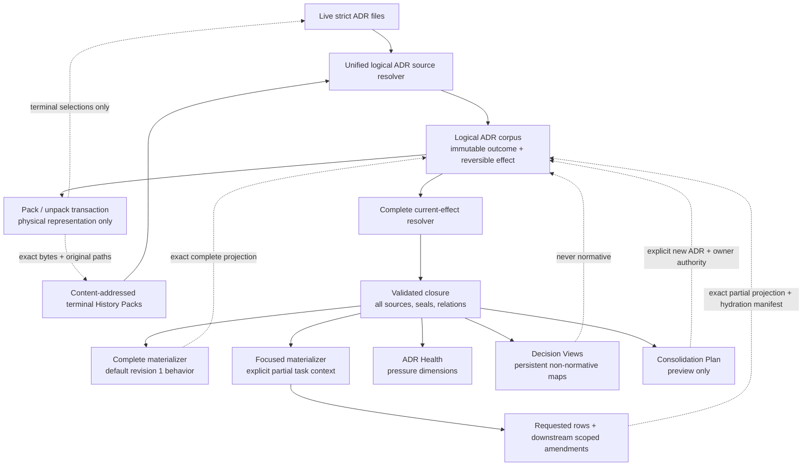

# Lossless ADR context compaction

This document is the entrypoint for `DD-012`. The logical Design and all
managed package members share one review and approval boundary.

## Design Summary

RepoFoundry separates ADR compression into two independent mechanisms. **Context
compaction** is a retrieval projection and never changes stored decisions. **History
packing** is an explicitly authorized physical representation change for terminal
ADRs: it replaces several independent Markdown files with one content-addressed
pack only after the complete logical corpus validates from the packed bytes. The
logical ADR record, exact original UTF-8 bytes, original repository-relative path,
stable IDs, seals, relations, and decision authority remain normative and auditable.
A deterministic source resolver reads live Markdown and packed history as one ADR
corpus, then derives the recursively current decision set, current amendment
annotations, stable provenance, and exact structured constraint rows. Four
consumers sit above that resolver:

1. `adr-health` reports corpus pressure as separate, explainable dimensions;
2. persistent Decision Views group current ADRs into named working contexts; and
3. `decision-capsule` compiles an exact, digest-verifiable task context under an
   explicit byte budget; and
4. `pack-historical-adrs` and `unpack-adr-history-pack` change only the physical
   representation of explicitly selected terminal ADRs through preview-first,
   reversible transactions.

Revision 2 separates **closure validation** from **context materialization**.
`complete` materialization remains the default and preserves the revision 1 output.
An explicitly requested `focused` materialization first validates the same complete
current-effect closure, then emits only requested structured constraints and the
complete constraint sets of current amendments that directly or recursively target
those rows. It never walks backward from a materialized amendment to all unrelated
historical targets. The capsule declares itself partial, records why focus was
chosen, lists omitted-but-validated ADRs, and provides a digest of the complete
validated closure so an Agent can hydrate more context when task scope expands.

`adr-consolidation-plan` remains preview-only. It identifies amendment chains,
legacy contracts, proposed overlap, and active ExecPlan impact, but it never merges,
retires, supersedes, accepts, or rewrites an ADR. Semantic consolidation still
requires a new atomic ADR and explicit Decision Owner authority.

Revision 3 adds lossless terminal ADR History Packs. A pack is one deterministic
JSON file under `docs/.epctl/adr-packs/`; every entry embeds the exact original file
bytes together with the original path and independent document and sealed-payload
digests. Packing does not merge decisions, alter lifecycle, change current effect,
renumber constraints, or reduce the logical ADR count. It reduces physical source
document count only. Unpacking restores the exact original paths and bytes and is
the required preparation before downgrading to a RepoFoundry version that does not
understand packs.

The design is valid while RepoFoundry ADRs have stable IDs and lifecycle metadata,
strict ADRs expose stable `Decision Statement` and `Normative Constraints` sections,
and focused retrieval is treated as a task aid rather than evidence of complete
architecture compliance. Linked legacy ADRs remain conservative whole-document
inputs to complete capsules and cannot be guessed into a structured focus boundary.
History packing is valid only for strict RepoFoundry ADRs stored beneath
`docs/adr/`, with a terminal status and an exact, independently validated source
record. Registered legacy roots and symlinked sources are not packable.

## Goals and Non-goals

Goals:

- make a corpus with dozens of ADRs navigable without weakening historical audit;
- separate corpus health, reusable domain navigation, and task-specific context;
- resolve current effect from accepted ADR relationships instead of trusting a
  manually maintained summary;
- keep selected normative bytes exact and attributable to repository sources;
- let a caller materialize a small exact constraint focus without skipping
  validation of the complete current-effect closure;
- make complete versus focused context explicit and machine-readable;
- fail closed when a capsule exceeds its reviewed context budget;
- make every persistent change preview-first, deterministic, and idempotent;
- give maintainers evidence for later semantic consolidation without performing it;
- reduce the physical document count for explicitly selected terminal ADR history
  without reducing the logical ADR corpus or weakening historical resolution;
- preserve exact original bytes and paths so a pack can be verified offline and
  unpacked without reconstruction; and
- make deletion conditional on successful post-pack repository validation, with
  atomic rollback on every failure.

Non-goals:

- automatically packing, deleting, archiving, retiring, superseding, accepting, or
  rejecting ADRs based on age, count, size, graph position, or an LLM
  recommendation;
- packing proposed, under-review, accepted/current, linked-legacy, malformed, or
  symlinked ADR sources;
- treating physical packing as semantic consolidation or claiming that it reduces
  the number of logical decisions;
- treating a Decision View or capsule as a new normative decision;
- inventing a universal numeric architecture quality score;
- summarizing or truncating normative text to fit a model context window;
- automatically switching from complete to focused context after an overflow;
- claiming that a focused capsule proves compliance with omitted decisions;
- inferring a safe partial extract from a linked legacy ADR that lacks structured
  normative sections; or
- replacing Architecture Input Sets, Compliance Matrices, ADR seals, or explicit
  decision authority in ExecPlans.

## Research and Decision Inputs

### Supported Findings and Confidence

The DataFox corpus observed on 2026-08-31 contains 51 ADRs and 10,228 lines. Its
current projection contains 46 effective ADRs, 18 partially amended decisions, 86
typed relationship edges, 279 structured current constraint rows, and a largest
weakly connected component of 38 ADRs. One active ExecPlan references 28 ADRs and
225 constraints. These measurements establish high confidence that flat file count
and the current `DECISIONS.md` table are no longer sufficient task entrypoints.

The existing Engineering Specifications Router already demonstrates the relevant
safety pattern: select stable IDs, resolve an exact closure, read local verified
source bytes, compile a bounded context capsule, and fail rather than summarize or
truncate on overflow. Confidence is high that the same separation applies to ADR
retrieval, while ADR current-effect relationships require an ADR-specific resolver.

ADR-016 already separates immutable decision outcome from reversible current
effect. Therefore compaction can be built as a projection above that effect model
without changing or weakening the accepted lifecycle.

The follow-up DataFox measurement on 2026-09-02 exercises the revision 1 mechanism
against seven Decision Views covering all 47 current ADRs. The
`span-query-oql-lineage` view resolves 29 current ADRs. Its complete capsule is
144,285 bytes; selecting only `ADR-049#C-001` or `ADR-049#C-003` still produces a
112,668-byte capsule because the current selector expands backward through every
target named by a materialized amendment and keeps every resolved Decision
Statement.

A read-only design probe retained validation of all 29 source ADRs but applied the
revision 2 one-way materialization boundary. Four representative task focuses
materialized one or two ADRs and produced exact prototype contexts of 1,764 bytes
(`ADR-049#C-001`), 6,236 bytes (`ADR-049#C-003`), 6,456 bytes
(`ADR-049#C-009`), and 6,141 bytes (`ADR-049#C-010` plus `C-011`). These are
high-confidence feasibility measurements, not released implementation evidence;
the final format will add a compact closure manifest and must be remeasured by the
ExecPlan.

After the accepted DataFox lifecycle changes through 2026-09-03, the corpus still
contains 51 logical ADRs but only 45 are effective; six are historical or awaiting
a terminal transition. This confirms that context projection alone does not reduce
filesystem pressure. Once ADR-055 has validly superseded ADR-051 through ADR-054,
the four original source documents can be represented by one History Pack, a net
reduction of three physical files while retaining all four logical ADRs and their
exact source bytes. History packing cannot by itself materially reduce the 45
effective decisions; that still requires separate, owner-approved semantic
consolidation by domain.

### Negative Evidence and Rejected Hypotheses

The DataFox corpus rejects several tempting shortcuts:

- retiring by age or count would hide current decisions and confuse lifecycle with
  retrieval cost;
- one mega ADR would destroy atomic acceptance, amendment, supersession, and stable
  constraint references;
- an LLM summary cannot prove semantic equivalence and would silently create a
  second, unauthorised source of architectural truth;
- using graph centrality as an automatic consolidation decision would confuse
  structural coupling with common decision ownership; and
- extracting selected paragraphs from legacy ADRs is unsafe because those documents
  do not expose a machine-verifiable normative boundary.
- compressing terminal ADRs into generated prose would lose exact bytes, seals, and
  proof that historical references still resolve;
- deleting source files before validating the packed corpus creates an
  unrecoverable partial state; and
- a pack manifest beside a separate payload file saves fewer physical documents and
  introduces a second atomicity boundary without adding audit value;
- splitting the OQL corpus into more views or choosing a single ADR seed does not
  bound context when every seed resolves the same amendment component; and
- filtering constraint rows only after bidirectional amendment expansion cannot
  solve the pressure because one requested row expands to 20 constraint-owning ADRs.

The design therefore allows generated navigation and exact extraction, while
keeping semantic consolidation as an explicit later decision.

### Remaining Unknowns and Validity Conditions

Domain membership is a human architectural classification. RepoFoundry will store
explicit Decision View seed ADRs and resolve their current closure; it will not infer
domain names from embeddings or filenames. A future evidence-backed classifier may
propose view membership, but automatic application is outside this revision.

The 32 KiB default capsule budget remains an operational default, not a semantic
limit; a caller may raise it only with an explicit reviewed reason. Focus is chosen
before byte accounting and never as an automatic reaction to overflow. The final
closure manifest adds bytes beyond the design probe, so DataFox integration must
prove the representative focused capsules remain under budget.

Legacy ADRs remain readable but are whole-document-only in capsules. Evidence that
a repository has a stable, mechanically identifiable legacy decision section may
justify an explicit migration adapter later; this design does not guess one.

ADR-level amendments without stable `amends_constraints` targets make row-level
focus unprovable. Focused materialization fails closed when such a current amendment
could affect a requested row. Complete materialization remains available, and a
future richer amendment mapping may reduce this limitation.

History packing is a persisted schema boundary. RepoFoundry 0.8.3 and older cannot
resolve a packed ADR after its original Markdown file is removed. Revision 3
therefore requires an exact-byte unpack command and treats successful unpacking as
the downgrade preparation path; it does not claim downgrade-readability for the
packed state itself.

### ADR Constraints

- ADR-014 C-001 and C-004 require stable identity, lifecycle visibility, and
  repository-backed provenance for governed artifacts. Decision Views are explicitly
  non-normative projections, but their registry and generated paths still use stable
  slugs, deterministic source references, and validation.
- ADR-016 C-001 through C-008 require outcome history to remain immutable, current
  effect to be derived from lifecycle and typed relations, historical decisions to
  stay discoverable, and lifecycle transitions to retain explicit authority. The
  resolver consumes these rules; none of the new commands may mutate ADR lifecycle.
- ADR-058 C-001 through C-009 authorize revision 1 lossless Decision Views, complete
  capsules, health, and preview-only consolidation. Its C-006 task-capsule contract
  currently materializes the resolved context as the interpretation frame.
- ADR-059 amends ADR-058 C-006 to authorize declared focused capsule
  materialization while retaining complete closure validation.
- Proposed ADR-060 must amend ADR-058 C-001, C-008, and C-009 before release because
  exact terminal history packing changes the durable promise that every source ADR
  remains an independent Markdown file and that compaction never deletes a source
  path. Until ADR-060 is accepted and this exact revision is approved, History Pack
  implementation cannot be merged or released.

## System Context and Invariants



Invariants:

- an ADR identity, original logical path, decision payload, stable constraint ID,
  and decision authority remain owned by the ADR lifecycle; a terminal ADR's bytes
  may be physically stored inside one verified History Pack;
- a packed entry is logically indistinguishable from its live source for
  validation, evidence resolution, relations, indexes, and historical consumers;
- a live source and packed entry may not claim the same ADR ID or original path;
- packing is allowed only for explicit strict ADRs in `retired`, `rejected`, or
  `superseded` state, and never changes lifecycle or current-effect projection;
- a view contains current accepted ADRs only and stores direct seeds separately from
  the derived closure;
- dependency and amendment closure is resolved from repository bytes on every
  render, so a view cannot freeze stale current-effect claims;
- complete materialization remains the default and stays byte-compatible with the
  revision 1 capsule for identical repository bytes and arguments;
- focused materialization is available only with explicit stable constraints and a
  non-empty focus reason; overflow never changes the materialization mode;
- a focused capsule validates every ADR in the complete closure but materializes
  only requested rows and complete constraint sets from downstream current scoped
  amendments; it lists every omitted-but-validated ADR and declares that the
  context is partial;
- focused amendment traversal follows target row -> current amender rows only. It
  never treats an amender's other historic targets as newly requested rows;
- original constraint rows targeted by current amendments remain visible when they
  are selected and are annotated; no mode silently replaces them as if every
  amendment were total;
- proposed, review-required, retired, rejected, and superseded ADRs never enter a
  current capsule through default resolution;
- generated source excerpts are exact UTF-8 substrings or whole documents, and every
  source carries a digest;
- a pack embeds the exact original UTF-8 bytes as Base64, uses normalized
  repository-relative paths, and is named by a canonical self-digest;
- originals are removed only inside an atomic apply after the candidate pack is
  verified and the complete repository validates from packed sources; any failure
  restores every original byte and prior generated index; and
- health or preview output cannot call lifecycle mutation commands.

## Proposed Architecture

`epctl.py` has seven bounded components. Revision 3 adds a physical storage adapter
and transaction boundary while keeping lifecycle ownership independent:

1. **Decision registry** — `docs/.epctl/decision-views.json`, schema version 1,
   stores `{id, title, adr_refs}` for each stable kebab-case view. It is the only
   persistent source owned by the view feature.
2. **ADR source resolver** — loads live strict and linked-legacy Markdown plus
   History Pack entries into one immutable logical source model. It rejects
   duplicate ADR IDs, duplicate logical paths, unsupported pack schemas, digest
   drift, path escapes, and malformed embedded UTF-8 before returning a source.
3. **Current-effect resolver** — validates requested current ADRs, expands
   `depends_on` and `amends`, recursively adds current scoped amendments, and returns
   ordered source metadata, relationship annotations, and structured constraints.
4. **View renderer** — writes deterministic generated documents under
   `docs/decision-views/` and a rebuildable `docs/DECISION-VIEWS.md` entrypoint. A
   view contains exact Decision Statements for strict ADRs, constraint identities,
   current amendment annotations, and links to source documents.
5. **Capsule compiler** — accepts a view or explicit ADR selection, optional exact
   constraint IDs, and a materialization mode. `complete` emits the revision 1 exact
   Decision Statement/constraint or whole-document bytes. `focused` keeps the full
   validated closure but materializes a directional constraint subgraph, a compact
   closure digest, omitted source IDs, and exact bytes only from participating strict
   ADRs. Overflow is an error with per-materialized-source byte costs.
6. **Health and consolidation analyzers** — read the same resolver model and active
   ExecPlans. Health exposes independent counts and graph pressure. Consolidation
   output is a read-only impact preview. Health reports logical ADR count, live ADR
   file count, pack count, packed entry count, and physical file reduction as
   distinct measures.
7. **History Pack transaction manager** — deterministically previews packing or
   unpacking, acquires the repository lock for apply, snapshots every affected
   source, pack, and generated index, validates the candidate logical corpus, and
   either commits the complete representation change or restores the snapshot.

The dependency direction is physical source adapters -> logical source resolver ->
complete resolver -> materialization policy -> renderer/analyzer. The focus policy consumes the validated resolver result; it
cannot bypass source validation, currentness, cycle checks, or seals. Renderers do
not introduce another lifecycle model, and ADR transition code does not depend on
views, capsules, or pack placement. Lifecycle mutation commands reject packed ADRs
with an instruction to unpack first, so they never rewrite embedded history in
place.

## Interfaces and Contracts

Public CLI contracts:

```text
epctl adr-health [--json]
epctl set-decision-view VIEW --title TITLE --adr ADR-NNN [--adr ...] [--apply]
epctl remove-decision-view VIEW [--apply]
epctl decision-capsule (--view VIEW | --adr ADR-NNN [--adr ...])
    [--constraint ADR-NNN#C-NNN ...] [--budget-bytes N]
    [--budget-reason TEXT]
    [--materialization complete|focused] [--focus-reason TEXT] [--json]
epctl adr-consolidation-plan (--view VIEW | --adr ADR-NNN [--adr ...]) [--json]
epctl pack-historical-adrs ADR-NNN [ADR-NNN ...]
    --packed-by ACTOR --reason REASON [--apply] [--json]
epctl unpack-adr-history-pack PACK-ID
    --unpacked-by ACTOR --reason REASON [--apply] [--json]
```

`set-decision-view` and `remove-decision-view` are preview-first. Preview returns the
exact registry and generated-file delta but writes nothing. `--apply` executes under
the existing repository lock and rolls back registry/index/view bytes if rendering
or validation fails. Repeating the same applied command is byte-stable.

`decision-capsule` is read-only. `--materialization complete` is the default and
retains revision 1 behavior: `--constraint` filters constraint rows only, every
resolved strict ADR Decision Statement remains an interpretation frame, and every
resolved legacy ADR is included as its exact whole document. Without
`--constraint`, all strict constraints in the resolved context are included. The
command rejects unknown, non-current, out-of-view, or duplicate references.

`--materialization focused` requires at least one `--constraint` and a non-empty
`--focus-reason`. It uses this deterministic algorithm:

1. resolve and validate the complete current-effect closure exactly as complete
   mode does;
2. initialize the selected row set with the explicitly requested constraints;
3. for each selected row, find every current accepted ADR whose
   `amends_constraints` explicitly contains that row, materialize that ADR's exact
   Decision Statement and complete structured constraint set, and enqueue those
   constraint rows for the same downstream lookup;
4. materialize each requested-row owner with its exact Decision Statement and only
   its selected rows; and
5. stop without following a participating ADR's other `amends_constraints` targets
   backward into unrelated historical rows.

The result is a directional current-effect focus, not a claim that omitted
dependencies or historical targets are irrelevant. If any current whole-ADR
amendment could affect a requested row but lacks stable scoped targets, focused mode
fails with `FOCUSED_CONTEXT_AMENDMENT_SCOPE_UNPROVABLE`. A caller must use complete
mode or migrate the amendment contract; the compiler never guesses.

Budgets below or equal to 32 KiB need no reason. A larger budget requires
`--budget-reason`; no budget permits truncation. Complete overflow never retries as
focused. JSON mode retains the revision 1 fields and, for focused mode, adds a
`focus` object with schema version 1, the reason, `context_completeness`, validated,
materialized and omitted ADR IDs, omitted relation references, and the complete
closure digest. `sources` and `source_costs` describe materialized bytes;
`validated_sources` records the digest metadata for the full closure.

`adr-health` and `adr-consolidation-plan` expose stable JSON schema version 1 and a
human-readable table. Health has no opaque aggregate score. Consolidation output
always declares `preview_only: true`.

`pack-historical-adrs` requires one or more explicit ADR IDs, `--packed-by`, and a
non-empty reason. It never selects candidates by age, status, directory, glob, graph
shape, or model inference. Preview performs the complete preflight and returns the
ordered eligible inputs, exact candidate pack path and digest, source paths that
would be removed, generated index deltas, and validation plan without writing a
directory, lock, pack, or index. Apply repeats the preflight under the repository
lock and must produce the same candidate digest before it may write.

An input is packable only when it is a live, regular, non-symlink strict ADR beneath
the canonical `docs/adr/` root; has status `rejected`, `retired`, or `superseded`;
passes current schema, relation, seal, and evidence validation; and is absent from
all existing packs. Accepted, proposed, under-review, review-required, linked
legacy, packed, duplicate, non-UTF-8, unsealed terminal, or path-escaping inputs
fail the entire operation. Packing one ADR is valid but reports zero physical file
reduction so callers can avoid a pointless operation.

Apply first validates an in-memory candidate corpus that excludes the selected live
paths and resolves those ADRs only from the candidate pack. Original files remain
untouched until that packed representation passes complete repository validation.
The command then writes the verified pack atomically, removes only the preflighted
originals, rebuilds generated ADR indexes through the unified resolver, and runs a
second complete validation against the materialized filesystem state. The operation
commits only if both validations succeed. A failure restores all original files
byte-for-byte, restores prior pack and index bytes, and removes only targets created
by the failed transaction.

`unpack-adr-history-pack` accepts the pack identity or exact repository-relative
pack path. Preview verifies the pack and reports restored paths, bytes, and index
deltas. Apply rejects any existing destination path, restores every entry at its
recorded path with exact decoded bytes, rebuilds indexes, validates the complete
repository from live sources, and then removes the pack in the same transaction.
It is all-or-nothing; selective unpacking is outside revision 3 because it would
create a second pack identity and complicate audit and rollback.

## Data Model and State Ownership

`decision-views.json` uses this shape:

```json
{
  "version": 1,
  "views": [
    {
      "id": "oql-compiler",
      "title": "OQL compiler decisions",
      "adr_refs": ["ADR-049", "ADR-056", "ADR-057"]
    }
  ]
}
```

A History Pack is a single canonical JSON document:

```json
{
  "artifact_type": "adr-history-pack",
  "schema_version": "1",
  "pack_sha256": "sha256 of this object with pack_sha256 set to an empty string",
  "packed_by": "Wangxiaowei1",
  "reason": "Superseded implementation decisions consolidated by ADR-055",
  "entries": [
    {
      "adr_id": "ADR-051",
      "title": "Original decision title",
      "status": "superseded",
      "original_path": "docs/adr/adr-051_original-decision.md",
      "document_sha256": "sha256 of decoded source bytes",
      "payload_sha256": "sealed ADR payload sha256",
      "source_base64": "exact original UTF-8 bytes encoded as Base64"
    }
  ]
}
```

Canonical JSON sorts object keys, uses compact separators, preserves Unicode, and
has no trailing newline. Entries are ordered by numeric ADR ID, then original path.
`pack_sha256` is calculated with that field set to the empty string; the file name
is `docs/.epctl/adr-packs/sha256-<pack_sha256>.json`. No wall-clock field participates
in identity, so identical input bytes, actor, and reason produce the same preview
and applied pack. Git records commit time. The actor and reason are provenance,
not lifecycle authority and do not alter any embedded ADR.

View identity is a stable kebab-case slug. View records have no accepted/rejected
lifecycle because they are navigation configuration, not decisions. Updating a view
replaces its title and direct seeds atomically; deleting a view requires the explicit
preview/apply remove command. The renderer owns `docs/decision-views/<id>.md` and the
managed region in `docs/DECISION-VIEWS.md`.

Live ADR decision payloads, seals, and `.epctl/adr-revisions` remain untouched.
Packing relocates exact terminal document bytes from independent Markdown files
into the pack's `source_base64`; unpacking reverses that relocation. Digests in a
view or capsule are derived from the decoded logical source bytes, not the pack
container. No secrets, network content, model output, or user data beyond the
explicit actor and reason are persisted by this feature.

The source resolver returns a logical record containing ADR ID, original path,
decoded text and bytes, parsed metadata, document digest, payload digest, physical
kind (`live`, `legacy`, or `packed`), and physical container path. Read-only
consumers use that record instead of assuming every ADR is a filesystem `Path`.
Mutation commands that require editing an ADR accept only `live` records.

Focused output owns no repository state. Its `validated_closure_sha256` is computed
over canonical UTF-8 JSON containing ordered direct and resolved ADR IDs plus each
validated source's ADR ID, repository-relative path, document SHA-256, and sealed
payload SHA-256. Canonical JSON sorts object keys, uses compact separators, preserves
Unicode, and has no trailing newline. This digest proves which complete validated
closure the partial materialization came from without copying every source body into
the Agent context.

The Markdown capsule includes a prominent `focused_partial` declaration, focus
reason, validated/materialized/omitted IDs, closure digest, selected rows, and exact
materialized source blocks. `unmaterialized_relation_refs` names dependency or
historic amendment targets reachable from participating ADRs but intentionally not
hydrated. An Agent must request additional constraints or complete materialization
when its task crosses one of those boundaries.

## Control and Data Flows

```mermaid
sequenceDiagram
    participant U as Agent
    participant E as epctl
    participant R as ADR resolver
    participant S as Repository sources
    participant M as Materializer

    U->>E: decision-capsule + selection + mode
    E->>R: resolve complete current-effect closure
    R->>S: read once; validate lifecycle, relations, seals
    S-->>R: exact bytes and digest metadata
    R-->>E: complete validated closure
    alt complete materialization
        E->>M: materialize revision 1 context
    else explicit focused materialization
        E->>M: directional row-to-amender traversal
        M->>M: build closure manifest and omitted boundary
    end
    M->>M: enforce budget without adaptive omission
    M-->>U: exact capsule + digests, or fail closed
```

Capsule compilation is read-only. Each source body and digest come from the same
in-memory bytes. Concurrent writers serialize through the existing `.epctl/lock` for
mutations; capsule reads fail on invalid intermediate state instead of returning a
partially trusted result. A retry recomputes the complete closure and may therefore
produce a new closure digest after a legitimate repository change.

History Pack apply uses a separate all-or-nothing representation flow:

```mermaid
sequenceDiagram
    participant U as Maintainer
    participant E as epctl
    participant F as Live ADR files
    participant P as History Pack
    participant V as Repository validator

    U->>E: pack-historical-adrs + explicit IDs + actor + reason
    E->>F: preflight exact bytes, lifecycle, seals, relations
    E->>E: build deterministic candidate and preview digest
    U->>E: repeat with --apply
    E->>E: acquire lock and repeat preflight
    E->>V: validate candidate overlay from packed bytes
    alt candidate validation succeeds
        E->>P: atomically write verified pack
        E->>F: remove only selected originals
        E->>V: validate materialized filesystem state
        alt materialized validation succeeds
            V-->>E: valid
            E-->>U: committed pack identity and net file reduction
        else materialized validation fails
            E->>F: restore exact original bytes
            E->>P: restore prior bytes or remove new pack
            E-->>U: rolled back with error
        end
    else candidate validation fails
        V-->>E: error
        E-->>U: originals unchanged; no pack materialized
    end
```

The validator remains offline and Git-independent. Git status and commit history may
be useful operator evidence, but they are neither required for normal resolution nor
a substitute for the pack's embedded bytes and digests.

## Failure Semantics and Recovery

The resolver fails closed for duplicate IDs, unknown ADRs, invalid seals, non-current
seeds, relationship cycles, missing amendment targets, invalid constraint rows,
symlink escapes, non-UTF-8 data, and unsupported registry schema. Capsule compilation
fails with an actionable cost breakdown when bytes exceed budget.

Pack loading additionally fails closed for an unsupported schema, filename/self-
digest mismatch, duplicate pack identity, duplicate entry ID or original path,
non-canonical entry ordering, invalid Base64, decoded document-digest mismatch,
frontmatter/manifest identity mismatch, payload-seal mismatch, absolute or
non-normalized paths, paths outside `docs/adr/`, embedded non-terminal status, or a
live source colliding with a packed record. These errors invalidate repository
validation; the resolver never silently prefers one representation.

Pack preview fails as one unit when any selected ADR is ineligible. Apply also fails
if repository state changed between preview and lock acquisition, the candidate
digest differs, a managed target cannot be snapshotted, an original cannot be
removed, generated indexes cannot be rebuilt, or either candidate-overlay or
post-change validation reports any error. Candidate-overlay failure leaves original
files untouched. Failure after materialization triggers mandatory rollback and
preserves the primary failure plus any rollback diagnostic. If rollback itself
cannot restore the exact snapshot, the command emits a distinct fatal recovery
error and leaves the lock discipline intact rather than claiming success.

Unpack fails on any destination conflict, digest drift, invalid pack, unsafe path,
write failure, or validation error. It never overwrites an existing file and never
removes the pack until every original has been restored and the live-source corpus
has passed validation. Re-running a successfully applied pack or unpack request is
reported as an explicit no-op only when the resulting representation and identity
are provably identical; ambiguity fails closed.

Focused materialization additionally fails for missing constraints, missing focus
reason, a requested legacy/whole-document boundary, any current broad amendment that
could affect a selected row without a stable constraint target, or inconsistent
validated/materialized manifests. Failure emits no partial context. It never falls
back to complete mode, raises the budget, summarizes text, or silently omits another
selected row. The operator may choose complete mode, add constraints, migrate the
ambiguous ADR contract, or provide a reviewed larger budget and retry.

Preview commands never create `docs/.epctl`, indexes, directories, or lock files.
Apply takes snapshots of every managed target before writing. A failure restores
existing files and removes only newly created generated targets. `reindex` rebuilds
all registered views from source bytes; `validate` reports registry or projection
drift and may use `--fix-index` for generated projections only. Neither command
changes ADR lifecycle. Only the two explicit History Pack commands may relocate
terminal source bytes, and neither may alter decoded content.

## Compatibility, Migration, and Rollout

Revisions 1 and 2 are additive. Existing `.epctl/config.json`, ADR schemas,
`DECISIONS.md`, and Harness manifests remain readable. `epctl init` and an explicit RepoFoundry
Harness upgrade create an empty schema-1 view registry, `docs/decision-views/`, and
`docs/DECISION-VIEWS.md` without creating any domain view.

Distribution version 0.8.0 carries the revision 1 components. Revision 2 targets an
additive 0.8.1 release. It changes no ADR, Decision View, Harness, or persisted
repository schema. Existing calls default to `complete`, and their Markdown bytes,
JSON fields, validation behavior, and budget semantics remain unchanged. Focus-only
fields are additive and appear only when the caller explicitly requests focused
materialization.

A project previews and applies `repofoundry upgrade --to 0.8.1`, then may use the new
flag with its existing Decision Views. Downgrading to 0.8.0 leaves all project files
readable because focused capsules are ephemeral and no migration state persists.
The local Codex Skill and project Harness producer version advance through the normal
release and upgrade workflow; a project does not need to recreate its views.

Revision 3 targets RepoFoundry 0.8.4 and adds the `adr-history-pack` schema without
automatically creating a pack. Upgrading is therefore additive until a maintainer
explicitly applies `pack-historical-adrs`. Once originals are removed, that project
requires a pack-aware RepoFoundry version for validation, indexing, evidence
resolution, and historical navigation. Before downgrading to 0.8.3 or older, the
maintainer must preview and apply `unpack-adr-history-pack` for every pack and verify
that `adr-health` reports zero packed entries. The CLI and Harness upgrade preview
must disclose this one-way persisted boundary; no command silently unpacks during a
downgrade.

Rollout proceeds in four gates: release and install RepoFoundry 0.8.4; upgrade the
DataFox Harness through the normal preview/apply flow; validate the unchanged live
corpus with the unified resolver; then preview, apply, and validate the explicit
DataFox ADR-051 through ADR-054 pack after every selected ADR is terminal. The pack
commit records the candidate digest, original paths, net physical reduction, and
post-apply validation result.

No migration automatically retires, packs, or consolidates ADRs. Any later semantic
consolidation is a separate proposed ADR, explicit owner decision,
implementation/migration, and supersession or retirement operation.

## Security, Privacy, and Operations

All inputs are repository-local. Existing path normalization, symlink rejection,
repository locking, atomic writes, and strict UTF-8 parsing apply. The capsule is
Markdown data, never executable instructions; consumers must treat source text as
architecture context rather than shell input.

Pack JSON is untrusted repository input. The parser accepts only the declared schema
and fields, uses strict Base64 decoding, rejects duplicate JSON keys, normalizes no
path on the caller's behalf, and verifies every digest before parsing embedded
frontmatter. Recorded paths must be POSIX, repository-relative, canonical, and
strict descendants of `docs/adr/`; drive prefixes, backslashes, empty components,
`.`/`..`, NULs, symlinks, and case-fold collisions fail closed. Apply rechecks file
identity and bytes after acquiring the lock to close preview/apply races.

Revision 3 limits a pack to 256 entries, each decoded source to 16 MiB, and the
decoded aggregate to 64 MiB before allocating all bodies. These are abuse bounds,
not lifecycle policy; exceeding them requires multiple explicit packs rather than a
hidden override. Base64 is an exact transport encoding, not encryption or
compression. Actors must not place secrets in reasons, and normal tooling must not
execute or interpolate embedded Markdown.

The principal revision 2 risk is scope misuse: exact bytes can still be incomplete
for a broader task. The explicit non-default mode, mandatory reason,
`focused_partial` marker, complete validated-closure digest, omitted ADR list, and
unmaterialized relation list make that boundary visible. Focused output is suitable
for task-local reasoning and progressive hydration; it is not sufficient evidence
for a full architecture review, an ExecPlan Architecture Input Set, or a Compliance
Matrix. A task whose files, behavior, or acceptance criteria expand must hydrate the
new constraints or rerun complete mode.

Operational visibility comes from `adr-health --json`, which reports corpus counts,
contract mix, relation edges, connected-component sizes, structured constraints,
amendment pressure, active-plan load, view coverage, and estimated capsule bytes.
Revision 3 adds physical live-file count, History Pack count, packed-entry count,
and net physical reduction without changing the logical or effective counts.
Signals identify the exceeded dimension and threshold; they do not mutate state or
page an operator. The repository owner owns view taxonomy and any decision to begin
semantic consolidation.

## Verification Strategy

Unit and integration tests will prove:

- view preview is side-effect free and apply is idempotent;
- current dependency/amendment closure and annotations are deterministic;
- proposed, under-review, retired, rejected, and superseded ADRs are rejected as
  direct current view inputs;
- strict excerpts are exact source substrings and sealed source drift fails;
- selected constraint filtering rejects out-of-view or unknown IDs;
- linked legacy ADRs use whole-document mode and participate in byte budgets;
- default overflow and unjustified raised budgets fail with cost details;
- identical complete-mode invocations remain byte-for-byte compatible with 0.8.0;
- focused mode requires constraints and reason, validates the full closure, and
  reports deterministic validated/materialized/omitted partitions;
- directional selection follows requested row -> scoped amender rows recursively
  but does not expand backward to unrelated targets named by an amender;
- every focused Decision Statement and constraint row is an exact source substring,
  and the canonical closure digest changes when any validated source digest changes;
- broad whole-ADR amendments and legacy focus boundaries fail closed;
- focused overflow reports materialized costs and never changes mode or drops rows;
- registry/schema/path/symlink errors fail closed and partial writes roll back;
- reindex is byte-stable and validation detects generated drift;
- health metrics and consolidation impact match fixture graphs and active plans;
- consolidation commands never change ADR or ExecPlan bytes; and
- Harness bootstrap/upgrade creates the additive files while preserving customized
  existing project content;
- pack preview performs no writes and reports a deterministic canonical pack digest;
- eligibility rejects every non-terminal, legacy, symlinked, malformed, unsealed,
  duplicate, already-packed, or out-of-root source as one atomic failure;
- pack apply preserves each selected document and sealed payload digest, proves the
  candidate packed corpus before deleting any original, removes only the selected
  live files, and makes evidence, relations, indexes, health, and historical
  ExecPlan validation resolve through the unified source model;
- live/packed ID or original-path collisions, pack self-digest drift, invalid
  Base64, manifest/frontmatter mismatch, unsafe paths, and resource-limit overflow
  fail closed;
- an injected failure at every write, delete, reindex, and validation boundary
  restores exact original files, prior packs, and prior generated indexes;
- repeated pack preview/apply is deterministic and does not create duplicate
  logical ADRs or a second pack;
- unpack preview is side-effect free, destination conflicts fail without overwrite,
  and successful apply restores exact original paths and bytes before removing the
  pack;
- a pack followed by unpack returns all governed and generated files to their
  pre-pack byte state; and
- a 0.8.3 compatibility test fails visibly on packed state while the documented
  unpack-before-downgrade path restores compatibility.

Final verification runs `python3 -B scripts/check.py`, direct CLI smoke tests against
a fixture corpus, RepoFoundry self-validation, installation from the release source,
and a real DataFox preview/apply/validate sequence. DataFox evidence must show the
same 29-ADR closure was validated, representative OQL focuses materialize only their
directional owners, each capsule remains below 32 KiB, packed ADR logical source
hashes remain unchanged, ADR-051 through ADR-054 live files are replaced by exactly
one verified pack, physical file count falls by three, and the pre-existing
complete-mode output remains unchanged.

## Alternatives, Open Questions, and Revisit Triggers

Rejected alternatives remain deletion/retirement by pressure, generated prose
summaries, a consolidated mega ADR, lossy archive text, a split manifest/payload
pair, dependence on Git objects for normal reads, and automatic semantic clustering. Raising the
budget alone only postpones context pressure. Automatically changing existing
`--constraint` behavior would turn a previously complete interpretation frame into
an undeclared partial one. Filtering source bodies after the current bidirectional
selection still materializes 20 OQL ADR owners. The explicit directional focus is
the smallest additive boundary that addresses the measured failure while preserving
the complete path.

Open follow-ups, none of which block revision 3:

- a future view membership recommender may produce preview-only suggestions;
- a future task router may activate a view from planned paths after the project has
  an explicit path-to-view mapping contract; and
- a future legacy migration may convert selected documents to strict ADRs so their
  capsules no longer require whole-document fallback.
- a future amendment contract may map each amender constraint to one or more target
  constraints, allowing a narrower focus than today's atomic amender constraint set;
  and
- `adr-health` may later report representative focused costs, after production use
  establishes stable and explainable thresholds; and
- selective unpack or repacking may be considered only after real pack lifecycle
  evidence justifies the extra identity and atomicity rules.

Revisit this design if focused capsules routinely require immediate hydration, if
broad amendment ambiguity is common, if typed amendments gain explicit row-to-row
replace/extend semantics, if focused closure manifests approach the budget, or if
repositories need views spanning multiple independent ADR authorities. Revisit the
History Pack contract if repositories routinely need to mutate packed ADRs, if pack
resource limits are too small for legitimate corpora, if Git-independent exact-byte
recovery proves insufficient, or if pack-aware downgrade support becomes necessary.

## Package Document Map

Single-file layout; every required concern is covered in this entrypoint.

## Revision Notes

- 2026-08-31 — Created working revision 1.
- 2026-09-02 — Opened working revision 2 after DataFox constraint selection still
  expanded to a 29-ADR, 112,668-byte context; specified explicit focused
  materialization with complete closure validation and directional amendment
  hydration.
- 2026-09-03 — Opened working revision 3 after DataFox context compaction left 51
  independent ADR documents; specified content-addressed, exact-byte terminal
  History Packs with explicit selection, atomic post-validation deletion, unified
  offline resolution, and reversible unpack-before-downgrade recovery.
