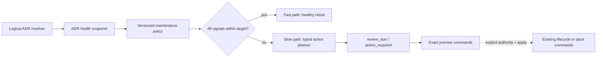

# Policy-driven ADR maintenance triggers

This document is the entrypoint for `DD-013`. The logical Design and all
managed package members share one review and approval boundary.

## Design Summary

RepoFoundry will add a deterministic ADR maintenance evaluator above the existing
`adr-health` projection. It runs at normal workflow boundaries, classifies every
explainable health signal as `within_target`, `review_due`, or `action_required`,
and emits typed next actions. A repository with several mechanically eligible
terminal ADR files receives a `pack_history` action with the exact candidate IDs and
preview command. A repository whose pressure comes from current decisions receives
`consolidate_current`, `repair_views`, or `narrow_plan_context`; it is never told that
packing historical files will solve current-decision complexity.

The evaluator is built into `epctl validate`, `epctl status`, and a dedicated
`epctl adr-maintenance` command. Agent workflow guidance runs the dedicated check at
governed session completion and after ADR lifecycle changes. CI or an external
scheduler can invoke `adr-maintenance --check` through the same repository-owned
command. RepoFoundry does not ship a resident daemon or duplicate cadence policy in
GitHub, GitLab, Codex, or Claude adapters.

Detection and planning are automatic; mutation is not. The evaluator may identify
mechanical eligibility and construct a command, but it cannot accept, reject,
retire, supersede, consolidate, pack, unpack, or rewrite an ADR. Existing explicit
actor, reason, preview, apply, validation, and rollback contracts remain the only
write path. This design is valid while repository validation is a routine workflow
boundary and ADR effect changes remain human-authorized.

## Goals and Non-goals

Goals:

- turn the existing health measurements into a repeatable maintenance workflow;
- distinguish a review threshold from a hard action threshold without an opaque
  score;
- detect terminal strict ADR files that are mechanically eligible for a History
  Pack and show the exact preview command;
- route excessive current ADRs, graph coupling, amendment depth, view cost, and
  active-plan context to the correct maintenance action;
- make the check run automatically at repository validation and Agent handoff
  boundaries while remaining callable from scheduled CI;
- keep healthy evaluation cheap and reserve impact analysis for crossed signals;
- produce deterministic human and JSON output suitable for agents and CI; and
- preserve every existing ADR authority, lossless storage, validation, and recovery
  guarantee.

Non-goals:

- automatically applying a History Pack or choosing semantic replacements;
- retiring or superseding an ADR because it is old, numerous, large, or weakly
  connected;
- treating a hard threshold as evidence that an individual decision is obsolete;
- generating prose summaries or mega ADRs;
- creating a background daemon, relying on wall-clock state, or writing a
  last-checked timestamp during read-only validation;
- blocking unrelated repository verification by default; and
- providing repository-specific threshold customization in the first policy
  version.

## Research and Decision Inputs

### Supported Findings and Confidence

The current `adr-health` implementation already computes independent corpus,
contract, graph, constraint, amendment, active-plan, view, context-cost, and storage
dimensions. It also carries reviewed navigation targets: 24 effective ADRs, a
12-ADR largest component, 12 ADR references and 96 constraint references per active
plan, eight partially amended ADRs, full current-view coverage, and a 32 KiB default
complete-capsule budget. Confidence is high that these existing measurements are a
sound input boundary; the missing capability is policy evaluation and workflow
routing, not another corpus scanner.

The verified DataFox rollout is direct operational evidence. Four terminal strict
ADRs were packed into one file, reducing physical sources by three while 51 logical
ADRs and 44 current decisions remained. That outcome proves both sides of the new
policy: terminal packing can be triggered mechanically, but it does not resolve a
large current working set. DataFox should therefore receive both an archive-ready
action for terminal files and a separate consolidation/view action when current
pressure remains high.

No new Research is required. The accepted ADR lifecycle and History Pack contracts,
the released implementation, and the repository owner's explicit request determine
the route. Threshold effectiveness remains an operational hypothesis and will be
verified against RepoFoundry fixtures and DataFox rather than treated as universal
architecture quality.

### Negative Evidence and Rejected Hypotheses

- A total ADR count cannot identify safe retirement. DataFox retained 51 logical
  ADRs after a correct four-to-one pack because history and working context are
  different quantities.
- Running only on a weekly clock misses pressure immediately after an ADR transition
  and cannot work consistently in local-only repositories.
- Running a full consolidation impact analysis on every validation adds avoidable
  latency when all signals are within target.
- Automatically packing every eligible file violates the existing explicit-ID,
  actor, reason, and preview boundary even though eligibility itself is mechanical.
- Making every hard signal a validation error can deadlock ordinary delivery on the
  very repositories that most need an incremental cleanup plan.
- Persisting acknowledgement timestamps makes a read-only check mutate the working
  tree and lets stale time state obscure unchanged structural pressure.

### Remaining Unknowns and Validity Conditions

The first hard thresholds are conservative product defaults, not a claim that every
repository above them has poor architecture. Fixtures and DataFox must prove that
they create useful, bounded actions without excessive noise. Evidence that healthy
large repositories routinely exceed a hard boundary should revise the policy in a
new version rather than add local exceptions throughout the evaluator.

External systems own wall-clock scheduling. RepoFoundry guarantees an idempotent
`--check` command and event-driven execution during validation and governed
handoffs. A future portable scheduler adapter is a separate concern.

Automatic generation of a proposed consolidation ADR or ExecPlan is deferred. Such
artifacts need a real owner, scope, and architecture question; the v1 action instead
provides the exact read-only consolidation command and explains the required human
boundary.

### ADR Constraints

- ADR-014 requires stable identity, lifecycle visibility, truthful authorship, and
  repository provenance. Maintenance output is an explicitly non-normative schema,
  not a governed decision artifact.
- ADR-016 requires explicit authority for every effect transition and preserves
  historical evidence. The evaluator never calls lifecycle mutation.
- ADR-058 C-007 requires independent explainable health dimensions without an opaque
  score or automatic lifecycle changes. The policy adds per-signal severity and a
  maximum-severity state; it does not combine values into a score.
- ADR-058 C-008 keeps semantic consolidation preview-only. A
  `consolidate_current` action can invoke only the existing read-only preview.
- ADR-060 C-001 requires explicit IDs, actor, reason, and preview for packing and
  rejects automatic selection in the pack command. Maintenance output lists
  mechanically eligible candidates, but the operator must explicitly construct and
  authorize the pack request.
- ADR-060 C-006 forbids storage operations from changing lifecycle or semantics;
  every action preserves that boundary.
- ADR-060 C-007 forbids installation and Harness upgrade from creating a pack. The
  new release installs detection only.
- ADR-060 C-009 requires logical, effective, and physical counts to remain distinct;
  the policy uses those dimensions independently.

## System Context and Invariants



Invariants:

- the existing logical resolver and health snapshot remain the only source of ADR
  facts;
- each signal exposes its value, review threshold, action threshold, severity,
  explanation, and reason for any proposed action;
- overall state is the maximum visible severity, never a weighted score;
- only terminal, strict, live, valid, regular files can appear as History Pack
  candidates;
- a candidate list is not a selected pack request and grants no mutation authority;
- excessive current ADRs never produce a `pack_history` action as their remedy;
- read-only maintenance checks do not write repository files, locks, timestamps, or
  acknowledgements;
- malformed sources, invalid seals, collisions, or broken views fail closed before
  a maintenance result is reported; and
- all mutation continues through existing preview/apply transaction boundaries.

## Proposed Architecture

The implementation has four components in
`engineering-execution-plan/scripts/epctl.py`:

1. **Policy definition** — immutable schema-1 defaults map each dimension to a
   review threshold, action threshold, and action family. The initial policy uses
   the existing review targets and introduces these hard boundaries:

   | Dimension | Review boundary | Action boundary | Action family |
   |---|---:|---:|---|
   | effective ADRs | 24 | 40 | `consolidate_current` |
   | largest current component | 12 | 24 | `consolidate_current` |
   | active-plan ADR references | 12 | 24 | `narrow_plan_context` |
   | active-plan constraint references | 96 | 192 | `narrow_plan_context` |
   | partially amended ADRs | 8 | 16 | `consolidate_current` |
   | current legacy ADRs | 0 | 8 | `migrate_legacy_contracts` |
   | uncovered current ADRs | 0 | 8 | `repair_views` |
   | maximum complete-view bytes | 32 KiB | 64 KiB | `narrow_view_context` |

   Three or more mechanically eligible terminal strict live ADRs independently
   trigger `pack_history`; this is an archive-readiness rule, not a current-context
   quality score. Numeric boundaries are exclusive: a value becomes `review_due`
   only when it is greater than the review boundary, and becomes
   `action_required` only when it is greater than the action boundary. Terminal
   eligibility uses the explicit inclusive rule `candidate_count >= 3`.
2. **Policy evaluator** — decorates each existing health signal with
   `action_threshold` and `severity`, calculates a transparent maximum state, and
   discovers eligible terminal IDs from validated logical sources.
3. **Action planner** — on the slow path, groups crossed signals into typed,
   deduplicated actions. Each action carries reasons, affected IDs or views,
   authority requirements, and an executable read-only next command. It does not
   invoke that command or synthesize governed prose.
4. **Workflow surfaces** — `adr-maintenance` renders the complete result;
   `status --json` includes its summary; `validate` emits one concise warning for
   `review_due` or `action_required`; the root and project Skills require a check at
   governed handoff and after ADR lifecycle changes. Platform adapters only
   translate the shared workflow and never own thresholds.

The fast path returns immediately after policy evaluation when no signal crosses a
review boundary and fewer than three eligible terminal files exist. The slow path
alone computes impacted views/plans and command suggestions. Both paths return the
same schema and deterministic ordering.

## Interfaces and Contracts

Public CLI:

```text
epctl adr-maintenance [--json] [--check] [--explain]
```

- default mode prints the current result and exits 0;
- `--json` emits schema version 1;
- `--check` exits 1 only for `action_required`, exits 0 for `within_target` and
  `review_due`, and retains exit 2 for invalid input or repository errors;
- `--explain` forces slow-path action details even when no hard signal is crossed;
- repeated commands over identical bytes produce identical output; and
- human output always states that actions are non-normative previews.

The JSON result contains:

```json
{
  "schema_version": 1,
  "non_normative": true,
  "state": "within_target|review_due|action_required",
  "fast_path": true,
  "policy": {"id": "default-v1"},
  "signals": [],
  "eligible_terminal_adrs": [],
  "actions": []
}
```

Each signal retains its original health dimension and value. Each action has a
stable type, severity, reason dimensions, affected IDs, `preview_only: true`,
`authority_required`, and `next_command`. Paths and IDs are sorted.

`epctl validate` remains exit-compatible: maintenance pressure is a warning, while
an invalid ADR corpus remains an error. `status --json` adds an
`adr_maintenance` summary without changing existing fields. Scheduled CI that wants
an enforcement gate calls `adr-maintenance --check` after the canonical repository
validation rather than reimplementing thresholds.

## Data Model and State Ownership

Policy `default-v1` is versioned source code and distributed documentation. The
maintenance result is derived, ephemeral, and non-normative. No new repository
state file is created in v1, so there is no timestamp, acknowledgement lifecycle,
retention rule, or merge-conflict surface.

ADR documents and History Packs retain ownership of IDs, exact bytes, payloads,
effect, relations, and provenance. Decision Views retain ownership of explicit
domain seeds. ExecPlans retain their architecture input sets. The evaluator owns
only the mapping from observed dimensions to maintenance severity and action type.

The result contains repository-relative paths, ADR IDs, view IDs, and plan IDs only.
It reads no credentials or sensitive external data.

## Control and Data Flows

1. A validation, status, explicit maintenance check, post-lifecycle hook, or
   governed handoff requests evaluation.
2. The logical source resolver validates the complete mixed live/packed corpus.
3. `adr-health` produces the existing independent measurement snapshot.
4. The policy evaluator applies fixed thresholds and discovers terminal eligibility.
5. If every signal is within target and terminal candidates are fewer than three,
   the fast path returns an empty action list.
6. Otherwise the slow path groups crossed dimensions, identifies affected views or
   plans, and emits sorted preview commands.
7. The workflow shows the result. For `pack_history`, an operator may copy the exact
   IDs into `pack-historical-adrs` with a real actor and reason, review its preview,
   and separately authorize `--apply`.
8. After any lifecycle or pack apply, the command is run again against the new
   corpus; resolved actions disappear naturally without acknowledgement state.

Concurrent repository mutation is handled by the existing source validation and
pack/lifecycle locks. The read-only evaluator takes no lock and may return a snapshot
that becomes stale immediately afterward; every actual mutation revalidates under
its existing lock, so stale advice cannot commit stale state.

## Failure Semantics and Recovery

- Invalid ADR bytes, seals, relations, packs, view registry, or source collisions
  fail closed with the existing repository error; no partial maintenance result is
  presented as trustworthy.
- A missing or unhealthy Decision View produces a repair action instead of guessing
  new seeds.
- A hard current-context signal with no safe consolidation seed reports
  `action_required` and an explicit owner-review action; it does not downgrade to a
  pack suggestion.
- A generated preview command is informational. If repository bytes change, the
  invoked command performs its own fresh validation and may reject the request.
- No recovery is needed for the read-only evaluator. Lifecycle and History Pack
  recovery remain governed by their existing atomic rollback and exact unpack
  contracts.
- A failed scheduled `--check` is retried after the repository problem or required
  maintenance action is resolved; there is no state to clean up.

## Compatibility, Migration, and Rollout

The capability is an additive CLI and JSON schema change targeted for RepoFoundry
0.9.0. Existing ADR, pack, Decision View, Harness, and artifact schemas remain
readable. Existing `adr-health` fields remain present; added action-threshold fields
are additive.

Harness upgrade updates the versioned project Skill so new Agent sessions run the
maintenance check, but it does not create a policy file, change a lifecycle state,
or pack history. Customized project Skills continue to require an explicit manual
merge under the existing seed-provenance rules.

Older RepoFoundry versions ignore the new workflow guidance and cannot run
`adr-maintenance`, but repositories remain readable because v1 persists no new
state. Repositories containing History Packs retain the existing unpack-before-
downgrade rule independently of this feature.

Rollout sequence: ship evaluator and unit fixtures, integrate `validate`/`status`,
update all distributed Skills and bilingual documentation, run clean-install and
Harness-upgrade tests, release/install the tool, then upgrade DataFox and confirm it
reports current-context maintenance separately from any archive-ready candidates.

## Security, Privacy, and Operations

All repository Markdown and JSON remain untrusted data. The evaluator uses existing
strict parsing, path confinement, size limits, and logical source validation. It
never executes ADR content. Generated commands use normalized stable IDs and
repository-relative identifiers; renderers quote human reasons and never interpolate
source prose into a shell command.

Observability consists of policy ID, fast/slow path, per-signal values and
thresholds, overall state, action types, affected IDs, and exit status. This is
sufficient for CI logs without a remote telemetry service. Capacity is bounded by
the existing ADR and History Pack resource limits.

The repository owner owns action disposition. RepoFoundry maintainers own policy
defaults and schema compatibility. Agent adapters own only timely invocation and
truthful handoff of the shared result.

## Verification Strategy

- threshold boundary fixtures exercise `threshold`, `threshold + 1`, and each hard
  boundary independently;
- fixtures prove overall state is the maximum visible severity and contains no
  aggregate score;
- fast-path tests prove healthy repositories produce no impact-analysis calls;
- slow-path tests prove deduplicated action routing for current, plan, view, legacy,
  amendment, capsule, and terminal-storage pressure;
- terminal fixtures prove only valid strict live terminal files are reported and
  that no repository byte changes during detection;
- CLI tests cover human/JSON parity, deterministic ordering, `--check` exit codes,
  `--explain`, and invalid-corpus fast failure;
- integration tests prove `validate` warning compatibility and additive `status`
  output;
- mutation audits prove maintenance never calls lifecycle or pack apply functions;
- installer and Harness migration fixtures prove no pack or policy-state file is
  created and customized seeds remain protected;
- the canonical `scripts/check.py` suite passes; and
- DataFox reports its large current working set as consolidation/view work while a
  separate terminal fixture produces the exact History Pack preview action.

## Alternatives, Open Questions, and Revisit Triggers

Rejected alternatives:

- **Automatic apply:** simpler for operators but violates explicit authority and can
  make a structurally valid yet unwanted storage change.
- **Wall-clock daemon:** provides literal periodic execution but is not portable,
  introduces hidden state, and duplicates host scheduling.
- **Validation hard failure by default:** guarantees attention but blocks unrelated
  delivery and encourages threshold bypasses.
- **One ADR-count limit:** cannot distinguish current complexity, historical storage,
  view coverage, or active-plan scope.
- **Repository-custom thresholds in v1:** flexible but creates an early policy
  migration and audit surface before defaults have operational evidence.

Open implementation detail: whether `status` embeds the complete action list or a
summary plus a command hint. Prefer the summary to keep the existing status payload
bounded; settle this in the ExecPlan without changing authority or policy semantics.

Revisit when large healthy repositories repeatedly cross hard thresholds, teams
need an auditable acknowledgement/snooze lifecycle, portable scheduler ownership is
established, or mechanical evidence becomes strong enough to propose—but never
accept—consolidation artifacts automatically.

## Package Document Map

Single-file layout; every required concern is covered in this entrypoint.

## Revision Notes

- 2026-09-04 — Created working revision 1.
- 2026-09-04 — Defined the versioned threshold policy, event-driven cadence,
  fast/slow paths, typed maintenance actions, explicit mutation boundary, public
  command contract, rollout, and verification strategy.
