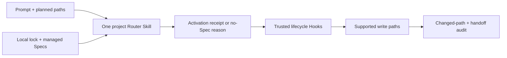

# Use one project-local Engineering Specs Router with trusted Hook enforcement

This ADR records one architecturally significant decision. Proposed ADRs may be
revised. Accepted or rejected ADR bodies and decision-input metadata are sealed;
later changes require an amending or superseding ADR.

## Context and Problem Statement

RepoFoundry materializes explicitly selected Engineering Specifications into a
project and pins their exact bytes in a lock. Installation alone does not prove
that an Agent read the relevant Spec before implementation or review. Loading
every installed Spec on every turn would make context grow with the Catalog,
while relying only on a prose reminder in `AGENTS.md` would make activation
unobservable and unenforceable.

The architecture therefore needs a durable task-time activation contract. It
must preserve the Agent-neutral ownership of normative content established by
ADR-005, fit the project Harness ownership established by ADR-002, work with
Codex progressive Skill disclosure, use only locked repository-local content
at task time, and provide a mechanical guardrail on supported mutation paths.

The decision is architecturally significant because it fixes the boundary
between the remote Specification source, the generated project adapter,
project trust, Agent context, and write-time enforcement.

## Decision Drivers

- Keep normative Specifications independent of Codex and other Agent runtimes.
- Expose one bounded, discoverable project Skill instead of one Skill for every
  installed Specification.
- Preserve progressive disclosure: required installation does not mean every
  Spec is unconditionally read on every task.
- Resolve activation from the prompt, planned repository-relative paths,
  Catalog scope, Spec description, and the Spec's Applicability section.
- Record one explicit turn-scoped result: applicable Spec IDs or a justified
  no-Spec decision, including dependency closure.
- Verify locked SHA-256 content and avoid all task-time network access.
- Gate supported writes until activation and path coverage are established,
  then audit completion against changed paths and the required handoff.
- Preserve existing `AGENTS.md` and project Hook configuration; conflicts must
  require an explicit maintainer merge.
- Respect Codex project trust and exact Hook-definition review.
- Keep a manual workflow available when lifecycle Hooks are unavailable.
- Avoid claiming that project Hooks are a universal sandbox, repository ACL,
  or organization-managed enforcement policy.

## Research Evidence

No additional sealed Research package is required. The Repository Owner
explicitly approved this outcome in the current Codex conversation on
2026-08-03 after reviewing the proposed architecture.

The decision is supported by these accepted and approved inputs:

- ADR-002 assigns project Harness Bootstrap and the short `AGENTS.md` route to
  the root RepoFoundry Skill.
- ADR-005 assigns normative content and its lifecycle to the independent
  EngineeringSpecifications repository while RepoFoundry owns resolution,
  locking, materialization, and validation.
- EngineeringSpecifications ESP-0010 defines the Agent-neutral task-activation
  protocol: scope produces candidates, Applicability determines activation,
  dependencies close automatically, and a no-Spec result requires a reason.
- The current [Codex Skills documentation](https://learn.chatgpt.com/docs/build-skills)
  supports repository-local Skills with progressively disclosed instructions;
  the [AGENTS.md documentation](https://learn.chatgpt.com/docs/agent-configuration/agents-md)
  supports a small root routing instruction; and the
  [Hooks documentation](https://learn.chatgpt.com/docs/hooks) defines project
  trust plus lifecycle events capable of adding context and gating supported
  tool calls.
- Completed EP-009 demonstrates the selected design with isolated tests for
  candidate routing, dependency closure, content injection, write denial,
  completion audit, manual fallback, and non-destructive Hook integration.

## Considered Options

### Use only an `AGENTS.md` reminder

This is small and portable, but it cannot prove which Spec was selected, verify
dependency closure, inject locked content, or gate a mutation.

### Generate one project Skill per installed Specification

This makes each Spec directly discoverable, but couples Agent packaging to the
normative Catalog, expands always-visible Skill metadata with the installed
set, and duplicates routing behavior across generated packages.

### Inject every installed Specification on every task

This makes omission unlikely, but defeats progressive disclosure, consumes
context independent of task relevance, and makes adding a new category an
unbounded prompt-cost decision.

### Use Hooks without a Router Skill

This can gate supported tools, but hides the activation workflow inside a
runtime adapter, weakens manual invocation and portability, and gives the Agent
no stable project-local interface for inspection, activation, status, or audit.

### Use one project-local Router Skill, a short `AGENTS.md` route, and trusted Hooks

This keeps Agent-specific behavior in one generated adapter, retains explicit
and inspectable activation, uses Hooks for scoped mechanical enforcement, and
supports the same lifecycle manually when Hooks are unavailable.

## Decision Outcome

Use exactly one generated project-local Skill named `engineering-specs` for
task-time Engineering Specification routing. A short mandatory root
`AGENTS.md` instruction routes implementation and review tasks to this Skill.

The Router must use only the local managed index, manifest, lock, and
digest-verified local Spec Markdown. It must:

1. derive conservative candidates from planned repository-relative paths;
2. evaluate each candidate's activation summary and Applicability section
   against the task;
3. record either the activated direct IDs or an explicit no-Spec reason;
4. add dependency closure automatically;
5. expose status and audit operations for the current turn; and
6. provide equivalent explicit commands when Hooks are unavailable.

For trusted Codex projects, generated project Hooks integrate that Router with
the lifecycle:

- `UserPromptSubmit` and `SubagentStart` add the Router contract and local index
  as developer context;
- `PreToolUse` allows discovery but denies supported mutation until the turn has
  a valid activation receipt covering the declared paths;
- the first supported mutation after activation is denied once while the
  activated, digest-verified local content is injected, requiring the Agent to
  re-evaluate and retry; and
- `Stop` audits changed-path coverage and the required completion handoff.

Project Hooks are a Codex guardrail over the tool paths and lifecycle events
the runtime exposes. They are not a universal process sandbox, filesystem
policy, repository permission boundary, or guarantee for specialized mutation
paths that do not participate in the Hook event. Stronger organization-wide
enforcement remains a separate deployment concern.

Existing `AGENTS.md` and `.codex/hooks.json` files remain byte-preserved. If the
mandatory route or Hook groups are missing, Bootstrap reports a deterministic
manual-merge conflict instead of overwriting them. Non-managed project Hooks
become effective only after the user trusts the project and reviews the exact
definition.

## Consequences

The project gains one bounded and discoverable activation surface regardless
of how many language, framework, database, protocol, and testing Specs it
installs. Agents receive only task-relevant locked content, activation is
auditable, dependency closure is mechanical, and normal write paths fail
closed when activation, content integrity, path coverage, or completion
evidence is missing.

RepoFoundry must version and validate generated Router and Hook adapter files in
addition to the Agent-neutral Spec consumer. A task has one additional explicit
activation step. First-write injection intentionally causes one denied tool
call and retry. Large applicable Specs still consume context when activated,
and Codex may spill or truncate very large Hook output; Catalog authors should
therefore keep Specs focused and consumer adapters must retain explicit size
limits and diagnostics.

Projects with custom `AGENTS.md` or Hook definitions require a maintainer to
merge the short route and required Hook groups. Projects that cannot or do not
trust lifecycle Hooks use the Router's manual begin, activate, status, and audit
sequence; they receive explicit activation and validation but not automatic
write interception.

Other Agent runtimes may implement ESP-0010 through their own adapter without
adopting Codex Skills or Hooks. The normative Catalog remains free of generated
Codex files and turn receipts.

## Confirmation

- Fresh Bootstrap creates exactly one valid project-local
  `engineering-specs` Skill, one short `AGENTS.md` route, and the required Hook
  groups without copying Agent adapter files into EngineeringSpecifications.
- Candidate tests prove that file scope is conservative and does not itself
  equal activation; activation tests prove applicability decisions,
  dependencies, and justified `none` receipts.
- Hook tests deny an unactivated mutation, undeclared target paths, digest
  drift, and an incomplete completion handoff.
- Injection tests prove that the first supported write receives only local
  locked content after SHA-256 verification and that task-time routing performs
  no network access.
- Conflict tests prove existing `AGENTS.md` and `.codex/hooks.json` bytes are
  preserved and produce deterministic manual-merge guidance.
- Manual-fallback tests cover begin, activation, status, and audit without
  lifecycle Hooks.
- `foundryctl validate --harness`, Skill validation, EP validation, and the
  repository canonical `python3 -B scripts/check.py` remain green.
- Completed EP-009 retains the implementation and exact-revision evidence.

## Revisit Triggers

- Codex changes project Skill discovery, Hook trust, event payloads, supported
  tool coverage, or Hook output behavior in a way that invalidates the adapter.
- Organization-managed Hooks or another administrative policy surface can
  provide stronger cross-project enforcement without project-local trust.
- Production evidence shows that one Router is not discoverable enough or that
  one Skill per Spec provides better activation accuracy at acceptable metadata
  and maintenance cost.
- Activated Spec size regularly exceeds useful context limits and requires
  requirement-level extraction or another bounded representation.
- RepoFoundry supports additional Agent runtimes whose common activation model
  justifies a runtime-neutral adapter interface.
- Security requirements demand an OS, container, CI, or repository-policy
  boundary rather than a Codex lifecycle guardrail.

## More Information

- Research references: []
- Prerequisite ADRs: ["ADR-002", "ADR-005"]
- Amended ADRs: []
- Design documents: ["docs/design-docs/engineering-spec-management.md"]
- Related ExecPlans:
  `docs/exec-plans/completed/ep-009_enforce-spec-task-activation/EXECPLAN.md`.

## Revision Notes

- 2026-08-03T11:52:53Z — Proposed ADR created.
- 2026-08-03T12:10:00Z — Recorded the Repository Owner's explicit approval of
  the one-Router, local locked-content, trusted-Hook enforcement architecture;
  clarified that project Hooks are a scoped Codex guardrail rather than a
  universal sandbox or administrative policy.
