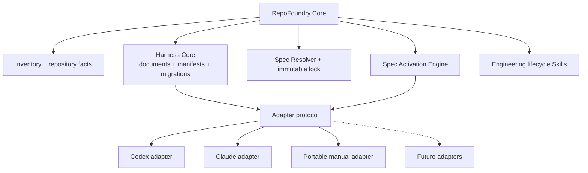
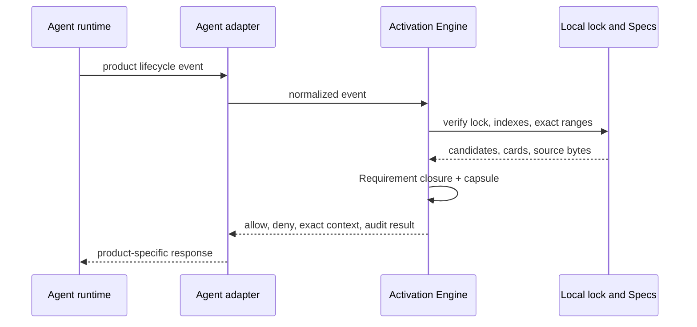

# Agent-neutral Harness and Engineering Spec Adapters

## Purpose

Make RepoFoundry AI independent from any single coding-agent product while
retaining first-class integrations where a runtime exposes instructions,
Skills, lifecycle Hooks, subagents, or tool interception.

The invariant is:

> One repository engineering contract, one locked Engineering Specification
> set, and multiple independently versioned Agent adapters.

Product neutrality does not mean reducing every integration to the least
common denominator. RepoFoundry owns a runtime-neutral Core and capability
protocol. Each adapter maps that protocol to one Agent product and states
which guarantees are native, CLI-enforced, or advisory.

## Architectural boundaries



The Core owns repository facts, generated neutral documents, manifest shape,
Spec resolution, lock verification, task activation semantics, receipts, and
CLI/CI validation. It must not contain a product event name, product trust
model, product configuration path, or provider-specific instruction format.

An Agent adapter owns only:

- instruction and Skill discovery entrypoints;
- lifecycle event input and output translation;
- project trust and Hook installation guidance;
- supported tool-shape extraction;
- native context-injection and write-gate behavior;
- adapter-specific generated files and validation.

Normative Engineering Specification content remains in the independent
EngineeringSpecifications repository. Neither RepoFoundry Core nor an adapter
may fork, rewrite, or render provider-specific copies of a Spec.

## Capability model

Adapters declare capabilities rather than letting the Core infer behavior from
an adapter ID.

```text
instructions        none | file | native
skills              none | file | native
lifecycle_events    [] | [session_start, subagent_start, before_mutation, stop]
context_injection   none | advisory | native
mutation_gate       none | cli | native
completion_audit    advisory | cli | native
project_trust       none | user_review | administrative
automated_enforcement_effective_maximum  Advisory
finding_lifecycle   unsupported
```

Adapter `enforcement` describes integration guarantees: CLI or native write
gates and audits. Requirement Automated enforcement is separate. Every current
adapter exposes the Core's Advisory effective ceiling and unsupported finding
lifecycle, even when a trusted Codex Hook provides a native activation gate.
Documentation and CLI output must not combine these dimensions or describe
`cli` or `advisory` integration behavior as a native runtime guarantee.

The current implementation ships three adapters:

| Adapter | Purpose | Enforcement |
|---|---|---|
| `codex` | Preserve the current AGENTS, Skill, trusted Hook, injection, write-gate, subagent, and Stop behavior | native for supported Hook paths |
| `claude` | Install native project Skills while using explicit Core Router commands for activation and audit | native Skill discovery; CLI/advisory enforcement |
| `portable` | Provide product-independent instructions and explicit Router CLI commands without installing product configuration | CLI plus advisory instructions |

Additional products implement the same adapter descriptor and normalized
activation events. Their arrival must not change the Core manifest, selected
Specs, or locked content merely because instruction and Hook formats differ.

## Target repository layout

Core state and content are shared:

```text
docs/
├── .engineering/
│   ├── harness.json
│   ├── specs.json
│   └── specs.lock.json
├── agent-guides/
│   ├── README.md
│   └── managed/
│       ├── index.md
│       ├── requirements.json
│       └── <locked-spec>.md
├── index.md
├── QUALITY_SCORE.md
├── RELIABILITY.md
├── SECURITY.md
└── design-docs/index.md
.repo-foundry/
├── engineering-specs/
│   └── spec_router.py
└── skills/repo-foundry-ai/SKILL.md
```

Adapters add only their own entrypoints:

```text
# Codex adapter
AGENTS.md
.agents/skills/repo-foundry-ai/SKILL.md
.agents/skills/engineering-specs/
├── SKILL.md
└── agents/openai.yaml
.codex/hooks.json

# Claude adapter
.claude/skills/repo-foundry-ai/SKILL.md
.claude/skills/engineering-specs/SKILL.md

# Portable adapter
docs/agent-guides/README.md
```

The Core Router executable has one canonical installed path under
`.repo-foundry/`. Adapter entrypoints invoke that executable; they do not carry
independent copies of the activation engine. RepoFoundry records every
generated Core and adapter file with its template version and installed
SHA-256 so upgrades preserve customized bytes.

The [Claude Code Skills precedence contract](https://code.claude.com/docs/en/slash-commands#where-skills-live)
gives a personal Skill precedence over a project Skill with the same name.
RepoFoundry deliberately retains the `repo-foundry-ai` name at both
scopes: the distribution root Skill delegates to the canonical project Skill
when that file exists, while the thin `.claude/skills/` entrypoint covers
clones without a personal registration. Both routes converge on repository
state rather than a user-home copy of the workflow.

## Harness manifest schema 3

Harness schema `3` separates Core and adapter state. The exact JSON stays
strict, ordered, and forward-failing:

```json
{
  "schema_version": 3,
  "owner": "repo-foundry",
  "producer": {
    "name": "repo-foundry",
    "version": "0.4.1"
  },
  "core": {
    "version": "1.3.1"
  },
  "adapters": [
    {
      "id": "codex",
      "version": "2.3.1",
      "enforcement": "native"
    },
    {
      "id": "claude",
      "version": "1.2.1",
      "enforcement": "cli"
    },
    {
      "id": "portable",
      "version": "1.2.1",
      "enforcement": "cli"
    }
  ],
  "components": [
    "engineering-execution-plan"
  ],
  "instruction_files": [],
  "files": [],
  "applied_migrations": []
}
```

`instruction_files` and `files` retain the existing path, line-budget,
template identity, template version, template SHA-256, and installed SHA-256
semantics. File records additionally identify `owner_kind: core|adapter` and,
for adapter files, `owner_id`.

The following version planes remain independent:

- RepoFoundry distribution version;
- Harness schema version;
- Harness Core version;
- each Agent adapter version;
- Engineering Specifications Catalog version;
- Spec Activation protocol version.

Changing Codex Hook bytes bumps only the RepoFoundry distribution and Codex
adapter. Changing normative guidance bumps only the Engineering Specifications
Catalog. Changing normalized activation semantics bumps the Activation
protocol and every incompatible adapter implementation.

## CLI contract

New commands name adapters explicitly:

```text
foundryctl bootstrap --adapter portable
foundryctl bootstrap --adapter codex
foundryctl bootstrap --adapter claude
foundryctl bootstrap --all-adapters
foundryctl adapter list
foundryctl validate --harness
foundryctl validate --adapter codex
foundryctl validate --adapter claude
foundryctl upgrade --to 0.4.1
```

Bootstrap remains preview-first and preflights the complete Core plus adapter
plan before any write. Adapter IDs are unique and output is deterministically
ordered. `--all-adapters` expands to the complete registry order and conflicts
with `--profile` or explicit `--adapter`; it never infers committed state from
locally installed Agent hosts.

For one compatibility release:

- `bootstrap --profile codex` is an alias for `--adapter codex`;
- omitting both flags retains the `codex` default and emits a structured
  deprecation warning;
- manifests continue to read schemas `1` and `2` but only an explicit
  `upgrade --to 0.4.1 --apply` writes schema `3`;
- `validate` reports an available migration without silently changing state.

The compatibility alias is removed only by a later explicit release and
migration decision.

## Activation depth is a Core decision

All adapters preserve the same task-depth boundary. Ordinary read-only code
explanation, navigation, call-chain tracing, and existing-behavior summaries
read only the necessary code and repository documents. They do not start full
Harness validation, create a Spec activation receipt, create governed
artifacts, or require the five-label evidence handoff solely because repository
code was inspected.

Formal code review, explicit Spec-conformance evaluation, defect, security, or
reliability diagnosis, and repository mutation enter the applicable governed
layer. A read-only answer escalates only when the requested scope changes. The
Core owns this classification; Codex and Claude Skill metadata narrow automatic
discovery, while the Portable guide states the same rule explicitly.

## Engineering Specification activation protocol

Protocol v2 keeps candidate, Applicability, explicit-none, digest, and
five-label handoff semantics behind one runtime-neutral Activation Engine. It
narrows task context from applicable Specs to exact Requirements before any
normative text is injected.



The task-time selection path is deterministic:


Cards contain only ID, owning Spec, title, Activation summary, dependencies,
and block byte count. Their default aggregate budget is 16 KiB. A capsule's
default budget is 32 KiB; it contains exact mandatory interpretation frames,
resolved Requirement blocks, matching Verification rows, and explicitly
requested supporting sections. The engine never summarizes or truncates
normative bytes. It fails on overflow, while explicit whole-Spec activation
with a reason remains available for legacy documents, migrations, and broad
audits. Raising the default budget requires a reviewed reason stored in the
receipt; overflow diagnostics identify direct/resolved IDs and exact block and
frame costs.

The normalized event envelope contains only RepoFoundry concepts:

```json
{
  "protocol_version": 2,
  "event": "before_mutation",
  "adapter_id": "codex",
  "session_id": "opaque-session",
  "turn_id": "opaque-turn",
  "prompt": "optional task summary",
  "planned_paths": ["src/cache/**"],
  "tool": {
    "category": "file_write",
    "name": "apply_patch",
    "input": {}
  }
}
```

The Core never interprets `UserPromptSubmit`, `SubagentStart`, `PreToolUse`,
`Stop`, Claude event names, or product tool JSON. The Codex adapter translates
those inputs to `session_start`, `subagent_start`, `context_resume`,
`before_mutation`, and `stop`, then translates the Core decision back to the
Codex Hook output shape.

Runtime receipts are keyed by repository identity, adapter ID, session ID, and
turn ID. Including the adapter prevents collisions when two coding-agent
products work in the same repository concurrently. They record applicable and
requested Specs, direct and resolved IDs, task reasons, exact source ranges,
published/effective Automated enforcement levels, fallback mode and reason,
capsule digest/bytes/budget, and `context_epoch`.
Receipts remain ephemeral operational state rather than project policy or
normative evidence. `rehydrate` advances the epoch, recompiles from verified
local bytes, and requires the same capsule digest before injection.

When no native lifecycle integration exists, the Claude and portable adapters
use the same Core operations through `begin`, `candidates`, `requirements`,
`activate`, `rehydrate`, `status`, `evidence`, and `audit`. Claude exposes those
instructions through a native
project Skill; portable uses a neutral guide. Both provide auditable CLI
behavior without claiming automatic write interception.

## Spec Manager boundary

`scripts/spec_manager.py` owns only Catalog resolution, explicit selection,
lock creation, materialization, managed-index generation, and provider-neutral
content validation. It must not require `AGENTS.md`, `.codex/hooks.json`, an
OpenAI metadata file, or any adapter route.

Core Spec validation verifies:

- manifest and lock schemas;
- immutable source revision and digests;
- dependency closure;
- managed and project Spec files;
- generated managed routing and Requirement indexes;
- the canonical Activation Engine.

Each adapter validator separately verifies its instruction route, Skill
metadata, Hook groups, line budgets, and adapter-owned generated files.

## Migration from schema 2

Schema `2` has one Codex profile and eleven seeded records. Migration to schema
`3` is explicit, preview-first, and rollback-safe:

1. map `profile: codex@1.0.0` to the `codex` adapter;
2. classify existing documents and managed Spec state as Core-owned;
3. classify `AGENTS.md`, the generated Router Skill metadata, and
   `.codex/hooks.json` as Codex-owned;
4. install the canonical Activation Engine when the existing generated Router
   script still matches its recorded installed SHA-256;
5. replace the old generated script with the Codex adapter entrypoint only
   when its recorded provenance proves it unmodified;
6. preserve customized or legacy-unversioned bytes and report a deterministic
   manual-merge conflict;
7. write schema `3` and migration history only after all generated paths and
   validators pass;
8. roll back every touched path and manifest on validation failure.

Existing Specs selection, lock, local Markdown, and Catalog version never
change as a side effect of this Harness migration.

Schema `3` component upgrades remain readable by their declared versions.
Core `1.0.0` omits the canonical project Skill, and Codex `2.0.0` omits its
thin root Skill. Core `1.1.0` and Codex `2.1.0` add those Skills. Core `1.2.0`,
Codex `2.2.0`, Claude `1.1.0`, and Portable `1.1.0` add
Requirement-level routing instructions and protocol-v2 engine behavior. Core
`1.2.1` additionally requires Agents to surface unresolved Catalog selection
decisions and wait for the maintainer's explicit choice before apply. Core
`1.3.0`, Codex `2.3.0`, Claude `1.2.0`, and Portable `1.2.0` add
Automated enforcement metadata propagation plus Advisory-only activation
evidence export without changing activation protocol v2. The current Core
`1.3.1`, Codex `2.3.1`, Claude `1.2.1`, and Portable `1.2.1` add the shared
activation-depth boundary without changing protocol v2. A
previewed upgrade, or a bootstrap that adds an adapter, creates or replaces
generated paths only when they are absent or still have provable template
provenance and records the component migrations. Unknown or customized target
bytes remain conflicts. Harness migration does not select a new Catalog or
rewrite the Spec manifest, lock, managed Markdown, or Requirement index.

## Safety and ownership

- Adapter installation never rewrites repository-owned content.
- Multiple adapters may coexist, but no two adapters may own the same generated
  path unless the descriptor declares a shared Core file.
- Existing product configuration is byte-preserved; missing required fragments
  produce manual-merge conflicts.
- Adapter event payloads, tool inputs, paths, and identifiers are untrusted.
- The Core normalizes paths and rejects traversal and symlinks before applying
  a decision.
- Product trust is never inferred from files in the repository.
- A native adapter may claim enforcement only for the lifecycle events and tool
  categories covered by executable contract tests.
- Removing an adapter is outside the first implementation because deleting
  customized product configuration needs a separate ownership and migration
  decision.

## Implementation surface

- `scripts/foundryctl.py`: Core manifest, multi-adapter planning, validation,
  migration, and compatibility CLI.
- `scripts/spec_manager.py`: remove instruction-route ownership and expose only
  provider-neutral Spec state validation.
- `assets/`: separate Core templates from `adapters/codex`,
  `adapters/claude`, and `adapters/portable` templates.
- Activation Engine: own candidates, Requirement cards, exact dependency
  closure and capsule compilation, local digest verification, published and
  effective enforcement metadata, activation evidence, context epochs,
  normalized events, and audit.
- Codex adapter: own Hook payload translation, tool-path extraction, Hook output
  translation, `AGENTS.md`, Skill metadata, and `.codex/hooks.json`.
- Claude adapter: own project Skill discovery entrypoints and truthful
  CLI/advisory activation instructions without installing Hooks.
- tests: prove Core independence, Codex behavior parity, Claude and portable
  fallback, multi-adapter coexistence, schema/component migration,
  customization preservation, and rollback.
- docs and root Skill: present RepoFoundry as Agent-neutral with first-class
  adapters rather than a Codex-only Harness.

## Acceptance

- A Core or portable Bootstrap writes no `.codex` file and does not require
  `AGENTS.md`.
- A Codex Bootstrap preserves the `v0.1.0` user-visible Harness behavior.
- Codex, Claude, and portable adapters can coexist over one manifest, Spec
  lock, managed index, and Activation Engine.
- The same candidate paths and activation choice produce the same direct and
  resolved Requirement IDs, capsule digest/bytes, epoch semantics, and audit
  result through Codex and manual entrypoints.
- Core Spec validation succeeds without an Agent adapter installed.
- Adapter validation fails only for the selected adapter's contract.
- Schema `1` and `2` remain readable; future schema, Core, adapter, protocol,
  template, and migration versions fail closed.
- Schema `2` migration preserves selected Specs and customized seed bytes.
- Preview has no writes, repeated apply is idempotent, and post-validation
  failure rolls back every touched path.
- Canonical `python3 -B scripts/check.py` passes.
