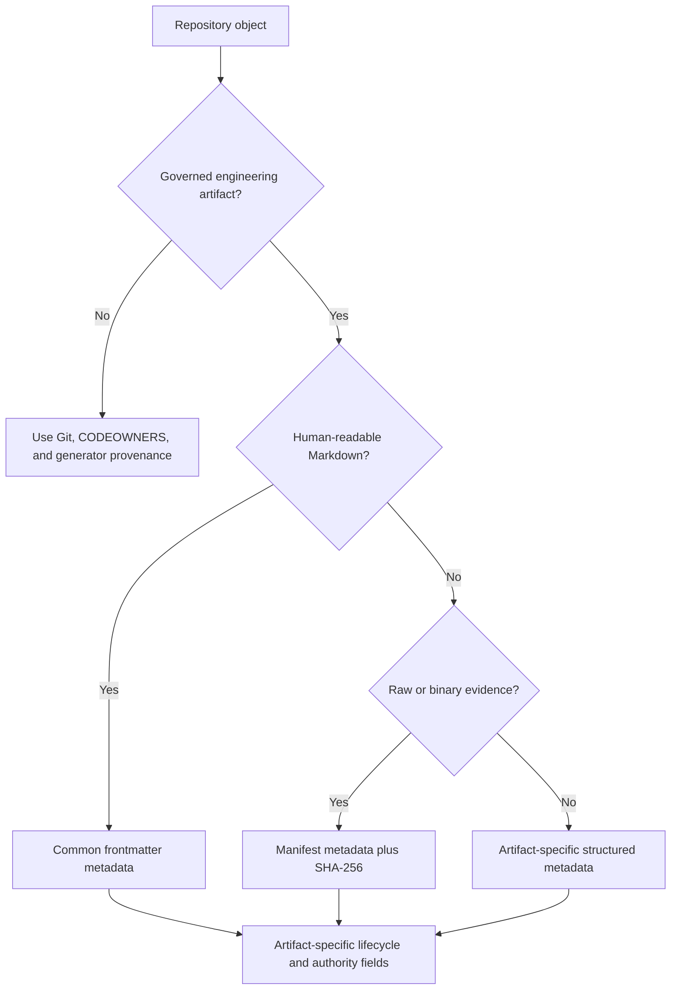

# Artifact Metadata Contract

## Purpose

Every governed engineering artifact must explain what it is, which logical
artifact it represents, who wrote the current edition, who remains accountable
for it, and when it was created and last changed. Git history is essential
evidence, but it is not a complete semantic contract: files are copied,
exported, snapshotted, rendered, and consumed outside their original checkout.

The contract therefore puts portable provenance on the artifact itself while
leaving event-specific authority and integrity evidence in dedicated fields.
It applies to newly created or actively maintained Research, ADR, ExecPlan,
Task, Checkpoint, Bugfix, Benchmark, Case Study, and Design Doc artifacts.

## Classification



Ordinary source code, configuration, generated indexes, and derived tables do
not receive decorative author headers. Their provenance remains in Git,
CODEOWNERS, the generating tool, and the canonical artifact from which they are
derived. This keeps metadata meaningful instead of turning it into boilerplate.

## Common fields

Human-governed Markdown uses YAML frontmatter. Structured manifests use fields
with the same names and meanings.

| Field | Meaning | Rule |
|---|---|---|
| `metadata_schema` | Version of this cross-artifact contract | Required; currently `"1"` |
| `artifact_type` | Stable machine-readable profile | Required; one canonical value per artifact class |
| `id` | Stable logical identity | Required; must follow the profile's namespace |
| `title` | Human-readable name | Required and non-empty |
| `status` | Current lifecycle state | Required; allowed values are profile-specific |
| `author` | Person or agent responsible for the current authored edition | Required; `Unassigned` is an explicit draft placeholder, not an approval |
| `owner` | Person or role accountable for ongoing maintenance and lifecycle decisions | Required; terminal transitions may require a named owner |
| `created` | Date the logical artifact was first created | Required ISO 8601 date; immutable across moves and ordinary revisions |
| `updated` | Date of the latest semantic change | Required ISO 8601 date or, where the profile permits, timestamp |

`schema_version` remains separate. It versions the artifact-specific shape;
`metadata_schema` versions only the shared meaning above. A Research Topic and
an ADR can therefore evolve independently while implementing the same metadata
contract.

## Identity and responsibility are not authority

The common fields answer authorship and stewardship questions. They do not
replace event records:

| Field | Answers | Typical lifecycle |
|---|---|---|
| `author` | Who wrote or materially revised this edition? | Mutable while draft; sealed with immutable artifacts |
| `owner` | Who is accountable for keeping it current? | Mutable through an explicit transfer while active |
| `decision_maker` | Who accepted or rejected an ADR? | Written only by the ADR decision event |
| `approved_by` | Who authorized Research conclusion? | Written only by the terminal Research event |
| `executed_by` | Who or what executed a Benchmark run? | Written when the run is sealed |
| `generated_by` | Which deterministic tool produced a derived artifact? | Written by the generator |

An agent may be the `author`; that does not make it the `owner` or grant it
decision authority. Conversely, a repository owner can approve an artifact
without claiming to have written its analysis.

## Artifact profiles

| Artifact | ID profile | Current artifact schema | Integrity boundary |
|---|---|---|---|
| Research | `R-NNN` | `1.2` | Terminal package manifest and Synthesis sealing |
| Research Synthesis | `R-NNN-SYNTHESIS` | `1.2` | Review and terminal payload digest |
| Research Round | `RR-NNN` within its Research | `1.1` | Managed corpus manifest |
| Research Topic | `RT-NNN` within its Research | `2.3` | Managed corpus manifest |
| Research manifest | `R-NNN-MANIFEST` | `1.1` | Canonical JSON plus document SHA-256 values |
| ADR | `ADR-NNN` | `1.4` | Accepted or rejected decision payload digest |
| ExecPlan | `EP-NNN` | `2.8` | Completed or cancelled archive digest plus approved Design evidence |
| Task | `T-NNN` within its ExecPlan | `1` | Parent plan validation and Git history |
| Checkpoint | `CP-NNN` within its ExecPlan | `1.2` | Canonical whole-document digest |
| Bugfix | `BF-NNN` | `1` | Lifecycle validation and Git history |
| Benchmark Suite | `B-NNN` | `1.1` | Git history while active |
| Benchmark Scenario | `BS-NNN` | `1.1` | Snapshot digest in every sealed run |
| Benchmark Result | `BR-NNN` | `1.1` | Sealed run manifest and SHA-256 inventory |
| Benchmark manifest | `BR-NNN-MANIFEST` | `1.1` | Canonical manifest plus artifact SHA-256 values |
| Case Study | `CS-NNN` | `1` | Review process and Git history |
| Design Doc | `DD-NNN` | `1.1` | Approved revision manifest, exact member SHA-256 values, and immutable snapshot |

Profile schemas may advance without changing `metadata_schema` when only their
domain fields or lifecycle rules change.

## Integrity and mutation

Active documents may update `author`, `owner`, `status`, and `updated` according
to their lifecycle. Once an ADR, Checkpoint, Benchmark run, Research snapshot,
or completed ExecPlan is sealed, metadata participates in its integrity
boundary. Changing attribution after sealing is therefore tampering, not a
cosmetic edit; correction requires the profile's amendment, supersession, or
new-revision mechanism.

Raw logs, traces, screenshots, generated captures, and binary evidence do not
need embedded metadata. Their enclosing manifest carries identity, authorship,
ownership, lifecycle, timestamps, and SHA-256 digests for every file.

## Compatibility and migration

- Validators enforce this contract only for current artifact schemas.
- Older valid schemas remain readable and retain their original integrity
  rules; sealed historical artifacts are not rewritten solely to add fields.
- Active artifacts may be migrated in place because they are still mutable.
- A missing value is rendered as the explicit `Unassigned` placeholder. It
  satisfies structural portability but does not satisfy gates that require an
  accountable owner or authorized actor.
- Generated indexes remain projections and are rebuilt from canonical
  artifacts; they do not become independent governed documents.

## Validation contract

Repository validation must prove that current artifacts have the correct
metadata schema, artifact type, stable ID, non-empty title/status/actors, and
valid dates. It must also prove that Design Doc IDs are unique, generated
templates expose the common fields, immutable payloads include metadata, and
legacy fixtures remain compatible.

Skill interfaces should request `--author` and `--owner` where users know them,
inherit those actors from a parent artifact where the relationship is clear,
and otherwise write `Unassigned` honestly. They must never infer approval,
decision ownership, or execution identity from authorship.

## Acceptance examples

```yaml
---
schema_version: "1.4"
metadata_schema: "1"
artifact_type: adr
id: ADR-014
title: "Require semantic metadata for governed engineering artifacts"
status: proposed
author: "Codex"
owner: "RepoFoundry Maintainer"
created: 2026-08-04
updated: 2026-08-04
decision_outcome:
effect_changed_by:
effect_changed:
effect_reason:
---
```

The document remains a proposal until `decision_maker`, `decided`,
`decision_outcome`, and the sealed payload digest are written by an explicit
ADR decision. Schema 1.4 keeps identity, attribution, creation time, authority,
inputs, and body in the decision payload while treating `status`, `updated`,
effect metadata, and replacement links as validated lifecycle state. The
metadata describes the document; it does not silently decide it.

## Revision Notes

- 2026-08-04 — Defined the common metadata layer, actor semantics, profile
  versions, integrity boundaries, and legacy migration policy.
- 2026-08-13 — ADR-016 separated immutable ADR decision metadata from
  explicitly authorized mutable effect metadata in ADR schema 1.4.
