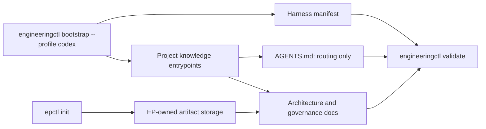

# Codex Project Documentation Bootstrap

Decision records:
[ADR-002](../adr/adr-002_codex-project-documentation-bootstrap.md) and
[ADR-004](../adr/adr-004_separate-workflow-orchestration-from-execution-planning.md).
This document describes their selected implementation.

## Purpose

Add a repository-aware bootstrap surface to Engineering Workflow. It creates
the minimum documentation control plane needed for Codex to navigate a project
and composes the deterministic, idempotent `epctl init` contract for EP-owned
artifacts.

The bootstrap establishes navigation and verification structure. It does not
claim that generic templates contain verified project facts.

## Scope

The first version provides one optional profile, `codex`, with these behaviors:

- preview all proposed actions without writing by default;
- apply the preview only when `--apply` is present;
- invoke the existing EP initialization semantics during apply;
- create missing Harness directories and document scaffolds;
- preserve every existing documentation/content file byte-for-byte;
- register `docs/design-docs` as an architecture root;
- record the enabled profile and required files in
  `docs/.engineering/harness.json`;
- validate the Harness automatically after bootstrap and through
  `engineeringctl validate`;
- enforce a maximum of 100 physical lines for each registered Agent instruction
  file.

The first version manages only the root `AGENTS.md`. Future nested instruction
files must be registered explicitly before the validator owns their limit.

## Non-goals

- Infer or invent architecture, product, security, or reliability facts.
- Rewrite or truncate an existing `AGENTS.md`.
- Accept ADRs or make architecture decisions.
- Configure worktrees, browsers, observability stacks, permissions, CI
  providers, deployment, or auto-merge.
- Create product-specific documents such as `FRONTEND.md` or
  `PRODUCT_SENSE.md` without repository evidence.
- Turn `AGENTS.md` into a complete manual.

## CLI Contract

Preview is the safe default:

```bash
python3 scripts/engineeringctl.py --repo . bootstrap --profile codex
python3 scripts/engineeringctl.py --repo . bootstrap --profile codex --dry-run
```

Apply is explicit:

```bash
python3 scripts/engineeringctl.py --repo . bootstrap --profile codex --apply
```

`--apply` and `--dry-run` are mutually exclusive. The command emits JSON with:

- `profile`;
- `mode`;
- `components`;
- ordered `actions`;
- `warnings`;
- `created` and `updated` paths when applied.

An action is one of `create_directory`, `create_file`, `register`, `preserve`,
or `conflict`. Apply performs a complete preflight and refuses all writes when
any conflict exists.

Harness verification is available explicitly:

```bash
python3 scripts/engineeringctl.py --repo . validate --harness
```

Normal `validate` also checks the Harness whenever
`docs/.engineering/harness.json` exists. `--harness` requires the manifest to exist,
so CI or a user can assert that bootstrap has been completed.

## Generated Structure

The `codex` profile adds the following paths to the existing EP layout:

```text
AGENTS.md
ARCHITECTURE.md
docs/
├── index.md
├── QUALITY_SCORE.md
├── RELIABILITY.md
├── SECURITY.md
├── design-docs/
│   └── index.md
├── RESEARCH.md
├── DECISIONS.md
├── PLANS.md
├── BUGFIXES.md
├── research/
├── adr/
├── exec-plans/
└── bugfixes/
```

`AGENTS.md` is a short routing map. Detailed architecture, quality, reliability,
security, research, decisions, and plans remain in the linked documents.

The only intentional mutation of an existing managed file is adding
`docs/design-docs` to `docs/.epctl/config.json`. Bootstrap does not rebuild
existing index projections; `reindex` remains an explicit operation.

## Harness Manifest

`docs/.engineering/harness.json` is independent from `config.json`, whose current
contract only owns architecture roots.

Schema version 1:

```json
{
  "version": 1,
  "owner": "engineering-workflow",
  "profile": "codex",
  "components": [
    "engineering-execution-plan"
  ],
  "instruction_files": [
    {
      "path": "AGENTS.md",
      "max_lines": 100
    }
  ],
  "required_files": [
    "AGENTS.md",
    "ARCHITECTURE.md",
    "docs/index.md",
    "docs/QUALITY_SCORE.md",
    "docs/RELIABILITY.md",
    "docs/SECURITY.md",
    "docs/design-docs/index.md"
  ]
}
```

All paths are repository-relative, must remain inside the repository, and may
not traverse symbolic links.

## Template Semantics

Templates must distinguish facts from prompts for future completion:

- generated documents declare themselves bootstrap scaffolds;
- unknown project facts stay explicitly `unknown` or `TODO`;
- no template claims that a command, architecture boundary, security control,
  SLO, or quality score exists;
- validation warns while bootstrap TODO markers remain;
- structural failures and the `AGENTS.md` line limit are errors.

The bundled `AGENTS.md` template targets at most 80 physical lines, leaving at
least 20 lines for repository-specific additions. Blank lines, comments, and
frontmatter count toward the 100-line limit.

## Existing Repository Behavior

Before apply, bootstrap checks every target:

- an existing regular file is preserved;
- an existing directory is reused;
- a file where a directory is required is a conflict;
- a directory where a file is required is a conflict;
- a symbolic link in any managed path is a conflict;
- an existing registered instruction file over its line limit is a conflict.

Bootstrap never repairs conflicts by deletion, truncation, renaming, or
overwriting. The preview reports the exact path and required manual action.

## Validation

Harness validation checks:

1. manifest schema and supported profile;
2. normalized, repository-contained, non-symlink paths;
3. existence and file type of every required file;
4. uniqueness of required and instruction paths;
5. instruction files are also required files;
6. `max_lines` is exactly `100` for the Codex profile;
7. physical line count does not exceed the registered maximum;
8. bootstrap TODO markers are reported as warnings;
9. `docs/design-docs` is registered as an architecture root.

Validation messages must include a stable problem label, affected path, actual
value, and required value so an Agent can remediate the problem directly.

## Ownership Boundaries



`engineering-execution-plan` owns EP directories, indexes, configuration and ID
state. `engineering-workflow` owns creation of missing Harness entrypoints and
its manifest. Once a document exists, its content is repository-owned;
bootstrap will not rewrite it.

## Implementation Surface

- `scripts/engineeringctl.py`
  - own bootstrap planning, apply, manifest loading, and Harness validation;
  - load the bundled EP initialization contract only during composition.
- `engineering-execution-plan/scripts/epctl.py`
  - preserve `init_repo` and all EP lifecycle behavior;
  - expose no Bootstrap or Harness validation command.
- `assets/`
  - add Codex Harness templates.
- `tests/test_engineeringctl.py`
  - add dry-run, apply, idempotence, preservation, conflict, manifest, and line
    limit tests.
- `engineering-execution-plan/tests/test_epctl.py`
  - retain the EP lifecycle regression suite without Harness tests.
- `tests/test_repository_contracts.py`
  - verify packaged assets and the bundled `AGENTS.md` line budget.
- `SKILL.md`, `README.md`, and `references/bootstrap.md`
  - document routing, commands, safety, and ownership.

## Acceptance

- Existing `init` tests and behavior remain unchanged.
- Preview produces no repository changes.
- Apply creates the declared structure and passes
  `engineeringctl validate --harness`.
- Repeating apply produces no content changes.
- Existing files remain byte-identical.
- A 100-line `AGENTS.md` passes.
- A 101-line `AGENTS.md` fails bootstrap preflight and Harness validation.
- Normal repository tests and canonical checks pass.
