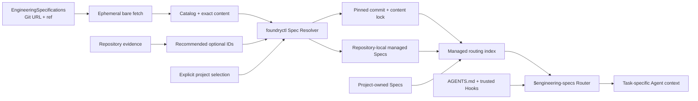
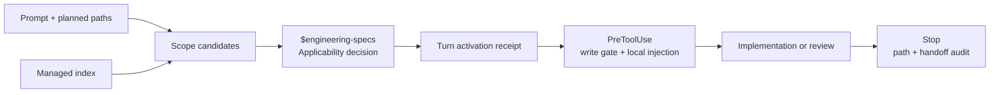

# Engineering Spec Resolution and Project Materialization

## Purpose

Extend the RepoFoundry AI Harness with versioned, composable engineering
Specs fetched from an independently governed Git repository. Bootstrap installs
required common guidance plus optional guidance explicitly selected by the
repository owner. Deterministic repository evidence recommends optional IDs;
it does not authorize installation. RepoFoundry generates one project-local
`$engineering-specs` Router Skill that reads repository-local copies through a
bounded `AGENTS.md` route. Trusted Codex Hooks make the turn decision, local
content injection, write gate, and completion audit mechanical without
depending on remote content at task time.

This design implements the ownership accepted by ADR-002, ADR-004, and ADR-005:
`repo-foundry-ai` owns project Bootstrap and Spec consumption,
`EngineeringSpecifications` owns Catalog and normative content, while
`engineering-execution-plan` remains Agent-neutral and owns only ADR, ExecPlan,
Task, Checkpoint, Bugfix, and technical-debt artifacts.

The release-source refinement follows approved EngineeringSpecifications
ESP-0008: production consumers select immutable `vX.Y.Z` Catalog tags, while
explicit branch refs remain development sources.

The selection refinement follows approved EngineeringSpecifications ESP-0009:
required entries remain automatic, detection is advisory, optional direct IDs
are user-selected, and dependency closure remains automatic.

The task-activation refinement follows approved EngineeringSpecifications
ESP-0010: one generated Router Skill evaluates file candidates plus task
Applicability, while AGENTS and trusted project Hooks require a turn-scoped
activation decision before implementation or review.



## Goals

- Always select a common semantic-naming Spec for implementation repositories.
- Recommend language Specs from deterministic repository evidence.
- Let the repository owner explicitly select the complete optional direct set.
- Support polyglot repositories without loading every language guide.
- Materialize exact Spec content inside the target repository.
- Record the immutable Git commit, versions, and SHA-256 digests in a lock file.
- Give reusable Specs an independent contribution and release lifecycle.
- Support public, private, self-hosted, branch, tag, and local Git sources
  through standard Git transport.
- Keep project-specific guidance repository-owned and independently editable.
- Preserve Bootstrap dry-run, whole-plan preflight, idempotence, and
  non-destructive behavior.
- Validate configuration, catalog content, local copies, project references,
  the generated Router package, Hook groups, and the Codex routing entry
  mechanically.

## Non-goals

- Bundle normative Engineering Spec content with the RepoFoundry distribution.
- Fetch individual raw HTTP files or silently fall back to packaged content.
- Store, prompt for, or manage Git credentials.
- Check out or execute code from the specification repository.
- Provide persistent catalog caching in version 1.
- Infer frameworks, architecture, owners, build commands, or project facts.
- Rewrite an existing `AGENTS.md` to insert a missing route.
- Overwrite or silently merge an existing `.codex/hooks.json`.
- Create one Skill per Specification or put Codex adapter files in the
  normative Catalog.
- Claim project Hook enforcement before the project and exact Hook definition
  are trusted by Codex.
- Delete untracked, drifted, or repository-owned files during deselection.
- Move project-owned guidance into the central catalog.

When lifecycle Hooks are unavailable, the same Router exposes an explicit
`begin` command that records the pre-write Git baseline for a caller-provided
session and turn. Manual activation remains fail-closed if `begin` was skipped,
and `audit --message` checks both changed-path coverage and the five-label
handoff. This makes fallback operational without pretending it has an automatic
write gate.

## Repository Layout

The independent
[EngineeringSpecifications](https://github.com/XiaoWeiKIN/EngineeringSpecifications)
repository contains:

```text
EngineeringSpecifications/
├── catalog.json
├── schemas/
│   └── catalog.schema.json
├── specification/
│   ├── core/
│   │   ├── data-boundaries.md
│   │   └── semantic-naming.md
│   └── languages/
│       └── go.md
├── scripts/
│   └── check.py
└── tests/
```

The RepoFoundry distribution contains no Catalog or normative Spec Markdown.
It contains only the Router templates and runtime adapter. The target project
receives:

```text
docs/
├── .engineering/
│   ├── harness.json
│   ├── specs.json
│   └── specs.lock.json
└── agent-guides/
    └── managed/
        ├── index.md
        ├── core/
        │   ├── data-boundaries.md
        │   └── semantic-naming.md
        └── languages/
            └── <selected-language>.md
.agents/
└── skills/
    └── engineering-specs/
        ├── SKILL.md
        ├── agents/openai.yaml
        └── scripts/spec_router.py
.codex/
└── hooks.json
```

`docs/agent-guides/managed/` is tool-owned. Project-specific Specs may live
anywhere inside the repository and are referenced from `specs.json`.

## Catalog Contract

`catalog.json` schema version 1 contains:

- a stable catalog ID;
- a semantic catalog version;
- one current entry for each Spec ID;
- a semantic version and source-relative Markdown path;
- the source file SHA-256;
- required Spec dependencies;
- optional deterministic language-detection markers;
- file scopes and a concise routing description.

Spec IDs use lowercase path segments, for example
`core/semantic-naming` and `languages/go`. Source paths must be relative,
remain within the Git tree, contain no traversal or revision separators, and
match their declared digest. Dependency IDs must exist and form an acyclic
graph.

Language detection may use marker filenames and source extensions. The resolver
ignores generated, dependency, VCS, and Harness-managed directories. Detection
only recommends optional Catalog entries; it neither installs them nor claims
the project uses a particular framework or architecture.

## Project Manifest

`docs/.engineering/specs.json` schema version 1 is repository-owned
configuration:

```json
{
  "version": 1,
  "owner": "repo-foundry",
  "catalog": {
    "kind": "git",
    "url": "https://github.com/XiaoWeiKIN/EngineeringSpecifications.git",
    "ref": "refs/tags/v1.2.0"
  },
  "specs": [
    "core/semantic-naming",
    "core/data-boundaries",
    "languages/go"
  ],
  "project_specs": [
    {
      "path": "docs/agent-guides/handler-pattern.md",
      "applies_to": ["internal/http/**"],
      "description": "Datafox HTTP Handler pattern"
    }
  ]
}
```

The only source kind is `git`. `url` is passed as one argument to Git after
validation; it may be an HTTPS, SSH, `git://`, `file://`, or SCP-style Git URL.
`ref` is a branch, tag, or full commit-like ref accepted by `git fetch` and may
not begin with `-`. Production release refs use the exact canonical form
`refs/tags/vMAJOR.MINOR.PATCH`. The default source is:

```json
{
  "kind": "git",
  "url": "https://github.com/XiaoWeiKIN/EngineeringSpecifications.git",
  "ref": "refs/tags/v1.2.0"
}
```

The default Catalog release is `1.2.0`. The option
`--spec-version MAJOR.MINOR.PATCH` constructs the canonical release ref; the resolver rejects
the source unless its `catalog_version` equals the requested version.
`--spec-ref` remains an explicit development escape hatch for a branch, custom
tag, or commit and does not imply a released Catalog version.

Bootstrap creates this file only when missing. Required Catalog entries always
form the mandatory part of `specs`; repeatable `--spec ID` values form the
complete optional direct part. Detection is returned as a recommendation and
does not mutate `specs`. Once the manifest exists, selection and source are
explicit project policy. `spec sync` reuses the existing locked commit and
selection. `spec update --spec-version ...` replaces the manifest source with
another release tag after preview; `spec update --spec-ref ...` explicitly
selects a development source. Without selection arguments, update preserves
the current IDs. Repeatable `--spec ID` replaces the optional direct set;
`--required-only` selects no optional IDs. The resolver adds dependencies after
direct selection.

Each project Spec path must remain inside the repository and identify a
non-symlink regular Markdown file. Project Spec scopes and descriptions are
rendered into the routing index but their content is never copied or rewritten.

## Lock Contract

`docs/.engineering/specs.lock.json` schema version 1 is generated and contains:

- catalog identity, semantic version, and catalog digest;
- requested Git URL/ref and the resolved 40-character commit;
- each resolved Spec ID and version;
- source and installed repository-relative paths;
- content SHA-256;
- scopes and routing description;
- the selected dependency closure.

The lock is the reproducibility and validation contract. Managed file bytes
must match the recorded digest. A published release tag must never move; the
resolved commit and digests still protect consumers from unexpected movement.
`spec sync` continues to resolve the locked commit. Changing the manifest
source while retaining an old lock requires an explicit update.

## Git Resolution

Networked operations create a temporary bare Git repository, set the configured
URL as `origin`, and fetch exactly one manifest ref or locked commit. They
resolve `FETCH_HEAD^{commit}` and read `catalog.json` and selected Markdown with
Git object commands. No working tree is checked out and no repository code,
hooks, filters, or scripts are run.

The resolver:

- uses argument arrays without a shell;
- sets `GIT_TERMINAL_PROMPT=0`;
- applies bounded command timeouts and output sizes;
- rejects URLs or refs that can be interpreted as command options;
- validates remote JSON and paths before addressing Git objects;
- verifies Catalog and file SHA-256 digests;
- deletes the temporary object store after resolution.

Existing Git credential helpers and SSH agents may satisfy authentication.
RepoFoundry never reads, accepts, logs, or persists credentials.

## CLI Contract

All mutating operations are preview-first:

```text
foundryctl spec plan
foundryctl spec sync [--dry-run | --apply]
foundryctl spec update [--spec ID ... | --required-only] [--dry-run | --apply]
foundryctl spec update --spec-version MAJOR.MINOR.PATCH [--spec ID ...] [--dry-run | --apply]
foundryctl spec validate
```

- `plan` resolves the current manifest, or previews the required-only initial
  manifest when it is absent. It lists all Catalog entries and distinguishes
  required, recommended, configured, and dependency-closed selected sets. With
  a lock, it previews the locked revision.
- `sync` materializes the explicitly selected Spec set from the locked commit;
  without a lock it resolves and creates one from the manifest ref.
- `update --spec-version ...` changes the manifest to a reviewed immutable
  release and refreshes the lock and selected content without changing direct
  selection. `update --spec-ref ...` is the explicit development-source
  equivalent. Repeated `--spec ID` values replace the complete optional direct
  selection; `--required-only` removes every optional direct ID.
- `validate` performs no writes and verifies the manifest, lock, managed
  content, project Spec references, routing index, and `AGENTS.md` route. It
  performs no network or Git operation.

`foundryctl bootstrap --profile codex` includes the same Spec plan and
accepts optional initial `--spec-repository` and `--spec-version` values.
`--spec-ref` selects an explicit development source instead. Repeated
`--spec ID` values choose optional Specs; omitting them creates a required-only
selection while reporting deterministic recommendations.
Bootstrap apply may create missing files but does not replace an existing
managed file with different bytes. An explicit `spec sync --apply` or
`spec update --apply` may replace files inside the managed namespace after the
preview reports the replacement.

## Routing

The RepoFoundry `AGENTS.md` template contains one stable instruction:

> Before implementation or review, invoke `$engineering-specs`; use
> `docs/agent-guides/managed/index.md` only as its locked routing source.

The generated index maps scope, description, version, and local path. It does
not duplicate Spec content. The Router Skill takes planned repository-relative
paths, returns conservative scope candidates, and requires the Agent to apply
each candidate's description and Applicability section. Before work, it records
either the applicable IDs or an explicit no-Spec reason. Dependencies enter the
activated closure automatically.



`UserPromptSubmit` and `SubagentStart` Hooks inject the Router contract and the
current local index as developer context. `PreToolUse` allows read-only
discovery and Router commands, but denies mutation until the active turn has a
valid receipt. It denies the first post-activation mutation once while
injecting the activated local Markdown, so the Agent must re-evaluate and retry
with the contract in context. `Stop` compares the prompt-time Git baseline with
the current tree and requires coverage plus the five-field Agent handoff.

Receipts are keyed by repository, session, and turn under Git metadata or the
platform temporary directory; they never become hidden project policy or
normative evidence. Managed content is SHA-256 verified again before injection.
No network access occurs during candidate, activation, Hook, status, or audit
operations.

Existing `AGENTS.md` and `.codex/hooks.json` files remain byte-preserved. A
missing mandatory route or required Hook group is a Bootstrap conflict, not a
silent edit. Maintainers explicitly merge the short route or Hook group and
rerun validation. Project-local Hooks load only in a trusted project, and
Codex requires trust review for each exact non-managed Hook definition.

## Safety and Ownership

- Catalog, manifest, lock, and installed paths reject traversal and symlinks.
- Remote Git content is parsed as untrusted data and never checked out or
  executed.
- Git failures report the URL/ref and remediation without exposing credential
  material.
- Bootstrap stops before all writes when any Harness or Spec conflict exists.
- Bootstrap never changes an existing manifest, lock, managed Spec, routing
  index, project Spec, `AGENTS.md`, or Hook configuration.
- Generated Router Skill files must match the RepoFoundry release; drift is an
  error rather than an instruction-injection ambiguity.
- Hook input, activation IDs, planned paths, runtime state, and Markdown are
  parsed as untrusted boundary data. Path traversal and symlinks fail closed.
- Explicit applied Spec commands only write the manifest, lock, routing index,
  and files beneath `docs/agent-guides/managed/`.
- Atomic writes and the existing Harness lock protect project state.
- Explicit deselection removes only previously locked managed files whose
  bytes still match their old digest. Drift blocks the complete update before
  writes. Untracked stale files are retained and omitted from the index/lock.
- Validation errors include a stable label, affected path, and remediation.

## Acceptance

- Empty repositories preview without writes and install the required Core Spec
  from the default remote repository when applied.
- Repositories containing Go evidence recommend `languages/go` without
  installing it until the user selects that ID.
- Explicit selections install one or more optional Specs, automatically add
  dependencies, and route the resulting closure by scope.
- `--required-only` previews and removes only unchanged, previously locked
  optional managed copies.
- Repeated Bootstrap and Spec sync operations are byte-idempotent.
- The default absent-manifest plan uses `refs/tags/v1.2.0`, and exact release
  refs whose Catalog version differs fail before writes.
- `spec sync` remains pinned after the tracked branch or tag moves; an explicit
  version/ref update adopts a new source and commit.
- Catalog digest drift, managed-content drift, missing lock entries, traversal,
  dependency cycles, unreachable refs, and missing project Specs fail safely.
- Existing `AGENTS.md` and project documentation remain byte-identical.
- Fresh Bootstrap creates exactly one valid `engineering-specs` Skill and the
  four required Codex Hook groups.
- Candidate routing uses file scopes without equating scope with activation;
  explicit activation adds dependencies and explicit `none` requires a reason.
- An unactivated edit, an undeclared target path, digest drift, and incomplete
  completion handoff are rejected in isolated Hook tests.
- A custom Hook file is never overwritten and instead receives a deterministic
  manual-merge conflict.
- The independently installed `repo-foundry-ai` package contains no
  normative Spec files and resolves the public default source.
- EngineeringSpecifications and RepoFoundry each have a canonical
  check, and Workflow integration tests use isolated Git fixture repositories.
