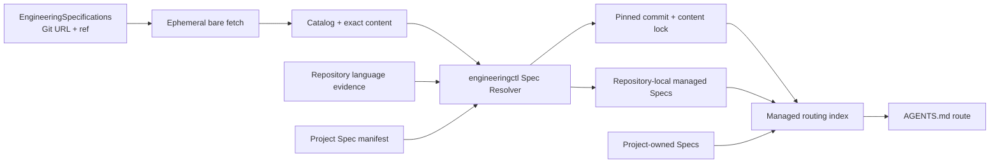
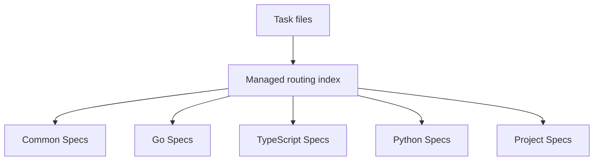

# Engineering Spec Resolution and Project Materialization

## Purpose

Extend the Engineering Workflow Harness with versioned, composable engineering
Specs fetched from an independently governed Git repository. Bootstrap installs
required common guidance and language guidance detected from repository
evidence. Codex reads repository-local copies through a bounded `AGENTS.md`
route rather than depending on remote content at task time.

This design implements the ownership accepted by ADR-002, ADR-004, and ADR-005:
`engineering-workflow` owns project Bootstrap and Spec consumption,
`EngineeringSpecifications` owns Catalog and normative content, while
`engineering-execution-plan` remains Agent-neutral and owns only ADR, ExecPlan,
Task, Checkpoint, Bugfix, and technical-debt artifacts.



## Goals

- Always select a common semantic-naming Spec for implementation repositories.
- Select language Specs from deterministic repository evidence.
- Support polyglot repositories without loading every language guide.
- Materialize exact Spec content inside the target repository.
- Record the immutable Git commit, versions, and SHA-256 digests in a lock file.
- Give reusable Specs an independent contribution and release lifecycle.
- Support public, private, self-hosted, branch, tag, and local Git sources
  through standard Git transport.
- Keep project-specific guidance repository-owned and independently editable.
- Preserve Bootstrap dry-run, whole-plan preflight, idempotence, and
  non-destructive behavior.
- Validate configuration, catalog content, local copies, project references,
  and the Codex routing entry mechanically.

## Non-goals

- Bundle normative Engineering Spec content with EngineeringWorkflow.
- Fetch individual raw HTTP files or silently fall back to packaged content.
- Store, prompt for, or manage Git credentials.
- Check out or execute code from the specification repository.
- Provide persistent catalog caching in version 1.
- Infer frameworks, architecture, owners, build commands, or project facts.
- Rewrite an existing `AGENTS.md` to insert a missing route.
- Remove stale managed files automatically.
- Move project-owned guidance into the central catalog.

## Repository Layout

The independent
[EngineeringSpecifications](https://github.com/XiaoWeiKIN/EngineeringSpecifications)
repository contains:

```text
EngineeringSpecifications/
├── catalog.json
├── schemas/
│   └── catalog.schema.json
├── specification/
│   ├── core/
│   │   └── semantic-naming.md
│   └── languages/
│       ├── go.md
│       ├── python.md
│       └── typescript.md
├── scripts/
│   └── check.py
└── tests/
```

EngineeringWorkflow contains no Catalog or normative Spec Markdown. The target
project receives:

```text
docs/
├── .engineering/
│   ├── harness.json
│   ├── specs.json
│   └── specs.lock.json
└── agent-guides/
    └── managed/
        ├── index.md
        ├── core/
        │   └── semantic-naming.md
        └── languages/
            └── <selected-language>.md
```

`docs/agent-guides/managed/` is tool-owned. Project-specific Specs may live
anywhere inside the repository and are referenced from `specs.json`.

## Catalog Contract

`catalog.json` schema version 1 contains:

- a stable catalog ID;
- a semantic catalog version;
- one current entry for each Spec ID;
- a semantic version and source-relative Markdown path;
- the source file SHA-256;
- required Spec dependencies;
- optional deterministic language-detection markers;
- file scopes and a concise routing description.

Spec IDs use lowercase path segments, for example
`core/semantic-naming` and `languages/go`. Source paths must be relative,
remain within the Git tree, contain no traversal or revision separators, and
match their declared digest. Dependency IDs must exist and form an acyclic
graph.

Language detection may use marker filenames and source extensions. The resolver
ignores generated, dependency, VCS, and Harness-managed directories. Detection
only chooses catalog entries; it does not claim the project uses a particular
framework or architecture.

## Project Manifest

`docs/.engineering/specs.json` schema version 1 is repository-owned
configuration:

```json
{
  "version": 1,
  "owner": "engineering-workflow",
  "catalog": {
    "kind": "git",
    "url": "https://github.com/XiaoWeiKIN/EngineeringSpecifications.git",
    "ref": "main"
  },
  "specs": [
    "core/semantic-naming",
    "languages/go"
  ],
  "project_specs": [
    {
      "path": "docs/agent-guides/handler-pattern.md",
      "applies_to": ["internal/http/**"],
      "description": "Datafox HTTP Handler pattern"
    }
  ]
}
```

The only source kind is `git`. `url` is passed as one argument to Git after
validation; it may be an HTTPS, SSH, `git://`, `file://`, or SCP-style Git URL.
`ref` is a branch, tag, or full commit-like ref accepted by `git fetch` and may
not begin with `-`. The default source is:

```json
{
  "kind": "git",
  "url": "https://github.com/XiaoWeiKIN/EngineeringSpecifications.git",
  "ref": "main"
}
```

Bootstrap creates this file only when missing. Required catalog entries and
detected languages form the initial `specs` selection. Once the manifest
exists, the selection and source are explicit project policy. `spec sync`
reuses an existing locked commit. `spec update` resolves the manifest ref
again, may add newly detected language entries, and never removes an existing
selection.

Each project Spec path must remain inside the repository and identify a
non-symlink regular Markdown file. Project Spec scopes and descriptions are
rendered into the routing index but their content is never copied or rewritten.

## Lock Contract

`docs/.engineering/specs.lock.json` schema version 1 is generated and contains:

- catalog identity, semantic version, and catalog digest;
- requested Git URL/ref and the resolved 40-character commit;
- each resolved Spec ID and version;
- source and installed repository-relative paths;
- content SHA-256;
- scopes and routing description;
- the selected dependency closure.

The lock is the reproducibility and validation contract. Managed file bytes
must match the recorded digest. Branch or tag movement affects the project only
after `spec update --apply`; `spec sync` continues to resolve the locked commit.
Changing the manifest source while retaining an old lock requires an explicit
update.

## Git Resolution

Networked operations create a temporary bare Git repository, set the configured
URL as `origin`, and fetch exactly one manifest ref or locked commit. They
resolve `FETCH_HEAD^{commit}` and read `catalog.json` and selected Markdown with
Git object commands. No working tree is checked out and no repository code,
hooks, filters, or scripts are run.

The resolver:

- uses argument arrays without a shell;
- sets `GIT_TERMINAL_PROMPT=0`;
- applies bounded command timeouts and output sizes;
- rejects URLs or refs that can be interpreted as command options;
- validates remote JSON and paths before addressing Git objects;
- verifies Catalog and file SHA-256 digests;
- deletes the temporary object store after resolution.

Existing Git credential helpers and SSH agents may satisfy authentication.
EngineeringWorkflow never reads, accepts, logs, or persists credentials.

## CLI Contract

All mutating operations are preview-first:

```text
engineeringctl spec plan
engineeringctl spec sync [--dry-run | --apply]
engineeringctl spec update [--dry-run | --apply]
engineeringctl spec validate
```

- `plan` resolves the current manifest, or previews the inferred initial
  manifest when it is absent. With a lock, it previews the locked revision.
- `sync` materializes the explicitly selected Spec set from the locked commit;
  without a lock it resolves and creates one from the manifest ref.
- `update` resolves the manifest ref again, refreshes the lock and selected
  content, and additionally discovers newly introduced languages.
- `validate` performs no writes and verifies the manifest, lock, managed
  content, project Spec references, routing index, and `AGENTS.md` route. It
  performs no network or Git operation.

`engineeringctl bootstrap --profile codex` includes the same Spec plan and
accepts optional initial `--spec-repository` and `--spec-ref` values.
Bootstrap apply may create missing files but does not replace an existing
managed file with different bytes. An explicit `spec sync --apply` or
`spec update --apply` may replace files inside the managed namespace after the
preview reports the replacement.

## Routing

The Workflow `AGENTS.md` template contains one stable instruction:

> Before implementation or review, read
> `docs/agent-guides/managed/index.md` and follow every entry whose scope
> matches the files being changed.

The generated index maps scope, description, version, and local path. It does
not duplicate Spec content. Existing `AGENTS.md` files remain byte-preserved;
validation reports a warning with the required route when it is absent.



## Safety and Ownership

- Catalog, manifest, lock, and installed paths reject traversal and symlinks.
- Remote Git content is parsed as untrusted data and never checked out or
  executed.
- Git failures report the URL/ref and remediation without exposing credential
  material.
- Bootstrap stops before all writes when any Harness or Spec conflict exists.
- Bootstrap never changes an existing manifest, lock, managed Spec, routing
  index, project Spec, or `AGENTS.md`.
- Explicit applied Spec commands only write the manifest, lock, routing index,
  and files beneath `docs/agent-guides/managed/`.
- Atomic writes and the existing Harness lock protect project state.
- Stale managed files are retained but omitted from the current index and lock.
- Validation errors include a stable label, affected path, and remediation.

## Acceptance

- Empty repositories preview without writes and install the required Core Spec
  from the default remote repository when applied.
- Repositories containing Go, TypeScript, or Python evidence select only the
  applicable language Specs plus Core.
- Polyglot repositories install multiple language Specs and route them by
  scope.
- Repeated Bootstrap and Spec sync operations are byte-idempotent.
- `spec sync` remains pinned after the tracked branch moves; `spec update`
  adopts the new commit.
- Catalog digest drift, managed-content drift, missing lock entries, traversal,
  dependency cycles, unreachable refs, and missing project Specs fail safely.
- Existing `AGENTS.md` and project documentation remain byte-identical.
- The independently installed `engineering-workflow` package contains no
  normative Spec files and resolves the public default source.
- EngineeringSpecifications and EngineeringWorkflow each have a canonical
  check, and Workflow integration tests use isolated Git fixture repositories.
