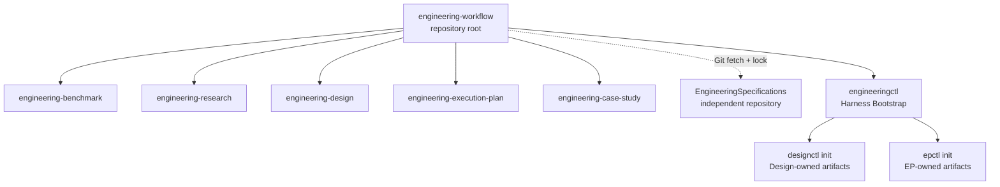

# EngineeringWorkflow Skill Packaging

This document remains current for the aggregation and professional-Skill
boundaries adopted by ADR-004 and ADR-005. Its product identifiers and path
examples record the original packaging baseline.
[RepoFoundry AI system identity and packaging](repo-foundry-system.md) amends
that naming while retaining these structural boundaries.
[Agent-neutral Harness and Engineering Spec adapters](agent-neutral-harness-adapters.md)
amends the root asset layout and Bootstrap command examples below; they remain
the `0.1.0` packaging baseline rather than current adapter paths.
[First-class technical Design Documents](first-class-technical-design-documents.md)
extends the professional-Skill boundary with `engineering-design`; the original
four-Skill lists below are updated to show the current composition.

Decision records:
[ADR-004](../adr/adr-004_separate-workflow-orchestration-from-execution-planning.md)
and
[ADR-005](../adr/adr-005_external-engineering-specifications.md), and
[ADR-018](../adr/adr-018_first-class-technical-design-documents.md).

## Purpose

Make the repository structure match the product boundary. The repository root
is an installable `engineering-workflow` aggregation Skill. Benchmark,
Research, Design, Execution Plan, and Case Study remain focused professional Skills;
the former root Execution Plan package moves to
`engineering-execution-plan/`.



## Package Layout

```text
EngineeringWorkflow/
├── SKILL.md
├── agents/openai.yaml
├── assets/harness-*.md
├── references/bootstrap.md
├── scripts/
│   ├── engineeringctl.py
│   ├── spec_manager.py
│   └── check.py
├── engineering-benchmark/
├── engineering-research/
├── engineering-design/
├── engineering-execution-plan/
└── engineering-case-study/
```

Root `docs/`, `examples/`, CI adapters and `scripts/check.py` belong to the
distribution repository. Every professional Skill owns its `SKILL.md`,
`agents/`, `assets/`, `references/`, `scripts/`, tests and eval catalog.

## Ownership

| Owner | Responsibilities |
|---|---|
| `engineering-workflow` | Project Harness templates, manifest, Bootstrap preflight, remote Engineering Spec resolution, aggregate routing |
| `EngineeringSpecifications` | Catalog schema, normative Specs, content versions, digests, and releases |
| `engineering-benchmark` | Suite, Scenario, Run, Result and evidence sealing |
| `engineering-research` | Research questions, topics, corpus, snapshots and Synthesis |
| `engineering-design` | Design Package identity, members, reading maps, manifests, lifecycle and approved revision snapshots |
| `engineering-execution-plan` | ADR, ExecPlan, Task, Checkpoint, Bugfix and technical debt |
| `engineering-case-study` | Evidence-backed engineering narratives |

The five professional Skills remain independently installable and do not import
one another. The root aggregation Skill may load the bundled Design and EP CLIs
only while composing project initialization. It must fail clearly if either
bundled component is absent.

## Command Boundaries

```text
scripts/engineeringctl.py
  bootstrap --profile codex [--dry-run | --apply]
  validate --harness
  spec plan
  spec sync / update [--dry-run | --apply]
  spec validate

engineering-execution-plan/scripts/epctl.py
  init
  register-architecture-root
  register-adr-revision [--from-file | --from-git-blob] [--apply]
  register-checkpoint-recovery --from-git-commit [--git-path] [--apply]
  new-adr / decide-adr / new-ep / ...
  validate / reindex / status

engineering-design/scripts/designctl.py
  init
  new-design / new-member / sync
  mark-review-ready / approve / revise / abandon / supersede
  validate / reindex / status
```

`engineeringctl` owns neither Design/ADR/EP IDs nor their templates. During
apply it imports the bundled `designctl` and `epctl` contracts, runs both
idempotent `init` operations, and registers `docs/design-docs`. Neither
professional CLI exposes a Codex profile, Harness manifest, or `AGENTS.md`
validation surface.

## State Boundaries

- `docs/.engineering/harness.json` records the project-level Harness.
- `docs/.engineering/specs.json` records project Spec selection and overlays.
- `docs/.engineering/specs.lock.json` records resolved versions and digests.
- `docs/.engineering/lock` serializes Harness changes.
- `docs/.designctl/state.json` records Design and package-member high-water IDs.
- `docs/.epctl/state.json`, `docs/.epctl/config.json`, and optional immutable
  `docs/.epctl/adr-revisions/` remain EP state. Historical ADR validation is
  therefore portable and does not enter the Harness manifest or an Agent adapter.
- `benchmarks/.benchctl/` remains Benchmark state.

Project initialization may append `docs/design-docs` to the EP architecture
roots. It does not combine the Harness and EP schemas.

## Migration

- Rename the repository presentation from `EngineeringPlan` to
  `EngineeringWorkflow`.
- Replace `ENGINEERING_PLAN_HOME` with `ENGINEERING_WORKFLOW_HOME` in current
  examples.
- Register the repository root as `engineering-workflow`.
- Register `engineering-design/` separately for Design requests.
- Register `engineering-execution-plan/` separately for EP requests.
- Update callers from `scripts/epctl.py` to
  `engineering-execution-plan/scripts/epctl.py`.
- Rename the GitHub repository after merge; GitHub redirects old repository and
  Git transport URLs, but local remotes should still be updated. See
  <https://docs.github.com/en/repositories/creating-and-managing-repositories/renaming-a-repository>.

The old `$execution-plan` Skill name and root CLI path are not retained as
parallel packages because duplicated packages would create two sources of truth.
The README carries the explicit migration path.

## Verification

- Validate all six Skill metadata packages and five eval catalogs.
- Run `engineeringctl` dry-run, apply, idempotence, preservation and line-limit
  tests, plus Core, language, polyglot, lock, drift, and project Spec tests.
- Reject bundled normative Spec content and prove an independently installed
  Workflow Skill resolves a temporary or public Git-backed Catalog.
- Prove locked sync remains pinned and explicit update adopts a moved Git ref.
- Run the independently installed `engineering-design` and
  `engineering-execution-plan` test suites.
- Copy the root aggregation package with its bundled Design and EP components
  and prove Bootstrap works without private host paths.
- Run `python3 -B scripts/check.py` as the canonical repository check.
