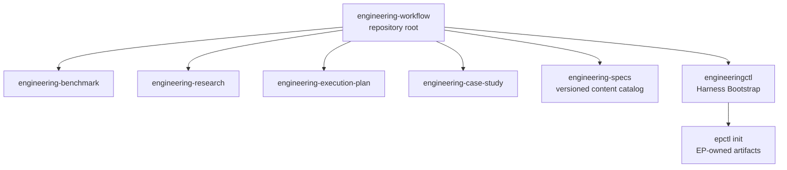

# EngineeringWorkflow Skill Packaging

Decision record: [ADR-004](../adr/adr-004_separate-workflow-orchestration-from-execution-planning.md).

## Purpose

Make the repository structure match the product boundary. The repository root
is an installable `engineering-workflow` aggregation Skill. Benchmark,
Research, Execution Plan, and Case Study remain focused professional Skills;
the former root Execution Plan package moves to
`engineering-execution-plan/`.



## Package Layout

```text
EngineeringWorkflow/
├── SKILL.md
├── agents/openai.yaml
├── assets/harness-*.md
├── engineering-specs/
│   ├── catalog.json
│   ├── core/
│   └── languages/
├── references/bootstrap.md
├── scripts/
│   ├── engineeringctl.py
│   ├── spec_manager.py
│   └── check.py
├── engineering-benchmark/
├── engineering-research/
├── engineering-execution-plan/
└── engineering-case-study/
```

Root `docs/`, `examples/`, CI adapters and `scripts/check.py` belong to the
distribution repository. Every professional Skill owns its `SKILL.md`,
`agents/`, `assets/`, `references/`, `scripts/`, tests and eval catalog.

## Ownership

| Owner | Responsibilities |
|---|---|
| `engineering-workflow` | Project Harness templates, manifest, Bootstrap preflight, Engineering Spec resolution, aggregate routing |
| `engineering-benchmark` | Suite, Scenario, Run, Result and evidence sealing |
| `engineering-research` | Research questions, topics, corpus, snapshots and Synthesis |
| `engineering-execution-plan` | ADR, ExecPlan, Task, Checkpoint, Bugfix and technical debt |
| `engineering-case-study` | Evidence-backed engineering narratives |

The four professional Skills remain independently installable and do not import
one another. The root aggregation Skill may load the bundled EP CLI only while
composing project initialization. It must fail clearly if that bundled
component is absent.

## Command Boundaries

```text
scripts/engineeringctl.py
  bootstrap --profile codex [--dry-run | --apply]
  validate --harness
  spec plan
  spec sync / update [--dry-run | --apply]
  spec validate

engineering-execution-plan/scripts/epctl.py
  init
  register-architecture-root
  new-adr / decide-adr / new-ep / ...
  validate / reindex / status
```

`engineeringctl` owns neither ADR IDs nor EP templates. During apply it imports
the bundled `epctl` contract, runs its idempotent `init`, and registers
`docs/design-docs`. `epctl` exposes no Codex profile, Harness manifest or
`AGENTS.md` validation surface.

## State Boundaries

- `docs/.engineering/harness.json` records the project-level Harness.
- `docs/.engineering/specs.json` records project Spec selection and overlays.
- `docs/.engineering/specs.lock.json` records resolved versions and digests.
- `docs/.engineering/lock` serializes Harness changes.
- `docs/.epctl/state.json` and `docs/.epctl/config.json` remain EP state.
- `benchmarks/.benchctl/` remains Benchmark state.

Project initialization may append `docs/design-docs` to the EP architecture
roots. It does not combine the Harness and EP schemas.

## Migration

- Rename the repository presentation from `EngineeringPlan` to
  `EngineeringWorkflow`.
- Replace `ENGINEERING_PLAN_HOME` with `ENGINEERING_WORKFLOW_HOME` in current
  examples.
- Register the repository root as `engineering-workflow`.
- Register `engineering-execution-plan/` separately for EP requests.
- Update callers from `scripts/epctl.py` to
  `engineering-execution-plan/scripts/epctl.py`.
- Rename the GitHub repository after merge; GitHub redirects old repository and
  Git transport URLs, but local remotes should still be updated. See
  <https://docs.github.com/en/repositories/creating-and-managing-repositories/renaming-a-repository>.

The old `$execution-plan` Skill name and root CLI path are not retained as
parallel packages because duplicated packages would create two sources of truth.
The README carries the explicit migration path.

## Verification

- Validate all five Skill metadata packages and four eval catalogs.
- Run `engineeringctl` dry-run, apply, idempotence, preservation and line-limit
  tests, plus Core, language, polyglot, lock, drift, and project Spec tests.
- Validate the bundled `engineering-specs/catalog.json` and prove it remains a
  portable content package in an independently installed Workflow Skill.
- Run the independently installed `engineering-execution-plan` test suite.
- Copy the root aggregation package with its bundled EP component and prove
  Bootstrap works without private host paths.
- Run `python3 -B scripts/check.py` as the canonical repository check.
