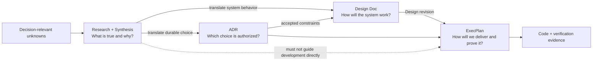
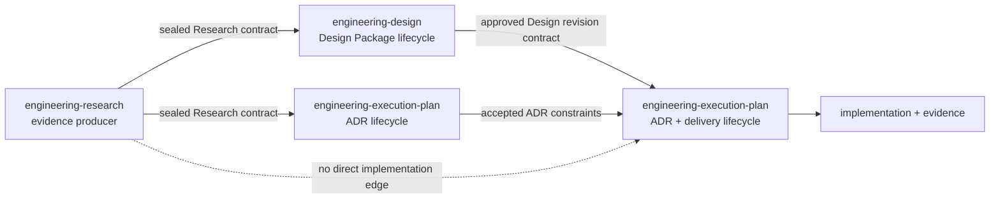
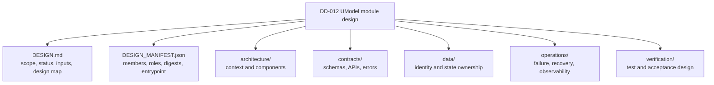
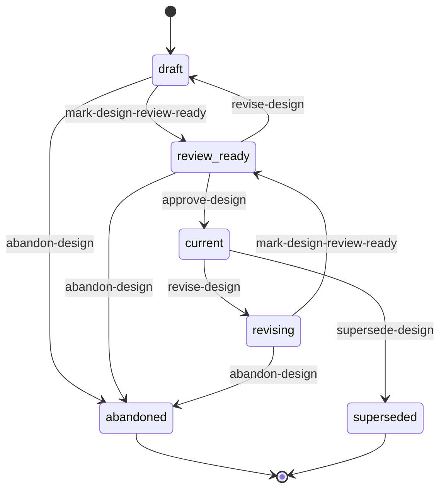
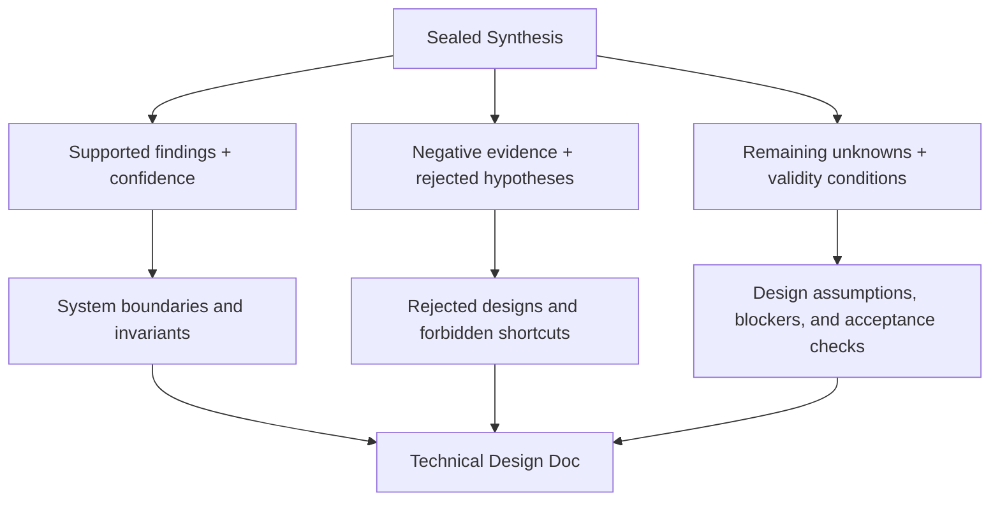
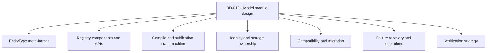

# First-class technical Design Documents

RepoFoundry needs a governed artifact that translates established evidence into
an implementable system model. Research establishes what is true, uncertain,
or recommended. A logical technical Design specifies how the selected system
will behave: its boundaries, interfaces, data model, flows, failure semantics,
compatibility obligations, and verification strategy. A small design may fit
in one Markdown file; a module or system design may require a manifest-managed
set of documents that share one identity and review boundary.

The current repository recognizes Design Docs as linked architecture inputs,
but only after authors create them manually. `epctl` validates their metadata
and lets ADRs and ExecPlans reference them; no producer allocates `DD-NNN`,
scaffold their content, consume a concluded Research handoff, or manage their
lifecycle. This design closes that production gap without changing the
authority of Research, ADRs, or ExecPlans.

## The workflow needs four distinct answers

Each artifact must answer one engineering question and hand a versioned file
contract to the next consumer.



The arrows do not impose a single-pass waterfall. Authors may draft a Design
Doc while an ADR is proposed, then revise the document to conform to accepted
constraints. Some work needs only an accepted ADR, some needs a Design with a
concrete decision-not-required reason, and some needs both. The gates remain
directional: Research can inform ADR/Design but cannot itself become a development
input, an unaccepted ADR cannot authorize a durable choice, and a Design Doc
cannot replace an implementation plan.

| Artifact | Primary question | Owns | Must not own |
|---|---|---|---|
| Research | What is true, unknown, or supported by evidence? | questions, sources, experiments, option comparison, confidence, Synthesis | target interfaces, implementation architecture, delivery tasks |
| Design Doc | How should the selected system behave? | one logical design package containing boundaries, components, interfaces, data, flows, failure behavior, migration, operations, and verification design | decision authority, task progress, completion evidence |
| ADR | Which durable choice is authorized? | one decision, normative constraints, consequences, confirmation, Decision Owner authorization | detailed component design or execution history |
| ExecPlan | How will the authorized design be delivered? | milestones, paths, tasks, commands, recovery, acceptance evidence | new unsupported architecture decisions |

## Engineering Design owns production; Execution Plan consumes the contract

The multi-document model gives Design its own bounded context:

- a direct user intent: create, review, revise, or inspect a technical design;
- a distinct artifact graph: logical `DD-NNN`, package-local `DOC-NNN`,
  manifest, reading map, artifacts, and revision snapshots;
- a distinct lifecycle: draft, review-ready, current, revising, abandoned, and
  superseded;
- a distinct integrity boundary: package membership, hashes, published
  revisions, and approval evidence; and
- a reusable output consumed by ADR review, ExecPlan, implementation, and
  architecture navigation.

Loading Task, Checkpoint, Bugfix, technical-debt, and plan-archive instructions
for a Design-only request reduces trigger precision and spends context on an
unrelated lifecycle. `engineering-design` therefore owns Design production and
exposes `designctl`.

`engineering-research` remains an independently installable evidence producer.
`engineering-design` consumes its concluded package contract, never imports
`researchctl`, and never concludes Research.

`engineering-execution-plan` remains the authority for ADR, ExecPlan, Task,
Checkpoint, Bugfix, and technical debt. It consumes approved Design Package
revisions through a versioned file contract, validates Design dependency
closure for ADRs and EPs, and never creates, approves, revises, or supersedes a
Design. ExecPlan `research_refs` are audit provenance only: for active v2.8 plans,
they must exactly match the Research references consumed by the plan's ADR/Design
inputs. A Research-only plan fails creation and validation.



All three packages remain independently installable. Consumers parse
repository files and manifests; they do not call a sibling skill or depend on
its installation path. RepoFoundry AI is the only aggregation layer allowed to
compose their initialization and routing.

## One DD-NNN identifies one review boundary, not one file

The artifact identity belongs to the logical design. Physical representation
is selected at creation time:

- `layout: single` stores a bounded design in one `dd-NNN_slug.md` file.
- `layout: package` stores a module or system design in a stable directory with
  one control document, one manifest, a reading map, and multiple managed
  documents.



The package path remains stable across lifecycle states:

```text
docs/design-docs/dd-012_umodel-registry/
├── DESIGN.md
├── DESIGN_MANIFEST.json
├── docs/
│   └── README.md
├── architecture/
│   ├── context-and-boundaries.md
│   └── components-and-dependencies.md
├── contracts/
│   ├── entity-type-schema.md
│   ├── registry-api.md
│   └── validation-errors.md
├── data/
│   └── identity-and-storage.md
├── operations/
│   ├── publication-and-recovery.md
│   └── observability.md
├── migration/
│   └── compatibility-and-rollout.md
├── verification/
│   └── acceptance-strategy.md
├── artifacts/
└── snapshots/
    └── rev-001/
```

`DESIGN.md` is the package entrypoint and carries `DD-012` metadata, Research
and ADR inputs, goals, non-goals, system-wide invariants, the document map,
cross-document conclusions, open blockers, and revision state. It does not
copy every child document.

`docs/README.md` is the human reading route. It explains which documents to
read for architecture review, API review, data review, operations review, or
implementation handoff. It is a navigation projection, not another source of
design conclusions.

Every managed member receives a stable package-local identity such as
`DD-012/DOC-003`. Moving or renaming its file does not change that identity.
The member frontmatter declares its role and package:

```yaml
---
design_id: DD-012
document_id: DOC-003
role: interface
title: EntityType registry API
author: Codex
owner: Model Platform Owner
updated: 2026-08-16
---
```

The manifest is the machine-readable fact source for package membership:

```json
{
  "schema_version": "1",
  "artifact_type": "design-manifest",
  "id": "DD-012-MANIFEST",
  "design_id": "DD-012",
  "working_revision": 1,
  "entrypoint": "DESIGN.md",
  "documents": [
    {
      "id": "DOC-003",
      "role": "interface",
      "path": "contracts/registry-api.md",
      "title": "EntityType registry API",
      "sha256": "<document-sha256>"
    }
  ]
}
```

Allowed roles include `architecture`, `component`, `interface`, `data`,
`flow`, `security`, `operations`, `migration`, `verification`, and `appendix`.
Roles organize review coverage; they do not force one file per role.

The package boundary follows lifecycle independence:

- Keep a topic as `DOC-NNN` when it only makes sense as part of this module and
  must be approved with the rest of the design.
- Create another global `DD-NNN` when a subdesign has a different owner,
  independent consumers, its own ADRs, or a separate revision and rollout
  lifecycle.
- Compose independently governed designs with typed `design_dependencies` and
  show their relationship in the root module Design Map. Do not copy one Design
  Package into another.

## A Design Doc has its own lifecycle

New Design Docs use schema `1.1` and a repository-unique `DD-NNN`. The lifecycle
applies to the whole logical design, whether it has one file or fifty.



- `draft` permits incomplete sections and proposed ADR references. An ExecPlan
  may cite it only with an explicit warning and cannot complete against it.
- `review_ready` has no unresolved required markers, has a complete manifest,
  passes Research input validation, and is ready for Design Owner review.
- `current` records explicit approval for one complete package revision. Every
  durable choice described by any member must be covered by current accepted
  ADRs, or the root must give a specific `decision_not_required_reason`.
- `revising` preserves the last published revision for existing consumers while
  authors prepare a new working revision. New work cannot consume the draft
  revision until it is approved.
- `abandoned` records that the proposed design will not proceed.
- `superseded` points to a newer current Design Doc that replaces its scope.

Approval is narrower than ADR authorization. It confirms that the exact files
listed by the sealed manifest form a coherent and current explanation of the
architecture. It does not accept an ADR or turn explanatory prose into
normative constraints.

## Research conversion is a traceable translation

`new-design --research R-NNN` accepts only concluded Research packages that
satisfy the existing sealed Synthesis contract. The command scaffolds the
document and records input references; the author performs the semantic
translation.



The root Design and its managed members repeat the decision-relevant
conclusions required to understand the design. A bare link to `SYNTHESIS.md` is
insufficient. The package preserves
confidence limits and negative evidence so an implementation does not present
a conditional Research recommendation as an unconditional architecture fact.

One Research may produce several Design Packages, and one Design Package may
consume several Research packages. IDs and references therefore form a
many-to-many graph; conversion never moves, renames, or mutates the Research
package. A Research that has not been referenced by an ADR or Design remains a
Research result only. Its recommendation cannot be copied directly into an
ExecPlan as a constraint, milestone, Task, or acceptance criterion.

If Research was not required because authoritative standards, existing current
architecture, or an explicit user direction already fixes the inputs, creation
requires a concrete `--research-not-required-reason`. This reason belongs to
the Design Doc and remains independently reviewable by a later ADR or EP.

## The content profile applies to the package, not every member

The complete Design Package must cover the following concerns. A single layout
uses sections in one file. A package layout distributes concerns across member
documents and maps each concern from `DESIGN.md` and the manifest.

1. **Design Summary** — selected shape, user-visible outcome, and validity
   conditions in one bounded statement.
2. **Goals and Non-goals** — owned scope and explicit exclusions.
3. **Research and Decision Inputs** — reproduced findings, confidence,
   negative evidence, remaining unknowns, and ADR constraints.
4. **System Context and Invariants** — existing boundaries that the design
   preserves, with a Mermaid context diagram when relationships matter.
5. **Proposed Architecture** — components, responsibilities, ownership, and
   dependency direction.
6. **Interfaces and Contracts** — APIs, schemas, commands, events, versioning,
   idempotency, validation, and error surfaces.
7. **Data Model and State Ownership** — identity, lifecycle, persistence,
   consistency, retention, and sensitive-data boundaries.
8. **Control and Data Flows** — success paths, concurrency, retries, and
   partial failure using sequence or flow diagrams where useful.
9. **Failure Semantics and Recovery** — fail-open/closed behavior, timeouts,
   rollback, reconciliation, and operator actions.
10. **Compatibility, Migration, and Rollout** — old/new coexistence, upgrade,
    downgrade, cleanup, and irreversible boundaries.
11. **Security, Privacy, and Operations** — trust boundaries, authorization,
    observability, capacity assumptions, alerts, and support ownership.
12. **Verification Strategy** — contract, integration, migration, failure,
    security, and operational evidence needed before an EP can complete.
13. **Alternatives, Open Questions, and Revisit Triggers** — rejected shapes,
    blockers, evidence that would change the design, and follow-up ownership.

`DESIGN.md` contains a coverage table so reviewers can prove that the package
answers every concern without opening files by guesswork:

| Concern | Package document | Stable reference | Review owner |
|---|---|---|---|
| Proposed Architecture | `architecture/components-and-dependencies.md` | `DD-012/DOC-002` | Model Platform Owner |
| Interfaces and Contracts | `contracts/entity-type-schema.md` | `DD-012/DOC-003` | Schema Owner |
| Failure and Recovery | `operations/publication-and-recovery.md` | `DD-012/DOC-007` | Runtime Owner |

A concern may state `Not applicable` with a concrete reason in the coverage
table. Missing coverage, unregistered members, and empty required placeholders
block `mark-design-review-ready`.

## The UModel example becomes one coherent package

An UModel Research may conclude that `primaryLabel` is the stable runtime type,
identity paths must remain invariant across API versions, and a registry should
compile declarations before activation. Those are evidence-backed findings.

The corresponding Design Package can distribute the system contract without
losing one review boundary:



An ADR decides whether the meta-format and its stable invariants become the
project's durable model contract. The approved Design Package explains their
complete realization. The ExecPlan names the code modules, migrations,
milestones, and verification commands that deliver the package.

This boundary prevents a detailed Research explanation written in a chat from
silently becoming the system contract and prevents a folder of unrelated
Markdown files from masquerading as one reviewed module design.

## Designctl manages both layouts through one identity model

The independent `engineering-design` package exposes:

```text
designctl init
designctl new-design --slug SLUG --title TITLE
                 --layout single|package
                 [--research R-NNN ...]
                 [--research-not-required-reason REASON]
                 [--adr ADR-NNN ...]
                 [--design-dependency TYPE:DD-NNN ...]
                 [--author ACTOR] [--owner ACTOR]
designctl new-member DD-NNN --role ROLE --slug SLUG --title TITLE
designctl sync DD-NNN
designctl mark-review-ready DD-NNN
designctl revise DD-NNN --reason REASON
designctl approve DD-NNN --approved-by ACTOR --approval-ref REF
designctl abandon DD-NNN --approved-by ACTOR --approval-ref REF --reason REASON
designctl supersede DD-OLD --by DD-NEW --approved-by ACTOR --approval-ref REF --reason REASON
designctl validate
designctl status
designctl reindex
```

Files remain at stable paths:

```text
docs/
├── DESIGN-DOCS.md
└── design-docs/
    ├── index.md
    ├── dd-NNN_small-design.md
    └── dd-NNN_module-design/
        ├── DESIGN.md
        ├── DESIGN_MANIFEST.json
        ├── docs/README.md
        ├── architecture/
        ├── contracts/
        ├── data/
        ├── operations/
        ├── migration/
        ├── verification/
        ├── artifacts/
        └── snapshots/
```

`docs/.designctl/state.json` owns the `DD` high-water mark and package-local
`DOC:DD-NNN` high-water marks. Allocation scans state and the Design corpus
before choosing max + 1; gaps are never reused. `docs/DESIGN-DOCS.md` and any
managed region in `docs/design-docs/index.md` are rebuildable projections. The single file or
package `DESIGN.md` is the logical artifact entrypoint; the manifest is the
fact source for package membership and bytes.

`docs/.epctl/` does not allocate or mutate Design IDs. It stores only ADR/EP
state and validates the producer contract when `design_refs` or
`design_evidence` enter an ADR or ExecPlan.

The existing bootstrap seed called `docs/design-docs/index.md` remains a legacy
entrypoint. Reindexing may update only generated marker regions and must
preserve human-authored text. A repository with a fully manual index receives
a diagnostic instead of an overwrite.

## Package revisions keep reviews coherent

`sync-design` updates the active manifest with every declared member's path,
role, byte size, and SHA-256. `mark-design-review-ready` fails if files are
missing, undeclared Markdown exists inside managed content roots, references
escape the package, document IDs conflict, required concerns lack coverage, or
the manifest drifts.

`approve-design` seals the manifest and copies the complete reviewable document
set to `snapshots/rev-NNN/`. ADRs and ExecPlans cite the stable entrypoint and
pin the approved package revision as:

```text
DD-012@rev:1@sha256:<manifest-payload-sha256>
```

Revising a current design creates a new working revision while preserving the
last published snapshot. Existing consumers continue using the published
revision; new consumers cannot use the working revision until approval. This
avoids making every active EP invalid while a module design is being improved.

Package approval remains atomic. Per-document review notes may identify
specialist reviewers, but they do not publish only half of a module design. A
document that needs an independent publication lifecycle becomes another
`DD-NNN` dependency.

## Gates fail closed at semantic boundaries

Validation adds the following rules for schema `1.1` Design Docs:

- IDs are unique across every registered architecture root; single and package
  layouts resolve to exactly one entrypoint per `DD-NNN`.
- Exactly one of `research_refs` or `research_not_required_reason` satisfies
  the Research input gate; every referenced Research is concluded and sealed.
- Package manifests contain every managed document exactly once, use unique
  `DOC-NNN` identities, match file bytes and SHA-256 values, and declare one
  valid entrypoint and reading map.
- `review_ready` and publishable revisions cover every required design concern
  and contain no required placeholder.
- A published revision has explicit approval metadata and a sealed snapshot for
  the exact manifest payload.
- Every `adr_ref` used to justify a durable choice resolves to a current
  accepted ADR; proposed ADRs remain legal only in an unpublished revision.
- Every `design_dependency` is current, acyclic, and pinned when an ADR or EP
  consumes the aggregate module design.
- ADR and ExecPlan `design_refs` resolve to non-terminal Design entrypoints. A
  new EP may inspect a review-ready revision, but completed archival requires
  approved `design_evidence` for every package in the dependency closure.
- For active schema-2.8 EPs, Research provenance is the exact union of
  `research_refs` declared by referenced ADRs and Designs. Missing provenance
  breaks the audit chain; extra Research is unconverted and cannot enter the
  development plan. Archived historical plans remain byte-stable compatibility
  records.
- Design prose cannot satisfy `adr_constraint_refs`; the EP compliance matrix
  still maps stable `ADR-NNN#C-NNN` constraints to implementation and tests.
- Terminal Design Docs cannot be inputs to new work, and supersession graphs
  must be acyclic.

`status --json` reports identity, lifecycle, layout, working and published
revisions, evidence, dependencies, path, integrity errors, and warnings. The
review-ready command remains the authoritative aggregate check for Research,
ADR, content, manifest, and dependency gates.

## Compatibility keeps existing Design Docs usable

Existing schema `1` Design Docs remain legacy single-file inputs. A legacy
`current` document may satisfy compatibility gates; drafts remain visible with
an unpublished warning. Validation keeps checking common metadata and unique IDs but does not invent
Research refs, package manifests, approval actors, or historical revisions. A
legacy document migrates only when an author materially revises it or explicitly
runs a previewed migration.

`designctl init` adopts an existing `docs/design-docs` directory without moving
files. `epctl init` may register the same directory as a read-only architecture
root. No migration rewrites accepted ADRs, archived ExecPlans, or legacy Design
Docs merely to add lifecycle fields.

Independent installation remains intact: `engineering-design` parses the
versioned Research package contract, and `engineering-execution-plan` parses
the versioned Design Package contract. Neither consumer imports the producing
CLI. RepoFoundry bootstrap may compose both `designctl init` and `epctl init`,
but it does not own either lifecycle.

## Verification proves the whole package contract

The implementation must add focused tests for:

- deterministic `DD` and package-local `DOC` allocation, gaps, duplicates,
  traversal, symlink escape, and independent installation;
- single and package layout creation, sync idempotence, member moves that
  preserve document identity, unregistered files, missing files, digest drift,
  role validation, and reading-map coverage;
- concluded, active, cancelled, missing, and tampered Research inputs;
- all Design lifecycle transitions, explicit actors, working versus published
  revisions, immutable snapshots, supersession cycles, and terminal references;
- required-concern coverage across one or many documents;
- proposed versus accepted ADR references and Design dependency closure at
  each lifecycle state;
- new-EP and archive behavior for draft, review-ready, revising, current, and
  terminal or superseded Design states, including exact `design_evidence` pins;
- rejection of Research-only EP creation, exact ADR/Design Research provenance
  closure, and read-only compatibility for archived plans;
- generated-index preservation and idempotent reindexing;
- legacy schema `1` compatibility and byte preservation;
- a producer-consumer fixture that creates Research with `researchctl`, creates
  a multi-document Design Package with an independently copied `designctl`,
  then uses an independently copied `epctl` to accept an ADR with explicit
  authority, create an EP, and validate the complete graph; and
- canonical repository checks, README examples, Skill evals, and installer
  packaging for the updated command surface.

## Deferred decisions

- Generated API reference importers and binary artifact policies remain out of
  the first schema; package artifacts must stay repository-relative and
  explicitly declared.
- Automatic prose generation from Synthesis remains Agent behavior. The CLI
  scaffolds and validates traceability; it cannot prove semantic correctness.
- Partial publication is intentionally deferred. A module Design Package is
  approved atomically; independently releasable subdesigns use separate
  `DD-NNN` identities.

## Revision Notes

- 2026-08-16 — Drafted the first-class Design Doc lifecycle, Research handoff,
  `epctl` command surface, gates, compatibility, and UModel transformation
  example for ADR-018 review.
- 2026-08-16 — Replaced the single-file assumption with single and package
  layouts, package-local document identities, manifest-managed membership,
  atomic revision snapshots, dependency composition, and package-level gates.
- 2026-08-17 — Moved Design production into an independent
  `engineering-design` skill after the package model established a distinct
  trigger, artifact graph, lifecycle, integrity boundary, and reusable output;
  `engineering-execution-plan` now consumes the versioned Design contract.
- 2026-08-17 — Aligned the draft with the implemented command names, typed
  dependency syntax, schema-1.1 evidence consumer, status output, and managed
  index compatibility. The document remains draft pending Design Owner review.
- 2026-08-28 — Clarified that Research must be semantically converted by a
  referenced ADR or Design before development, made ExecPlan Research references
  audit-only provenance, and added exact conversion-closure validation.
