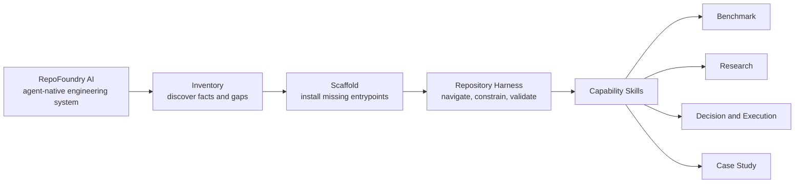
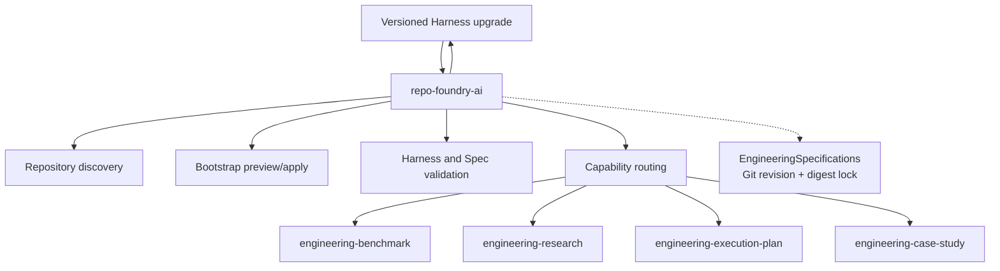

# RepoFoundry AI System Identity and Packaging

**RepoFoundry AI** is the external product brand. `RepoFoundry` remains the
distribution basename and short name. Its category is **The Agent-Native
Engineering System**: a repository-centered system that gives humans and coding
agents shared entrypoints, composable rules, durable evidence, and deterministic
validation.

The primary public claim is: **Turn any repository into an AI-ready engineering
system.**

## The system has four layers



`Inventory` describes discovery of repository facts and missing controls.
`Scaffold` is the guarded bootstrap operation. `Repository Harness` is the
persistent result installed in a target repository. Benchmark, Research,
Execution Plan, and Case Study remain independently installable capability
Skills.

The product therefore owns more than a workflow. It establishes and maintains
the engineering environment in which multiple workflows can operate.

## Public naming is one coherent contract

| Surface | Name |
|---|---|
| External product brand | `RepoFoundry AI` |
| Product short name and distribution basename | `RepoFoundry` |
| Category | `The Agent-Native Engineering System` |
| Primary claim | `Turn any repository into an AI-ready engineering system.` |
| Root Skill ID | `repo-foundry-ai` |
| Root Skill display name | `RepoFoundry AI` |
| Distribution installer | `install.py` |
| Installed command | `repofoundry` |
| Root CLI | `scripts/foundryctl.py` |
| Distribution version source | `VERSION` (`0.3.0`) |
| Installation variable used in examples | `REPO_FOUNDRY_HOME` |
| New Harness and Spec manifest owner | `repo-foundry` |
| Persistent target state directory | `docs/.engineering/` |
| Professional Skills | existing `engineering-*` IDs |

`AI` is part of the public project and root Skill identity. The `.engineering`
state directory, manifest owner, and professional Skill IDs remain stable
because they describe machine and domain contracts rather than the package
display name. New manifests use
`repo-foundry`; validators continue to recognize `engineering-workflow` as a
legacy owner so existing bootstrapped repositories remain readable.

## The root remains a control layer

The root Skill owns repository inspection, guarded bootstrap, explicit Harness
migration, Engineering Spec resolution, Harness validation, and capability
routing. It does not create Benchmark Runs, Research packages, ADRs, ExecPlans,
or Case Studies.



`foundryctl` is a deterministic implementation surface used by the root Skill.
It does not become an agent runtime or a general workflow engine.

`install.py` is the distribution boundary above `foundryctl`. It acquires and
atomically activates a stable local package, generates the `repofoundry`
launcher, and connects detected Agent hosts to that package. It never owns
repository Bootstrap, Harness migration, Spec selection, or professional
artifact lifecycles.

## Brand assets encode repository boundary and AI transformation

The RepoFoundry AI mark places a forge-orange AI spark inside two graphite
repository braces. The braces form a stable, inspectable engineering boundary.
The inner spark represents repository context transformed into reliable Agent
capability.

Canonical assets live under `assets/brand/`:

- `repofoundry-mark.svg` is the transparent vector master.
- `repofoundry-icon.svg` is the fixed-background square application icon.
- `repofoundry-icon.png` is the raster distribution asset.
- `README.md` records the usage and palette contract.

The mark uses graphite `#17202A`, forge orange `#FF6B2C`, and warm white
`#F7F4ED`. It contains no text so it remains legible at favicon size and across
languages.

## Migration preserves history

Current promotional surfaces use RepoFoundry AI. Technical contracts use the
stable RepoFoundry identifiers defined above. Accepted ADRs, completed
ExecPlans, and their sealed validation artifacts retain the names that were
true when they were recorded.

The former root Skill and CLI are not shipped as parallel packages. Migration
instructions map:

```text
$engineering-workflow  -> $repo-foundry-ai
$repo-foundry          -> $repo-foundry-ai
scripts/engineeringctl.py -> scripts/foundryctl.py
ENGINEERING_WORKFLOW_HOME -> REPO_FOUNDRY_HOME
```

This keeps one current entrypoint while leaving historical evidence auditable.
The Git hosting repository can be renamed separately; local contracts must not
claim that external rename succeeded before it actually occurs.

## Verification

The canonical `python3 -B scripts/check.py` entrypoint proves:

- all five Skill packages have valid metadata and routing, with the root
  package named `repo-foundry-ai`;
- the root CLI writes `repo-foundry` into new manifests;
- legacy `engineering-workflow` manifests remain readable;
- bootstrap, Spec locking, drift detection, and idempotence still work;
- distribution reporting, legacy Harness migration, customized-seed protection,
  and rollback work;
- current documentation and tests no longer present EngineeringWorkflow as the
  active product identity;
- brand assets exist and the raster icon has the expected square dimensions.
