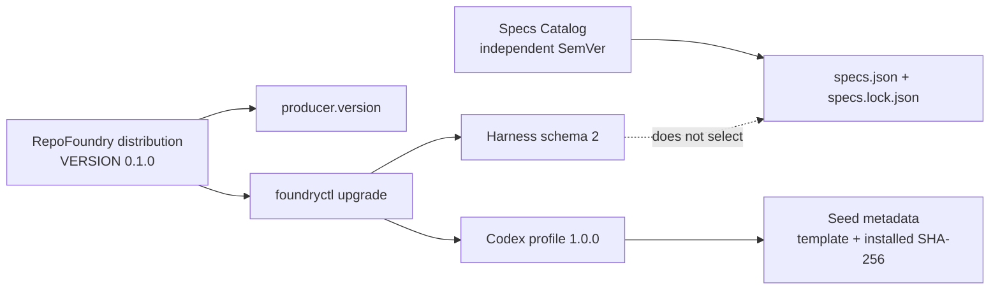
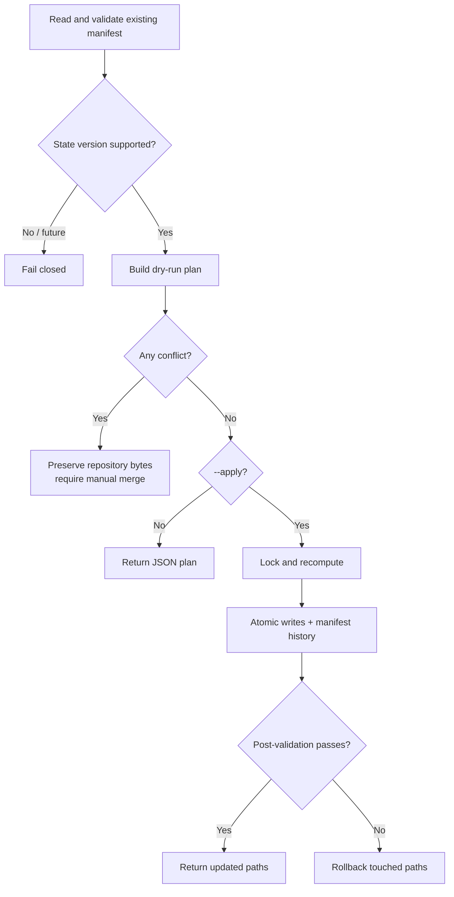

# RepoFoundry Versioning and Harness Migrations

## Purpose

RepoFoundry must be able to improve its Skill, scripts, profiles, and generated
files without treating an existing repository as disposable. Versioning is
therefore part of the repository contract, not only release metadata.

The first versioned distribution is `0.1.0`. It writes Harness schema `2` and
Codex profile `1.0.0`. Engineering Specifications keep their independent
Catalog version and lock lifecycle.

## Independent version planes

| Plane | Current | Stored in | Meaning |
|---|---:|---|---|
| RepoFoundry distribution | `0.1.0` | `VERSION`, `producer.version` | Skill and CLI release that produced or last migrated the Harness |
| Harness schema | `2` | `schema_version` | JSON state shape and validation contract |
| Codex profile | `1.0.0` | `profile.version`, per-file template metadata | Seed set and template behavior |
| Engineering Specs Catalog | `1.2.0` by default | `specs.json`, `specs.lock.json` | Independently selected engineering guidance release |

No plane inherits another plane's version. A Spec update does not migrate the
Harness, and a RepoFoundry upgrade does not change the selected Spec Catalog.

## Release invariants

Every distributed change updates the planes it actually changes:

- bump `VERSION` for every RepoFoundry release;
- bump the Codex profile whenever any seeded template bytes, required seed set,
  or profile behavior changes;
- bump the Harness schema whenever the persistent JSON shape or interpretation
  changes, while retaining explicit readers for supported older schemas;
- add deterministic migration logic and fixtures before publishing a release
  that changes existing repository state;
- update the Specs Catalog only in its own repository and select it through
  `spec update`.

In particular, template bytes must never change while keeping the same profile
version. Schema `2` intentionally verifies that invariant against the bundled
assets. A distribution-only script or Skill fix may leave the schema and
profile versions unchanged.

## Schema compatibility

The reader is deliberately asymmetric:

- schema `1` is accepted as a legacy, read-only contract and emits
  `HARNESS_SCHEMA_UPGRADE_AVAILABLE`;
- schema `2` is accepted when its producer, profile, templates, and migration
  records are not newer than the installed distribution;
- an unknown future schema, producer, profile, template, or migration version
  fails closed;
- `bootstrap` never migrates an existing manifest; migration requires the
  explicit `upgrade` command.

Schema `2` records the producer and profile plus one provenance record for each
seeded file. A versioned record contains the template SHA-256 and the SHA-256
installed at the last safe adoption point. A pre-existing file that cannot be
matched to a bundled template is recorded as `legacy-unversioned` with null
hashes so a future release cannot mistake it for an overwrite-safe seed.

## Preview-first migration

`foundryctl upgrade --to VERSION` computes a plan and writes nothing.
`--apply` acquires the Harness lock, recomputes the same plan, refuses any
changed preflight, applies atomic file replacements, writes the manifest, and
runs Harness validation. A post-write validation failure restores every file
touched by the migration.

## Seed replacement policy

| Existing seed state | Upgrade action |
|---|---|
| File already equals the current template | Update provenance only |
| File equals its recorded `installed_sha256` and a newer template exists | Replace it and record the new hashes |
| Versioned file differs from `installed_sha256` | Conflict; preserve bytes and require a manual merge |
| `legacy-unversioned` project-editable document differs from the current template | Preserve permanently until explicitly reconciled |
| A new generated Router or Hook seed is absent | Create it during the explicit profile upgrade |
| A generated Router or Hook path contains different bytes | Conflict; require explicit reconciliation |
| Required file missing, wrong type, or reached through a symlink | Conflict |

This policy makes customization detection evidence-based. Timestamps, Git
status, and heuristic text matching are not accepted as overwrite authority.

## Migration history and idempotence

Successful structural and profile migrations append stable records to
`applied_migrations`. The records have no wall-clock timestamp so the manifest
remains reproducible. Reapplying the same target produces no file or manifest
updates and never duplicates a migration ID.

The current distribution bundles only migrations to its own version. Selecting
another target returns `UPGRADE_TARGET_UNAVAILABLE`; fetching and executing
remote migration code is outside the CLI trust boundary.
