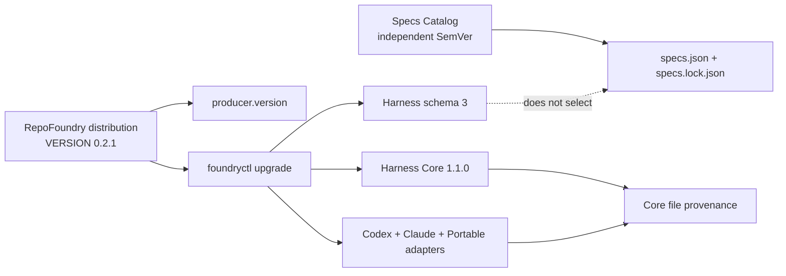
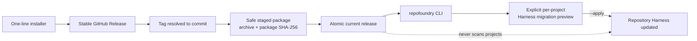
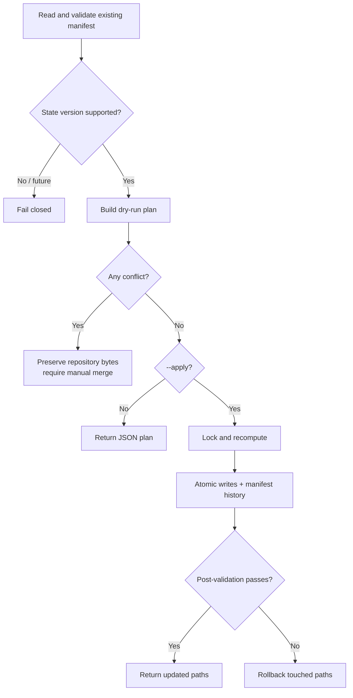

# RepoFoundry Versioning and Harness Migrations

## Purpose

RepoFoundry must be able to improve its Skill, scripts, Core, adapters, and generated
files without treating an existing repository as disposable. Versioning is
therefore part of the repository contract, not only release metadata.

The current distribution is `0.2.1`. It writes Harness schema `3`, Core
`1.1.0`, Codex adapter `2.1.0`, Claude adapter `1.0.0`, Portable adapter
`1.0.0`, and activation protocol `1`. Engineering Specifications keep their
independent Catalog version and lock lifecycle. Distributions `0.1.0` and
`0.2.0`, schemas `1` and `2`, Core `1.0.0`, Codex adapter `2.0.0`, and Codex
profile `1.0.0` remain migration inputs rather than the current model.

## Independent version planes

| Plane | Current | Stored in | Meaning |
|---|---:|---|---|
| RepoFoundry distribution | `0.2.1` | `VERSION`, `producer.version` | Skill and CLI release that produced or last migrated the Harness |
| Harness schema | `3` | `schema_version` | JSON state shape and validation contract |
| Harness Core | `1.1.0` | `core.version`, Core file records | Product-neutral repository, project Skill, and activation behavior |
| Codex adapter | `2.1.0` | `adapters[]`, adapter file records | Codex instructions, Skills, Hooks, and event translation |
| Claude adapter | `1.0.0` | `adapters[]`, adapter file records | Claude project Skills with CLI/advisory activation |
| Portable adapter | `1.0.0` | `adapters[]`, adapter file records | CLI and advisory integration |
| Activation protocol | `1` | Core executable and adapter capability output | Normalized event and decision semantics |
| Engineering Specs Catalog | `1.3.0` by default | `specs.json`, `specs.lock.json` | Independently selected engineering guidance release |

No plane inherits another plane's version. A Spec update does not migrate the
Harness, and a RepoFoundry upgrade does not change the selected Spec Catalog.

Release `0.2.1` changes the default Catalog used only when a project does not
yet have `docs/.engineering/specs.json`: new projects start from
EngineeringSpecifications `1.3.0`. Installing the distribution or upgrading a
Harness from `0.2.0` to `0.2.1` MUST NOT rewrite an existing Spec manifest,
lock, routing index, or managed Markdown. Existing projects adopt Catalog
`1.3.0` only through an explicit, previewed `spec update`.

## Distribution installation is not Harness migration

The public `install.py` entrypoint owns acquisition and activation of the
RepoFoundry distribution on one macOS or Linux user machine. The same command
performs a first install, advances to a newer stable release, or reports an
idempotent no-op. It does not discover or mutate target repositories.

The default install prefix contains immutable, source-addressed directories in
`releases/`, a relative `current` symlink, and a local `install.json`. That
installation manifest records the active version, release ID, package digest,
GitHub tag/commit/archive digest or explicit local source, launcher, and host
integration links. It is local distribution provenance and never appears in a
repository Harness manifest.

The installer uses `curl` transport when available and a certificate-validating
standard-library HTTPS fallback. It validates all archive paths before extraction, rejects links and
non-regular members, bounds remote payload sizes, verifies package identity and
`foundryctl --version`, then switches the active release. Pre-existing
non-managed launchers or host registrations are moved to reported backups.
Network, extraction, validation, or activation failure preserves the previous
active release. Host detection and registration are installer adapters; the
installed package remains usable through the portable CLI without any
product-specific private directory.

## Release invariants

Every distributed change updates the planes it actually changes:

- bump `VERSION` for every RepoFoundry release;
- publish `install.py` in every release so the stable one-line entrypoint can
  install that release and later versions;
- bump Core or the owning adapter whenever its template bytes, required seed
  set, or behavior changes;
- bump the Harness schema whenever the persistent JSON shape or interpretation
  changes, while retaining explicit readers for supported older schemas;
- add deterministic migration logic and fixtures before publishing a release
  that changes existing repository state;
- update the Specs Catalog only in its own repository and select it through
  `spec update`.

In particular, template bytes must never change while keeping the same owning
Core or adapter version. A distribution-only script or Skill fix may leave the
schema, Core, and adapter versions unchanged.

## Schema compatibility

The reader is deliberately asymmetric:

- schema `1` is accepted as a legacy, read-only contract and emits
  `HARNESS_SCHEMA_UPGRADE_AVAILABLE`;
- schema `2` is accepted as the versioned Codex-profile migration input;
- schema `3` is accepted when its producer, Core, adapters, templates, and
  migration records are not newer than the installed distribution;
- an unknown future schema, producer, Core, adapter, template, or migration version
  fails closed;
- schema `1` or `2` migration requires the explicit `upgrade` command;
- schema `3` is interpreted by its declared component versions, so Core
  `1.0.0` and Codex `2.0.0` remain valid without the newer project Skill
  records;
- a schema `3` bootstrap that adds an adapter may also create missing new
  generated paths and record Core/adapter component migrations after the same
  conflict-free preview; replacing an older seed still requires `upgrade`.

Schema `3` records the producer, Core, adapters, and unique Core/adapter owner
for each seeded file. A versioned record contains the template SHA-256 and the SHA-256
installed at the last safe adoption point. A pre-existing file that cannot be
matched to a bundled template is recorded as `legacy-unversioned` with null
hashes so a future release cannot mistake it for an overwrite-safe seed.

## Preview-first migration

`foundryctl upgrade --to VERSION` computes a plan and writes nothing.
`--apply` acquires the Harness lock, recomputes the same plan, refuses any
changed preflight, applies atomic file replacements, writes the manifest, and
runs Harness validation. A post-write validation failure restores every file
touched by the migration.

## Seed replacement policy

| Existing seed state | Upgrade action |
|---|---|
| File already equals the current template | Update provenance only |
| File equals its recorded `installed_sha256` and a newer template exists | Replace it and record the new hashes |
| Versioned file differs from `installed_sha256` | Conflict; preserve bytes and require a manual merge |
| `legacy-unversioned` project-editable document differs from the current template | Preserve permanently until explicitly reconciled |
| A new generated Core or adapter seed is absent | Create it during the explicit upgrade |
| A generated Core or adapter path contains different bytes | Conflict; require explicit reconciliation |
| Required file missing, wrong type, or reached through a symlink | Conflict |

This policy makes customization detection evidence-based. Timestamps, Git
status, and heuristic text matching are not accepted as overwrite authority.

## Migration history and idempotence

Successful structural, Core, and adapter migrations append stable records to
`applied_migrations`. The records have no wall-clock timestamp so the manifest
remains reproducible. Reapplying the same target produces no file or manifest
updates and never duplicates a migration ID.

The current distribution bundles only migrations to its own version. Selecting
another target returns `UPGRADE_TARGET_UNAVAILABLE`; fetching and executing
remote migration code is outside the CLI trust boundary.

The Core `1.0.0` to `1.1.0` migration adds
`.repo-foundry/skills/repo-foundry-ai/SKILL.md`. The Codex `2.0.0` to `2.1.0`
migration adds `.agents/skills/repo-foundry-ai/SKILL.md`. Both are generated,
repository-relative regular files. Claude `1.0.0` is a new adapter rather than
a migration of personal host registration; it owns only its two
`.claude/skills/` entrypoints.
