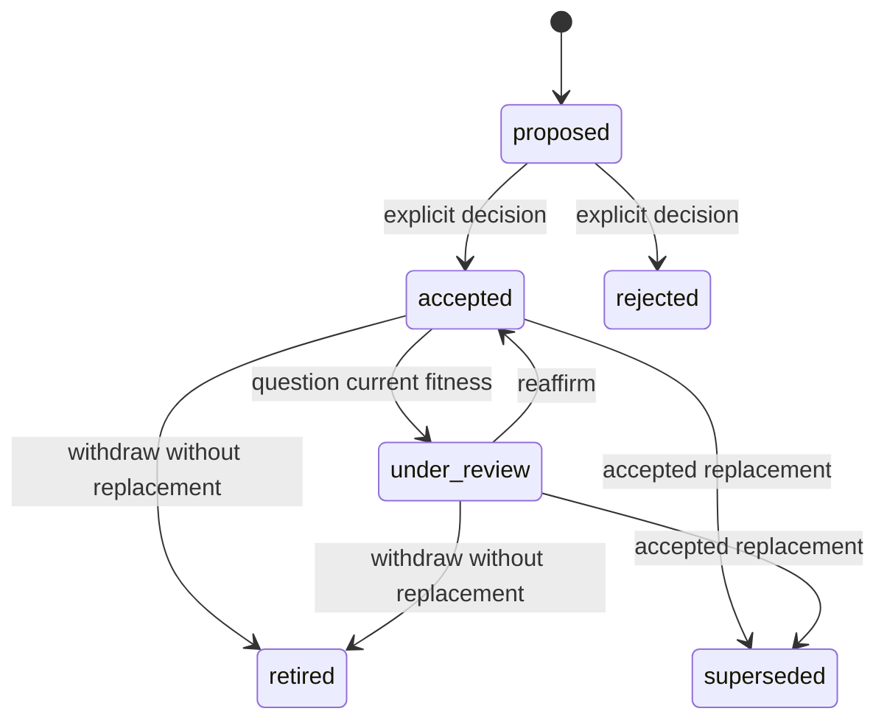
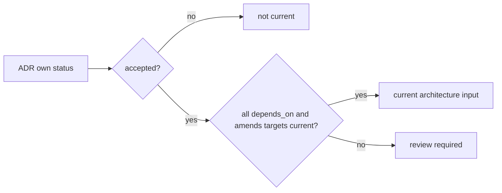

# Reversible ADR effect and immutable decision history

## Purpose

An ADR must preserve what was decided without forcing the repository to obey
that decision forever. RepoFoundry therefore separates two questions:

- **decision history**: what an authorized owner accepted or rejected, with the
  original context, inputs, constraints, and payload digest;
- **current effect**: whether an accepted decision is currently active,
  under review, retired without replacement, or superseded by another ADR.

Changing effect never rewrites the sealed decision body. It changes which
constraints new work may treat as current and reports the implementation and
planning surfaces that need reconsideration.

## Lifecycle



`rejected`, `retired`, and `superseded` are terminal. Reusing their direction
requires a new ADR so later authority and evidence remain explicit.

### Accepted

The decision and its dependency/amendment closure are current. New ExecPlans
may consume it and its normative constraints.

### Under review

The historical decision remains accepted, but its constraints are suspended as
authority for new work. Bounded investigation may continue. Existing code is
not automatically reverted, and completed plans keep their original digest.
Affected active plans receive an `architecture_review_required` signal and
cannot be completed until their architecture input is revised or the ADR is
reaffirmed.

### Retired

The decision has no current replacement and no longer governs new work. The
transition records explicit authority and reason. Existing implementation is a
fact to migrate, remove, or consciously retain; retirement is not an automatic
rollback.

### Superseded

An accepted current ADR replaces the old decision. The old document remains at
its stable path and links to the replacement. New work consumes the replacement
and any current dependency closure.

## Historical relations and current eligibility

`depends_on` and `amends` describe the accepted decision's historical semantic
inputs. Their targets may later become non-current without making the sealed
source document invalid. Instead, current eligibility is derived:



This rule propagates: if ADR-B amends ADR-A and ADR-A enters review, ADR-B is
not silently treated as a valid current input. ADR-B remains valid history, but
new work must reaffirm the coherent direction through a new or replacement ADR.

## Command contract

Effect changes are preview-first:

```text
epctl transition-adr ADR-NNN --to under_review|accepted|retired \
  --decision-maker "..." --reason "..." [--apply]

epctl supersede-adr ADR-OLD --by ADR-NEW \
  --decision-maker "..." --reason "..." [--apply]
```

Preview and apply return deterministic JSON containing:

- source and target state;
- affected constraints;
- transitively affected accepted ADRs;
- affected active ExecPlans; and
- the exact files that apply will update.

Apply acquires the repository lock, recomputes the preview, updates ADR
lifecycle metadata and managed indexes atomically, then validates the result.
It never edits active ExecPlans or implementation code implicitly.

## ADR schema 1.4

Schema 1.4 adds `decision_outcome`, `effect_changed_by`, `effect_changed`, and
`effect_reason`.

- `decision_outcome` is written once by `decide-adr` and enters the sealed
  decision payload.
- `status`, `updated`, effect metadata, `supersedes`, and `superseded_by` are
  lifecycle metadata outside the decision payload.
- `author`, `owner`, `created`, decision inputs, the decision authority, and the
  body remain sealed.

Schemas 1–1.3 remain readable. Their decided payload calculation treats
`under_review`, `retired`, and `superseded` as the original accepted outcome;
effect transitions do not rewrite their sealed `updated` value.

## ExecPlan behavior

New ExecPlans accept only current ADRs. Existing active plans that cite a
non-current or transitively affected ADR remain structurally valid so an
authorized transition does not break the repository. Status and validation
surface `architecture_review_required`; completion is blocked. Completed and
cancelled plans continue resolving their recorded ADR digest as historical
evidence.

## Non-goals

- Automatically reverting code, data, deployments, or migrations.
- Letting an Agent suspend or retire a decision without explicit authority.
- Editing a sealed ADR body to make history appear consistent with current
  preferences.
- Automatically selecting the replacement architecture for affected plans.

## Verification

- State-transition tests cover authorization, legal transitions, dry-run,
  atomic apply, idempotence, and rollback.
- Relationship tests cover the ADR-010/ADR-012 shape: suspending or retiring a
  base decision reports the amendment as affected without invalidating history.
- Plan tests prove new plans reject non-current ADRs, active plans surface an
  architecture-review completion blocker, and archived plans retain old
  evidence.
- Payload tests prove effect changes preserve the original decision digest for
  every supported decided ADR schema.
