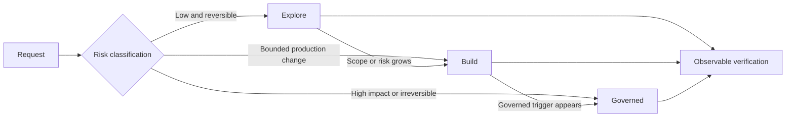

# Risk-adaptive Agent governance

RepoFoundry currently optimizes its Agent workflows for reproducibility,
cross-session recovery, explicit authority, and mechanically verifiable
evidence. Those properties remain valuable, but applying the same process
weight to exploration, ordinary implementation, and irreversible engineering
decisions makes the model spend too much of its attention proving workflow
compliance before it can investigate or improve a solution.

This design introduces a risk-adaptive governance envelope. It keeps hard
engineering boundaries independent of mode while scaling process artifacts,
activation receipts, handoff detail, and lifecycle gates to the risk of the
work actually being performed.

## Design principles

1. Govern risk boundaries and observable outcomes, not the model's private
   reasoning sequence.
2. Let low-risk work start with bounded exploration instead of requiring an
   up-front artifact graph.
3. Promote work when evidence reveals more risk; do not require retrospective
   reconstruction of every exploratory step.
4. Keep explicit human authority, evidence integrity, and destructive-action
   controls hard in every mode.
5. Preserve the existing strict workflow as a first-class governed mode and as
   a compatibility profile for already bootstrapped repositories.

## Governance modes

### Explore

Explore is the default for read-only investigation, explanation, local
experiments, prototypes, and small reversible changes whose failure remains
inside the current worktree.

- No persistent Research, ADR, ExecPlan, Bugfix, or Benchmark artifact is
  required.
- Engineering Specifications may be suggested or injected as advisory context;
  a manual activation receipt and a justified `none` decision are not required
  before the first reversible edit.
- The Agent may inspect alternatives, modify local files, and run tests.
- The handoff reports the outcome, verification performed, and unresolved risk.
- Discovery of a Build or Governed trigger promotes the task before crossing
  that boundary.

Explore never authorizes external writes, destructive operations, credential
use, publication, deployment, data migration, or acceptance of a durable
decision.

### Build

Build is the default for bounded production implementation that is locally
reversible and does not cross a Governed trigger.

- Record a concise task contract: intent, planned paths, acceptance checks, and
  known compatibility impact. The contract may remain thread-local.
- Activate only directly applicable Engineering Specification requirements.
- Research and ADR are optional and need no formal `not_required` artifact when
  their trigger is absent.
- Verification is proportional to the changed surface.
- The handoff reports changed behavior, activated requirements when any,
  verification, exceptions, and compatibility impact.

### Governed

Governed applies when the work crosses a durable authority, safety, evidence,
or reversibility boundary. It preserves the current full workflow:

- concluded Research when decision-relevant unknowns remain;
- explicit Decision Owner authorization for ADR outcomes;
- a self-contained ExecPlan for resumable, cross-module implementation;
- predeclared Benchmark Scenarios for decision-critical measurements; and
- sealed evidence, compliance mapping, checkpoints, and strict completion
  validation where applicable.

## Classification contract

The effective mode is the highest mode required by the user's explicit request,
repository policy, applicable Specification requirement, and observed task
risk. A user can always request a stricter mode. A lower requested mode cannot
disable a hard boundary or a repository policy whose applicability has been
established.

Governed triggers include:

- public API, schema, protocol, or compatibility changes;
- security, privacy, authorization, secrets, or data-integrity boundaries;
- irreversible migrations or operations with material external side effects;
- reliability, availability, capacity, or SLO claims;
- durable cross-system or cross-team architecture decisions;
- release, deployment, publication, or evidence intended to justify a durable
  decision; and
- explicit user, owner, or repository policy selection of Governed mode.

Build triggers include production source changes, cross-file refactoring,
dependency or configuration changes, and other bounded work that requires a
clear acceptance contract but does not meet a Governed trigger.

Everything else starts in Explore. Classification is not a one-time guess: the
Agent reevaluates it when paths, intent, side effects, or discovered risk
change. Promotion records the reason and carries forward only decision-relevant
evidence. It does not backfill fictional Research history.

## Hard boundaries in every mode

The following controls do not become advisory:

- preserve user changes and explicit sources of truth;
- require explicit authority for destructive or externally persistent actions;
- require explicit Decision Owner authority for ADR acceptance or rejection;
- never infer credentials, owner identity, approval, SLOs, or architecture
  facts;
- verify locked or sealed content before relying on its integrity claim;
- stop on a discovered security, data-loss, compatibility, or authority risk
  that cannot be resolved within the current scope; and
- report observable verification honestly.

## Router and adapter behavior

The shared activation engine owns mode classification receipts in addition to
Specification activation receipts. Runtime adapters remain thin translators.

| Behavior | Explore | Build | Governed |
|---|---|---|---|
| Initial Spec routing | advisory candidates | exact applicable requirements | exact applicable requirements |
| Spec Router pre-mutation denial | none solely for a missing receipt | missing or uncovered applicable requirements | strict configured gate |
| Persistent workflow artifacts | none by default | optional | trigger-driven and validated |
| Handoff | outcome, verification, risks | behavior, requirements, verification, compatibility | full evidence index and lifecycle state |
| Audit result | advisory | task-contract coverage | strict governed compliance |

Hooks must not force a retry solely to inject advisory context in Explore.
Hard boundaries remain enforced by their owning authority, integrity, and
destructive-action controls; the initial Router does not claim to infer them
from arbitrary tool input. Build may inject a bounded requirement capsule
before a governed path is changed. Governed retains fail-closed activation,
path coverage, and completion audit.

The Agent performs semantic risk classification; the shared Router validates
and records the selected mode and machine-readable reasons, and rejects mode
decreases. The initial policy schema stores a repository profile only. A future
policy schema may add mechanically enforced path- or requirement-level minimum
modes. Unknown risk does not automatically force every task into Governed; it
requests bounded inspection first and promotes only when a trigger is supported
by evidence.

## Professional Skill behavior

Professional Skills retain ownership of their artifacts. The change is in when
they become mandatory:

- `engineering-research` is selected for genuine decision-relevant unknowns,
  not as a ceremony for every complex-looking feature.
- `engineering-execution-plan` creates persistent artifacts for durable
  decisions and resumable delivery, while ordinary Build work uses a concise
  thread-local contract.
- `engineering-benchmark` remains mandatory for reusable or decision-critical
  measurement evidence, not for ordinary test execution.
- `engineering-case-study` remains explicitly requested output.

Skipping a non-triggered professional artifact is normal classification, not
an exception that requires a second artifact to justify the absence.

## Compatibility and migration

Fresh Harnesses default to the `adaptive` profile. Existing Harnesses preserve
their installed strict behavior until an explicit, previewed migration selects
`adaptive`; this avoids silently weakening an accepted repository control.
Repositories may pin `strict`, set minimum modes for paths or requirements, or
disable Explore for production code.

The Harness manifest records the profile and policy schema. Migration changes
configuration and generated adapters without rewriting accepted ADRs, sealed
Research, completed ExecPlans, or evidence manifests.

## Verification strategy

- Router tests cover explicit escalation, monotonicity, idempotence, and strict
  profile behavior; instruction-contract tests cover the semantic triggers.
- Explore tests prove reversible edits and completion are not denied only
  because no Spec receipt or five-label handoff exists.
- Build tests prove bounded requirement activation and concise handoff coverage.
- Governed parity tests preserve current activation, authorization, evidence,
  and completion behavior.
- Migration tests prove fresh adaptive defaults, strict-profile preservation,
  previewed opt-in, customized-adapter protection, and rollback.
- Repository contract tests prove all Agent adapters expose equivalent mode
  semantics without moving runtime-specific behavior into the Core.

## Implemented choices and deferred extensions

- The first release adds an explicit Core `classify` command. Agent guidance
  owns semantic trigger recognition; adapters only translate lifecycle events.
- Policy schema `1` stores `adaptive|strict` only. Path and requirement minimums
  are deferred until their policy ownership and migration contract are defined.
- Classification and activation receipts remain turn-scoped. A later protocol
  may define resumable bounded-task identity without weakening freshness.

These limits keep the first implementation observable and backward compatible
without claiming deterministic risk inference that the Router does not perform.
