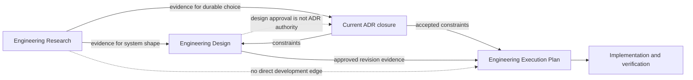

# Implement the Engineering Design skill

This ExecPlan is a bounded living document. Keep current truth synchronized. Preserve historical events without rewriting them, and seal older events into immutable history checkpoints when the root working set grows.

## Purpose / Big Picture

Add an independently installable `engineering-design` skill that turns concluded
Engineering Research into reviewable technical Designs without confusing research,
architecture decisions, or delivery plans. A Design may be one Markdown file or a
multi-document Design Package, but it always has one global `DD-NNN` identity, an
explicit lifecycle, reproducible source handoff, and a sealed approved revision.

Users can observe the capability by installing the repository skills, invoking
`$engineering-design`, creating both layouts with `designctl.py`, validating package
integrity, approving a revision, and then using the resulting evidence from an
ExecPlan. Existing schema-1 Design Docs remain readable and are not mass-rewritten.

## Current Snapshot

- Latest checkpoint: none.
- Current milestone: Milestone 5 complete — publication gate pending.
- Current state: the independently installable `engineering-design` producer,
  schema-1.1 lifecycle, immutable revision snapshots, read-only EP schema-2.8
  consumer, root Bootstrap composition, 0.6.0 packaging, and focused integration
  tests are implemented. The Research conversion gate now requires the exact audit
  closure of Research already translated by referenced ADRs or Designs, preserves
  legacy compatibility, and has canonical regression evidence. DD-011 remains
  `draft`.
- Next action: obtain an explicit Design Owner decision on DD-011; if approved, pin
  its published revision, rerun final verification, and archive EP-058.
- Open question: whether the Design Owner approves DD-011 revision 1. This does not
  change the implemented route, but the v2.8 completion gate correctly blocks archive.

## Context and Orientation

Before this EP, RepoFoundry packaged four independently installable professional skills:
`engineering-research/`, `engineering-benchmark/`,
`engineering-execution-plan/`, and `engineering-case-study/`. The root `SKILL.md`,
`install.py`, `scripts/foundryctl.py`, `scripts/check.py`, and
`tests/test_repository_contracts.py` compose and verify them. The repository now has
a fifth peer, `engineering-design/`; the package does not import sibling skill code or rely
on a sibling installation path.

Engineering Research records what was learned and ends with a handoff contract.
An ADR records an authoritative architecture choice. A Design specifies how a
coherent module will work. An ExecPlan consumes approved Design evidence and plans
delivery. A Design Package is one logical Design spread across `DESIGN.md`, a
machine-verifiable `DESIGN_MANIFEST.json`, a reading map, and typed member documents.
Member `DOC-NNN` identifiers are local to the package; `DD-NNN` identifiers are
repository-global.

The draft explanatory contract is
`docs/design-docs/first-class-technical-design-documents.md`. The architecture
entrypoint is `docs/design-docs/index.md`. ADR-018 is the canonical authority when
either prose document is ambiguous.

## Constraints and References

| Source | Why it matters | When to read |
|---|---|---|
| `docs/adr/adr-018_first-class-technical-design-documents.md` | Accepted ownership, lifecycle, package, evidence, compatibility, and identifier constraints | Before every producer or consumer contract change |
| `docs/design-docs/first-class-technical-design-documents.md` | Draft target format and workflow; explanatory only | Before templates, schemas, and UX changes |
| `docs/research/concluded/R-001/RESEARCH.md` | Concluded evidence on independent producer/consumer artifacts | Before defining file boundaries |
| `docs/design-docs/artifact-metadata-contract.md` | Common frontmatter and manifest rules | Before schema or template work |
| `docs/design-docs/reversible-adr-effect.md` | Current-ADR and dependent-plan semantics | Before changing `epctl.py` |
| `engineering-execution-plan/scripts/epctl.py` | Existing read-only Design consumer and EP gates | Before consumer integration |
| `scripts/foundryctl.py` | Root bootstrap and composed workflow | Before root integration |
| `scripts/check.py` | Repository verification entrypoint | Before declaring a milestone complete |

## Research and Architecture Inputs

- Research conversion gate (`research_gate`): `satisfied`.
- Research references: ["R-001"].
- Architecture decision gate: `satisfied`.
- Architecture compliance: `applicable`.
- ADR references: ["ADR-001", "ADR-004", "ADR-014", "ADR-016", "ADR-018"].
- ADR constraint references: ["ADR-014#C-001", "ADR-014#C-002", "ADR-014#C-003", "ADR-014#C-004", "ADR-014#C-005", "ADR-014#C-006", "ADR-016#C-001", "ADR-016#C-002", "ADR-016#C-003", "ADR-016#C-004", "ADR-016#C-005", "ADR-016#C-006", "ADR-016#C-007", "ADR-016#C-008", "ADR-018#C-001", "ADR-018#C-002", "ADR-018#C-003", "ADR-018#C-004", "ADR-018#C-005", "ADR-018#C-006", "ADR-018#C-007", "ADR-018#C-008", "ADR-018#C-009", "ADR-018#C-010", "ADR-018#C-011", "ADR-018#C-012", "ADR-018#C-013", "ADR-018#C-014"].
- ADR evidence: ["ADR-001@sha256:9866f72aa09c400b36a9993681a73f7131381a28179a1f0832cd6a89a2ca8fae", "ADR-004@sha256:401daee8795f70b9c0816e02e655e874bc20c37603b937fe831009bb5a80ef98", "ADR-014@sha256:bf56752a919cc0bc807ef703db9cb8e4192a1e1495597b954412db93a915b1e7", "ADR-016@sha256:448a34be4804a9e60e7ce2e6e78158d7c45d462326b99d456fe533a1513590fb", "ADR-018@sha256:578dc79ed9f5fecc2d15a4ea550b63cc18e4e1301131476a4aa4439be81e9e6e"].
- Design document references: ["docs/design-docs/engineering-workflow-packaging.md", "docs/design-docs/artifact-metadata-contract.md", "docs/design-docs/reversible-adr-effect.md", "docs/design-docs/first-class-technical-design-documents.md"].
- Approved Design revision evidence: none yet; the three legacy-current inputs are grandfathered, while DD-011 remains draft and blocks EP completion until separately approved.
- Architecture entrypoint: `docs/design-docs/index.md`.

R-001 is audit provenance converted by ADR-001; it is not an implementation
constraint. R-001 concluded that professional workflows should exchange versioned,
machine-checkable files instead of importing one another's implementation. Its
useful conclusion here is the producer/consumer boundary: `engineering-design`
owns Design mutation and publishes stable files; `engineering-execution-plan`
reads those files. Research did not define Design semantics, so ADR-018 supplies
the missing authority. The implementation paths and acceptance below derive from
ADR-001/ADR-018 and DD-011, not directly from R-001.

ADR-001 and ADR-004 require independently installable professional packages under a
thin root orchestrator. ADR-014 requires metadata on current governed Markdown and
digested manifests for bundles, while preserving sealed legacy artifacts. ADR-016
requires consumers to use only the current ADR closure and to preserve decided ADR
payloads and existing schema compatibility. ADR-018 selects Option D: a separate
skill and CLI own all Design lifecycle mutation; Research never mutates Designs;
Execution Plan is a read-only consumer; single-file and package layouts share one
logical model; approval seals a whole revision atomically; published revisions stay
valid while a new revision is drafted; delivery completion requires approved Design
revision evidence and current ADR closure.

The known downside is another installable package and a new compatibility surface.
The implementation controls that cost with Python-standard-library-only code,
versioned schemas, golden CLI tests, and root contract tests. No Benchmark Scenario
is required because this changes artifact governance rather than runtime performance
or capacity. There are no unresolved facts that require another Research round.

## Architecture Compliance Matrix

| ADR constraint or architecture input | Implementation or preservation | Verification |
|---|---|---|
| ADR-001 | Preserve explicit, file-based producer/consumer contracts and independent skill packages. | Install each skill separately and run repository contract tests. |
| ADR-004 | Add `engineering-design/` as a fifth peer package; keep root orchestration thin. | `scripts/check.py` validates package catalog, installer, prompts, and tests. |
| ADR-014#C-001 | Templates require the common metadata fields on current governed Markdown. | `test_designctl.py` rejects missing or malformed metadata. |
| ADR-014#C-002 | Package and revision manifests carry identity, lifecycle, timestamps, and SHA-256 digests. | Package drift and snapshot digest tests. |
| ADR-014#C-003 | Author and owner remain provenance/stewardship fields; approval authority is separately named. | Approval CLI tests require explicit approver and do not infer it. |
| ADR-014#C-004 | `designctl validate` enforces mutable metadata and immutable approved-revision boundaries. | Tamper tests fail validation after approval. |
| ADR-014#C-005 | Schema-1 legacy Design Docs remain readable; only new or explicitly revised artifacts use schema 2. | Legacy fixture tests and no bulk migration diff. |
| ADR-014#C-006 | Ordinary source, configuration, and indexes use Git and generator provenance rather than artifact frontmatter. | Repository contract tests distinguish governed artifacts from source files. |
| ADR-016#C-001 | Do not modify any decided ADR payload while integrating Design support. | Existing ADR integrity and `test_epctl.py` suites pass. |
| ADR-016#C-002 | Preserve explicit authority, reason, preview, and atomic apply for ADR effect transitions. | Existing transition tests pass unchanged. |
| ADR-016#C-003 | Continue excluding under-review ADRs and affected dependent plans from current architecture input. | Existing current-closure regression tests pass. |
| ADR-016#C-004 | Preserve retirement semantics without claiming implementation rollback. | Existing retire regression tests pass. |
| ADR-016#C-005 | Preserve supersession links and historical decided payloads. | Existing supersede and integrity tests pass. |
| ADR-016#C-006 | Keep active affected EPs `review_required` and completion-blocked. | Existing effect-transition EP tests pass. |
| ADR-016#C-007 | New EP validation uses current dependency and amendment closure before Design evidence. | `epctl validate` and new Design-consumer tests. |
| ADR-016#C-008 | Continue reading legacy ADR schemas and their existing digest domains. | Full `engineering-execution-plan/tests` suite passes. |
| ADR-018#C-001 | `engineering-design` and `designctl.py` exclusively implement Design IDs, lifecycle, manifests, snapshots, indexes, and publication. | Source-boundary tests assert no Design mutator elsewhere. |
| ADR-018#C-002 | Research handoff is evidence only; Research commands never write Design paths, and an unconverted Research reference cannot enter a new EP. | Cross-skill contract test plus Research-only EP rejection regression. |
| ADR-018#C-003 | `epctl.py` only parses and validates ADR/Design conversion provenance and approved Design evidence, and exposes no Design mutation command. | CLI help, exact Research conversion-closure tests, and consumer tests. |
| ADR-018#C-004 | One schema models unique `DD-NNN`, common metadata, lifecycle, and both single/package layouts. | Creation and validation tests for both layouts. |
| ADR-018#C-005 | Review readiness requires a Research handoff or an explicit not-required reason and preserves findings, confidence, negative evidence, and unknowns. | Handoff fixture and missing-field rejection tests. |
| ADR-018#C-006 | Required coverage sections must be substantive or contain a reasoned Not applicable statement. | Review-ready coverage table tests. |
| ADR-018#C-007 | Design approval records separate Design authority and never changes ADR state. | Approval fixture plus ADR state comparison. |
| ADR-018#C-008 | Packages require an entrypoint, manifest, reading map, local IDs, roles, exact paths, byte sizes, and SHA-256; drift blocks. | Tamper, missing-member, and digest tests. |
| ADR-018#C-009 | Typed Design dependencies are acyclic; independently governed content uses a separate `DD-NNN`. | Dependency cycle and member-boundary tests. |
| ADR-018#C-010 | Approval atomically snapshots the whole revision; later revision work leaves the published snapshot valid. | Approve/revise/snapshot immutability tests. |
| ADR-018#C-011 | Terminal states reject, unpublished states warn, and EP completion requires approved revision evidence plus current ADR closure. | New `epctl` warning and completion-gate tests. |
| ADR-018#C-012 | Schema-1 legacy references continue to validate without bulk rewrite. | Legacy Design Doc fixture and repository validation. |
| ADR-018#C-013 | The new package uses only its own files and the Python standard library. | Standalone copied-package test and import scan. |
| ADR-018#C-014 | State-backed high-water marks never reuse global DD or package-local DOC IDs; indexes rebuild from artifacts while preserving human text. | Delete/reindex/allocation regression tests. |

Every structured constraint from every referenced ADR must appear exactly once.
For a legacy ADR without structured constraints, restate its applicable decision
at document level. Design Docs are explanatory inputs and cannot override an ADR.

## Benchmark Gate Set

- Required Scenario IDs: [].

| Scenario | Development decision or milestone gated | Completion contract |
|---|---|---|
| — | No Benchmark Scenario gate declared for this EP. | — |

This set is declared before implementation. Do not replace one Scenario with
another after observing results; change the plan and record the reason first.

## Plan of Work

First scaffold `engineering-design/` with the canonical Skill Creator so its
`SKILL.md` and `agents/openai.yaml` meet platform conventions. Replace placeholders
with a concise workflow, reference contract, Markdown/JSON assets, evaluations, and
a standard-library `scripts/designctl.py`.

Then implement one internal Design model used by both layouts. The CLI will
initialize state, allocate non-reusable IDs, create a Design, add package members,
rebuild indexes/manifests, check review readiness, approve an atomic revision,
start a revision, move to terminal states, inspect status, and validate the corpus.
The manifest is derived from on-disk bytes and approved snapshots are immutable.

Next extend `engineering-execution-plan/scripts/epctl.py` only at its read boundary:
understand schema-1.1 Design roots and revision evidence, warn for unpublished Design,
reject terminal Design, and block EP completion without an approved revision. It
must expose no Design mutation command. Register the fifth skill in root routing,
bootstrap, installation, prompts, docs, checks, and contract tests.

Finally enforce the missing semantic boundary discovered during follow-up review:
for active schema-2.8 plans, `research_refs` is the exact audit-provenance union of
referenced ADRs and Designs. `new-ep` and `validate` reject both missing provenance
and unconverted extra Research. Update Research, Design, Execution Plan, routing,
examples, and evals so no instruction still presents Synthesis as a development
contract. Preserve completed plans as historical compatibility records.

Finally run standalone, package, consumer, regression, skill, and repository
verification. Record concise evidence in this plan, use the repository-supported
working-tree revision evidence, and archive EP-058 only when every gate passes.

## Milestones

### Milestone 1: Independent Design producer exists

`engineering-design/` contains valid skill metadata, contracts, assets, CLI, evals,
and producer tests. Run its unit tests and Skill Creator validator; both must pass.

### Milestone 2: Design lifecycle is reproducible

Temporary repositories can create single and package Designs, allocate monotonic
IDs, reach review readiness, approve immutable snapshots, revise without invalidating
publication, reject drift and cycles, rebuild indexes, and preserve schema-1 files.
Run `engineering-design/tests/test_designctl.py`; all cases must pass.

### Milestone 3: Consumers and repository composition are integrated

`epctl.py` consumes but never mutates Design artifacts; root routing, bootstrap,
installer, docs, and checks include the fifth package. Run the execution-plan and
repository suites; all cases must pass.

### Milestone 4: Verification evidence is recorded

Run full validation from a cleanly described working-tree revision and update
outcomes and evidence. EP-058 remains active while its ADR-linked DD-011 input is
unpublished; archive requires a later explicit Design approval and a final verified
revision rather than weakening or bypassing that gate.

### Milestone 5: Research must be converted before development

`new-ep` rejects Research-only plans and validates exact Research provenance through
referenced ADR/Design inputs. Research and Synthesis templates hand off only to ADR
or Design; ExecPlan templates attribute implementation constraints to those converted
artifacts. Focused, full-package, and canonical repository tests must pass without
rewriting archived plans or accepted ADR payloads.

## Concrete Steps

All commands run from `/Users/wangxiaowei1/x-otel/EngineeringPlan` unless stated.

1. Initialize the skill package:

       python3 /Users/wangxiaowei1/.codex/skills/.system/skill-creator/scripts/init_skill.py engineering-design --path . --resources scripts,references,assets --interface display_name="Engineering Design" --interface short_description="Create and govern technical Design Packages" --interface default_prompt='Use $engineering-design to turn concluded Research into a reviewable technical Design Package.'

   Expect `engineering-design/` and valid `agents/openai.yaml` to be created.

2. Implement the producer and run focused verification:

       python3 -m unittest discover -s engineering-design/tests -p 'test_*.py'
       python3 /Users/wangxiaowei1/.codex/skills/.system/skill-creator/scripts/quick_validate.py engineering-design

   Expect all Design tests to pass and the skill validator to print a success result.

3. Integrate the read-only consumer and root composition:

       python3 -m unittest discover -s engineering-execution-plan/tests -p 'test_*.py'
       python3 -m unittest discover -s tests -p 'test_*.py'

   Expect all existing and new consumer/contract tests to pass.

4. Run repository validation and inspect the composed CLI:

       python3 scripts/check.py
       python3 engineering-execution-plan/scripts/epctl.py --repo . validate
       python3 engineering-design/scripts/designctl.py --repo . validate

   Expect zero errors. Draft Design warnings and the pre-existing ready-to-archive
   plan warning are acceptable only when reported as warnings, not errors.

5. Verify the Research conversion boundary:

       python3 -m unittest engineering-execution-plan.tests.test_epctl.EpctlTestCase.test_research_cannot_directly_guide_an_execplan engineering-execution-plan.tests.test_epctl.EpctlTestCase.test_design_converts_research_before_execplan_consumption
       python3 -m unittest discover -s engineering-execution-plan/tests -p 'test_*.py'
       python3 -B scripts/check.py

   Expect Research-only creation to fail closed, ADR/Design conversion paths to
   validate, archived compatibility to remain readable, and the canonical check to
   report zero errors.

## Validation and Acceptance

- [x] Run `python3 -m unittest discover -s engineering-design/tests -p 'test_*.py'`;
  16 tests passed, covering both layouts, lifecycle, integrity, compatibility, and
  independent installation.
- [x] Run `python3 -m unittest discover -s engineering-execution-plan/tests -p 'test_*.py'`;
  62 tests passed, including ADR-effect regressions, schema-2.8 Design consumer
  gates, and exact Research conversion closure.
- [x] Run `python3 -m unittest discover -s tests -p 'test_*.py'`; 118 root package,
  installer, prompt, migration, and architecture-contract tests passed.
- [x] Run `python3 /Users/wangxiaowei1/.codex/skills/.system/skill-creator/scripts/quick_validate.py engineering-design`;
  result: `Skill is valid!`.
- [x] Run `python3 -B scripts/check.py`; all integrity checks passed, including 240
  tests across Research (35), Benchmark (9), Design (16), Execution Plan (62), and
  root contracts (118).
- [x] Run `python3 engineering-execution-plan/scripts/epctl.py --repo . validate`;
  result: zero errors and four documented warnings (DD-011 unpublished twice
  through linked inputs, EP-058 explicitly archive-blocked by DD-011, plus
  pre-existing EP-006 archive readiness).
- [x] Run `python3 engineering-design/scripts/designctl.py --repo . validate`; result:
  zero errors and one expected warning that legacy DD-011 remains an unpublished draft.
- [x] Inspect the consumer CLI through the root ownership contract;
  `test_design_lifecycle_has_one_mutation_owner_and_file_only_consumers` passed and
  `epctl.py` exposes no Design mutator.
- [x] Exercise an independently copied `engineering-design/` package through
  `test_skill_runs_after_independent_copy`; it passed without sibling packages.
- [x] Verify Research-only EP rejection, Design/ADR conversion provenance, complete
  Execution Plan regressions, Research/Design skill tests, and the canonical check
  after the 2026-08-28 boundary correction; `python3 -B scripts/check.py` passed all
  240 tests and every validator, index, and whitespace check.

### Required Benchmark Scenario Gates

- No required Benchmark Scenario gates.

Completion writes `verified_revision` and `verification_evidence` through
`archive-ep`. Archival also seals the complete document with `archive_sha256`;
do not pre-fill these fields while the plan is active.

## Idempotence and Recovery

Skill initialization is one-time; after the directory exists, edits use atomic file
replacement and tests may be repeated safely. `designctl init`, `sync`, `reindex`,
`status`, and `validate` are idempotent. Allocation records the next high-water mark
before exposing a new artifact; deleting an artifact never lowers it. Manifest and
index rebuilds derive machine-owned regions from files and preserve marked human
text.

Mutating commands stage all new bytes in a temporary directory under the target
repository and replace destinations only after validation. Approval fails before
publication on missing coverage, stale manifest data, dependency cycles, or digest
mismatch. If interruption leaves temporary files, a repeated command ignores or
cleans only its own named staging directory. Existing approved snapshots are never
overwritten; recovery is to fix the mutable draft and retry with a new revision.

No automatic schema-1 migration is performed. If root integration fails, the new
peer package can be removed from root registration without altering existing Design
Docs, ADRs, Research, Benchmarks, or ExecPlans. Git remains the rollback mechanism
for ordinary source and configuration changes.

## Progress

- [x] (2026-08-17T01:30:04Z) Plan created with accepted Research, ADR, and Design references.
- [x] (2026-08-17T01:48:00Z) Filled execution, compliance, validation, and recovery contracts before implementation.
- [x] (2026-08-17) Scaffolded and implemented the independent Design producer with both layouts, lifecycle transitions, sealed revision evidence, compatibility, and tests.
- [x] (2026-08-17) Integrated read-only Design consumption, schema-2.8 EP evidence, Bootstrap composition, installer, routing, documentation, and 0.6.0 migration semantics.
- [x] (2026-08-17T02:56:37Z) Verified and recorded implementation evidence. EP-058
  intentionally remains active because DD-011 has not received separate Design
  Owner approval.
- [x] (2026-08-28T03:57:40Z) Enforced Research→ADR/Design→ExecPlan conversion,
  preserved legacy Synthesis and archived-plan compatibility, and passed all 240
  canonical tests plus repository validation.

## Surprises & Discoveries

- The EP Design scanner initially descended into immutable package `snapshots/` and
  treated historical copies as duplicate current Designs. Excluding snapshot roots
  restored the intended live-corpus boundary and is covered by integration tests.
- A syntactically valid Research handoff was insufficient: the Design producer also
  needed to verify concluded status, approval metadata, sealed Synthesis payload,
  manifest membership, and exact digests without importing `researchctl.py`.
- The canonical wrapper's 180-second subprocess budget became too small after the
  root suite grew to 118 bootstrap-heavy cases; the independently passing suite took
  191 seconds inside the wrapper. The budget is now 300 seconds and the full check
  completes successfully.
- Archive enforcement was correct, but the initial status projection considered
  only checked acceptance and reported `ready_to_archive`. Status and validation now
  consume the same Design publication gate and report
  `archive_blocked: design_unpublished:DD-011`.
- The original `research_gate: satisfied` proved only that Research was concluded;
  it did not prove that an ADR or Design had translated that evidence. This allowed
  Research-only plans to treat Synthesis as an implicit development contract. The
  corrected invariant makes Research references the exact audit closure of the
  referenced ADR/Design set.

## Decision Log

- 2026-08-17 — Implement accepted ADR-018 Option D as a fifth, independent
  `engineering-design` skill. Design approval remains distinct from ADR acceptance;
  therefore DD-011 stays `draft` during this EP unless separately authorized.
- 2026-08-28 — Treat direct Research-to-development flow as a compliance defect in
  the ADR-018 boundary: enforce Research→ADR/Design→ExecPlan conversion without
  changing any accepted ADR payload or inferring new decision authority.

## Blockers

| ID | Status | Opened | Resolved | Missing capability | Impact | Unblock or resolution |
|---|---|---|---|---|---|---|

## Outcomes & Retrospective

The implementation delivers ADR-018 Option D as an independent producer rather
than extending Research or giving Execution Plan mutation authority. One model now
covers single-file and package Designs, monotonic `DD-NNN` and local `DOC-NNN`
identities, review coverage, typed dependencies, explicit Design approval, atomic
immutable revisions, legacy schema-1 compatibility, and generated projections.

`epctl.py` remains a read-only consumer and schema 2.8 pins approved Design evidence
before completion. Root bootstrap, installation, routing, documentation, examples,
evaluations, migration, and validation compose the new peer as RepoFoundry 0.6.0 /
Harness Core 1.5.0. The consumer now treats Research as audit provenance only and
requires its exact conversion closure through referenced ADRs or Designs. All 240
canonical tests pass and every validator reports zero errors.

The remaining work is governance, not implementation: DD-011 is still a draft and
therefore has no approved revision evidence to pin. EP-058 stays active by design;
its archive gate must not be weakened or bypassed.

### Knowledge promotion candidates

- None.

## Interfaces and Dependencies

`engineering-design/scripts/designctl.py` targets Python 3 and the standard library
only. Its public interface is a CLI with `--repo` plus `init`, `new-design`,
`new-member`, `sync`, `mark-review-ready`, `approve`, `revise`, `abandon`,
`supersede`, `status`, `reindex`, and `validate` subcommands. Exit code `0` means the
requested operation or validation succeeded; non-zero means no governed transition
was published.

The persistent producer contract comprises schema-versioned Markdown frontmatter,
`docs/.designctl/state.json`, package
`DESIGN_MANIFEST.json`, immutable revision snapshots, and generated index regions.
The consumer contract is a parser/validator in `epctl.py`; it may read Design state,
revision, manifest digest, ADR references, and dependency edges but may not import
`designctl.py` or invoke its mutators. The root orchestrator may invoke each CLI as a
process but owns no professional artifact semantics.

Core logical types are `DesignId` (`DD-NNN`), package-local `MemberId`
(`DOC-NNN`), `DesignStatus`, `DesignLayout`, `DesignDependency` (typed directed
edge), `ManifestEntry` (role, path, byte size, SHA-256), `DesignRevision`, and
`ApprovalEvidence` (revision, approver, authority basis, timestamp, snapshot digest).
Paths are repository-relative POSIX paths and hashes cover exact file bytes.

## Artifacts and Notes

- Plan: `docs/exec-plans/active/ep-058_implement-engineering-design-skill/EXECPLAN.md`
- Accepted authority: `docs/adr/adr-018_first-class-technical-design-documents.md`
- Producer entrypoint: `engineering-design/SKILL.md`
- Producer CLI: `engineering-design/scripts/designctl.py`
- Draft explanatory Design: `docs/design-docs/first-class-technical-design-documents.md`
- Verification: `python3 -B scripts/check.py` passed 240 tests and all repository
  integrity checks on 2026-08-28.
- Full logs, traces, screenshots and generated evidence belong under `artifacts/`; keep only concise observations and paths here.

## Revision Notes

- 2026-08-17T01:30:04Z — Initial plan created.
- 2026-08-17T01:48:00Z — Replaced all planning placeholders with the accepted Option D implementation and verification contract.
- 2026-08-17T02:56:37Z — Recorded the completed producer, consumer, composition,
  migration, and canonical verification work; retained active status because
  DD-011 approval is a separate unresolved gate.
- 2026-08-17T03:02:54Z — Aligned status projection with the schema-2.8 Design
  completion gate and re-ran all 56 Execution Plan tests plus 16 root repository
  contract tests.
- 2026-08-28 — Reopened implementation verification after the user identified that
  concluded Research could still guide development directly; added exact
  ADR/Design conversion-closure behavior, documentation, and regression coverage.
- 2026-08-28T03:57:40Z — Completed Milestone 5 with 240 passing canonical tests;
  retained active status because DD-011 approval remains a separate gate.
