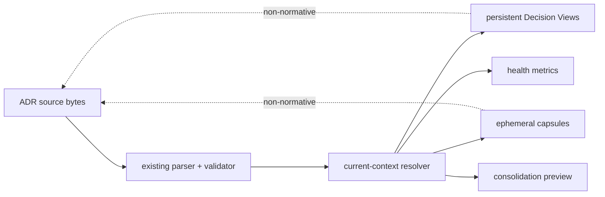

# Implement lossless ADR context compaction

This ExecPlan is a bounded living document. Keep current truth synchronized. Preserve historical events without rewriting them, and seal older events into immutable history checkpoints when the root working set grows.

## Purpose / Big Picture

RepoFoundry users with a mature ADR corpus can organize current decisions without
retiring valid history. After this plan, `epctl adr-health` explains corpus pressure,
`set-decision-view` creates a previewed persistent domain map,
`decision-capsule` emits exact digest-verifiable task context under an explicit byte
budget, and `adr-consolidation-plan` previews semantic-consolidation impact without
changing lifecycle. The capability ships in RepoFoundry AI 0.8.0, is installed into
the local Codex host, and is exercised against the real DataFox mixed strict/legacy
ADR corpus after its Harness upgrade.

## Current Snapshot

- Latest checkpoint: none.
- Current milestone: Milestone 4 — release, installation, and DataFox adoption.
- Current state: resolver, views, capsules, health, consolidation preview, additive
  Harness migration, public documentation, and 0.8.0 version contracts are implemented;
  focused suites and the provider-neutral full check pass.
- Next action: commit and push the reviewed branch, open the release PR, wait for CI,
  merge, tag/release 0.8.0, install it, then upgrade and organize DataFox.
- Open questions: DataFox View taxonomy will be chosen from its real current-effect
  graph after the released tool is installed; no ADR lifecycle changes are implied.

## Context and Orientation

`engineering-execution-plan/scripts/epctl.py` owns ADR parsing, currentness,
relationships, constraints, indexes, status, validation, and mutation. Its current
`adr_input_closure` follows `depends_on` and `amends`; `current_constraint_amendments`
finds accepted current ADRs that target stable constraint IDs. The new resolver will
compose these facts for retrieval without entering the lifecycle mutation path.

`engineering-execution-plan/assets/` contains initialized repository seeds.
`engineering-execution-plan/tests/test_epctl.py` is the executable CLI contract.
`scripts/foundryctl.py` dynamically loads `epctl.py` and consumes
`INIT_DIRECTORIES`/`INIT_FILE_ASSETS`, so additive decision-view infrastructure will
automatically participate in Harness bootstrap and explicit upgrade. Installer and
repository-wide compatibility tests live under `tests/` and run through
`scripts/check.py`.

Decision View means a named repository navigation selection stored in
`docs/.epctl/decision-views.json`; its Markdown files are generated projections.
Decision Capsule means ephemeral exact Markdown returned by the CLI. Neither is an
ADR or an Architecture Input authority. Consolidation Plan means a read-only impact
report, not an effect transition.

## Constraints and References

<!-- REQUIRED: Summarize task-relevant invariants here, then link canonical repository sources. -->

| Source | Why it matters | When to read |
|---|---|---|
| `docs/adr/adr-058_lossless-adr-context-compaction.md` | Normative authority, fidelity, budget, preview, and compatibility constraints | Before every milestone and review |
| `docs/design-docs/dd-012_lossless-adr-context-compaction.md` | Approved resolver, registry, command, failure, and rollout design | Before implementation and integration tests |
| `docs/adr/adr-016_reversible-decision-effect.md` | Existing immutable outcome/current-effect model that must remain unchanged | Before resolver and lifecycle regression work |
| `engineering-execution-plan/scripts/epctl.py` | Single deterministic ADR and ExecPlan control plane | During implementation |
| `engineering-execution-plan/tests/test_epctl.py` | Public CLI and repository contract evidence | With every behavior change |
| `scripts/foundryctl.py` | Harness bootstrap/upgrade composition and rollback | During rollout integration |
| `scripts/check.py` | Canonical provider-neutral verification entrypoint | Before commit, merge, tag, and installation |

## Research and Architecture Inputs

- Research gate: `not_required`.
- Research references: [].
- Architecture decision gate: `satisfied`.
- Architecture compliance: `applicable`.
- ADR references: ["ADR-014", "ADR-016", "ADR-058"].
- ADR constraint references: ["ADR-014#C-001", "ADR-014#C-002", "ADR-014#C-003", "ADR-014#C-004", "ADR-014#C-005", "ADR-014#C-006", "ADR-016#C-001", "ADR-016#C-002", "ADR-016#C-003", "ADR-016#C-004", "ADR-016#C-005", "ADR-016#C-006", "ADR-016#C-007", "ADR-016#C-008", "ADR-058#C-001", "ADR-058#C-002", "ADR-058#C-003", "ADR-058#C-004", "ADR-058#C-005", "ADR-058#C-006", "ADR-058#C-007", "ADR-058#C-008", "ADR-058#C-009"].
- ADR evidence: ["ADR-014@sha256:bf56752a919cc0bc807ef703db9cb8e4192a1e1495597b954412db93a915b1e7", "ADR-016@sha256:448a34be4804a9e60e7ce2e6e78158d7c45d462326b99d456fe533a1513590fb", "ADR-058@sha256:7fa638fb69bcd70969a7491fb7567ec0fa3b7ba72f34a0793333901c6bfeca1b"].
- Design document references: ["docs/design-docs/artifact-metadata-contract.md", "docs/design-docs/reversible-adr-effect.md", "docs/design-docs/dd-012_lossless-adr-context-compaction.md"].
- Approved Design revision evidence: ["DD-012@rev:1@sha256:ce4bdbaa555ed8c1411a88e2637211b927ba595b819115af321cf66e9888c26c"].
- Architecture entrypoint: `docs/design-docs/index.md`.

Research is not required because the approved Design, accepted ADR, DataFox corpus
measurements, existing effect resolver, and existing exact Specifications capsule fix
the architecture route. The remaining work is implementation and validation, not
evidence discovery.

ADR-014 requires existing governed artifacts and their seals to retain semantic
metadata and explicit authority. Generated views are configuration projections, so
they use Git/generator provenance and canonical source links rather than pretending
to be approved artifacts. ADR-016 requires currentness to remain derived from legal
effect states and typed relation closure and forbids lifecycle mutation without
explicit authority. ADR-058 adds the retrieval boundary: exact bytes, current-only
closure, stable view IDs, preview/apply persistence, budget failure, separate health
dimensions, and preview-only semantic consolidation.

DD-012 revision 1 defines schema-1 view registry, commands, atomic recovery, additive
0.8.0 rollout, legacy whole-document fallback, and verification evidence. Its only
remaining unknowns are future enhancements—classification suggestions, path routing,
and legacy migration—and none changes this plan. No Benchmark Scenario is required:
the 32 KiB limit is a deterministic contract boundary, not a performance claim.

## Architecture Compliance Matrix

| ADR constraint or architecture input | Implementation or preservation | Verification |
|---|---|---|
| ADR-014#C-001 | Preserve common metadata and stable IDs on ADR, Design, and EP; classify views as generated configuration rather than governed approval artifacts. | Existing metadata tests plus repository validation. |
| ADR-014#C-002 | Do not introduce a raw evidence bundle; capsule JSON reports exact source and capsule SHA-256 in-band. | Capsule schema/digest tests and manifest regression suite. |
| ADR-014#C-003 | Never infer decision or approval authority from view titles, authors, owners, or CLI callers. | Mutation-free consolidation and lifecycle command regression tests. |
| ADR-014#C-004 | Keep ADR/Design/EP seals intact and validate source payload before compiling strict context. | Tampered accepted ADR and approved Design snapshot tests. |
| ADR-014#C-005 | Read legacy ADRs without rewriting them and make all new files additive. | Legacy whole-document capsule and Harness upgrade compatibility tests. |
| ADR-014#C-006 | Generated views carry generator notice, canonical source path, and digest; Git owns change provenance. | Golden view/index output and repository classification checks. |
| ADR-016#C-001 | Resolver is read-only and never edits decision outcome, authority, inputs, constraints, or body. | Before/after ADR corpus digest assertions. |
| ADR-016#C-002 | Existing transition/supersede preview and authority behavior remains unchanged. | Full lifecycle regression suite. |
| ADR-016#C-003 | Reject under-review seeds and transitively non-current closure. | Current-context graph fixture. |
| ADR-016#C-004 | Exclude retired ADRs from current views while retaining them in historical source/index. | Retirement/view/index fixture. |
| ADR-016#C-005 | Exclude superseded ADRs from current input and preserve replacement/history links. | Supersession/view and archived-evidence fixtures. |
| ADR-016#C-006 | Health/consolidation report active EP impact without editing or unblocking it. | Active-plan impact and archive-block regression tests. |
| ADR-016#C-007 | Reuse recursive currentness and add current scoped amendment expansion. | Dependency/amendment closure fixtures. |
| ADR-016#C-008 | Legacy schemas remain byte-identical and use document SHA-256 fallback. | Cross-schema digest and legacy transition regression tests. |
| ADR-058#C-001 | Put all view/capsule/health/consolidation logic on a read-only projection boundary with explicit non-normative labels. | Source digest equality and rendered-header tests. |
| ADR-058#C-002 | Implement current seeds, relation closure, current amendment expansion, cycle/non-current rejection, and amendment annotations. | Resolver matrix tests. |
| ADR-058#C-003 | Slice exact strict sections/rows, verify strict payloads, and include exact whole legacy documents. | Byte equality, digest drift, UTF-8, and legacy fallback tests. |
| ADR-058#C-004 | Enforce 32 KiB default, no truncation, per-source costs, and reason for raised budgets. | Boundary/overflow/budget-reason tests. |
| ADR-058#C-005 | Add schema-1 stable view registry, deterministic projections, preview/apply, lock, rollback, reindex, and drift validation. | CLI side-effect/idempotency/rollback/symlink tests. |
| ADR-058#C-006 | Emit view/explicit seed capsules with optional constraint selection and complete provenance metadata. | Markdown and JSON golden tests plus EP regression. |
| ADR-058#C-007 | Report independent corpus, graph, constraints, amendments, active-plan, coverage, and context-cost signals. | Health fixture tests without an aggregate score. |
| ADR-058#C-008 | Keep consolidation preview-only and require normal ADR lifecycle for semantic change. | Repository tree digest equality across preview tests. |
| ADR-058#C-009 | Ship additive 0.8.0 installer/Harness upgrade and prove DataFox integration without rewriting its ADRs. | Installer/bootstrap/upgrade suites and real DataFox validation transcript. |

Every structured constraint from every referenced ADR must appear exactly once.
For a legacy ADR without structured constraints, restate its applicable decision
at document level. Design Docs are explanatory inputs and cannot override an ADR.

## Benchmark Gate Set

- Required Scenario IDs: [].

| Scenario | Development decision or milestone gated | Completion contract |
|---|---|---|
| — | No Benchmark Scenario gate declared for this EP. | — |

This set is declared before implementation. Do not replace one Scenario with
another after observing results; change the plan and record the reason first.

## Plan of Work

First extend `epctl.py` with schema-1 registry loading, exact source extraction, a
fixed-point current-context resolver, deterministic Decision View rendering, index
integration, validation, and preview/apply mutation. Add focused fixtures before
changing the public parser.

Then implement exact capsule compilation, independent health metrics, and read-only
consolidation impact. Integrate commands into argparse and document their invariants,
budgets, and non-normative boundary in the Skill, references, README, and evals.

Next update distribution version and release-facing examples, exercise bootstrap and
upgrade contracts, run focused and full verification, and review the branch diff for
scope and compatibility. Merge through a PR and create GitHub release v0.8.0 only
after CI passes.

Finally install the released distribution into the local Codex host, preview/apply
the DataFox Harness upgrade, define DataFox domain views only through the new CLI,
run health/capsule/consolidation previews, and verify source ADR bytes were unchanged.

## Milestones

### Milestone 1: Deterministic current-context resolver and Decision Views

Add registry/assets, exact source models, fixed-point current closure, view rendering,
preview/apply/remove commands, reindex integration, and validation. Focused tests must
show no preview side effects, idempotent apply/reindex, invalid-input failure, and
unchanged ADR bytes.

### Milestone 2: Exact capsules, health, and consolidation preview

Add task capsule selection/digests/budgets, multidimensional health JSON/table output,
and active-plan/proposed/legacy/amendment consolidation impact. Focused tests must
cover strict and legacy bytes, filters, overflow, raised-budget reasons, graph metrics,
and read-only behavior.

### Milestone 3: Distribution documentation and full integrity

Update Skill/reference/README/evals and version metadata for 0.8.0. Run focused unit
tests, installer/bootstrap/upgrade tests, repository validators, link checks, and the
canonical `python3 -B scripts/check.py`. Reindex twice and require a clean second run.

### Milestone 4: Release, installation, and DataFox adoption

Push a reviewed PR, wait for CI, merge, tag/release v0.8.0, install that immutable
release locally, and preview/apply DataFox's upgrade. Use the new CLI to create
domain views and inspect task capsules/consolidation impact. Verify DataFox ADR source
hashes are identical before and after organization.

## Concrete Steps

Work from `/Users/wangxiaowei1/x-otel/EngineeringPlan-adr-context-compaction`.

1. Edit `engineering-execution-plan/scripts/epctl.py`, assets, tests, Skill and
   references with `apply_patch`.
2. Run focused tests:
   `python3 -m unittest engineering-execution-plan.tests.test_epctl`.
3. Run component and repository validators:
   `python3 engineering-execution-plan/scripts/epctl.py --repo . validate` and
   `python3 engineering-design/scripts/designctl.py --repo . validate`.
4. Run full integrity: `python3 -B scripts/check.py`; expect exit 0.
5. Run `epctl reindex` twice and compare `git status --short`; the second run must
   produce no new diff.
6. Commit, push `codex/adr-context-compaction`, open a PR, wait for all checks, merge,
   create tag/release `v0.8.0`, and verify release assets/tag/commit.
7. Install with the released installer/version and verify `repofoundry --version`
   reports 0.8.0.
8. From `/Users/wangxiaowei1/x-otel/datafox`, hash all ADR source documents, preview
   then apply `repofoundry upgrade --to 0.8.0`, use released `epctl` commands to define
   views, validate, and compare the ADR source hash manifest byte-for-byte.

## Validation and Acceptance

- [x] From the RepoFoundry root, run the focused `test_epctl` suite; expect every view,
  capsule, health, consolidation, lifecycle, and compatibility test to pass. Evidence:
  concise test transcript or `artifacts/focused-tests.txt`.
- [x] Run `python3 -B scripts/check.py`; expect exit 0 across supported repository,
  installer, Harness, spec-router, design, and execution contracts. Evidence:
  `artifacts/full-check.txt`.
- [x] Run `epctl reindex` twice and `epctl validate`; expect byte-stable projections,
  zero errors, and only pre-existing documented warnings. Evidence: git diff and
  validation transcript.
- [x] Exercise a mixed strict/legacy fixture; expect exact verified bytes, default
  32 KiB overflow failure, and reason-gated raised budget. Evidence: focused golden
  assertions.
- [x] Exercise consolidation preview; expect no ADR/EP/source byte changes and an
  explicit `preview_only` result with active-plan/proposed/legacy impact. Evidence:
  before/after digest assertions.
- [ ] Verify GitHub PR checks, merged commit, tag, and release v0.8.0 all point to the
  intended revision. Evidence: GitHub URLs and CLI transcript in the final report.
- [ ] Install v0.8.0 locally; expect host registration and `repofoundry --version` to
  report 0.8.0. Evidence: installer receipt and version output.
- [ ] Preview/apply DataFox Harness 0.8.0, define views with released commands, run
  health/capsule/consolidation/validate, and prove every ADR source digest is
  unchanged. Evidence: DataFox command transcript and digest comparison.

### Required Benchmark Scenario Gates

- No required Benchmark Scenario gates.

Completion writes `verified_revision` and `verification_evidence` through
`archive-ep`. Archival also seals the complete document with `archive_sha256`;
do not pre-fill these fields while the plan is active.

## Idempotence and Recovery

All new persistent commands preview by default. Apply uses the existing repository
lock and snapshots registry/index/generated paths; any rendering or validation error
restores previous bytes and removes only newly created generated files. Repeating
`set-decision-view`, `reindex`, Harness upgrade, installation, and validation with the
same inputs must be a no-op or byte-stable.

The feature never edits ADR sources. A failed DataFox operation can be retried after
fixing the reported conflict. A view can be explicitly removed through preview/apply;
downgrading leaves additive files ignored by 0.7.1. Git commits and the immutable
release permit code rollback; DataFox ADR digest manifests prove organization did not
alter authority. Do not use destructive Git commands or remove user worktree changes.

## Progress

- [x] (2026-09-01T00:49:56Z) Plan created from approved DD-012 and accepted ADR-058.
- [x] (2026-09-01T00:55:00Z) Filled the self-contained implementation, compliance,
  recovery, release, and DataFox acceptance contract.
- [x] (2026-09-01T02:20:00Z) Implemented Milestone 1 resolver, registry, generated
  Decision Views, preview/apply/remove, lifecycle rebuild, validation, and rollback.
- [x] (2026-09-01T02:45:00Z) Implemented Milestone 2 exact strict/legacy capsules,
  budget diagnostics, independent health dimensions, and mutation-free consolidation.
- [x] (2026-09-01T03:30:00Z) Completed Milestone 3 documentation, 0.8.0 versioning,
  additive Harness migration tests, repeated reindex, and the canonical full check.
- [ ] Complete Milestone 4 release, installation, and DataFox adoption.

## Surprises & Discoveries

- Existing `foundryctl upgrade` migrated only Harness manifest/Core/adapter files;
  `epctl` bootstrap assets were composed only during bootstrap. The 0.8.0 migration
  now explicitly previews, creates, validates, and rolls back the three additive
  Decision View infrastructure paths.
- Lowercase legacy ADR filenames were discoverable but `find_adr` used a case-sensitive
  filename fallback and strict frontmatter parser. It now uses the shared legacy parser
  and case-insensitive path identity while rejecting matching symlink paths.

## Decision Log

- 2026-09-01 — Treat the 32 KiB default as a deterministic context contract rather
  than a Benchmark claim; correctness evidence is byte/digest and boundary testing.
- 2026-09-01 — Keep Decision View identity as a stable kebab-case slug in a schema-1
  registry because views are generated navigation configuration, not governed
  acceptance artifacts with a separate lifecycle.
- 2026-09-01 — Use explainable soft review targets of 24 effective ADRs, 12 ADRs in
  the largest current component, 12 ADR refs or 96 constraint refs per active plan,
  and 8 partially amended ADRs; these signals never trigger lifecycle mutation.
- 2026-09-01 — Keep Harness schema/Core/adapter versions unchanged for 0.8.0 and model
  Decision View setup as an additive distribution migration, not a schema migration.

## Blockers

| ID | Status | Opened | Resolved | Missing capability | Impact | Unblock or resolution |
|---|---|---|---|---|---|---|

## Outcomes & Retrospective

<!-- REQUIRED_AT_COMPLETION: Compare the result with the original purpose. Record completed behavior, evidence, gaps, remaining work, and lessons. -->

### Knowledge promotion candidates

- None.

## Interfaces and Dependencies

Use only the Python 3.10+ standard library already required by RepoFoundry. New code
must compose existing `adr_document_data`, `validate_adr`, `adr_currentness`,
`adr_input_closure`, `current_constraint_amendments`, `section`, `atomic_write`,
`repo_lock`, and path/symlink guards rather than duplicating lifecycle rules.

Persistent schema: `docs/.epctl/decision-views.json` version 1 with sorted unique
`{id,title,adr_refs}` records. Generated interfaces: `docs/DECISION-VIEWS.md` and
`docs/decision-views/<id>.md`. Public commands and JSON schemas are those fixed in
DD-012. `foundryctl.py` continues consuming `INIT_DIRECTORIES` and
`INIT_FILE_ASSETS`; no new service, database, network API, or third-party dependency
is permitted.

## Artifacts and Notes

- Plan: `docs/exec-plans/active/ep-061_implement-adr-context-compaction/EXECPLAN.md`
- Full logs, traces, screenshots and generated evidence belong under `artifacts/`; keep only concise observations and paths here.

## Revision Notes

- 2026-09-01T00:49:56Z — Initial plan created.
