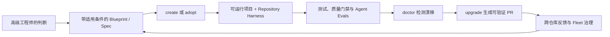

# RT-001 · RepoFoundry AI commercial and delivery feasibility

## 结论速览

<!-- topic-role: decision-brief -->

> **答案：** 值得继续，但属于“有条件 Go”。前门可以是 AI 时代的项目脚手架，
> 真正需要建设的是可创建、接管、诊断和持续升级的 Verified Golden Path；如果只生成
> Prompt、AGENTS.md 或一次性模板，则很难形成持续商业价值。
>
> **置信度：** Medium。需求、市场时机和技术基础有较强证据，目标客户的真实使用
> 频率、预算归属和付费意愿仍没有客户访谈或试点数据。
>
> **决策影响：** 只批准单一技术栈 MVP、对照 Benchmark 和设计伙伴验证；在证明
> Agent 交付质量提升并获得至少一个付费承诺前，不扩张为多语言平台或企业控制面。
>
> **适用边界：** 判断基于截至 2026-08-02 的公开市场与当前仓库状态，适用于希望让
> Coding Agent 参与生产级软件交付的团队，不适用于仅生成一次性原型或把模型运行时
> 本身作为产品的方向。

关联研究问题：

- `RQ-001`
- `RQ-002`
- `RQ-003`
- `RQ-004`
- `RQ-005`

这个 Topic 决定 R-002 应继续验证还是停止投入。它把“AI 会继续普及”的行业判断，
转换成 RepoFoundry 必须满足的具体产品边界、商业前提和可证伪门槛。

**按阅读目标选择路径：**

- 快速决策：阅读“结论速览”和“产品应从一次性生成延伸到持续工程系统”。
- 理解机制：依次阅读 A-001 至 A-007，了解需求、商品化风险、现有资产和 MVP 路径。
- 完整复核：继续阅读反证条件、下游交接、证据索引和来源。

## 价值不在生成更多代码，而在复用并验证工程判断

<!-- topic-role: mental-model -->

传统脚手架把依赖选择和目录结构编码为模板；AI 原生脚手架还需要把架构边界、适用
条件、测试、安全、可靠性和完成标准编码为 Agent 可以读取、工具可以执行、团队可以
升级的契约。只有当系统持续检查这些契约，它才会从一次性下载工具变成有复购与留存
基础的工程产品。

这个模型区分三种容易混淆的价值：Bootstrap 负责第一次生成，Harness 让规范在仓库中
持续生效，Fleet 控制面让组织能够跨仓库复用和升级。后续分析将据此判断哪些能力只是
获客入口，哪些能力可能支持长期商业化。

## 从市场信号、替代方案和当前资产逐步收敛产品边界

<!-- topic-role: analysis -->

分析先验证问题是否真实，再检查基础能力是否已经商品化；随后把当前仓库与目标产品
比较，推导可持续的产品边界、商业模型、护城河和最小验证路径。

### AI 提高局部产出后，系统级约束与验证成为新的主要瓶颈（A-001）

DORA 将 AI 描述为组织能力的放大器：底层工程系统强时收益放大，系统存在缺陷时问题
也会放大。[E-001](#e-001) Stack Overflow 的调查进一步表明，开发者已经广泛使用 AI，
但对准确性、“几乎正确”的输出和调试返工仍有显著顾虑。[E-002](#e-002) 这意味着需求
并不是“再找一个模型写更多代码”，而是降低判断、上下文组织和验证的重复成本。

antirez 的实践观察把机制说得更具体：LLM 擅长局部最优实现，但系统的大设计、性能
目标和 QA 仍依赖清晰的心智模型。[E-003](#e-003) OpenAI 的 Harness 实践则展示了
仓库内知识、渐进披露和机械校验如何支撑更高 Agent 自主度。[E-004](#e-004) 这些来源
共同支持用户提出的核心假设，但不能直接证明某个 RepoFoundry 实现一定提高生产率。
METR 对 2026 年数据的更新也明确说明，当前净加速幅度仍难以可靠测量。[E-013](#e-013)

### 基础指令与一次性模板正在商品化，不能独立形成产品护城河（A-002）

AGENTS.md 已成为跨多个 Coding Agent 的开放格式，GitHub 等宿主也直接支持仓库级、
路径级指令和 Hooks。[E-005](#e-005) 传统生成端已有 Spring Initializr，组织级模板端
已有 Backstage Software Templates；它们都能通过参数生成并发布项目。[E-006](#e-006)
Spec Kit 和 Tessl 又覆盖了规范驱动开发和规则注册。[E-007](#e-007)

更直接的 repo-harness、Harness 和 Straion 已经宣传 repo-local workflow、Agent-ready
scaffold 或 AI coding governance。[E-008](#e-008) 因此，“生成 AGENTS.md 并内置最佳
实践”既容易被复制，也容易被 Agent 厂商吸收。它可以是低摩擦入口，但只有当模板带有
版本、适用条件、可执行验证、升级路径和实际效果证据时，才可能形成差异化。

### 当前仓库具备可信内核，但尚未交付一个可运行的业务项目（A-003）

RepoFoundry 已有 preview-first Bootstrap、冲突前停止、版本化 Spec、Git commit 与
摘要锁、Harness 漂移校验，以及 Benchmark、Research、ADR 和 ExecPlan 等持久证据
契约。[E-009](#e-009) 这些能力比普通模板更接近可持续工程系统，也是继续演进而不是
另起炉灶的主要理由。

但是当前公开入口只提供 `codex` profile，Bootstrap 创建的是 AGENTS.md、架构地图和
文档控制面，并不生成应用源码、依赖、CI、部署基线或可运行服务。[E-010](#e-010)
核心实现和测试已有一定规模，说明技术探索不是概念稿；它仍缺少发行包、Web 入口、
Golden Path catalog 和用户结果指标。[E-011](#e-011) 公开仓库当前没有 Star、Fork、
Release 或客户案例，现有工程成熟度不能替代市场验证。[E-012](#e-012)

### 前门应是脚手架，核心应覆盖 create、adopt、doctor 与 upgrade（A-004）

一次性 `create` 能提供类似 Spring Initializr 的清晰传播入口，但它发生频率低，也不能
保证项目在半年后仍符合标准。当前 RepoFoundry 已经擅长对已有仓库做安全增量改造，
因此 `adopt` 不应被新产品方向丢弃。[E-009](#e-009) 对企业而言，已有仓库通常比新建
仓库更多，brownfield 能力反而可能成为差异化。

`doctor` 应把规范、依赖、架构入口和质量门禁的漂移变成可定位结果；`upgrade` 应在
锁定版本、预览差异和通过验证后生成 PR。这个生命周期与 OpenAI 将人类反馈沉淀为
文档、工具和持续清理规则的实践一致。[E-004](#e-004) 它也符合 antirez 强调的工作
重心转移：高级工程师控制设计与 QA，Agent 承担实现。[E-003](#e-003)

### 付费客户更可能是管理多个仓库的团队，而不是只下载模板的个人（A-005）

个人开发者和开源用户适合作为传播渠道，但免费脚手架、开放 AGENTS.md 和 IDE 内置
能力限制了其持续付费意愿。相反，平台工程、架构、交付和受监管研发团队需要维护私有
规范、统一升级多个仓库、保留审计证据，并降低高级工程师反复 Review 的成本。现有
治理竞品也明确把 Lead Engineer、Platform Team 和 Engineering Manager 作为目标
用户。[E-008](#e-008)

因此较合理的模式是 Open Core：本地 `create/adopt/doctor` 与公开 Golden Path 免费，
私有 Blueprint/Spec、自动升级 PR、Fleet 漂移、组织策略、SSO/RBAC、审计和私有部署
收费。这是基于使用频率和组织成本的商业推断，而不是已经验证的付费事实。Stack
Overflow 数据只能证明准确性和安全顾虑存在，[E-002](#e-002) 当前公开项目数据也尚未
证明 RepoFoundry 获得了需求拉力。[E-012](#e-012)

### 可验证的 Golden Path 与持续反馈比静态最佳实践更可能形成护城河（A-006）

“最佳实践”如果没有适用边界，会把简单项目过度工程化；如果只有自然语言，Agent 也
可能忽略或错误解释。更可靠的资产是带版本和条件的 Blueprint、兼容性图谱、升级
迁移、可执行门禁，以及证明其有效性的稳定 Benchmark Scenario。当前 Spec 锁定和
Benchmark 生命周期为此提供了技术起点。[E-009](#e-009)

OpenAI 的经验表明，仓库知识需要机械 lint、CI 和持续清理，而不能只依靠提示词。
[E-004](#e-004) RepoFoundry 最重要的产品证据应是：相同 Agent 和相同任务，在普通
脚手架与 RepoFoundry Golden Path 上的首次通过率、返工、缺陷和总时间有可重复差异。
由于当前生产率测量本身存在选择偏差和任务分布问题，[E-013](#e-013) Benchmark 必须
公开边界，不能用单一演示推导普遍生产率。

### 单一技术栈、真实试点和停止门槛可以把落地风险控制在一个季度内（A-007）

同时维护 Java、Go、TypeScript 和 Python 会立即制造依赖矩阵、框架升级与最佳实践
争议。当前只有一个 Codex Harness profile，也没有应用生成抽象，[E-010](#e-010)
所以 MVP 应选择最容易获得真实设计伙伴的一条技术栈，只实现一条生产级 Golden Path
和 `create/adopt/doctor`；`upgrade` 可以先以一次受控版本迁移证明机制。

现有数千行 CLI 与测试降低了从零搭建控制契约的风险，[E-011](#e-011) 但 0 Star、
0 Fork 和无 Release 说明传播、安装与客户验证必须成为同等优先级。[E-012](#e-012)
建议把 Go 条件写成结果指标：10 分钟进入 Green CI、Agent 典型任务首次通过率提高
至少 20 个百分点或 Review 返工降低 30%、3 个团队连续使用四周、至少 1 个付费承诺。
鉴于客观生产率测量仍不稳定，[E-013](#e-013) 指标必须包含质量而不只计算生成速度。

## 三种合理路线中，只有生命周期产品同时保留传播与持续价值

<!-- topic-role: alternatives -->

| 解释或方案 | 为什么看似合理 | 反证 | 当前判断 |
|---|---|---|---|
| A：维持当前 Harness 与专业 Skill | 已有实现成熟，继续深化风险最低 | 用户需要理解五个 Skill，缺少一眼可见的业务结果，也没有持续收入表面 | 可保留为底层内核，不宜作为唯一产品形态 |
| B：增加 AI 最佳实践模板与 Web 下载 | 最像 Spring Initializr，演示和传播简单 | 免费替代多、使用频率低、模板会过期，无法证明长期质量 | 适合作为前门，不足以成为完整商业产品 |
| C：Verified Golden Path 生命周期 | 同时覆盖创建、旧仓库接管、验证和升级，可产生持续数据与组织价值 | 实现和维护成本更高，必须严格限制首条技术栈 | 推荐，但以 Benchmark 与付费试点为前置条件 |
| D：直接建设企业 Agent 编排控制面 | 合同价值可能最高 | 与现有产品正面竞争，当前无客户、运行时和安全能力基础 | 当前阶段拒绝，待 C 获得真实拉力后再评估 |

“模型会很快解决所有工程问题”是另一种可能解释，但现有证据更支持 AI 能力与工程
系统共同决定结果。即便模型继续增强，版本、架构意图、验收边界和组织政策仍需要可读
且可执行的事实源；产品必须避免依赖某一代模型的特定弱点作为唯一价值。

## 产品应从一次性生成延伸到持续工程系统

<!-- topic-role: implications -->

推荐 Option C，但只授权有界验证。对外信息可以使用“AI 时代的 Spring Initializr”
降低理解成本，正式产品承诺应是：从空目录或已有仓库出发，把它变成 Agent 可以理解、
验证和持续升级的生产级工程系统。

| 决策面 | 约束 |
|---|---|
| 用户入口 | 收敛为 `create`、`adopt`、`doctor`、`upgrade`；专业 Skill 留作高级能力和内部生产者 |
| 首条 Golden Path | 只选一条最容易取得真实客户和工程证据的技术栈，不同时覆盖多语言 |
| 专家经验表达 | 使用带适用条件、风险等级、反例、版本和验证的决策模块，不宣称无条件最佳实践 |
| 产品证据 | 在同一任务、Agent 和环境下，与普通脚手架做可重复 Benchmark |
| 商业化 | 免费本地内核负责采用，私有规范、升级、Fleet、审计与部署控制负责收费 |
| 扩张条件 | 三个真实设计伙伴、连续使用数据和至少一个付费承诺满足后再建设多栈或企业控制面 |

## 哪些新证据会改变当前判断

<!-- topic-role: falsifiers -->

| 影响的分析 | 会削弱或推翻当前判断的证据 | 为什么重要 | 如何验证 |
|---|---|---|---|
| A-001 | 目标团队认为 AI 工程质量不是高频问题，或已有流程无需新增系统 | 核心需求不存在就不应继续产品化 | 访谈 10–15 个团队，并要求提供最近一次真实返工或事故 |
| A-002 | 主流 Agent 宿主完整覆盖跨模型规则、版本升级和质量证明，团队愿意只使用宿主能力 | 独立产品空间会被平台吸收 | 用同一客户流程比较宿主原生能力和 RepoFoundry 差异 |
| A-003 | 现有文件契约无法安全扩展到应用生成，重用成本高于新建内核 | 当前技术资产不再构成优势 | 实现一条最小 Golden Path prototype 并记录复用与新增比例 |
| A-004 | 用户只在新建时使用，之后拒绝运行 doctor 或接受升级 PR | 生命周期与留存假设失效 | 对三个真实仓库进行四周跟踪 |
| A-005 | 平台团队认可问题但没有预算，或私有规范与 Fleet 功能无法获得付费承诺 | 商业模式不成立 | 获取至少一个付费试点、LOI 或明确采购路径 |
| A-006 | 对照 Benchmark 没有质量改善，或改善小于维护和 Token 成本 | 核心差异化没有产生净价值 | 预注册 Scenario，比较首次通过率、返工、缺陷与总成本 |
| A-007 | 单一 Golden Path 仍无法在一个季度内交付和维护 | MVP 范围仍然过大 | 设定 8–12 周时间盒并记录每类维护成本 |

## 下游交接

<!-- topic-role: handoff -->

| 去向 | 状态 | 具体变化或约束 |
|---|---|---|
| Synthesis | integrated | 记录“有条件 Go”、Option C、开放的付费问题和量化停止条件 |
| ADR / ExecPlan | not-ready | RQ-004 尚未回答，也没有 Golden Path Benchmark；不得接受全面产品化决定 |
| Prototype / monitoring | required | 单一技术栈 Golden Path、`create/adopt/doctor`、一次升级实验、3 个设计伙伴 |

下一轮应把客户访谈作为商业证据，把稳定对照实验交给 `engineering-benchmark`。只有
Owner 审阅并回答开放问题后，Synthesis 才能进入 review-ready；本 Topic 不授权
Research conclude。

## 证据索引

<!-- topic-role: evidence-index -->

| ID | 观察 | 精确来源 | 支持的分析 | 置信度 |
|---|---|---|---|---|
| E-001 | DORA 认为 AI 主要放大组织现有的强项与弱项，回报依赖底层系统。 | S-001 | A-001 | High |
| E-002 | 2025 调查中 46% 不信任 AI 准确性；66% 遇到“几乎正确”，45% 认为调试 AI 代码更耗时。 | S-002 | A-001, A-005 | High |
| E-003 | antirez 认为 LLM 更擅长局部代码，工程师应控制设计、性能方向和 QA。 | S-003 | A-001, A-004 | Medium |
| E-004 | OpenAI 通过仓库内知识、渐进披露、lint/CI 和持续清理支撑 Agent 自主度。 | S-004 | A-001, A-004, A-006 | High |
| E-005 | AGENTS.md 已是多 Agent 开放格式，GitHub 也原生支持仓库/路径指令与 Hooks。 | S-005, S-006 | A-002 | High |
| E-006 | Spring Initializr 与 Backstage 已覆盖参数化项目或组件模板生成。 | S-007, S-008 | A-002 | High |
| E-007 | GitHub Spec Kit 与 Tessl 已提供规范驱动开发或规则注册能力。 | S-009, S-010 | A-002 | High |
| E-008 | repo-harness、Harness 与 Straion 直接覆盖 repo-local workflow、Agent-ready scaffold 或 AI coding governance。 | S-011, S-012, S-013 | A-002, A-005 | High |
| E-009 | 当前 RepoFoundry 已实现安全 Bootstrap、Spec 锁定、验证和专业证据生命周期。 | S-014, S-015 | A-003, A-004, A-006 | High |
| E-010 | 当前 `foundryctl bootstrap` 只有 `codex` profile，生成文档 Harness 而不是应用源码。 | S-014, S-015 | A-003, A-007 | High |
| E-011 | 核心 CLI/Spec 实现约 3300 行，相关测试约 2300 行。 | S-016 | A-003, A-007 | High |
| E-012 | 公开仓库当前显示 0 Star、0 Fork，且没有 Release 或客户证据。 | S-017 | A-003, A-005, A-007 | High |
| E-013 | METR 认为 2026 年 AI 可能比 2025 年更能加速开发者，但当前实验存在选择偏差，无法可靠估计幅度。 | S-018 | A-001, A-006, A-007 | High |

## 来源

<!-- topic-role: sources -->

- S-001 — DORA, [State of AI-assisted Software Development 2025](https://dora.dev/research/2025/dora-report/)，用于验证 AI 与底层工程系统的关系。
- S-002 — Stack Overflow, [2025 Developer Survey: AI](https://survey.stackoverflow.co/2025/ai)，用于验证信任、返工、复杂任务与 Agent 使用情况。
- S-003 — Salvatore Sanfilippo, [Control the ideas, not the code](https://antirez.com/news/169)，Redis 作者关于设计、局部代码与 QA 的一手实践观点。
- S-004 — OpenAI, [Harness engineering: leveraging Codex in an agent-first world](https://openai.com/index/harness-engineering/)，用于验证 repo-local knowledge、机械校验和持续清理机制。
- S-005 — [AGENTS.md open format](https://agents.md/)，用于验证跨 Agent 指令格式的采用和基础层商品化。
- S-006 — GitHub Docs, [Adding repository custom instructions for GitHub Copilot](https://docs.github.com/en/copilot/how-tos/copilot-on-github/customize-copilot/add-custom-instructions/add-repository-instructions)，用于验证宿主原生指令能力。
- S-007 — Spring, [What's new with Spring Initializr](https://spring.io/blog/2019/02/20/what-s-new-with-spring-initializr/)，用于验证传统项目生成器的能力与规模。
- S-008 — Backstage, [Software Templates](https://backstage.io/docs/features/software-templates/)，用于验证组织级模板、参数和仓库发布能力。
- S-009 — GitHub, [Specification-Driven Development](https://github.com/github/spec-kit/blob/main/spec-driven.md)，用于验证 Spec-driven 替代能力。
- S-010 — Tessl, [Spec-driven framework and registry](https://tessl.io/blog/tessl-launches-spec-driven-framework-and-registry/)，用于验证规则与 Spec Registry 产品方向。
- S-011 — [repo-harness](https://repoharness.com/)，直接竞品的一手产品能力说明。
- S-012 — [Harness](https://antubattle.github.io/Harness/)，直接竞品的一手 Agent-ready scaffold 能力说明。
- S-013 — [Straion](https://straion.com/product/)，直接竞品的一手 AI coding governance 与目标客户说明。
- S-014 — `README.zh-CN.md` 与 `docs/design-docs/repo-foundry-system.md`，当前产品边界和架构事实。
- S-015 — `scripts/foundryctl.py`、`scripts/spec_manager.py` 与 `python3 scripts/foundryctl.py --help`，当前 CLI 与实现事实。
- S-016 — 在仓库根运行 `wc -l scripts/foundryctl.py scripts/spec_manager.py tests/test_foundryctl.py tests/test_spec_manager.py tests/test_repository_contracts.py`，用于记录当前实现与测试规模。
- S-017 — GitHub, [XiaoWeiKIN/RepoFoundryAI](https://github.com/XiaoWeiKIN/RepoFoundryAI)，截至 2026-08-02 的公开仓库采用与发行状态。
- S-018 — METR, [We are Changing our Developer Productivity Experiment Design](https://metr.org/blog/2026-02-24-uplift-update/)，用于限制对净生产率的推断。

## 修订记录

<!-- topic-role: revision-notes -->

- 2026-08-02T07:39:01Z — RT-001 created for RR-001.
- 2026-08-02 — 记录第一轮市场、竞争、仓库、商业模式和落地可行性分析。
