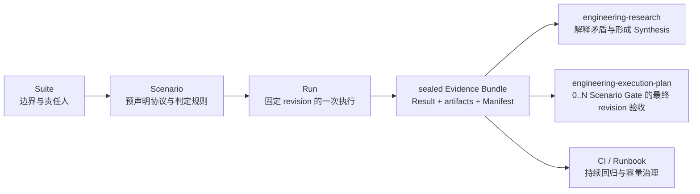

# Engineering Benchmark

把一次性的“跑个压测”转化为可复现、可封存、可被 Research、EP 和 CI
共同消费的证据。以可证伪假说驱动实验，用观察检验预测并解释适用边界。
Benchmark 可以给出有证据支持的局部机制解释，不替人做架构决策。



## 职责边界

使用本 Skill：

- 比较实现、配置、部署拓扑或依赖版本；
- 采集延迟、吞吐、资源、正确性、稳定性或故障恢复证据；
- 给 Research 补一个可复现实验；
- 对 EP 的最终 revision 执行验收；
- 建立 CI 回归基线或容量运行手册。

不要使用本 Skill：

- 只需要阅读代码、文档和已有证据；
- 需要解释多个来源、处理矛盾并给出研究级推荐；
- 需要接受 ADR、拆解开发任务或治理实施过程；
- 只有一条临时命令，且结果不会被复用、审计或作为决策依据。

Benchmark 不全部进入 Research：

Explore/Build 中普通测试、一次性 profiling 和不会被复用的本地测量不创建 Benchmark
制品；当测量将支撑持久决策、容量/SLO 声明、回归门禁或跨会话复核时，任务升级到
Governed 并使用本 Skill。模式变化不能用来事后降低已预声明的 Scenario 规则。

| 目的 | 默认消费者 |
|---|---|
| 探索未知、比较路线、结果可能改变架构 | Engineering Research |
| 验证已决定路线的最终 revision | Execution Plan |
| 夜间回归、容量趋势、运维阈值 | CI / Runbook |

持续回归只有在出现矛盾、路线未知或需要改变决策时，才升级为 Research。

## 科学方法约束

- 问题优先指向机制，而不止是实现排名。容量或回归验收可以检验有边界的行为声明，
  但不能仅凭相关性宣称因果机制。
- **跑基准之前写定假说、预测和证伪条件**，保存在 Scenario 中。每条假说都要回答
  “观察到什么就说明我错了”。已有探索数据必须披露；由它提出的新假说要用新实验检验。
- 预测必须落到可核对的指标、方向或阈值。“更快”不够；机制假说还要有分配、I/O、
  编译产物或其他能区分竞争解释的证据。延迟和吞吐可以是容量/SLO 的主指标。
- 对照实验工作量和正确性语义等价，一次只改变一个待归因变量。必须同时改变多个
  因素时预声明实验矩阵与交互分析；否则只报告组合效果，不拆分归因。
- 先验证被测操作确实执行、计时范围正确、输入有代表性，再解释数字。
  异常低耗时、零分配或突变必须排除代码消除、空跑、缓存特例和测量工具偏差。
- 预声明重复次数、样本单位、汇总方式、不确定性、排除规则和停止条件；保留所有
  原始样本，不挑最快一次，也不反复测到显著才停。分辨率不足时写 `inconclusive`。
- 机制结论需要**测量结果 + 编译器或运行时诊断 + 对应版本源码机制**相互印证。
  证据缺失或冲突时保留观察并降低解释强度，不把推测写成机制事实。
- 逐条记录预测命中、被推翻或证据不足，保留无效实验和失败修正过程；每个数字关联
  原始文件与生成命令，结论标明版本、架构、工作负载及失效条件。

设计实验时读取 [scientific-method.md](references/scientific-method.md)，其中包括
预测示例、重复测量方法、三条证据链和 Go 微基准的具体应用。
这些是实验有效性约束；Manifest 校验只能证明证据未被改写，不能证明实验设计正确。

## 制品模型

```text
benchmarks/
├── .benchctl/state.json
├── BENCHMARKS.md
└── suites/
    └── b-NNN_slug/
        ├── BENCHMARK.md
        ├── scenarios/
        │   └── bs-NNN_slug.md
        └── runs/
            └── br-NNN_slug/
                ├── SCENARIO.md
                ├── RESULT.md
                ├── EVIDENCE_MANIFEST.json
                └── artifacts/
```

- `B-NNN` 是长期主题和责任边界。
- `BS-NNN` 是执行前稳定下来的协议，包括假设、变量、数据集、环境、步骤、
  指标、重复策略、判定规则和外推边界。
- `BR-NNN` 是某个 subject revision 与 harness revision 的一次执行。
- `SCENARIO.md` 是创建 Run 时复制的协议快照；后续修改原 Scenario 不改变它。
- `EVIDENCE_MANIFEST.json` 只在封存时生成，清点本地证据并校验 SHA-256。
- 原始 CSV、JSON、日志、Trace、截图和 profiler 输出保留原生格式，不强制转换。

修改契约、实现 CLI 或让其他工具消费 Manifest 前，完整读取
`references/contract.md`。选择 Research、EP 或 CI 路由时读取
`references/examples.md`。

## Scenario 协作校准

用户要求一起设计压测，或工作负载、环境、指标、阈值、安全限制与外推边界存在多个
会改变证据含义的可信定义时，创建 Run 前完整读取
[collaboration.md](references/collaboration.md)。

- 从现有 SLO、EP gate、生产特征和仓库事实提出具体默认 Scenario，再比较 2–3 个
  有意义的工作负载或判定形态及其可证明范围；一次只询问一个用户拥有的约束。
- 用户的简短选择形成候选协议。先用一个 burst、长尾、冷缓存、故障或资源安全场景
  复验，再认为 Scenario 可用于创建 Run。
- `new-run` 复制 Scenario 后，该 Run 的协议不可协商。结果不理想不能改阈值、环境
  或 observation；协议实质变化创建新 Scenario，执行问题创建新 Run。
- Run、Result、seal 和 outcome 始终证据驱动。交互不能把 `failed`、
  `inconclusive` 或 `errored` 改成 `passed`。

## 优先使用 benchctl

把 `<skill-dir>` 解析为本 Skill 所在目录。命令都在目标仓库根目录运行：

```bash
python3 <skill-dir>/scripts/benchctl.py --repo . init

python3 <skill-dir>/scripts/benchctl.py --repo . new-suite \
  --slug spans-placement --title "Spans placement strategies" \
  --owner "Observability Performance Owner" --author "Codex"

python3 <skill-dir>/scripts/benchctl.py --repo . new-scenario B-001 \
  --slug placement-order-key \
  --title "Compare placement order-key strategies" --author "Codex"

python3 <skill-dir>/scripts/benchctl.py --repo . new-run BS-001 \
  --slug candidate-a \
  --title "Candidate A at 10k spans/s" \
  --subject-revision "git:<subject-commit>" \
  --harness-revision "git:<harness-commit>" --author "Codex"

python3 <skill-dir>/scripts/benchctl.py --repo . seal-run BR-001 \
  --outcome passed \
  --executed-by "Codex"

python3 <skill-dir>/scripts/benchctl.py --repo . evidence-ref BR-001
python3 <skill-dir>/scripts/benchctl.py --repo . validate
python3 <skill-dir>/scripts/benchctl.py --repo . status
python3 <skill-dir>/scripts/benchctl.py --repo . reindex
```

`new-run` 之前必须移除 Suite 和 Scenario 中的 `REQUIRED` 标记。创建 Run 后，
执行 Scenario 中声明的命令，把原始输出写入 `artifacts/`，再填写
`RESULT.md`。工具本身不假装执行领域压测命令。

## 标准工作流

1. 检查仓库约定和现有 Benchmark，确认是复用 Suite/Scenario 还是创建新的。
2. 在 Suite 中写清主题、被测系统边界、Owner、非目标和消费者。
   `Unassigned` 只允许保留 Suite 草稿，不能创建 Scenario。
3. 若 Scenario 的代表性或判定规则包含用户拥有的产品/SLO 取舍，先按
   `references/collaboration.md` 校准候选协议并用一个区分性压力场景复验；不要
   询问可以从系统和已有证据推导的技术默认值。
4. 在跑基准之前完成 Scenario 的问题、假说、具体预测与证伪条件，再补全对照、
   受控变量、数据集、环境、有效性检查、warmup、重复策略、缓存状态和恢复步骤。
5. 预声明指标、统计方法与判定规则。观察结果后实质改变假说或协议要创建新 Scenario；
   原协议下修复执行问题创建新 Run，不能回写历史。
6. 如果这些测量是 EP 完成门禁，在实现前把所有必需 Scenario 通过
   `epctl new-ep --benchmark-scenario BS-NNN` 声明到同一个 EP。一个 Scenario
   对应一个独立门禁；不要把不同环境或判定规则压成一个总分。
7. 创建 Run，记录不可变的 subject revision 与 harness revision。
8. 先做正确性和测量有效性检查，再执行预声明的重复实验；保留 stdout、stderr、
   配置、Trace 和原始样本。逐条核对预测并交叉验证机制，报告不确定性，
   Observation 与 Interpretation 分开写。
9. 即使失败、无结论或工具报错，也保留 Run，并选择 `failed`、
   `inconclusive` 或 `errored`，不要删除负面证据。
10. `seal-run` 后不得修改 Result、Scenario snapshot 或本地 artifacts。修正错误
   或补证据时创建新 Run，并用 `--supersedes BR-NNN` 建立替代链。
11. 把 `BR-NNN` 与 Manifest payload SHA-256 交给下游消费者。
   优先用 `evidence-ref` 生成已验真的标准引用。

## 封存规则

- 允许 outcome：`passed`、`failed`、`inconclusive`、`errored`。
- outcome 描述“相对预声明规则的结果”，不是 CLI 进程是否成功。
- 本地证据由 Manifest 清点；任何新增、删除或改写都会让 `validate` 失败。
- 外部大文件可以留在对象存储或压测平台，但 `RESULT.md` 必须记录不可变 URI、
  digest、保留策略和访问条件。
- 封存包不可原地修订。即使只是修正说明，也创建 superseding Run。
- Symlink 不进入证据包，避免工作站路径和包外内容破坏可移植性。

## 下游契约

本 Skill 输出证据，不输出决定：

- Research 引用 sealed Run，用它回答 Research Question、比较选项或解释矛盾；
- EP 只在路线已经决定时，把所有预声明 Scenario 的 final-revision Run 作为
  acceptance evidence；一个 EP 可以要求多个 Scenario，但每个门禁恰好由一个
  `passed` Run 覆盖，且所有 Run 必须使用同一 subject revision；
- CI / Runbook 使用稳定 Scenario 反复创建 Run，只有路线需要重新判断时才创建
  或恢复 Research。

消费者依赖 `RESULT.md` 与 `EVIDENCE_MANIFEST.json` 的版本化文件契约，不依赖
本 Skill 的安装位置，也不要求安装 `benchctl`。

## 制品元数据

新 Suite、Scenario、Result 与 Evidence Manifest 使用 artifact schema `1.1` 和
`metadata_schema: "1"`。它们携带稳定 type/ID、title/status、author/owner 与
created/updated。Scenario 继承 Suite owner，Run 继承 Suite owner 与 Scenario
author，除非调用者显式提供新的 `--author`。

`author` 表示协议或结果文档的写作者，`owner` 表示 Benchmark 责任边界；两者都
不能替代封存事件的 `executed_by`。Raw CSV、日志、Trace、截图和 profiler 文件
不嵌入重复 metadata，由 Evidence Manifest 携带 provenance 并用 SHA-256 绑定。
sealed bundle 的 metadata 不可原地修订；旧 schema 1 bundle 保持兼容。

Scenario 校准的交互边界见 `references/collaboration.md`；Benchmark 的事实、完整性
和消费者契约仍以 `references/contract.md` 为准。
