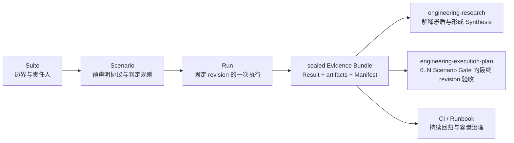

# Engineering Benchmark

把一次性的“跑个压测”转化为可复现、可封存、可被 Research、EP 和 CI
共同消费的证据。Benchmark 记录观察事实，不替人做架构决策。



## 职责边界

使用本 Skill：

- 比较实现、配置、部署拓扑或依赖版本；
- 采集延迟、吞吐、资源、正确性、稳定性或故障恢复证据；
- 给 Research 补一个可复现实验；
- 对 EP 的最终 revision 执行验收；
- 建立 CI 回归基线或容量运行手册。

不要使用本 Skill：

- 只需要阅读代码、文档和已有证据；
- 需要解释多个来源、处理矛盾并给出研究级推荐；
- 需要接受 ADR、拆解开发任务或治理实施过程；
- 只有一条临时命令，且结果不会被复用、审计或作为决策依据。

Benchmark 不全部进入 Research：

| 目的 | 默认消费者 |
|---|---|
| 探索未知、比较路线、结果可能改变架构 | Engineering Research |
| 验证已决定路线的最终 revision | Execution Plan |
| 夜间回归、容量趋势、运维阈值 | CI / Runbook |

持续回归只有在出现矛盾、路线未知或需要改变决策时，才升级为 Research。

## 制品模型

```text
benchmarks/
├── .benchctl/state.json
├── BENCHMARKS.md
└── suites/
    └── b-NNN_slug/
        ├── BENCHMARK.md
        ├── scenarios/
        │   └── bs-NNN_slug.md
        └── runs/
            └── br-NNN_slug/
                ├── SCENARIO.md
                ├── RESULT.md
                ├── EVIDENCE_MANIFEST.json
                └── artifacts/
```

- `B-NNN` 是长期主题和责任边界。
- `BS-NNN` 是执行前稳定下来的协议，包括假设、变量、数据集、环境、步骤、
  指标、重复策略、判定规则和外推边界。
- `BR-NNN` 是某个 subject revision 与 harness revision 的一次执行。
- `SCENARIO.md` 是创建 Run 时复制的协议快照；后续修改原 Scenario 不改变它。
- `EVIDENCE_MANIFEST.json` 只在封存时生成，清点本地证据并校验 SHA-256。
- 原始 CSV、JSON、日志、Trace、截图和 profiler 输出保留原生格式，不强制转换。

修改契约、实现 CLI 或让其他工具消费 Manifest 前，完整读取
`references/contract.md`。选择 Research、EP 或 CI 路由时读取
`references/examples.md`。

## 优先使用 benchctl

把 `<skill-dir>` 解析为本 Skill 所在目录。命令都在目标仓库根目录运行：

```bash
python3 <skill-dir>/scripts/benchctl.py --repo . init

python3 <skill-dir>/scripts/benchctl.py --repo . new-suite \
  --slug spans-placement --title "Spans placement strategies" \
  --owner "Observability Performance Owner"

python3 <skill-dir>/scripts/benchctl.py --repo . new-scenario B-001 \
  --slug placement-order-key \
  --title "Compare placement order-key strategies"

python3 <skill-dir>/scripts/benchctl.py --repo . new-run BS-001 \
  --slug candidate-a \
  --title "Candidate A at 10k spans/s" \
  --subject-revision "git:<subject-commit>" \
  --harness-revision "git:<harness-commit>"

python3 <skill-dir>/scripts/benchctl.py --repo . seal-run BR-001 \
  --outcome passed \
  --executed-by "Codex"

python3 <skill-dir>/scripts/benchctl.py --repo . evidence-ref BR-001
python3 <skill-dir>/scripts/benchctl.py --repo . validate
python3 <skill-dir>/scripts/benchctl.py --repo . status
python3 <skill-dir>/scripts/benchctl.py --repo . reindex
```

`new-run` 之前必须移除 Suite 和 Scenario 中的 `REQUIRED` 标记。创建 Run 后，
执行 Scenario 中声明的命令，把原始输出写入 `artifacts/`，再填写
`RESULT.md`。工具本身不假装执行领域压测命令。

## 标准工作流

1. 检查仓库约定和现有 Benchmark，确认是复用 Suite/Scenario 还是创建新的。
2. 在 Suite 中写清主题、被测系统边界、Owner、非目标和消费者。
   `Unassigned` 只允许保留 Suite 草稿，不能创建 Scenario。
3. 在执行前完成 Scenario。假设必须可证伪；受控变量、数据集、环境、warmup、
   重复次数、缓存状态、清理和失败恢复必须明确。
4. 预声明指标与判定规则。看完结果后再改变规则属于新的 Scenario 或 Run，
   不能回写历史。
5. 如果这些测量是 EP 完成门禁，在实现前把所有必需 Scenario 通过
   `epctl new-ep --benchmark-scenario BS-NNN` 声明到同一个 EP。一个 Scenario
   对应一个独立门禁；不要把不同环境或判定规则压成一个总分。
6. 创建 Run，记录不可变的 subject revision 与 harness revision。
7. 执行真实命令；保留 stdout、stderr、配置、Trace 和机器可读结果。Observation
   与 Interpretation 分开写。
8. 即使失败、无结论或工具报错，也保留 Run，并选择 `failed`、
   `inconclusive` 或 `errored`，不要删除负面证据。
9. `seal-run` 后不得修改 Result、Scenario snapshot 或本地 artifacts。修正错误
   或补证据时创建新 Run，并用 `--supersedes BR-NNN` 建立替代链。
10. 把 `BR-NNN` 与 Manifest payload SHA-256 交给下游消费者。
   优先用 `evidence-ref` 生成已验真的标准引用。

## 封存规则

- 允许 outcome：`passed`、`failed`、`inconclusive`、`errored`。
- outcome 描述“相对预声明规则的结果”，不是 CLI 进程是否成功。
- 本地证据由 Manifest 清点；任何新增、删除或改写都会让 `validate` 失败。
- 外部大文件可以留在对象存储或压测平台，但 `RESULT.md` 必须记录不可变 URI、
  digest、保留策略和访问条件。
- 封存包不可原地修订。即使只是修正说明，也创建 superseding Run。
- Symlink 不进入证据包，避免工作站路径和包外内容破坏可移植性。

## 下游契约

本 Skill 输出证据，不输出决定：

- Research 引用 sealed Run，用它回答 Research Question、比较选项或解释矛盾；
- EP 只在路线已经决定时，把所有预声明 Scenario 的 final-revision Run 作为
  acceptance evidence；一个 EP 可以要求多个 Scenario，但每个门禁恰好由一个
  `passed` Run 覆盖，且所有 Run 必须使用同一 subject revision；
- CI / Runbook 使用稳定 Scenario 反复创建 Run，只有路线需要重新判断时才创建
  或恢复 Research。

消费者依赖 `RESULT.md` 与 `EVIDENCE_MANIFEST.json` 的版本化文件契约，不依赖
本 Skill 的安装位置，也不要求安装 `benchctl`。
