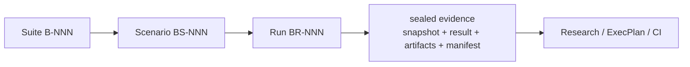

# Engineering Benchmarks

This file is the repository entry point and rebuildable index for reproducible
Benchmark evidence.

## How to read this index

- A Suite (`B-NNN`) defines a long-lived measurement subject, accountable
  owner, safety boundary, and expected consumers.
- A Scenario (`BS-NNN`) predeclares one reusable protocol and decision rule
  before results are visible.
- A Run (`BR-NNN`) records one execution against immutable subject and harness
  revisions. Its sealed bundle contains the Scenario snapshot, Result,
  artifacts, and Evidence Manifest.
- Existing load-test scripts remain in the normal source tree. A Scenario names
  their executable entrypoint; the Run records the exact harness revision.
- Research may interpret several sealed Runs. An ExecPlan declares Scenario IDs
  as independent completion gates. CI and Runbooks may repeat stable Scenarios.
- The managed tables below are projections. Rebuild them with
  `benchctl reindex`; edit Suite, Scenario, and Result facts instead.

## Suites

| ID | Status | Title | Owner | Scenarios | Runs | Path |
|---|---|---|---|---:|---:|---|
{{SUITE_ROWS}}

## Scenarios

| ID | Suite | Status | Title | Runs | Path |
|---|---|---|---|---:|---|
{{SCENARIO_ROWS}}

## Runs

| ID | Scenario | Status | Outcome | Subject revision | Supersedes | Path |
|---|---|---|---|---|---|---|
{{RUN_ROWS}}
