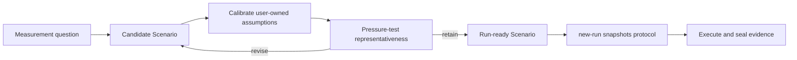

# Collaborative Benchmark Scenario Calibration

Use this protocol before creating a Run when several plausible workload,
environment, metric, threshold, safety, or extrapolation choices would produce
evidence with different meaning. Collaboration makes the Scenario
representative and falsifiable; it never negotiates observed results.



`candidate` and `run-ready` are conversational descriptions, not new artifact
statuses. The persisted Scenario remains `active`; each Run receives an
immutable protocol snapshot.

## What to calibrate

Calibrate only assumptions that materially change the claim the Benchmark can
support:

- the decision or operational question and intended consumer;
- representative steady, burst, long-tail, cold-start, failure, or recovery
  workload;
- dataset shape, cardinality, duration, scale, topology, and isolation;
- correctness guardrails and primary/secondary metrics;
- pass/fail/inconclusive rule and any SLO-derived threshold;
- safety limits, cleanup, retained artifacts, and valid extrapolation.

Discover technical facts from the repository, production evidence, existing
SLOs, EP gates, and adjacent Scenarios. Ask the user only for product
representativeness, risk tolerance, external environment, cost/safety limit, or
an acceptance threshold that cannot be inferred.

## Run a calibration round

1. Propose a concrete default Scenario and cite the facts or assumptions behind
   it.
2. Identify one dimension whose alternatives materially change the evidence
   meaning.
3. Compare two or three viable definitions, the claim each supports, and what
   each fails to represent. State the recommended definition.
4. Ask one primary question that lets the user revise or combine definitions.
5. Treat a terse answer such as `2` as a candidate protocol choice.
6. Test one discriminating case—burst traffic, cold cache, long-tail input,
   resource saturation, failure recovery, or unsafe load—before declaring the
   Scenario run-ready.
7. Write the retained assumptions, limitations, falsifier, and decision rule
   into the Scenario before `new-run`.

A compact response shape is:

```text
待校准维度：<one material Scenario variable>
默认协议：<concrete workload/rule + evidence>
可选定义：<2–3 shapes and evidence meaning>
我的建议：<choice + limitation>
想和你确认：<one user-owned representativeness or threshold question>
```

When the user delegates Benchmark design, select the most representative safe
default, state its limitations, and continue without manufacturing questions.

## Freeze evidence semantics

Before `new-run`, revise the reusable Scenario as needed. Once `new-run` copies
the protocol:

- do not change that Run's Scenario snapshot, environment claims, metrics,
  aggregation, threshold, or falsifier;
- do not discard observations or reinterpret a failed rule as passed;
- create a new Run for execution/harness corrections under the same protocol;
- create a new Scenario when the protocol or decision rule changes materially;
- route cross-Scenario interpretation to Research.

The user may decide that a different product requirement should be measured,
but that creates future evidence. It cannot retroactively change an existing
Run or sealed bundle.
