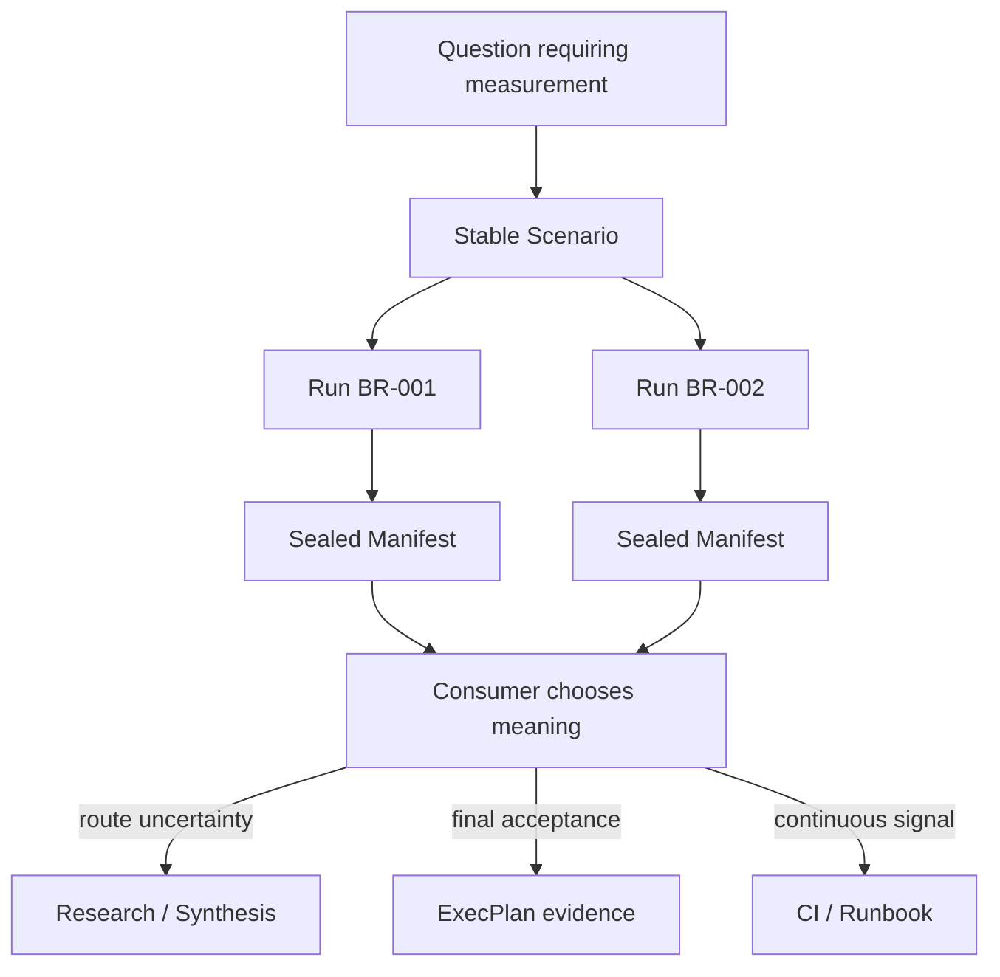

# Engineering Benchmark contract

## Contents

- Responsibility
- Repository schema
- Identity and lifecycle
- Scenario protocol
- Result contract
- Evidence manifest
- Immutability and supersession
- Consumer contract

## Responsibility

Engineering Benchmark owns repeatable experiment protocols and observed run
evidence. It does not own the architectural interpretation of conflicting
evidence, decision authority, implementation planning, or continuous CI
scheduling.



The skill may report whether a run passed its predeclared rule. It must not
turn that result into an accepted architecture decision.

## Repository schema

The producer writes the following repository-relative structure:

```text
benchmarks/
├── .benchctl/state.json
├── BENCHMARKS.md
└── suites/
    └── b-001_slug/
        ├── BENCHMARK.md
        ├── scenarios/bs-001_slug.md
        └── runs/br-001_slug/
            ├── SCENARIO.md
            ├── RESULT.md
            ├── EVIDENCE_MANIFEST.json
            └── artifacts/**
```

`BENCHMARKS.md` and `.benchctl/state.json` are projections and allocation
state. The Suite, Scenario, Result, Scenario snapshot, artifacts, and sealed
Manifest are facts.

Raw artifact formats are intentionally open. A tool may emit CSV, JSON,
protobuf, pprof, JFR, log text, an image, or a trace bundle. Uniformity exists
at the metadata and integrity layers, not by rewriting every native format.

## Identity and lifecycle

Identifiers are repository-global and monotonically allocated:

| Kind | Format | Meaning |
|---|---|---|
| Suite | `B-NNN` | Long-lived benchmark subject and ownership boundary |
| Scenario | `BS-NNN` | Stable, reusable protocol |
| Run | `BR-NNN` | One execution against explicit revisions |

An `Unassigned` Suite may exist as a draft placeholder, but it cannot create a
Scenario until an accountable owner is recorded.

Suite and Scenario status is initially `active`. Run status is `draft` or
`sealed`. A sealed Run has exactly one outcome:

- `passed`: the predeclared acceptance rule was satisfied;
- `failed`: the rule was not satisfied;
- `inconclusive`: evidence cannot distinguish the alternatives or the rule
  cannot be applied;
- `errored`: harness, environment, setup, or execution failed.

`failed`, `inconclusive`, and `errored` are valid evidence states and must not
be erased.

## Scenario protocol

A Scenario is complete before any Run is created. It must declare:

1. the decision or operational question it can inform;
2. a falsifiable hypothesis and explicit falsifier;
3. subject, control, and comparison variants;
4. controlled and intentionally changing variables;
5. dataset, traffic model, cardinality, duration, and scale;
6. hardware, OS, runtime, dependencies, deployment topology, and isolation;
7. setup, warmup, measurement, repetition, cache-state, and teardown steps;
8. exact commands or an executable harness entrypoint;
9. primary and secondary metrics, units, aggregation, uncertainty, and
   correctness checks;
10. a rule mapping observations to pass, fail, or inconclusive;
11. expected local and external evidence;
12. safety limits, cleanup, recovery, limitations, and valid extrapolation.

The copied `SCENARIO.md` inside a Run is the protocol of record for that Run.
Changing the reusable Scenario affects future Runs only.

## Result contract

`RESULT.md` frontmatter contains:

| Field | Requirement |
|---|---|
| `schema_version` | `"1"` |
| `id` | Run ID |
| `suite_id` / `scenario_id` | Existing parent identities |
| `status` | `draft` or `sealed` |
| `outcome` | Empty while draft; allowed outcome when sealed |
| `subject_revision` | Immutable code, image, package, config, or build ref |
| `harness_revision` | Immutable benchmark harness ref |
| `supersedes` | Zero or more older sealed Run IDs |
| `manifest` | `EVIDENCE_MANIFEST.json` |
| timestamps and executor | Creation and sealing provenance |

The body separates:

- summary;
- revisions and environment;
- executed procedure and commands;
- application of the predeclared decision rule;
- raw observations;
- interpretation;
- contradictions and supersession;
- boundaries and extrapolation;
- downstream handoff;
- artifact inventory, including external evidence.

External evidence entries record an immutable URI or platform ID, SHA-256 or
provider digest, retention policy, and access conditions. A mutable dashboard
URL alone is not sealed evidence.

## Evidence manifest

`EVIDENCE_MANIFEST.json` is deterministic UTF-8 JSON:

```json
{
  "schema_version": "1",
  "run_id": "BR-001",
  "suite_id": "B-001",
  "scenario_id": "BS-001",
  "status": "sealed",
  "outcome": "passed",
  "created": "2026-07-30T00:00:00Z",
  "sealed_at": "2026-07-30T00:10:00Z",
  "executed_by": "Benchmark Operator",
  "files": [
    {
      "path": "RESULT.md",
      "bytes": 1234,
      "sha256": "..."
    }
  ],
  "payload_sha256": "..."
}
```

The inventory contains exactly:

- `SCENARIO.md`;
- `RESULT.md`;
- every regular file recursively below `artifacts/`.

It excludes the Manifest itself to avoid a circular digest. Paths use `/`, are
sorted lexicographically, and cannot contain symlinks or escape the Run.

For each file, SHA-256 is calculated over raw bytes. `payload_sha256` is
calculated over canonical JSON encoded as UTF-8 with sorted keys, compact
separators, and `payload_sha256` temporarily set to the empty string.

Validation recomputes the complete local inventory, every byte count and file
digest, and the canonical payload digest. Adding an artifact after sealing is
drift, even when existing files are unchanged.

## Immutability and supersession

A sealed Run is append-only history. Do not edit it to fix prose, update a
link, replace an artifact, or reinterpret a threshold. Create another Run.

`supersedes` is appropriate when the new Run corrects or replaces an older Run
under the same Scenario. The target must already be sealed. The relation is
acyclic and does not delete the old evidence.

When the experimental protocol itself changes materially, create a new
Scenario. Results from different Scenarios may be compared by Research, but
they do not form a direct supersession chain.

## Consumer contract

A consumer resolves a Run by repository identity, then:

1. requires `RESULT.md`, `SCENARIO.md`, and `EVIDENCE_MANIFEST.json`;
2. verifies schema, identities, status, outcome, exact inventory, file digests,
   and `payload_sha256`;
3. records both Run ID and payload digest, for example
   `benchmark:BR-001@sha256:<payload_sha256>`;
4. distinguishes observations from interpretation;
5. preserves negative and inconclusive results;
6. never assumes the producer Skill or CLI is installed.

Research may cite several Runs and decide what they mean together. ExecPlan
v2.5 may predeclare several Scenario IDs as independent completion gates. Its
accepted Benchmark references must cover that exact Scenario set one-to-one;
every Run must be `passed`, sealed, and have `subject_revision` equal to the
single EP `verified_revision`. The EP does not aggregate unlike Scenarios into a
score. Older or exploratory Runs remain auditable evidence but do not satisfy
an undeclared completion gate.
