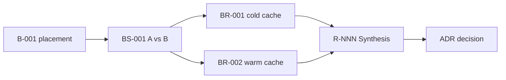

# Engineering Benchmark routing examples

## Exploratory comparison

Question: should spans placement use order-key strategy A or B?

Create one Suite, one Scenario with both variants and predeclared falsifiers,
then one or more Runs. Seal every outcome. Because the result may change the
architecture route, add the sealed Run references to an active Engineering
Research and let its Synthesis compare them with code and operational evidence.
Do not accept an ADR from the Benchmark.



## ExecPlan acceptance

The architecture is already accepted and an ExecPlan requires p95 below
120 ms at a fixed load. Create or reuse a Scenario whose environment, traffic,
correctness checks, metric aggregation, and threshold exactly match that
acceptance criterion. Run it against the final implementation revision.

If the sealed Result is `passed`, the EP can record:

```text
benchmark:BR-014@sha256:<manifest-payload-sha256>
```

No new Research is needed unless the result exposes route uncertainty or
contradicts the evidence that supported the decision.

## Continuous regression

For a nightly benchmark, keep one stable Scenario and create a new Run for each
meaningful revision or scheduled sample. CI and a capacity Runbook own the
schedule, retention, trend alerts, and operational response.

Do not create one Research per nightly Run. Open or resume Research only when a
regression cannot be explained operationally, evidence conflicts, or the team
must reconsider an architectural choice.

## Failed harness

If the load generator crashes after setup:

- preserve logs and partial observations;
- fill the Result with what executed and what did not;
- seal the Run as `errored`;
- create a new Run that supersedes it after fixing the harness.

Do not overwrite the first directory or call the rerun a passing version of the
same evidence.

## External load-test platform

Keep summary and stable metadata locally. In `RESULT.md`, record:

- immutable test or job ID;
- immutable export URI when available;
- provider digest or locally calculated SHA-256;
- retention period;
- authentication or access boundary;
- a small local export when policy and size permit.

The local Manifest protects local files. It cannot prove the continued
availability of an external mutable URL, so the Result must state that boundary.

## Protocol correction

If the original Scenario used the wrong percentile aggregation, do not edit the
sealed Scenario snapshot. Create a new Scenario because the interpretation rule
changed materially, then execute new Runs. Research may explain why the two
protocols are not directly comparable.
