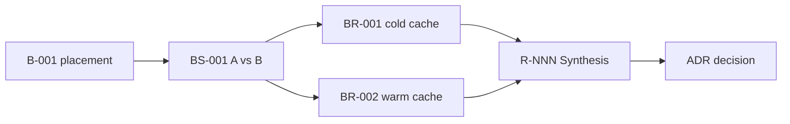
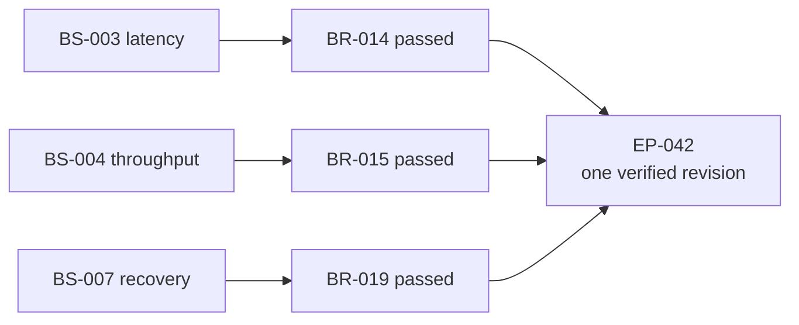

# Engineering Benchmark routing examples

## Exploratory comparison

Question: should spans placement use order-key strategy A or B?

Create one Suite, one Scenario with both variants and predeclared falsifiers,
then one or more Runs. Seal every outcome. Because the result may change the
architecture route, add the sealed Run references to an active Engineering
Research and let its Synthesis compare them with code and operational evidence.
Do not accept an ADR from the Benchmark.

```text
Use $engineering-benchmark to compare spans-placement order-key strategy A
and B. Predeclare the falsifier, controlled environment, repetitions,
correctness checks, metrics, and decision rules before executing either
variant. Seal every Run, including negative or inconclusive outcomes.

Because this evidence may change the architecture route, hand the sealed Run
references to $engineering-research for interpretation. Stop Research at
review-ready and do not accept an ADR.
```



## ExecPlan acceptance

The architecture is already accepted and an ExecPlan requires p95 below
120 ms, sustained throughput above 10k spans/s, and recovery within 30 seconds.
Create or reuse one Scenario for each independently meaningful criterion. Each
Scenario fixes its own environment, traffic, correctness checks, aggregation,
and threshold.

Declare the full set before implementation:

```text
Use $engineering-execution-plan to create "Implement spans placement" from
concluded R-006 and accepted ADR-011.

Before implementation, declare BS-003 for p95, BS-004 for sustained
throughput, and BS-007 for recovery as three independent completion gates.
Explain which milestone each Scenario governs. Do not merge them into one
score or execute the measurements yet.
```

Run all three Scenarios against the same final implementation revision:



If every sealed Result is `passed`, the EP can record one reference per gate:

```text
benchmark:BR-014@sha256:<manifest-payload-sha256>
benchmark:BR-015@sha256:<manifest-payload-sha256>
benchmark:BR-019@sha256:<manifest-payload-sha256>
```

One missing gate keeps the EP active and tells development exactly which
acceptance dimension still fails. Do not average unlike Scenarios into one
score. No new Research is needed unless a result exposes route uncertainty or
contradicts the evidence that supported the decision.

```text
Use $engineering-benchmark to run BS-003, BS-004, and BS-007 against the same
final implementation revision. Preserve raw artifacts and seal each Run.
Then use $engineering-execution-plan to verify EP-042. Archive it only when
each declared Scenario has exactly one passed sealed Run for that revision.
```

## Continuous regression

For a nightly benchmark, keep one stable Scenario and create a new Run for each
meaningful revision or scheduled sample. CI and a capacity Runbook own the
schedule, retention, trend alerts, and operational response.

Do not create one Research per nightly Run. Open or resume Research only when a
regression cannot be explained operationally, evidence conflicts, or the team
must reconsider an architectural choice.

```text
Use $engineering-benchmark to reuse BS-010 as the nightly capacity protocol
for the current revision. Create and seal a new Run without changing the
Scenario. Route the result to CI / Runbook. Open Research only if the
regression conflicts with existing evidence or forces a route decision.
```

## Failed harness

If the load generator crashes after setup:

- preserve logs and partial observations;
- fill the Result with what executed and what did not;
- seal the Run as `errored`;
- create a new Run that supersedes it after fixing the harness.

Do not overwrite the first directory or call the rerun a passing version of the
same evidence.

```text
Continue $engineering-benchmark after the load generator crash.
Preserve the partial logs and observations, seal the current Run as errored,
and create a superseding Run only after the harness is fixed. Do not rewrite
the first evidence bundle.
```

## External load-test platform

Keep summary and stable metadata locally. In `RESULT.md`, record:

- immutable test or job ID;
- immutable export URI when available;
- provider digest or locally calculated SHA-256;
- retention period;
- authentication or access boundary;
- a small local export when policy and size permit.

The local Manifest protects local files. It cannot prove the continued
availability of an external mutable URL, so the Result must state that boundary.

```text
Use $engineering-benchmark to register this external load-test job as one Run.
Keep immutable job metadata, URI, digest, retention, and access boundaries in
RESULT.md; preserve a small local export when policy permits. State clearly
which remote evidence the local Manifest cannot protect.
```

## Protocol correction

If the original Scenario used the wrong percentile aggregation, do not edit the
sealed Scenario snapshot. Create a new Scenario because the interpretation rule
changed materially, then execute new Runs. Research may explain why the two
protocols are not directly comparable.

```text
Use $engineering-benchmark to correct the percentile protocol.
Keep the sealed old Run unchanged, create a new Scenario with the corrected
aggregation rule, and execute new Runs. Ask $engineering-research to explain
the non-comparability only if that difference affects a decision.
```
