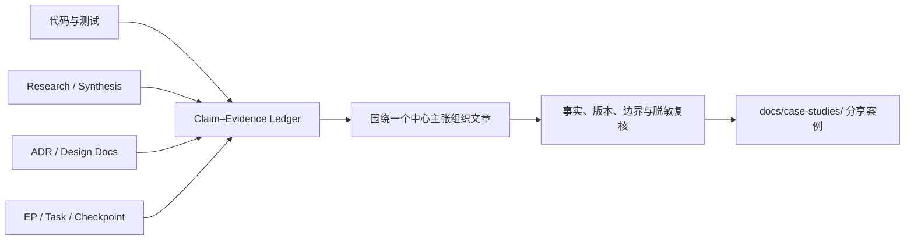

# Engineering Case Study

把分散在代码和工程制品中的事实，整理成有主张、可追溯、适合分享的中英文技术叙事。
本 Skill 只在用户明确提出分享写作意图时运行，输出是派生案例，不是新的运行时
规范或架构事实源。



## 边界

- 手动触发。不要在 Research concluded、ADR accepted 或 EP completed 后自动运行。
- 读取现有文件契约，不依赖 `engineering-research` 或 `engineering-execution-plan` 的安装路径。
- 可以消费 active Research 或 active EP 作为过程材料，但必须标注其状态；不得把
  review-ready 当成已批准结论，也不得把计划目标写成已实现结果。
- 没有 Research 或 EP 时仍可基于代码、测试和 Git 历史写作，明确哪些叙事来源
  不存在。
- 普通源码检索属于写作取证。只有出现会改变工程决策的新未知、且用户要求继续
  调研时，才另行使用 `engineering-research` 创建持久 Research。
- Case Study 不反向修改 ADR、Research 或 EP，也不阻塞它们的归档。

## 开始前

1. 读取仓库适用的 `AGENTS.md` 和文档约定。
2. 定位 `docs/case-studies/README.md`、相邻案例和目标输出路径；沿用仓库已有
   frontmatter、语言和索引约定。
3. 从用户请求或上下文确定读者、分享场景、文章类型、输出语言和中心主张。
   信息充分时直接取证和写作；缺省项可以做合理假设并在交付中说明。语言按下述
   优先级沿用已有选择，仅在会影响交付的真实冲突无法消解时询问。
4. 每次都读取 [source-evidence.md](references/source-evidence.md)。根据文章类型
   读取 [article-patterns.md](references/article-patterns.md)。成文后必须读取
   [review.md](references/review.md) 并完成复核。输出英文或双语时还必须读取
   [language.md](references/language.md)。需要选择文章类型、组织用户输入或展示
   完整调用方式时读取 [Prompt 示例](references/examples.md)。

## 选择文章类型

| 用户意图 | 类型 | 文章主轴 |
|---|---|---|
| 分享模块设计、讲清架构 | `module-design` | 设计压力、心智模型、运行机制、边界与权衡 |
| 总结最佳实践、沉淀方法 | `best-practice` | 反复出现的失败模式、原则、机制、反例和采用条件 |
| 复盘某个 EP 或研发过程 | `delivery-case` | 起点、关键转折、选择、落地证据和可复用经验 |
| 解释架构如何演进 | `architecture-evolution` | 前后模型、触发变化的证据、迁移路径和保留代价 |

一篇文章只选择一个主轴。其他材料用于支撑，不要把 Research 摘要、代码说明、
EP 时间线和最佳实践强行拼成四篇文章。

## 选择输出语言

| 模式 | 产物 |
|---|---|
| `zh-CN` | 一份自然、专业的简体中文文章 |
| `en` | 一份面向英文技术读者独立成文的英文文章 |
| `bilingual` | 同一证据基线上的中文、英文两份文章 |

优先使用当前请求或既有会话中的明确语言偏好；否则沿用目标文档或仓库已声明的
写作语言约定，再默认使用用户请求的语言。仓库可以在文档约定中配置默认语言，
无需新增配置文件。源码标识符的语言不决定文章语言。

只有读者、发布用途与已有偏好存在影响交付的冲突时才询问；同时继续独立取证。
没有这种冲突时直接成文，在交付中简述采用的默认值，不为语言选择机械暂停。

`bilingual` 默认生成两个文件，不在一个文件中逐段交错：

```text
<slug>-zh-CN-YYYY-MM-DD.md
<slug>-en-YYYY-MM-DD.md
```

两份文章共享 `source_revision`、来源集合和核心主张，但分别按语言受众组织表达。
不要先写中文再逐句机器翻译；按 [language.md](references/language.md) 做术语对齐
和受众化重写。

## 工作流

### 1. 建立源清单

从目标模块或 EP 反向发现以下内容：

- 入口、核心类型、关键调用链、边界适配器和对应测试；
- 当前 revision、相关 diff 或 Git 提交；
- Research 控制页、Synthesis、相关 Topic 与证据；
- ADR、Design Docs、EP 根文档、Task、Checkpoint、Decision Log、Discoveries；
- benchmark、CI、测试日志、截图或其他 outcome evidence；
- 当前规范入口，供案例声明“历史叙事不替代当前规范”。

优先使用 `rg` 和 `rg --files`。不要只读 README 就描述实现，也不要只读代码就
猜测设计动机。

### 2. 先做 Claim–Evidence Ledger

写正文前建立临时证据表，至少包含：

| Claim | 类型 | 证据 | Revision / 状态 | 可否公开 |
|---|---|---|---|---|
| 想在文章中表达的判断 | code / rationale / outcome / inference | 文件、测试或记录 | 精确版本和生命周期 | yes / redact / omit |

没有证据的内容只能作为明确标注的解释或待确认项，不能写成事实。没有真实测量时
不得编造效率倍数、性能提升、成本或时间节省。

### 3. 确立中心主张与读者路径

用目标语言写一句话回答：“这个案例最值得别人复用的判断是什么？”然后按
[article-patterns.md](references/article-patterns.md) 选择读者路径。先写章节标题
和每节主张，再填正文。

- 第一屏给中心主张和读者收益。
- 每个二级标题表达判断，不使用“背景、方案、总结”这种无信息标题。
- 代码片段只保留解释机制所需的最小部分，并链接真实源文件。
- 三个以上组件、状态或阶段的关系难以用短段落讲清时使用 Mermaid。
- 过程材料只保留改变路线的转折，不复刻完整 Progress 日志。

### 4. 写入案例

中文优先复制并改写 [case-study.zh-CN.md](assets/case-study.zh-CN.md)，英文使用
[case-study.en.md](assets/case-study.en.md)。允许为了文章主张重排或删除建议
章节。单语默认路径：

```text
docs/case-studies/<descriptive-slug>-YYYY-MM-DD.md
```

- 新文章默认 `status: draft`。
- 扫描现有 Case Study frontmatter 后分配不复用的 `CS-NNN`；双语版本共享同一
  logical ID，并通过 `language` 与 `translation_of` 区分文件。
- 使用 `metadata_schema: "1"`、`artifact_type: case-study`、stable `id`、
  `title`、`status`、`author`、`owner`、`created` 和 `updated`。`author` 是本版
  实际写作者，`owner` 是负责复核与维护的人或角色；未知时写 `Unassigned`，
  不从 Git committer 或来源制品 Owner 猜测。
- frontmatter 写明 `language: zh-CN` 或 `language: en`。双语文件互相写入
  `translation_of`，但每一份都必须能独立阅读。
- 记录准确 `source_revision`；工作树含未提交实现时写明 dirty 状态及相关 diff，
  不伪装成可恢复 Git revision。
- `relates_to` 包含实际使用的 EP、Research、ADR、规范和主要代码入口。
- 文章开头声明案例用途及当前规范入口。
- 创建新文件后更新仓库已有 Case Studies 索引；不要覆盖同名文件。

### 5. 复核并交付

按 [review.md](references/review.md) 完成来源、叙事、代码、链接和脱敏复核。

- 普通生成保持 `draft`。
- 只有用户明确要求“定稿、可发布、完成验证”，且所有事实和发布检查通过时，
  才把状态改为 `verified`，填写 `last_verified`。
- 发布复核者与 `author`/`owner` 不等价；如仓库需要独立 approval actor，应使用
  单独字段或 review evidence，不要用作者身份隐含授权。
- 对外发送、发布平台写入或通知他人属于独立外部动作；用户只要求生成文章时，
  只写仓库文件。

最终说明输出路径、中心主张、使用的主要证据、仍未验证的边界。不要声称文章是
“从代码自动生成”的；它是用户手动触发、经过取证和写作判断形成的派生材料。
