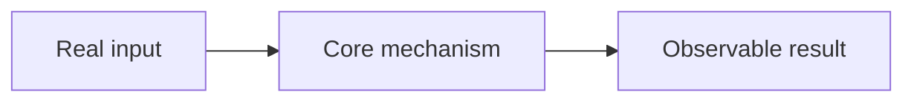

> **CASE STUDY**
> This article is grounded in the code and engineering records at
> `{{SOURCE_REVISION}}`. It explains the design judgment and delivery experience;
> it does not replace the current runtime specification. See
> {{CURRENT_NORMATIVE_ENTRY}} for the current contract.

# {{TITLE}}

{{CENTRAL_CLAIM_AND_READER_PROMISE}}

<!--
This is a working scaffold, not a mandatory table of contents. Select a reader
path from article-patterns.md, replace every heading with an engineering claim,
and remove all comments.
-->

## {{WHY_THIS_PROBLEM_MATTERED}}

{{PROBLEM_PRESSURE_AND_CONSTRAINTS}}

## {{THE_KEY_ENGINEERING_JUDGMENT}}

{{RESEARCH_DECISION_AND_TRADEOFF}}

## {{HOW_THE_SYSTEM_ACTUALLY_WORKS}}

{{CODE_BACKED_WALKTHROUGH}}

## {{THE_TURNING_POINTS_OR_HARD_BOUNDARIES}}

{{EP_DISCOVERIES_REJECTED_PATHS_AND_CONSEQUENCES}}

## {{WHAT_THE_EVIDENCE_PROVES}}

{{TEST_BENCHMARK_OR_RUNTIME_EVIDENCE}}

## {{WHAT_READERS_CAN_REUSE}}

{{A_FEW_CONDITIONAL_ENGINEERING_PRINCIPLES}}

## Evidence and Applicability

| Claim | Evidence | Revision / lifecycle |
|---|---|---|
| {{CLAIM}} | `{{PATH_OR_ARTIFACT}}` | `{{REVISION_OR_LIFECYCLE}}` |

{{CURRENT_LIMITATIONS_AND_HISTORICAL_BOUNDARY}}
