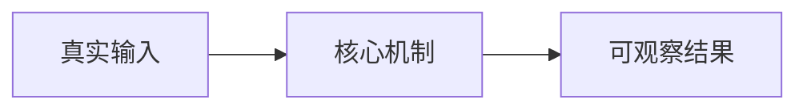

> **CASE STUDY**
> 本文基于 `{{SOURCE_REVISION}}` 的代码与工程记录整理，用于分享设计判断和实施经验。
> 它不替代当前运行时规范；当前契约请查看 {{CURRENT_NORMATIVE_ENTRY}}。

# {{TITLE}}

{{CENTRAL_CLAIM_AND_READER_PROMISE}}

<!--
以下是工作骨架，不是必须保留的固定标题。根据 article-patterns.md 选择一种
读者路径，把每个标题改成能独立表达判断的主张，删除所有注释。
-->

## {{WHY_THIS_PROBLEM_MATTERED}}

{{PROBLEM_PRESSURE_AND_CONSTRAINTS}}

## {{THE_KEY_ENGINEERING_JUDGMENT}}

{{RESEARCH_DECISION_AND_TRADEOFF}}

## {{HOW_THE_SYSTEM_ACTUALLY_WORKS}}

{{CODE_BACKED_WALKTHROUGH}}

## {{THE_TURNING_POINTS_OR_HARD_BOUNDARIES}}

{{EP_DISCOVERIES_REJECTED_PATHS_AND_CONSEQUENCES}}

## {{WHAT_THE_EVIDENCE_PROVES}}

{{TEST_BENCHMARK_OR_RUNTIME_EVIDENCE}}

## {{WHAT_READERS_CAN_REUSE}}

{{A_FEW_CONDITIONAL_ENGINEERING_PRINCIPLES}}

## 证据与适用边界

| 主张 | 证据 | Revision / 状态 |
|---|---|---|
| {{CLAIM}} | `{{PATH_OR_ARTIFACT}}` | `{{REVISION_OR_LIFECYCLE}}` |

{{CURRENT_LIMITATIONS_AND_HISTORICAL_BOUNDARY}}
