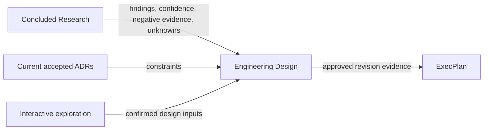

# Engineering Design

把“已经知道什么”翻译为“系统将如何工作”。当设计仍有多种合理形态时，先与用户
共同探索场景、取舍和失效条件，再把收敛结果写入 Design。一个模块的多篇技术文档
共享同一设计身份、评审边界和批准修订。Design approval 确认整套解释自洽，不代替
ADR 的 Decision Owner 授权。



## 先判断是否应创建 Design

使用本 skill：目标是定义模块或系统的边界、组件、接口、数据、流程、失败语义、
迁移、运行和验证，且结果需要被评审或复用。以下请求分别路由：

- 仍有会改变路线的未知：先用 `engineering-research`。
- 外部事实已经足够，但平台边界、状态所有权、接口形态、失败策略等仍有多个合理取舍：
  留在本 skill，先做交互式探索。
- 需要授权一个长期架构选择：用 `engineering-execution-plan` 创建 ADR。
- 方向和设计均已批准，只需拆交付步骤：用 `engineering-execution-plan` 创建 EP。
- 只解释现有代码且不产生持久设计契约：直接回答，不创建 Design。

一个小而完整的设计使用 `layout: single`。一个模块需要架构、契约、数据、运维、
迁移或验证等多位作者共同评审时使用 `layout: package`。只有在子设计具有独立 owner、
消费者、ADR、批准节奏或发布生命周期时，才拆成另一个全局 `DD-NNN`；包内专题使用
局部 `DOC-NNN`。

## 交互式探索

当用户要求“一起思考”、讨论或细化定位、边界、不变量、模型和关键取舍，或者一个
未确认选择会实质改变组件职责、数据所有权、接口或失败语义时，开始前完整读取
[exploration.md](references/exploration.md)。不要把这种未知误路由为 Research：Research
解决事实证据不足，交互式探索解决同一组事实之上的价值选择和架构取舍。

- 每轮聚焦一个会改变设计形态的矛盾，用具体场景比较 2–3 个可行模型、收益、代价和
  失效条件，并说明当前倾向及依据。
- 问题必须允许用户修改、组合或否定候选模型；不要把共同设计退化成连续投票。
- 用户的简短选择只形成 `provisional` 偏好。先复述由此产生的约束，再用一个反例、
  故障或规模场景复验；经过用户明确确认后才记为 `confirmed`。
- Research、标准和参考系统只提供证据，不自动替用户作规范性选择。
- 维护轻量决策台账 `open → exploring → provisional → confirmed`。这里的 `confirmed`
  只是当前 Design 的写作输入，不代表 Design approval 或 ADR acceptance。
- 探索尚未收敛时不把候选答案伪装成正式不变量并写回 Design；用户明确要求实时草稿
  时，可以写入但必须标出未确认状态和有效条件。

输入已经明确、用户要求直接起草，或取舍可安全地作为显式假设记录时，不要强制启动
访谈式流程。完成一组相互依赖的探索后统一写回，避免每一轮都机械修改文档。

## 工作流

开始前完整读取 [contract.md](references/contract.md)。准备评审或执行生命周期转换前，
再读取 [review.md](references/review.md)。常见调用见
[examples.md](references/examples.md)。

1. 判断是否存在需要交互式探索的实质取舍。需要时先运行探索循环，记录已确认输入、
   被否决方案、有效条件和仍需 Research 或验证的问题；不要因一次选项回复提前收敛。
2. 检查 `docs/design-docs/`、concluded Research、当前 ADR closure 和已有 Design
   dependency，确认是继续同一 Design 还是分配新身份。
3. 执行 `python3 scripts/designctl.py --repo <repo> init`。该命令接管现有目录但不迁移
   schema-1 文档。
4. 用 `new-design` 创建单文件或包。必须提供至少一个 `--research R-NNN`，或明确的
   `--research-not-required-reason`；不要代替用户编造 owner、author 或批准者。
5. 对 package 用 `new-member` 增加聚焦文档。每次成员变化后运行 `sync`，保持路径、
   字节数和 SHA-256 manifest 精确一致。
6. 语义性撰写整套 Design。必须复述结论与置信边界、负面证据和剩余未知，不能只放
   Research 链接；把探索中确认的约束、方案理由、反例复验和否决项写入对应 concern，
   不复制完整聊天记录。所有必需 concern 都要有实质内容，或写明具体的
   `Not applicable` 原因。
7. 运行 `mark-review-ready DD-NNN`。失败时修正文档，不绕过 REQUIRED marker、
   Research、ADR、依赖环或 manifest drift 门禁。
8. 只有 Design Owner 或声明的 Design authority 明确批准该完整修订后，才运行
   `approve ... --approved-by ... --approval-ref ...`。批准会封存完整快照并输出可供
   EP 使用的 evidence pin。
9. 已发布设计的新工作使用 `revise`；旧快照继续服务既有消费者。放弃或替代设计也
   要显式 authority、审计引用和原因。

## 命令面

```text
designctl init
designctl new-design --slug SLUG --title TITLE --layout single|package
                     [--research R-NNN ... | --research-not-required-reason REASON]
                     [--adr ADR-NNN ...] [--design-dependency TYPE:DD-NNN ...]
                     [--author ACTOR] [--owner ACTOR]
designctl new-member DD-NNN --role ROLE --slug SLUG --title TITLE
designctl sync DD-NNN
designctl mark-review-ready DD-NNN
designctl approve DD-NNN --approved-by ACTOR --approval-ref REF
designctl revise DD-NNN --reason REASON
designctl abandon DD-NNN --approved-by ACTOR --approval-ref REF --reason REASON
designctl supersede DD-OLD --by DD-NEW --approved-by ACTOR --approval-ref REF --reason REASON
designctl status [DD-NNN] [--json]
designctl reindex
designctl validate
```

不要手工分配 ID、降低 high-water mark、修改批准快照或让其他 skill 写入 Design。
CLI 是确定性治理层，不会替作者生成正确的系统设计；语义质量仍由撰写与评审承担。

## 下游契约

本 skill 输出 schema-1.1 Design 根、可选 package manifest/reading map/member docs、
不可变 revision snapshot 和 evidence pin。ADR 和 EP 消费仓库文件，不导入本 skill。
未发布 Design 只能作为带 warning 的输入；终态 Design 不能进入新工作；EP 完成必须
固定每个依赖 Design 的批准修订与当前 ADR closure。
