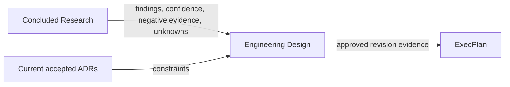

# Engineering Design

把“已经知道什么”翻译为“系统将如何工作”，并让一个模块的多篇技术文档共享同一
设计身份、评审边界和批准修订。Design approval 确认整套解释自洽，不代替 ADR 的
Decision Owner 授权。



## 先判断是否应创建 Design

使用本 skill：目标是定义模块或系统的边界、组件、接口、数据、流程、失败语义、
迁移、运行和验证，且结果需要被评审或复用。以下请求分别路由：

- 仍有会改变路线的未知：先用 `engineering-research`。
- 需要授权一个长期架构选择：用 `engineering-execution-plan` 创建 ADR。
- 方向和设计均已批准，只需拆交付步骤：用 `engineering-execution-plan` 创建 EP。
- 只解释现有代码且不产生持久设计契约：直接回答，不创建 Design。

一个小而完整的设计使用 `layout: single`。一个模块需要架构、契约、数据、运维、
迁移或验证等多位作者共同评审时使用 `layout: package`。只有在子设计具有独立 owner、
消费者、ADR、批准节奏或发布生命周期时，才拆成另一个全局 `DD-NNN`；包内专题使用
局部 `DOC-NNN`。

## 工作流

开始前完整读取 [contract.md](references/contract.md)。准备评审或执行生命周期转换前，
再读取 [review.md](references/review.md)。常见调用见
[examples.md](references/examples.md)。

1. 检查 `docs/design-docs/`、concluded Research、当前 ADR closure 和已有 Design
   dependency，确认是继续同一 Design 还是分配新身份。
2. 执行 `python3 scripts/designctl.py --repo <repo> init`。该命令接管现有目录但不迁移
   schema-1 文档。
3. 用 `new-design` 创建单文件或包。必须提供至少一个 `--research R-NNN`，或明确的
   `--research-not-required-reason`；不要代替用户编造 owner、author 或批准者。
4. 对 package 用 `new-member` 增加聚焦文档。每次成员变化后运行 `sync`，保持路径、
   字节数和 SHA-256 manifest 精确一致。
5. 语义性撰写整套 Design。必须复述结论与置信边界、负面证据和剩余未知，不能只放
   Research 链接。所有必需 concern 都要有实质内容，或写明具体的 `Not applicable`
   原因。
6. 运行 `mark-review-ready DD-NNN`。失败时修正文档，不绕过 REQUIRED marker、
   Research、ADR、依赖环或 manifest drift 门禁。
7. 只有 Design Owner 或声明的 Design authority 明确批准该完整修订后，才运行
   `approve ... --approved-by ... --approval-ref ...`。批准会封存完整快照并输出可供
   EP 使用的 evidence pin。
8. 已发布设计的新工作使用 `revise`；旧快照继续服务既有消费者。放弃或替代设计也
   要显式 authority、审计引用和原因。

## 命令面

```text
designctl init
designctl new-design --slug SLUG --title TITLE --layout single|package
                     [--research R-NNN ... | --research-not-required-reason REASON]
                     [--adr ADR-NNN ...] [--design-dependency TYPE:DD-NNN ...]
                     [--author ACTOR] [--owner ACTOR]
designctl new-member DD-NNN --role ROLE --slug SLUG --title TITLE
designctl sync DD-NNN
designctl mark-review-ready DD-NNN
designctl approve DD-NNN --approved-by ACTOR --approval-ref REF
designctl revise DD-NNN --reason REASON
designctl abandon DD-NNN --approved-by ACTOR --approval-ref REF --reason REASON
designctl supersede DD-OLD --by DD-NEW --approved-by ACTOR --approval-ref REF --reason REASON
designctl status [DD-NNN] [--json]
designctl reindex
designctl validate
```

不要手工分配 ID、降低 high-water mark、修改批准快照或让其他 skill 写入 Design。
CLI 是确定性治理层，不会替作者生成正确的系统设计；语义质量仍由撰写与评审承担。

## 下游契约

本 skill 输出 schema-1.1 Design 根、可选 package manifest/reading map/member docs、
不可变 revision snapshot 和 evidence pin。ADR 和 EP 消费仓库文件，不导入本 skill。
未发布 Design 只能作为带 warning 的输入；终态 Design 不能进入新工作；EP 完成必须
固定每个依赖 Design 的批准修订与当前 ADR closure。
