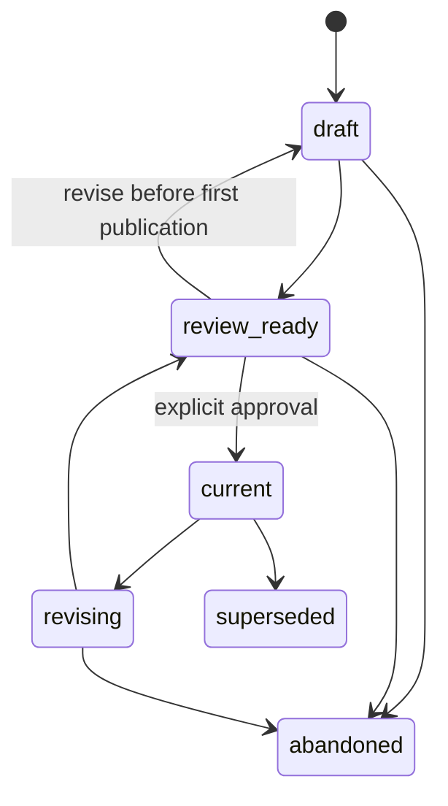

# Engineering Design file contract

## Logical identity and layouts

One `DD-NNN` is one ownership, review, and approval boundary. `layout: single`
uses `docs/design-docs/dd-NNN_slug.md`. `layout: package` uses
`docs/design-docs/dd-NNN_slug/DESIGN.md` plus a manifest, reading map, members,
artifacts, and snapshots. Paths stay stable across lifecycle states.

New roots use schema `1.1` and the common metadata contract. Current governed
Markdown carries `metadata_schema`, `artifact_type`, `id`, `title`, `status`,
`author`, `owner`, `created`, and `updated`. Author and owner describe provenance
and stewardship; neither implies approval authority.

Package member identities are local and stable: `DD-012/DOC-003`. A move keeps
the identity and changes only the manifest path. Create another global Design
when a topic has its own owner, consumers, ADRs, approval cadence, or rollout.

## Lifecycle

`current` means the working revision is the published revision. `revising` and
a later `review_ready` may retain an earlier `published_revision`; downstream
consumers continue pinning that immutable snapshot. `abandoned` and
`superseded` are terminal.

## Research handoff

Exactly one input route is required:

- one or more concluded `R-NNN` references; or
- a concrete `research_not_required_reason` grounded in authoritative standards,
  current architecture, or explicit user direction.

The Design repeats decision-relevant supported findings and confidence,
negative evidence and rejected hypotheses, and remaining unknowns and validity
conditions. A link alone is not a semantic handoff. The producer never mutates
Research files.

## Package manifest

`DESIGN_MANIFEST.json` is a deterministic JSON object with common metadata,
Design identity, lifecycle, working and published revisions, `DESIGN.md`
entrypoint, `docs/README.md` reading map, typed dependencies, and every managed
Markdown document exactly once. Each document records stable ID, role,
repository-relative package path, title, exact byte count, and SHA-256 of exact
bytes. The manifest does not hash itself.

Managed content roots are `architecture/`, `contracts/`, `data/`, `docs/`,
`operations/`, `migration/`, and `verification/`. `artifacts/` is explicitly
declared evidence and is not silently treated as a design member. `snapshots/`
is immutable publication history.

Dependency values use `TYPE:DD-NNN`. Supported types are `uses`, `extends`,
`implements`, and `replaces`. The Design graph and supersession graph must be
acyclic.

## Approved revision evidence

Approval records `approved_by`, `approved_at`, and `approval_ref` separately
from author and owner. For a package, evidence is
`DD-NNN@rev:N@sha256:<canonical-manifest-sha256>`. The snapshot contains every
manifest member and the exact manifest. For a single file, the digest covers
the canonical revision manifest, which in turn pins the exact snapshotted
Markdown byte count and SHA-256. A new working revision never overwrites an
earlier `rev-NNN` directory.

## Compatibility

Schema-1 Design Docs are legacy single-file inputs. Validate stable identity,
common metadata when present, and terminal status, but do not invent Research
handoffs, approval actors, manifests, or historic revisions. Migration is an
explicit author action; initialization and reindexing preserve legacy bytes.
