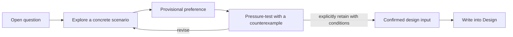

# Interactive Design Exploration

Use this protocol when the user wants to think together or when several viable
system shapes remain after the factual evidence is sufficient. The goal is not
to interview the user for facts Codex can discover. The goal is to expose and
test value choices, ownership boundaries, and architectural consequences before
they are written as settled design.



## Decide whether exploration is needed

Explore when a choice can materially change one or more of these concerns:

- platform responsibility or authority boundary;
- identity, lifecycle, data ownership, or consistency semantics;
- public interface, compatibility, security, or failure behavior;
- component responsibility, dependency direction, or operational ownership;
- a core invariant that later designs would treat as fixed.

Do not start an exploration loop merely because some implementation detail is
unspecified. Route missing external evidence to `engineering-research`. Draft
directly when the user supplied an explicit choice, asked for an autonomous
proposal, or a reversible local assumption can be stated without changing the
system shape.

## Keep a decision ledger

Use a lightweight conversational ledger when more than one material question
exists:

| ID | Design question | Status | Current preference | Condition or next test |
|---|---|---|---|---|
| D-01 | Example boundary | exploring | — | Test cross-source ownership |

Statuses have precise meanings:

- `open`: identified but not yet framed;
- `exploring`: alternatives and consequences are being examined;
- `provisional`: a preference exists, but its assumptions or pressure case have
  not been accepted;
- `confirmed`: the user explicitly retains the preference after its important
  consequence or counterexample is visible.

`confirmed` is a discussion state, not Design approval, ADR acceptance, or
implementation authorization. Reopen it if new evidence violates a recorded
validity condition. A material unresolved choice may be explicitly deferred
only with its owner, impact, and revisit trigger.

## Run one exploration round

Keep each round focused on one architectural tension. Closely coupled choices
may share a round when separating them would create an artificial answer.

1. Name the decision and why a wrong answer changes the architecture.
2. Use one concrete user scenario or a clearly labelled minimal example.
3. Present two or three viable models. Include the current shape or doing
   nothing when it is genuinely viable.
4. Compare benefits, costs, ownership consequences, and the condition under
   which each model fails. Separate facts, inferences, and preferences.
5. State a current inclination and the evidence behind it. Do not hide behind
   false neutrality.
6. Ask one primary question that lets the user alter, combine, or reject the
   models. Options may provide scaffolding, but must not restrict the answer to
   a vote.
7. Update the ledger without declaring convergence prematurely.

A useful compact response shape is:

```text
本轮探索：<decision>
场景：<one concrete case>
可行模型：<2–3 shapes with trade-offs>
我的倾向：<preference + evidence + uncertainty>
想和你确认：<one open, scaffolded question>
台账：<status and next test>
```

## Handle the user's response

A terse reply such as `2` establishes a preference, not a complete design
decision. Respond by:

1. restating the chosen model and the constraints it implies;
2. marking it `provisional`;
3. introducing one discriminating pressure case, such as source conflict,
   partial failure, high scale, historical compatibility, or split ownership;
4. asking whether the preference should survive unchanged, gain a condition,
   or be revised.

Do not repeat pressure tests indefinitely. One discriminating case is normally
enough; add another only when the first reveals a new material branch. If the
user explicitly delegates the choice, make the decision, state the assumption
and downside, and keep moving.

## Treat evidence as evidence

Research, standards, and reference systems constrain the option space but do
not automatically decide a product boundary. Always separate:

- established evidence;
- an inference from that evidence;
- the recommended normative choice;
- the user or owner constraint needed to accept that choice.

For example, evidence that a reference model represents `Release` as an entity
does not decide whether this platform should do so. Exploration must still test
whether stable platform-level addressing, relationships, governance, and
history justify that identity here.

## Converge and write back

Leave exploration when the selected shape, scope, conditions, rejected
alternatives, and pressure-test outcome are clear enough to author coherently.
Route factual blockers to Research and verification-only uncertainties to the
Design verification strategy.

Write the resulting rationale and constraints into the relevant Design
concerns. Do not copy the conversation transcript. Do not present provisional
preferences as invariants. If the user requests a live draft during exploration,
mark unresolved content and its validity conditions explicitly, then remove or
resolve those markers before `mark-review-ready`.
