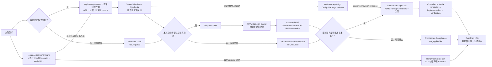

# Engineering Execution Plan

把需要 Governed 模式的复杂工程工作组织成可追溯、可恢复、可机械验证的仓库制品。
Explore 的可逆探索和 Build 的有界实现默认使用线程内契约，不因“看起来复杂”自动
创建持久制品。只有公共契约、安全、数据、不可逆迁移、可靠性声明、发布、长期决定
或跨会话恢复等触发器才升级到 Governed。默认工作流是：

项目级 Harness 初始化属于 `repo-foundry-ai`；本 skill 的 `init` 只创建
ADR、ExecPlan、Bugfix 等执行治理制品。



Engineering Research 负责减少未知并输出 sealed Manifest/Synthesis；本 skill
从该文件契约开始，负责 ADR、ExecPlan 和实施生命周期。生产者可以是
`engineering-research`、BMAD、其他 Deep Research 工具或人工流程，只要制品满足
契约。引用提供审计链；下游制品仍需复述执行所需的结论和约束。

Engineering Design 负责把已建立的证据翻译成单文件或多文档 Design Package，
并管理 `draft → review_ready → current`、revision 快照和依赖图。本 skill 只解析
仓库内版本化 Design contract：未发布 Design 可以作为带告警的讨论输入，但不能
支撑 EP 完成；approved revision 必须以 `DD-NNN@rev:N@sha256:<manifest>` 固定。
Design 的创建、批准、修订、放弃和替代全部路由到 `engineering-design`。

Engineering Benchmark 负责可复现测量。会改变路线的 Benchmark 先由 Research
解释；已决定路线的 final-revision Benchmark 可以直接进入 EP 验收。一个 EP
可以预声明多个 `BS-NNN`，每个 Scenario 代表一个独立的开发门禁，不合并成总分。
完成时，每个 Scenario 必须恰好由一个同 revision 的 passed sealed Run 覆盖。EP
用 `benchmark:BR-NNN@sha256:<payload>` 引用证据并按文件契约验真，不调用
Benchmark Skill。

## 制品路由

| 情况 | 制品 |
|---|---|
| Explore：调查、实验、prototype、局部可逆修改 | 无持久制品；线程内记录结果与风险 |
| Build：有界生产修改，无 Governed 触发器 | 线程内 intent/path/acceptance/compatibility 契约 |
| 用户明确要求记录的局部既有行为缺陷 | Bugfix |
| 需要可复现测量、性能/容量对比或回归证据 | 切换到 `engineering-benchmark` |
| 关键事实不清、需要比较方案或实验 | 切换到 `engineering-research` |
| 需要定义或评审系统边界、组件、接口、数据、失败与迁移设计 | 切换到 `engineering-design` |
| 存在影响长期边界且逆转成本较高的选择 | ADR |
| 跨模块、多里程碑、需跨会话恢复或已有决策待实施 | ExecPlan |

进入 Governed 且仍有会改变路线的未知时，默认先取得 concluded Research，尤其是
涉及公共契约、安全、可靠性、数据、不可逆迁移、第三方选型，或 Benchmark 会改变
架构路线时。prototype 本身属于 Explore，不自动触发 Research。新的可复现测量使用
`engineering-benchmark`；跨来源解释和 Synthesis 使用 `engineering-research`。
只有已经创建 ExecPlan 后，未提供 Research 才在计划内记录具体 Gate 理由；
Explore/Build 不为“没有触发 Research”创建跳过制品。

- 当前 accepted ADR 和代码事实已覆盖所需输入。
- 权威标准或用户已经固定实现方向。
- 工作局部、可逆，且没有会改变计划路线的未知。

存在两个以上可信选项，并涉及公共接口、跨系统边界、长期约束、高迁移成本、安全、数据一致性、可靠性或部署拓扑时创建 ADR。局部且易逆转的实现取舍写入 ExecPlan Decision Log，并记录 Architecture Decision Gate 跳过理由。跳过新决定不代表可以忽略既有架构；仍要独立判断 Architecture Compliance。

Bugfix 一旦需要 Research、ADR、任务拆分、公共契约变更或持续推进，升级为 ExecPlan。普通“修 bug”仍是实现请求；用户未要求记录时不创建 Bugfix 台账。

完整判定与状态机见 `references/templates.md`。消费 manifest-bearing Research
前读取 `references/research.md`；起草或决定 ADR 前读取
`references/adr.md`。

## 交互式决策与计划校准

用户要求共同讨论 ADR、一起拆解 EP，或存在会实质改变长期约束、实施边界、迁移
顺序、回滚或验收证据的多个可信方案时，完整读取
[collaboration.md](references/collaboration.md)。交互状态只服务会话收敛，不新增
ADR/EP lifecycle，也不替代 Research、Design、Decision Owner 或完成证据。

- ADR 使用交互式权衡：比较原子选项、Decision Drivers、后果和一个区分性反例，
  再形成可整体接受或拒绝的 proposed ADR。探索中的简短选项回复只是候选偏好；
  只有可归因主体对具体 ADR outcome 的明确接受/拒绝才构成决定授权。
- ExecPlan 使用实施校准：在 accepted ADR 与 approved Design 输入不变的前提下，
  校准范围、里程碑、依赖、迁移、回滚和验收。若讨论重新打开公共契约、数据所有权
  或长期架构选择，停止计划收敛并路由回 Research、Design 或 ADR。
- 不逐项询问可由仓库事实推导的 Task 细节。Checkpoint、验证、Benchmark Run、
  seal 和 archive 继续按证据与状态机确定性执行，不能通过协商改变结果。

## 仓库布局

```text
docs/
├── .epctl/
│   ├── state.json
│   ├── config.json          # 可选：注册既有 architecture roots
│   └── adr-revisions/       # 可选：completed/cancelled EP 的历史 ADR payload
│       └── ADR-NNN/
│           └── sha256-<payload>.md
├── RESEARCH.md
├── DECISIONS.md
├── PLANS.md
├── BUGFIXES.md
├── research/
│   ├── active/r-NNN_slug/
│   │   ├── RESEARCH.md
│   │   ├── SYNTHESIS.md
│   │   ├── notes/
│   │   └── artifacts/
│   └── completed/
├── adr/
│   └── adr-NNN_slug.md
├── design-docs/             # 可选：既有 ADR / Design Doc corpus
├── exec-plans/
│   ├── active/ep-NNN_slug/
│   │   ├── EXECPLAN.md
│   │   ├── tasks/
│   │   ├── history/
│   │   └── artifacts/
│   ├── completed/
│   └── tech-debt-tracker.md
└── bugfixes/
    ├── active/
    └── completed/
```

Research 结论或取消时整体移动到 `research/completed/`。新 ADR 始终写入
`docs/adr/`，路径稳定且不随状态移动。既有 ADR / Design Doc corpus 可以原地注册，
不要求搬迁。四个根索引都是可重建投影；制品文件才是事实源。

## 优先使用确定性脚本

把 `<skill-dir>` 解析为本 skill 所在目录。所有命令在目标仓库根目录运行：

```bash
python3 <skill-dir>/scripts/epctl.py --repo . init
python3 <skill-dir>/scripts/epctl.py --repo . register-architecture-root \
  docs/design-docs

python3 <skill-dir>/scripts/epctl.py --repo . new-adr \
  --slug cache-topology --title "Choose cache topology" --research R-001 \
  --author "Codex" --owner "Cache Platform Owner" \
  --depends-on ADR-004 --amends ADR-003 \
  --amends-constraint ADR-003#C-002 \
  --design docs/design-docs/cache-topology.md
python3 <skill-dir>/scripts/epctl.py --repo . decide-adr ADR-001 \
  --outcome accepted --decision-maker "<explicit authority>"
python3 <skill-dir>/scripts/epctl.py --repo . transition-adr ADR-001 \
  --to under_review --decision-maker "<explicit authority>" \
  --reason "<new evidence>"
python3 <skill-dir>/scripts/epctl.py --repo . supersede-adr ADR-001 \
  --by ADR-002 --decision-maker "<explicit authority>" \
  --reason "<replacement rationale>"
python3 <skill-dir>/scripts/epctl.py --repo . register-adr-revision ADR-001 \
  --from-file evidence/adr-001-historical.md
python3 <skill-dir>/scripts/epctl.py --repo . register-adr-revision ADR-001 \
  --from-file evidence/adr-001-historical.md --apply

python3 <skill-dir>/scripts/epctl.py --repo . new-ep \
  --slug implement-cache --title "Implement cache topology" \
  --author "Codex" --owner "Cache Platform Owner" \
  --research R-001 --adr ADR-004 --adr ADR-005 \
  --design docs/design-docs/cache-topology.md \
  --architecture-entrypoint docs/design-docs/index.md \
  --benchmark-scenario BS-003 \
  --benchmark-scenario BS-004

python3 <skill-dir>/scripts/epctl.py --repo . validate
python3 <skill-dir>/scripts/epctl.py --repo . validate --fix-index
python3 <skill-dir>/scripts/epctl.py --repo . reindex
python3 <skill-dir>/scripts/epctl.py --repo . status
```

重复引用时重复写 `--research`、`--adr`、`--design` 或
`--benchmark-scenario`。注册信息写入
`docs/.epctl/config.json`，本地和 CI 因而使用同一组 architecture roots。如果某个
Gate 不需要正式制品：

```bash
python3 <skill-dir>/scripts/epctl.py --repo . new-ep \
  --slug local-cleanup --title "Clean up local adapter" \
  --research-not-required-reason "<specific existing evidence>" \
  --decision-not-required-reason "<why no durable choice exists>" \
  --architecture-not-applicable-reason "<why no existing architecture input applies>"
```

- 先运行 `init`；它只补缺失目录和索引，不覆盖已有内容。
- 用脚本分配 ADR/EP 等本 skill 拥有的 ID、复制 assets、迁移状态、封存
  payload、重建索引和验证引用。不要手工猜编号。
- `.epctl/state.json` 保存编号高水位。故障可以造成跳号，不能复用旧 ID。
- completed/cancelled EP 引用的旧 ADR payload 不再等于当前 ADR 时，先用
  `register-adr-revision` 预览，再以 `--apply` 写入 digest-addressed 的不可变
  repository evidence。也可以显式使用 `--from-git-blob <full-object-id>` 恢复
  Git blob；正常 `validate` 只读仓库文件，不依赖 Git。
- `validate --fix-index` 只修复派生索引，不改事实制品。
- 脚本不可用时按 `assets/` 模板执行，并扫描文件系统、索引和高水位后取最大 ID +1。
- 不要求目标仓库使用 Git。

## 消费 Research 与 Synthesis

1. 如果仍有会改变路线的未知，先使用 `engineering-research` 或其他兼容流程。
2. 只让 `concluded` Research 满足 Gate；cancelled 或 active Research 都不能。
3. schema 1.1/1.2 Research 还必须有 `owner`、`maturity: review_ready` 和完整
   `approved_by/approved_at/approval_ref`；decision-ready 本身不是结束授权。
4. 验证 sealed `SYNTHESIS.md` 正文摘要。
5. 如果控制页声明 `RESEARCH_MANIFEST.json`，还必须验证：
   - schema 与 Research ID；
   - sealed manifest payload；
   - package-relative 文档存在且 bytes/SHA-256 匹配；
   - entrypoint 属于文档集合。
6. 兼容没有 manifest 的既有 v1 Research，但不要把这种兼容当作新制品模板。
7. 在 ADR 与 ExecPlan 中复述关键结论、置信边界、负面证据、成立条件和剩余未知。

本仓库的 `epctl` 暂时保留 legacy Research 创建/归档命令，供既有自动化迁移；
新 Research 不再从本 skill 的主流程创建。

## 消费 Design revision

1. 通过 `design_refs` 引用 `DD-NNN` 或 legacy Design 路径；schema 1.1 Design
   还必须包含它的 `design_dependencies` 传递闭包，且依赖图无环。
2. `new-ep` 对每个已发布 Design 自动写入
   `DD-NNN@rev:N@sha256:<manifest-digest>`；不要手工猜测或改写 evidence。
3. `validate` 独立检查 revision snapshot 的 manifest、路径、bytes、SHA-256、
   entrypoint 与 reading map，不导入或调用 `designctl`。
4. active EP 可以暂时引用 `draft`、`review_ready` 或 `revising` 工作版本并收到告警；
   `completed` 必须为完整依赖闭包提供有效 approved evidence。legacy schema 1
   Design 只有 `status: current` 才能满足完成门禁。
5. Design 是解释性架构输入，ADR constraint 仍是授权后的规范约束；两者冲突时
   停止归档并回到 Design/ADR 对应生命周期处理。

## ADR 与显式决策权

Agent 可以调研、比较并起草 `proposed` ADR。只有当前对话或明确授权来源中出现用户/Decision Owner 对具体 ADR 结果的明确接受或拒绝，才可运行 `decide-adr`。

以下表达不构成决策授权：要求分析、要求起草、同意继续研究、同意实施整个 skill 改造、沉默或推断出的偏好。授权必须能回答“谁决定了哪份 ADR 的哪个结果”。

当 ADR 仍在共同权衡时，先按 `references/collaboration.md` 把候选偏好经过后果复述
和区分性压力场景，再写成 proposed ADR。裸露的 `1`、`2`、`Option B` 不自动等于
对某份完整 ADR 的接受；明确身份、目标 ADR 和 outcome 的授权仍可直接进入决定门槛。

决定前：

1. 复述 sealed Synthesis 中影响选择的结论和证据路径。
2. 写全 Context、Decision Drivers、可信选项、Outcome、Decision Statement、
   Normative Constraints、Consequences、Confirmation 和 Revisit Triggers。
3. 把真实授权主体传给 `--decision-maker`。

新建 schema 1.4 ADR 必须给出一句可整体接受或拒绝的 `Decision Statement`，并把
长期约束写成稳定的 `C-NNN` 行：strength、scope、constraint、confirmation。
下游使用 `ADR-NNN#C-NNN` 引用它们。accepted/rejected schema 1.1–1.4 ADR 的正文、
Research/ADR/Design 输入和决策授权由 SHA-256 一并封存。方向变化时创建并接受新 ADR，再按语义使用 `amends` 或执行
preview-first 的 `supersede-adr`；若仅需暂停调查，则 preview/apply
`transition-adr --to under_review`，之后明确 reaffirm 或 retire。每次 effect change
都要求授权主体和原因。不要编辑旧决定，也不要把状态变化当作自动代码回滚。
non-current ADR 不能满足新 ExecPlan；受影响的既有 active EP 显示
`architecture_review_required` 并禁止 completed 归档。

一份 ADR 只记录一个原子决定，不因一个功能需要多个决定而合并成“大 ADR”：

- `depends_on` 表示必须同时成立的 accepted 前置决定。
- `amends` 表示新决定只修订旧决定的一部分；schema 1.2+ 还必须用
  `amends_constraints` / `--amends-constraint ADR-NNN#C-NNN` 精确指出被改约束，
  两份 ADR 仍是当前决定。
- `supersedes` 表示完整替代，旧 ADR 进入 superseded。
- `design_refs` 指向承载接口、数据流、迁移细节的 Design Docs。

关系必须无环且互斥。ExecPlan 的 `adr_refs` 必须包含 `depends_on` / `amends`
传递闭包，不能只引用叶子 ADR。

既有 `docs/design-docs` 等目录先用 `register-architecture-root` 注册。
`doc_type: adr` 或文件名含 `ADR-NNN` 的文档会被发现；缺少 epctl
`decision_maker` / seal 的 accepted 旧 ADR 可兼容作为 architecture input，但验证会持续告警，
工具把它视为只读。后续变化应创建严格的新 ADR，不要就地伪造历史授权。

## 创建 ExecPlan

执行前读取 `references/template.md`。

1. 若实施范围、里程碑边界、迁移顺序、回滚或验收方案存在多个会显著改变计划的
   可信形态，先按 `references/collaboration.md` 做有界实施校准；不要在 EP 内重新
   决定未收敛的架构。
2. Research Gate 必须引用所有相关 concluded Research，或提供具体 not-required 理由。
3. Architecture Decision Gate 必须由所需 accepted ADR 满足，或提供具体
   not-required 理由；提供理由时仍可引用适用的既有 ADR。
4. Architecture Compliance 必须独立标为 `applicable` 或 `not_applicable`：
   applicable 时引用全部相关当前 ADR/Design Docs；not_applicable 时不得夹带
   architecture inputs，并写明具体理由。
5. ADR 引用的 Research 和 Design Docs 也必须进入 ExecPlan 的对应引用数组。
6. 多文档架构集可指定一个 `architecture_entrypoint`，供人和 Agent 从索引开始阅读。
7. 对每个需要性能、容量、可靠性或回归验收的独立维度，先完成一个稳定的
   Benchmark Scenario。不要等实现完成、看到结果后才补门禁。
8. 运行 `new-ep` 创建 v2.8 目录和模板；已发布 Design evidence 自动固定；对每个必需 Scenario重复
   `--benchmark-scenario BS-NNN`。没有 Benchmark 门禁时保留空集合。
9. 在 `Architecture Compliance Matrix` 中逐条映射所有 `ADR-NNN#C-NNN` 到实施
   位置和 test/lint/schema/observable evidence；Design Doc 只能解释，不能覆盖 ADR。
10. 在 `Benchmark Gate Set` 中写清每个 Scenario 驱动哪个开发决定或里程碑。
   不同环境、流量模型或判定规则保持为不同 Scenario，不聚合成不可解释的总分。
11. 完整填写所有 REQUIRED section，并在 `Research and Architecture Inputs` 中复述：
   - 支持路线的关键证据与置信边界；
   - accepted ADR 的接口、数据、运维、迁移和负面后果；
   - 仍需在实现中验证的未知；
   - 跳过 Gate 的具体理由。
12. 保证无历史会话的 Agent 只读当前工作树和根 `EXECPLAN.md` 就能继续：
   - 解释目的、术语、用户可观察结果和系统现状；
   - 给出准确仓库相对路径、接口与依赖；
   - 提供独立可验证里程碑、工作目录、命令、预期输出和证据位置；
   - 写明幂等重试、回滚、迁移与清理。

上游引用用于审计，不得替代根计划内的执行上下文。不要预测耗时；时间戳只记录事实。

Benchmark 驱动开发采用闭环而不是自动改代码：Run 为 `failed`、
`inconclusive` 或 `errored` 时，保留 sealed evidence，在 Current Snapshot /
Progress 写明未满足的 Scenario，把修复落到对应 Milestone 或有限 Task，再创建新
Run 重测。只有规则本身确认错误时才先修订计划并创建新 Scenario；不能根据已看到
的结果降低原 Scenario 阈值。

## 维护有界 Living Document

当前事实随路线更新并保持精简：Purpose、Current Snapshot、Context、Inputs、
Benchmark Gate Set、Plan、Milestones、Validation、Recovery、Interfaces。

当前 checkpoint 区间内追加历史：Progress、Surprises & Discoveries、Decision Log、Blockers、Revision Notes。纠错时新增更正记录。每个停止点更新 Progress；修改当前事实时记录 Revision Notes。

`EXECPLAN.md` 的目标工作集不超过 500 行、48 KiB 和 30 个活跃历史事件；超过
任一目标值时建立 checkpoint 的准备信号。800 行、64 KiB 和 50 个活跃历史事件
是必须处理的强警戒线。里程碑完成、交接前，或出现任一级信号时：

1. 把仍有效的发现和决定吸收到当前事实。
2. 把完整输出移到 `artifacts/`。
3. 读取 `references/checkpoints.md`。
4. 读取 `references/integrity.md`，取得当前仓库或工作区 revision。
5. 先运行带 `--revision` 的 `checkpoint ... --dry-run`，确认后再正式封存。
6. 保证未完成 Progress/Validation 和 open blocker 留在根文件。
7. 只读根 `EXECPLAN.md` 做一次恢复检查。

Checkpoint 是 sealed 历史链，不能成为继续工作的必读前置。

文档规模只决定是否压缩历史，不决定是否归档。一个 active EP 超过 5 个里程碑或
10 个未完成 Task 时复核它是否仍有单一完成边界；超过 8 个里程碑或 15 个未完成
Task 时，`status` 和 `validate` 建议把可独立验证、发布或回滚的结果拆成 successor
EP。checkpoint 后根文件仍然过大，通常说明当前事实或工程范围过宽，应外置 Design
Doc / artifact 或拆分 EP，不能反复 checkpoint 掩盖范围膨胀。

## Task、未知与阻塞

- 仅在工作能指定有限修改目标和独立验证时创建 Task。
- Task 使用稳定 `parent_id: EP-NNN`；开始前检查依赖均为 `done` 或 `cancelled`。
- 根 ExecPlan 始终同步总体进度、接口和关键决定。
- 技术未知优先通过 Research、仓库检索或最小实验解决。
- 只有缺权限/凭据/外部状态、人类产品判断、范围外能力，或继续会造成安全、数据、兼容风险时建立 open blocker。
- blocker 解除后补充结果并恢复实体状态，不因历史阻塞持续报告 blocked。

## Bugfix 与技术债务

用户明确要求持久记录局部缺陷时使用 Bugfix，并读取 `references/bugfix.md`。至少记录 Symptom、Scope、Root Cause、Fix、Verification 和证据。升级为复杂工作时创建符合 Gate 的 ExecPlan，将 Bugfix 设为 `escalated`、填写 `linked_ep` 并归档，后续只在 EP 推进。

技术债务是反馈入口。用户未提供优先级或目标日期时使用 `unspecified` / `unscheduled`，不要猜测。

## 严格完成与归档

完成 ExecPlan 前：

1. 运行真实验证并记录结果和证据。
2. 勾选全部 Validation。
3. 确认 Task 全部 `done` / `cancelled`。
4. 确认没有 open blocker。
5. 填写 Outcomes & Retrospective。
6. 取得实际通过验证的 repository/workspace revision 和证据引用。
   对 v2.5+ `required_benchmark_scenarios` 中的每个 Scenario，取得恰好一个
   passed sealed Run。sealed Benchmark 使用
   `benchmark:BR-NNN@sha256:<manifest-payload-sha256>`；Run 的
   `subject_revision` 必须等于同一个 `verified_revision` 且 outcome 必须是
   `passed`。缺一个、重复覆盖一个、或引用未声明 Scenario 都会阻止归档。
7. 运行 `validate`，再运行：

```bash
python3 <skill-dir>/scripts/epctl.py --repo . archive-ep EP-NNN \
  --outcome completed \
  --verified-revision "<vcs-or-snapshot-revision>" \
  --evidence "benchmark:BR-014@sha256:<payload>" \
  --evidence "benchmark:BR-015@sha256:<payload>"
```

不完整计划保持 active/blocked，或在明确停止时以原因归档为 cancelled。不能靠口头确认、force 或删除验收项伪装完成。

`status` 的 `completion` 只报告仓库内事实：

- `in_progress`：仍有未勾选验收；
- `archive_blocked`：验收已勾选，但仍有 REQUIRED 占位、open blocker、未结束
  Task、待复核 ADR，或 schema 2.8 Design 尚未发布/缺少有效 revision evidence；
- `ready_to_archive`：计划内容已收敛，可以执行最终验证；v2.3+ 仍须在
  `archive-ep` 提供真实 `verified_revision` 和 `verification_evidence`；
- `archived`：制品已以 `completed` 或 `cancelled` 移入 completed 目录。

脚本不会根据长度、无活动时间或 `ready_to_archive` 自动修改、checkpoint 或归档
EP。Agent 在里程碑完成、交接、状态检查和最终验证后消费这些信号并执行对应动作。

归档只记录知识提升候选。新的架构决定仍需 proposed ADR 和独立明确授权；不要在“归档 EP”的隐含授权下接受 ADR 或修改 `AGENTS.md`。

用户明确要求把模块设计、最佳实践或 EP 过程整理成分享材料时，使用独立的
`engineering-case-study` Skill。EP 完成、归档或出现 knowledge promotion
candidate 本身都不构成生成案例的触发条件。

## 状态与验证

- `status` 汇总 Research 问题、Synthesis、ADR、Benchmark Scenario Gate、验收、
  Task、blocker、Checkpoint 和文档大小，并为每个 EP 输出 `completion`、`scope`
  与 `working_set`。`--json` 同时输出阈值计数、阻塞原因和归档命令仍需提供的输入。
- `validate` 检查 ID、路径、状态、必需 section、引用、依赖、payload 和索引。
- `reindex` 从事实制品重建 Research、ADR、ExecPlan 和 Bugfix 投影。
- CI 只调用仓库内唯一检查入口；GitHub、GitLab 或其他 CI 平台不得复制校验逻辑。
- accepted ADR 的 Confirmation 应指向测试、lint、schema check 或明确人工验收。
- v2.6–2.8 active EP 的 ADR 必须 current，`adr_constraint_refs` 必须精确覆盖结构化
  constraints，`adr_evidence` 必须匹配决定 seal，Compliance Matrix 必须逐条映射。
  completed/cancelled EP 保留当时摘要；若当前 ADR 已是另一个 payload revision，
  验证器从 `.epctl/adr-revisions/` 解析原摘要，绝不要求改写 sealed EP。
- v2.8 EP 的 `design_evidence` 必须精确覆盖所有已发布的 schema 1.1 Design
  输入；完成时每个 Design dependency 都必须有可独立验真的 approved revision pin。
- completed v2.3+ EP 必须保存 `verified_revision` 和至少一个
  `verification_evidence`，归档正文由 `archive_sha256` 封存；Checkpoint 必须
  保存 `repository_revision`。
- `benchmark:` evidence 会验证本地 sealed Manifest、精确文件清单、SHA-256、
  `passed` outcome、Scenario Gate 的一一覆盖和共同 final revision；普通
  `ci:` / `artifact:` 引用保持原语义。

## 制品元数据

新建 ADR、ExecPlan、Task、Checkpoint 和 Bugfix 使用统一
`metadata_schema: "1"`，并携带稳定的 `artifact_type`、`id`、`title`、`status`、
`author`、`owner`、`created` 和 `updated`。当前 artifact schema 分别是 ADR
`1.4`、ExecPlan `2.8`、Task `1`、Checkpoint `1.2`、Bugfix `1`。

`author` 是当前版本的实际写作者，`owner` 是持续负责者；两者不授予
`decision_maker`、Research approval 或 Benchmark execution 权限。新建命令优先
显式接收 `--author`/`--owner`，Task 与 Checkpoint 在边界明确时继承父 EP。
未知 actor 使用 `Unassigned`，不得杜撰。accepted ADR、sealed Checkpoint 与归档
ExecPlan 把 metadata 纳入 digest；旧版 sealed 制品按原 schema 保持只读兼容。
当前 Design Doc 使用仓库内唯一的 `DD-NNN` 和相同 common metadata；注册后的
corpus 由 `validate` 检查，legacy Design Doc 只读兼容并告警。

## 参考

- 制品路由、状态机、兼容策略 → `references/templates.md`
- Research/Synthesis 消费契约与 manifest 兼容 → `references/research.md`
- sealed Benchmark 作为 final-revision evidence → `references/benchmark.md`
- ADR 门槛、授权、状态与 supersession → `references/adr.md`
- 多 ADR / Design Doc Architecture Input Set 示例 →
  `examples/architecture-input-set/README.md`
- ExecPlan 自包含要求与 Living Document → `references/template.md`
- Checkpoint、压缩与恢复 → `references/checkpoints.md`
- 文档—代码完整性、CI 适配与合并门禁 → `references/integrity.md`
- Bugfix 字段与升级/归档 → `references/bugfix.md`
- Prompt 示例、典型场景和端到端输出边界 → `references/examples.md`
- ADR 权衡与 ExecPlan 实施校准 → `references/collaboration.md`
