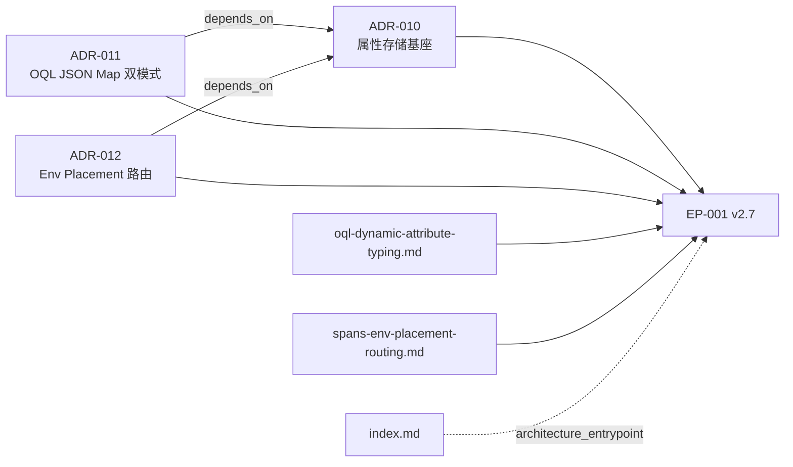

# 多 ADR / Design Doc Architecture Input Set

这个示例对应一种常见的既有仓库：

```text
docs/design-docs/
├── index.md
├── ADR-010-Spans-Attribute-Storage-Substrate.md
├── ADR-011-OQL-Attribute-JSON-Map-Dual-Mode.md
├── ADR-012-Spans-Env-Placement-Routing.md
├── oql-dynamic-attribute-typing.md
└── spans-env-placement-routing.md
```

一个功能同时受三份 ADR 和两份 Design Doc 约束。正确做法不是把三份 ADR
合成一个文件，而是构造一个依赖闭合的输入集合：



## 1. 注册既有目录

以下命令在目标代码仓库根目录运行：

```bash
EPCTL=/absolute/path/to/RepoFoundry/engineering-execution-plan/scripts/epctl.py

python3 "$EPCTL" --repo . init
python3 "$EPCTL" --repo . \
  register-architecture-root docs/design-docs
```

工具生成仓库内配置：

```json
{
  "architecture_roots": [
    "docs/adr",
    "docs/design-docs"
  ],
  "version": 1
}
```

原文档不移动。新 ADR 仍写入 `docs/adr/`。

## 2. 显式表达关系

`relates_to` 只表示“有关联”，不能机械区分依赖、局部修订和完整替代。架构
Owner 应确认语义后，在 legacy ADR frontmatter 中补充扁平 JSON 数组：

```yaml
---
doc_type: adr
title: OQL Attribute JSON Map Dual Mode
status: accepted
depends_on: ["ADR-010"]
amends: []
design_refs: ["docs/design-docs/oql-dynamic-attribute-typing.md"]
relates_to:
  - ADR-010
  - docs/design-docs/oql-dynamic-attribute-typing.md
---
```

ADR-012 同理：

```yaml
depends_on: ["ADR-010"]
amends: []
design_refs: ["docs/design-docs/spans-env-placement-routing.md"]
```

这只是补充关系元数据，不是补签决定。`epctl` 不会自动改写 legacy ADR，也不会
从 `relates_to` 猜测关系。旧 ADR 缺少 `decision_maker` 和 seal 时，验证器会
告警但允许 accepted 状态兼容作为 current architecture input；后续方向变化应创建
严格 schema 1.4 ADR。

## 3. 创建依赖闭合的 EP

假设 Research 已由既有证据覆盖，可以明确跳过 Research Gate：

```bash
python3 "$EPCTL" --repo . new-ep \
  --slug spans-attribute-routing \
  --title "Implement spans attribute routing" \
  --research-not-required-reason \
  "Accepted ADRs and current contract tests define the required behavior." \
  --adr ADR-010 \
  --adr ADR-011 \
  --adr ADR-012 \
  --design docs/design-docs/oql-dynamic-attribute-typing.md \
  --design docs/design-docs/spans-env-placement-routing.md \
  --architecture-entrypoint docs/design-docs/index.md
```

生成的 v2.7 frontmatter 包含：

```yaml
research_gate: not_required
adr_refs: ["ADR-010", "ADR-011", "ADR-012"]
adr_constraint_refs: []
adr_evidence: []
design_refs: ["docs/design-docs/oql-dynamic-attribute-typing.md", "docs/design-docs/spans-env-placement-routing.md"]
architecture_entrypoint: "docs/design-docs/index.md"
architecture_decision_gate: satisfied
architecture_compliance: applicable
required_benchmark_scenarios: []
```

这些 legacy ADR 没有 schema 1.2+ constraint IDs 或 payload seal，因此两个数组为空，
Compliance Matrix 按 ADR 整体映射：

| ADR constraint or architecture input | Implementation or preservation | Verification |
|---|---|---|
| ADR-010 | 保持属性存储基座不变 | storage contract tests |
| ADR-011 | 实现 JSON Map 双模式 | OQL typing tests |
| ADR-012 | 实现 Env Placement 路由 | routing integration tests |

严格 schema 1.2+ ADR 会改为逐条 `ADR-NNN#C-NNN` 映射，并在 `adr_evidence` 中固定
决定 payload。Design Docs 提供解释，不覆盖上表中的 ADR 约束。

如果只写 `--adr ADR-011 --adr ADR-012`，命令会因缺少依赖闭包中的 ADR-010
失败。如果漏掉 ADR 声明的 Design Doc，也会失败。

## 4. 验证与 CI

```bash
python3 "$EPCTL" --repo . validate
python3 -B /absolute/path/to/repository/scripts/check.py
```

`config.json`、ADR、Design Docs、EP 和验证脚本都在仓库内，因此 GitHub
Actions、GitLab CI 或其他平台只需调用同一个 canonical check。CI 能保证路径、
状态、依赖闭包、current amendment、引用、ADR digest 和 Compliance Matrix 一致；
架构语义仍由 Decision Owner / Code Owner 评审。

Design Doc 可以持续迭代，不对整个目录做内容 hash。EP 完成时绑定真正通过验证
的代码 revision 与 CI evidence，并用 `archive_sha256` 封存完成态计划。
